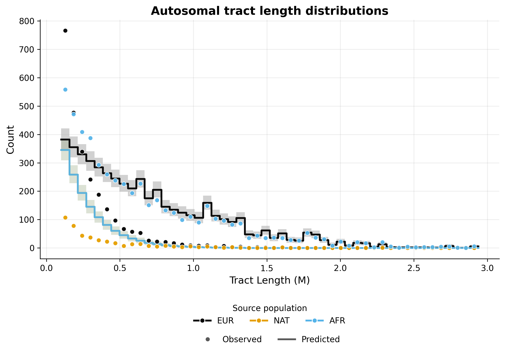
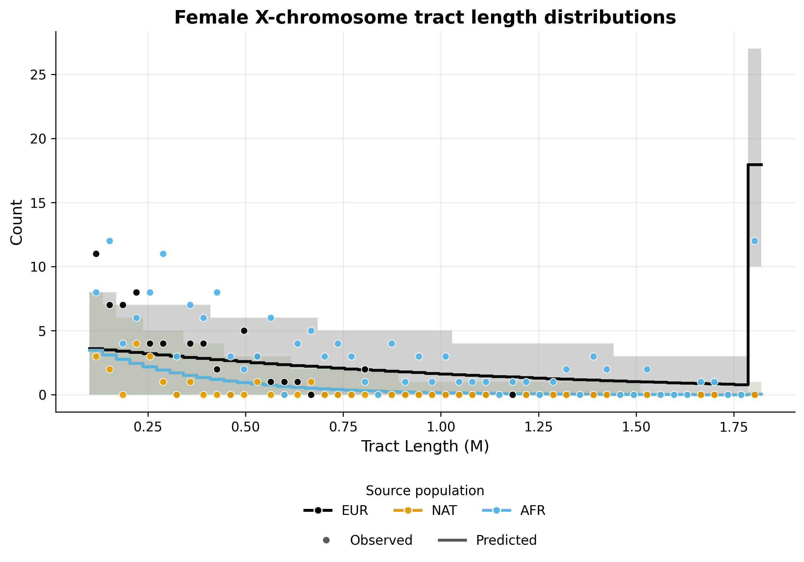
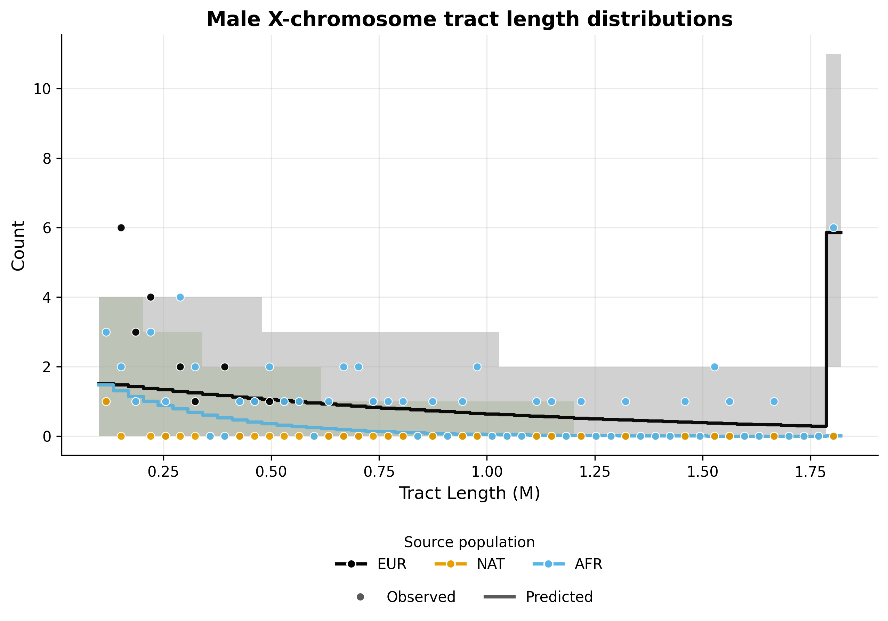

.. DO NOT EDIT.
.. THIS FILE WAS AUTOMATICALLY GENERATED BY SPHINX-GALLERY.
.. TO MAKE CHANGES, EDIT THE SOURCE PYTHON FILE:
.. "auto_examples/ASW/ASW_one_pulse.py"
.. LINE NUMBERS ARE GIVEN BELOW.

.. only:: html

    .. note::
        :class: sphx-glr-download-link-note

        :ref:`Go to the end <sphx_glr_download_auto_examples_ASW_ASW_one_pulse.py>`
        to download the full example code.

.. rst-class:: sphx-glr-example-title

.. _sphx_glr_auto_examples_ASW_ASW_one_pulse.py:

ASW inference - One pulse model
===============================

This example implements inference for the ASW population under a one pulse model of admixture, using the tracts package.
Inference is performed using autosomal and X chromosome data, allowing for the specification of sex-biased admixture. 

To implement this example, we use the following driver file:

.. code-block:: yaml
   
   samples:
    directory: ./TrioPhased/
    individual_names: [
      "NA19625","NA19700","NA19701","NA19703","NA19704","NA19707","NA19711","NA19712","NA19713","NA19818","NA19819",
      "NA19834","NA19835","NA19900","NA19901","NA19904","NA19908","NA19909","NA19913","NA19914","NA19916","NA19917",
      "NA19920","NA19921","NA19922","NA19923","NA19982","NA19984","NA20126","NA20127","NA20274","NA20276","NA20278",
      "NA20281","NA20282","NA20287","NA20289","NA20291","NA20294","NA20296","NA20298","NA20299","NA20314","NA20317",
      "NA20318","NA20320","NA20321","NA20332","NA20334","NA20339","NA20340","NA20342","NA20346","NA20348","NA20351",
      "NA20355","NA20356","NA20357","NA20359","NA20362","NA20412"] 
    male_names : [
      "NA19700","NA19703","NA19711","NA19818","NA19834","NA19900","NA19904","NA19908","NA19916","NA19920",
      "NA19922","NA19982","NA19984","NA20126","NA20278","NA20281","NA20291","NA20298","NA20318","NA20340",
      "NA20342","NA20346","NA20348","NA20351","NA20356","NA20362"] #see Readme_dataprocessing.md for how this was generated
    filename_format: "{name}_{label}_final.bed"
    labels: [A, B] #If this field is omitted, 'A' and 'B' will be used by default
    chromosomes: 1-22 #The chromosomes to use for analysis. Can be specified as a list or a range
   allosomes: [X]
   output_filename_format: "ASW_test_output_{label}"
   model_filename: ../models/ppp.yaml
   start_params: 
    t: 5:8

   repetitions: 1
   maximum_iterations: 1000
   seed: 100
   unknown_labels_for_smoothing: ["UNK", "centromere","miscall"] # segments with these labels will be smoother over, that is, will be filled with neighbouring ancestries up to their midpoints.  
   exclude_tracts_below_cm: 2
   npts : 50
   fix_parameters_from_ancestry_proportions: ['REUR', 'RNAT', 'REUR_sex_bias', 'RNAT_sex_bias']
   output_directory: ./output_one_pulse/
   ad_model_autosomes : M
   ad_model_allosomes: DC

Complete results from this analysis are saved in the output directory specified in the driver file. Below, we display the optimal parameters estimated from this analysis,
as well as the plots illustrating the inferred tract length distributions, compared to the observed histograms, for every source population and chromosome type (autosomes and X chromosome).

Optimal parameters
------------------

.. csv-table:: Estimated optimal parameters
   :file: output_one_pulse/ASW_test_output_optimal_parameters.txt
   :header-rows: 1
   :delim: tab

Tract length histograms
-----------------------

Autosomal admixture
^^^^^^^^^^^^^^^^^^^

X chromosome admixture in females
^^^^^^^^^^^^^^^^^^^^^^^^^^^^^^^^^

X chromosome admixture in males
^^^^^^^^^^^^^^^^^^^^^^^^^^^^^^^

.. GENERATED FROM PYTHON SOURCE LINES 83-103

.. rst-class:: sphx-glr-script-out

 .. code-block:: none

    ------------------------------------------------------------------------------------------------

    Running tracts 2.0 with driver file: ASW_one_pulse.yaml 

    Reading data, demographic model and driver specifications...

    ------------------------------------------------------------------------------------------------

    excluding_tracts_below Defaulting to 2.0 cM.
    Individual NA19700 is listed as male but has two X chromosomes. Selecting first of the two.
    Individual NA19703 is listed as male but has two X chromosomes. Selecting first of the two.
    Individual NA19711 is listed as male but has two X chromosomes. Selecting first of the two.
    Individual NA19818 is listed as male but has two X chromosomes. Selecting first of the two.
    Individual NA19834 is listed as male but has two X chromosomes. Selecting first of the two.
    Individual NA19900 is listed as male but has two X chromosomes. Selecting first of the two.
    Individual NA19904 is listed as male but has two X chromosomes. Selecting first of the two.
    Individual NA19908 is listed as male but has two X chromosomes. Selecting first of the two.
    Individual NA19916 is listed as male but has two X chromosomes. Selecting first of the two.
    Individual NA19920 is listed as male but has two X chromosomes. Selecting first of the two.
    Individual NA19922 is listed as male but has two X chromosomes. Selecting first of the two.
    Individual NA19982 is listed as male but has two X chromosomes. Selecting first of the two.
    Individual NA19984 is listed as male but has two X chromosomes. Selecting first of the two.
    Individual NA20126 is listed as male but has two X chromosomes. Selecting first of the two.
    Individual NA20278 is listed as male but has two X chromosomes. Selecting first of the two.
    Individual NA20281 is listed as male but has two X chromosomes. Selecting first of the two.
    Individual NA20291 is listed as male but has two X chromosomes. Selecting first of the two.
    Individual NA20298 is listed as male but has two X chromosomes. Selecting first of the two.
    Individual NA20318 is listed as male but has two X chromosomes. Selecting first of the two.
    Individual NA20340 is listed as male but has two X chromosomes. Selecting first of the two.
    Individual NA20342 is listed as male but has two X chromosomes. Selecting first of the two.
    Individual NA20346 is listed as male but has two X chromosomes. Selecting first of the two.
    Individual NA20348 is listed as male but has two X chromosomes. Selecting first of the two.
    Individual NA20351 is listed as male but has two X chromosomes. Selecting first of the two.
    Individual NA20356 is listed as male but has two X chromosomes. Selecting first of the two.
    Individual NA20362 is listed as male but has two X chromosomes. Selecting first of the two.
    Parameter "REUR_male" already exists.
    Parameter "RNAT_male" already exists.
    Parameter "REUR_female" already exists.
    Parameter "RNAT_female" already exists.
    Parameter "t" already exists.

    Data autosome proportions: [0.19578862 0.03825495 0.76595643]
    Data allosome proportions: [0.16839124 0.03818939 0.79341937]
    Model parameters : ['REUR', 'REUR_sex_bias', 'RNAT', 'RNAT_sex_bias', 't']

    Multiple starting parameters were generated. These will be converted to optimizer units and used for multiple optimization runs.
    ---------------------------------------------------
    Run | Starting parameters                          
    ---------------------------------------------------
      1 | [0.8, 0.1, 0.1, 0.1, 6.051                  ]
      2 | [0.8, 0.1, 0.1, 0.1, 7.828                  ]
      3 | [0.8, 0.1, 0.1, 0.1, 7.308                  ]
    ---------------------------------------------------

    Starting ancestry proportions for the starting parameters
    -------------------------------------------------------------------------------
    Run | X_autosomal                         | X_X                                
    -------------------------------------------------------------------------------
      1 | [0.8, 0.1, 0.1                    ] | [0.8067, 0.1033, 0.09             ]
      2 | [0.8, 0.1, 0.1                    ] | [0.8067, 0.1033, 0.09             ]
      3 | [0.8, 0.1, 0.1                    ] | [0.8067, 0.1033, 0.09             ]
    -------------------------------------------------------------------------------

    Optimization run # 1 
    --------------------

    --------------------------------------------------------------------------------------------------
    Admixture is modelled with the M model for autosomes and with the DC model for allosomes.
    Optimization is performed in two steps.
    Step 1 : Optimizing autosomal likelihood over parameters ['REUR', 'RNAT', 't']
    --------------------------------------------------------------------------------------------------
    Iter.    Log-likelihood  Model parameters                Transmission
    ---------------------------------------------------------------------

    1       , -11510.4    , array([ 0.8        ,  0          ,  0.1        ,  0          ,  6.05122    ]), Autosomes
    --------------------------------------------------------------------------------------------------
    Step 2 : Optimizing autosomal + allosomal likelihood over parameters : ['REUR_sex_bias', 'RNAT_sex_bias']
    Non-sex-bias parameters fixed at values from previous optimization step.
    --------------------------------------------------------------------------------------------------
    Iter.    Log-likelihood  Model parameters                Transmission
    ---------------------------------------------------------------------

    2       , -466.116    , array([ 0.8        ,  0          ,  0.1        ,  0          ,  6.05122    ]), Female allosomes
    2       , -201.548    , array([ 0.8        ,  0          ,  0.1        ,  0          ,  6.05122    ]), Male allosomes
    2       , -11510.4    , array([ 0.8        ,  0          ,  0.1        ,  0          ,  6.05122    ]), Autosomes

    Optimization run # 2 
    --------------------

    --------------------------------------------------------------------------------------------------
    Admixture is modelled with the M model for autosomes and with the DC model for allosomes.
    Optimization is performed in two steps.
    Step 1 : Optimizing autosomal likelihood over parameters ['REUR', 'RNAT', 't']
    --------------------------------------------------------------------------------------------------
    Iter.    Log-likelihood  Model parameters                Transmission
    ---------------------------------------------------------------------

    1       , -14065      , array([ 0.8        ,  0          ,  0.1        ,  0          ,  7.8277     ]), Autosomes
    --------------------------------------------------------------------------------------------------
    Step 2 : Optimizing autosomal + allosomal likelihood over parameters : ['REUR_sex_bias', 'RNAT_sex_bias']
    Non-sex-bias parameters fixed at values from previous optimization step.
    --------------------------------------------------------------------------------------------------
    Iter.    Log-likelihood  Model parameters                Transmission
    ---------------------------------------------------------------------

    2       , -471.396    , array([ 0.8        ,  0          ,  0.1        ,  0          ,  7.8277     ]), Female allosomes
    2       , -226.274    , array([ 0.8        ,  0          ,  0.1        ,  0          ,  7.8277     ]), Male allosomes
    2       , -14065      , array([ 0.8        ,  0          ,  0.1        ,  0          ,  7.8277     ]), Autosomes

    Optimization run # 3 
    --------------------

    --------------------------------------------------------------------------------------------------
    Admixture is modelled with the M model for autosomes and with the DC model for allosomes.
    Optimization is performed in two steps.
    Step 1 : Optimizing autosomal likelihood over parameters ['REUR', 'RNAT', 't']
    --------------------------------------------------------------------------------------------------
    Iter.    Log-likelihood  Model parameters                Transmission
    ---------------------------------------------------------------------

    1       , -13156      , array([ 0.8        ,  0          ,  0.1        ,  0          ,  7.30842    ]), Autosomes
    --------------------------------------------------------------------------------------------------
    Step 2 : Optimizing autosomal + allosomal likelihood over parameters : ['REUR_sex_bias', 'RNAT_sex_bias']
    Non-sex-bias parameters fixed at values from previous optimization step.
    --------------------------------------------------------------------------------------------------
    Iter.    Log-likelihood  Model parameters                Transmission
    ---------------------------------------------------------------------

    2       , -465.611    , array([ 0.8        ,  0          ,  0.1        ,  0          ,  7.30842    ]), Female allosomes
    2       , -217.823    , array([ 0.8        ,  0          ,  0.1        ,  0          ,  7.30842    ]), Male allosomes
    2       , -13156      , array([ 0.8        ,  0          ,  0.1        ,  0          ,  7.30842    ]), Autosomes

    ---------------------------------------------------------------------------
    Results from multiple optimization runs with different starting parameters:
    -------------------------------------
    Run |       LogLik | Found parameters
    -------------------------------------
      1 |       -12178 | [0.8, 0, 0.1, 0, 6.051]
      2 |     -14762.6 | [0.8, 0, 0.1, 0, 7.828]
      3 |     -13839.4 | [0.8, 0, 0.1, 0, 7.308]
    -------------------------------------

    Final parameters and corresponding likelihood:
    ---------------------------------------------------------------------------------
          LogLik |         REUR REUR_sex_bias         RNAT RNAT_sex_bias            t
    ---------------------------------------------------------------------------------
          -12178 |          0.8            0          0.1            0        6.051
    ---------------------------------------------------------------------------------
    Results saved to : ./output_one_pulse/

    {'destination_dir': PosixPath('/home/jgonzale/Documents/PhaseType/tracts/docs/source/auto_examples/ASW/output_one_pulse'), 'table_file': PosixPath('/home/jgonzale/Documents/PhaseType/tracts/docs/source/auto_examples/ASW/output_one_pulse/ASW_test_output_optimal_parameters.txt')}

|

.. code-block:: Python

    import sys
    from pathlib import Path

    sys.path.append('.')

    from tracts.driver import run_tracts

    script_path = Path(sys.argv[0]).resolve()

    driver_filename = "ASW_one_pulse.yaml"

    run_tracts(driver_filename = driver_filename, script_dir = script_path)

    # Don't run the code below: for documentation purposes only.
    from tracts.doc_utils import prepare_example_outputs_for_docs
    prepare_example_outputs_for_docs("output_one_pulse")

.. rst-class:: sphx-glr-timing

   **Total running time of the script:** (0 minutes 21.516 seconds)

.. _sphx_glr_download_auto_examples_ASW_ASW_one_pulse.py:

.. only:: html

  .. container:: sphx-glr-footer sphx-glr-footer-example

    .. container:: sphx-glr-download sphx-glr-download-jupyter

      :download:`Download Jupyter notebook: ASW_one_pulse.ipynb <ASW_one_pulse.ipynb>`

    .. container:: sphx-glr-download sphx-glr-download-python

      :download:`Download Python source code: ASW_one_pulse.py <ASW_one_pulse.py>`

    .. container:: sphx-glr-download sphx-glr-download-zip

      :download:`Download zipped: ASW_one_pulse.zip <ASW_one_pulse.zip>`

.. only:: html

 .. rst-class:: sphx-glr-signature

    `Gallery generated by Sphinx-Gallery <https://sphinx-gallery.github.io>`_
