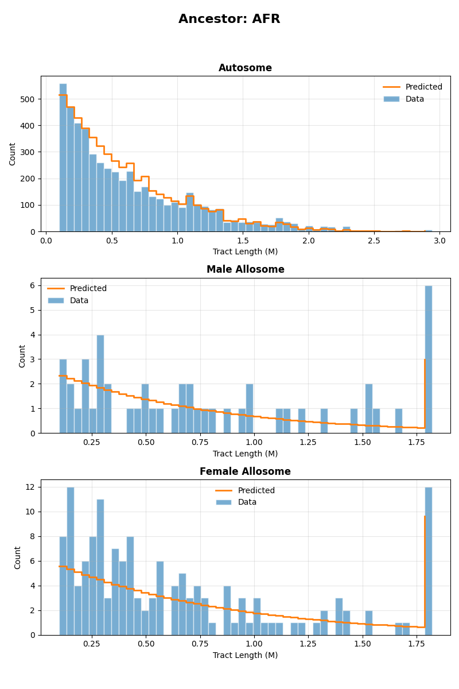
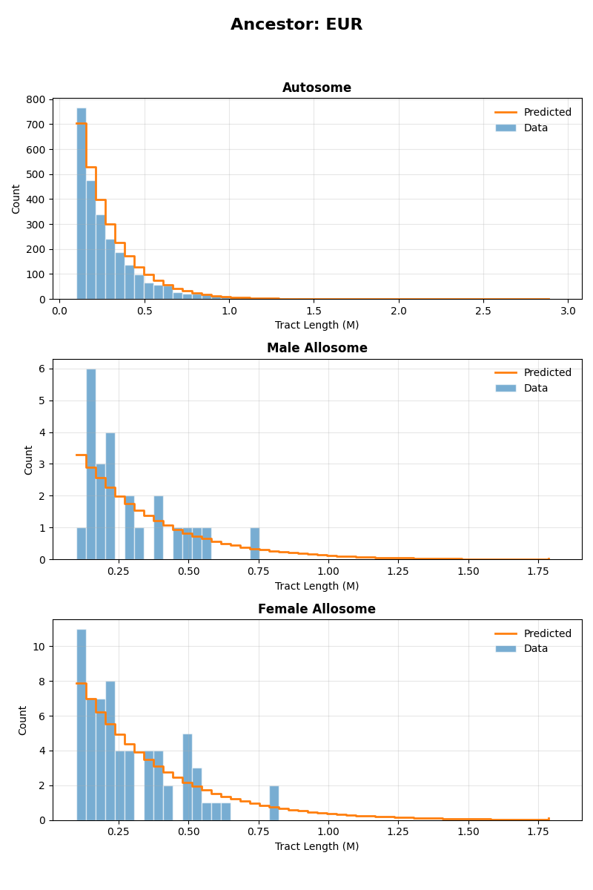
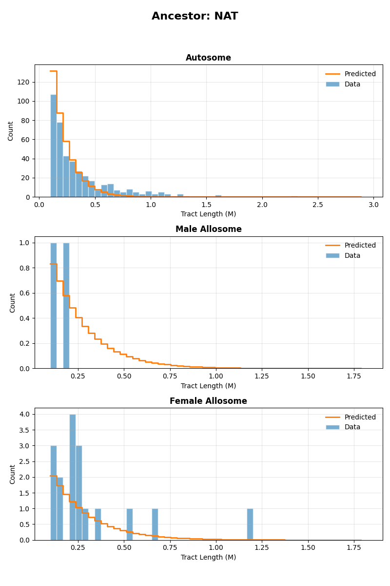

.. DO NOT EDIT.
.. THIS FILE WAS AUTOMATICALLY GENERATED BY SPHINX-GALLERY.
.. TO MAKE CHANGES, EDIT THE SOURCE PYTHON FILE:
.. "auto_examples/ASW/ASW_three_pulses.py"
.. LINE NUMBERS ARE GIVEN BELOW.

.. only:: html

    .. note::
        :class: sphx-glr-download-link-note

        :ref:`Go to the end <sphx_glr_download_auto_examples_ASW_ASW_three_pulses.py>`
        to download the full example code.

.. rst-class:: sphx-glr-example-title

.. _sphx_glr_auto_examples_ASW_ASW_three_pulses.py:

ASW inference - Three pulses model
==================================

This example implements inference for the ASW population under a three pulses model of admixture, using the tracts package.
Inference is performed using autosomal and X chromosome data, allowing for the specification of sex-biased admixture. 

To implement this example, we use the following driver file:

.. code-block:: yaml

   samples:
     directory: ./TrioPhased/
     individual_names: [
       "NA19625","NA19700","NA19701","NA19703","NA19704","NA19707","NA19711","NA19712","NA19713","NA19818","NA19819",
       "NA19834","NA19835","NA19900","NA19901","NA19904","NA19908","NA19909","NA19913","NA19914","NA19916","NA19917",
       "NA19920","NA19921","NA19922","NA19923","NA19982","NA19984","NA20126","NA20127","NA20274","NA20276","NA20278",
       "NA20281","NA20282","NA20287","NA20289","NA20291","NA20294","NA20296","NA20298","NA20299","NA20314","NA20317",
       "NA20318","NA20320","NA20321","NA20332","NA20334","NA20339","NA20340","NA20342","NA20346","NA20348","NA20351",
       "NA20355","NA20356","NA20357","NA20359","NA20362","NA20412"] 
     male_names : [
       "NA19700","NA19703","NA19711","NA19818","NA19834","NA19900","NA19904","NA19908","NA19916","NA19920",
       "NA19922","NA19982","NA19984","NA20126","NA20278","NA20281","NA20291","NA20298","NA20318","NA20340",
       "NA20342","NA20346","NA20348","NA20351","NA20356","NA20362"] #see Readme_dataprocessing.md for how this was generated
     filename_format: "{name}_{label}_final.bed"
     labels: [A, B] #If this field is omitted, 'A' and 'B' will be used by default
     chromosomes: 1-22 #The chromosomes to use for analysis. Can be specified as a list or a range
     allosomes: [X]
   output_filename_format: "ASW_test_output_{label}"
   model_filename: ../models/ppx_xxp_pxx.yaml
   start_params: 
     t1: 10
     REUR: 0.8
     RAFR: 0.9
     REUR2: 0.2
     t2: 5
     t3: 3
     REUR_sex_bias: 0.1
     REUR2_sex_bias: 0.1
     RAFR_sex_bias: 0.1
   repetitions: 1
   seed: 100
   maximum_iterations: 1000
   unknown_labels_for_smoothing: ["UNK", "centromere","miscall"] # segments with these labels will be smoother over, that is, will be filled with neighbouring ancestries up to their midpoints.  
   exclude_tracts_below_cm: 2
   npts : 50
   #fix_parameters_from_ancestry_proportions: ['REUR2', 'RAFR', 'REUR2_sex_bias', 'RAFR_sex_bias']
   output_directory: ./output_three_pulses/
   ad_model_autosomes: M
   ad_model_allosomes: DC
   

Complete results from this analysis are saved in the output directory specified in the driver file. Below, we display the optimal parameters estimated from this analysis,
as well as the plots illustrating the inferred tract length distributions, compared to the observed histograms, for every source population and chromosome type (autosomes and X chromosome).

Optimal parameters
------------------

.. csv-table:: Estimated optimal parameters
   :file: output_three_pulses/ASW_test_output_optimal_parameters.txt
   :header-rows: 1
   :delim: tab

Tract length histograms
-----------------------

African ancestry
^^^^^^^^^^^^^^^^

European ancestry
^^^^^^^^^^^^^^^^^

Native American ancestry
^^^^^^^^^^^^^^^^^^^^^^^^

.. GENERATED FROM PYTHON SOURCE LINES 90-108

.. rst-class:: sphx-glr-script-out

 .. code-block:: none

    ------------------------------------------------------------------------------------------------

    Running tracts 2.0 with driver file: ASW_three_pulses.yaml 

    Reading data, demographic model and driver specifications...

    ------------------------------------------------------------------------------------------------

    excluding_tracts_below Defaulting to 2.0 cM.
    Individual NA19700 is listed as male but has two X chromosomes. Selecting first of the two.
    Individual NA19703 is listed as male but has two X chromosomes. Selecting first of the two.
    Individual NA19711 is listed as male but has two X chromosomes. Selecting first of the two.
    Individual NA19818 is listed as male but has two X chromosomes. Selecting first of the two.
    Individual NA19834 is listed as male but has two X chromosomes. Selecting first of the two.
    Individual NA19900 is listed as male but has two X chromosomes. Selecting first of the two.
    Individual NA19904 is listed as male but has two X chromosomes. Selecting first of the two.
    Individual NA19908 is listed as male but has two X chromosomes. Selecting first of the two.
    Individual NA19916 is listed as male but has two X chromosomes. Selecting first of the two.
    Individual NA19920 is listed as male but has two X chromosomes. Selecting first of the two.
    Individual NA19922 is listed as male but has two X chromosomes. Selecting first of the two.
    Individual NA19982 is listed as male but has two X chromosomes. Selecting first of the two.
    Individual NA19984 is listed as male but has two X chromosomes. Selecting first of the two.
    Individual NA20126 is listed as male but has two X chromosomes. Selecting first of the two.
    Individual NA20278 is listed as male but has two X chromosomes. Selecting first of the two.
    Individual NA20281 is listed as male but has two X chromosomes. Selecting first of the two.
    Individual NA20291 is listed as male but has two X chromosomes. Selecting first of the two.
    Individual NA20298 is listed as male but has two X chromosomes. Selecting first of the two.
    Individual NA20318 is listed as male but has two X chromosomes. Selecting first of the two.
    Individual NA20340 is listed as male but has two X chromosomes. Selecting first of the two.
    Individual NA20342 is listed as male but has two X chromosomes. Selecting first of the two.
    Individual NA20346 is listed as male but has two X chromosomes. Selecting first of the two.
    Individual NA20348 is listed as male but has two X chromosomes. Selecting first of the two.
    Individual NA20351 is listed as male but has two X chromosomes. Selecting first of the two.
    Individual NA20356 is listed as male but has two X chromosomes. Selecting first of the two.
    Individual NA20362 is listed as male but has two X chromosomes. Selecting first of the two.
    Parameter "REUR_male" already exists.
    Parameter "REUR_female" already exists.
    Parameter "t1" already exists.
    Parameter "RAFR_male" already exists.
    Parameter "RAFR_female" already exists.
    Parameter "t2" already exists.
    Parameter "REUR2_male" already exists.
    Parameter "REUR2_female" already exists.
    Parameter "t3" already exists.
    Computed autosome proportions [0.19578862 0.03825495 0.76595643]
    Computed allosome proportions [0.16839124 0.03818939 0.79341937]
    Model parameters : ['REUR', 'REUR_sex_bias', 't1', 'RAFR', 'RAFR_sex_bias', 't2', 'REUR2', 'REUR2_sex_bias', 't3']
    Physical start params : [ 0.8  0.1 10.   0.9  0.1  5.   0.2  0.1  3. ]
    Initial parameters :  [ 1.38629436  0.2006707   2.30258509  2.19722458  0.2006707   1.60943791
     -1.38629436  0.2006707   1.09861229]
    Initial ancestry proportions : {'X_autosomal': array([0.264, 0.016, 0.72 ]), 'X_X': array([0.26856958, 0.01483042, 0.7166    ])}

    --------------------------------------------------------------------------------------------------
    Admixture is modelled with the M model for autosomes and with the DC model for allosomes.
    Optimization is performed in two steps.
    Step 1 : Optimizing autosomal likelihood over parameters ['REUR', 't1', 'RAFR', 't2', 'REUR2', 't3']
    --------------------------------------------------------------------------------------------------
    Iter.    Log-likelihood  Model parameters                Transmission
    ---------------------------------------------------------------------

    1       , -2677.04    , array([ 0.8        ,  0          ,  10         ,  0.9        ,  0          ,  5          ,  0.2        ,  0          ,  3          ]), Autosomes
    2       , -2680.83    , array([ 0.801595   ,  0          ,  10         ,  0.9        ,  0          ,  5          ,  0.2        ,  0          ,  3          ]), Autosomes
    3       , -2671.77    , array([ 0.8        ,  0          ,  10.1005    ,  0.9        ,  0          ,  5          ,  0.2        ,  0          ,  3          ]), Autosomes
    4       , -2690.92    , array([ 0.8        ,  0          ,  10.1005    ,  0.900896   ,  0          ,  5          ,  0.2        ,  0          ,  3          ]), Autosomes
    5       , -2466.12    , array([ 0.8        ,  0          ,  10.1005    ,  0.9        ,  0          ,  5.05025    ,  0.2        ,  0          ,  3          ]), Autosomes
    6       , -2464.78    , array([ 0.8        ,  0          ,  10.1005    ,  0.9        ,  0          ,  5.05025    ,  0.201605   ,  0          ,  3          ]), Autosomes
    7       , -2423.36    , array([ 0.8        ,  0          ,  10.1005    ,  0.9        ,  0          ,  5.05025    ,  0.201605   ,  0          ,  3.03015    ]), Autosomes
    8       , -2318.37    , array([ 0.799971   ,  0          ,  10.103     ,  0.899918   ,  0          ,  5.09977    ,  0.201615   ,  0          ,  3.03611    ]), Autosomes
    9       , -2271.31    , array([ 0.799943   ,  0          ,  10.1642    ,  0.899315   ,  0          ,  5.11963    ,  0.201625   ,  0          ,  3.04203    ]), Autosomes
    10      , -2239.64    , array([ 0.79991    ,  0          ,  10.2227    ,  0.899799   ,  0          ,  5.1492     ,  0.201637   ,  0          ,  3.04891    ]), Autosomes
    11      , -2206.63    , array([ 0.798614   ,  0          ,  10.2046    ,  0.899658   ,  0          ,  5.17478    ,  0.201648   ,  0          ,  3.05554    ]), Autosomes
    12      , -2166.15    , array([ 0.799177   ,  0          ,  10.1794    ,  0.899438   ,  0          ,  5.21643    ,  0.201666   ,  0          ,  3.06591    ]), Autosomes
    13      , -2127.64    , array([ 0.799079   ,  0          ,  10.1955    ,  0.899315   ,  0          ,  5.21882    ,  0.201684   ,  0          ,  3.09595    ]), Autosomes
    14      , -2099.79    , array([ 0.798938   ,  0          ,  10.2178    ,  0.89912    ,  0          ,  5.24217    ,  0.202919   ,  0          ,  3.10638    ]), Autosomes
    15      , -2061.65    , array([ 0.798728   ,  0          ,  10.2511    ,  0.898828   ,  0          ,  5.27779    ,  0.202563   ,  0          ,  3.12246    ]), Autosomes
    16      , -2031.92    , array([ 0.798528   ,  0          ,  10.2307    ,  0.899047   ,  0          ,  5.31106    ,  0.202651   ,  0          ,  3.14437    ]), Autosomes
    17      , -1999.89    , array([ 0.798362   ,  0          ,  10.1962    ,  0.898396   ,  0          ,  5.32527    ,  0.202726   ,  0          ,  3.16135    ]), Autosomes
    18      , -1968.63    , array([ 0.79913    ,  0          ,  10.2148    ,  0.898095   ,  0          ,  5.34713    ,  0.202819   ,  0          ,  3.18283    ]), Autosomes
    19      , -1933.52    , array([ 0.798686   ,  0          ,  10.2391    ,  0.897761   ,  0          ,  5.36695    ,  0.202929   ,  0          ,  3.20742    ]), Autosomes
    20      , -1904.57    , array([ 0.798555   ,  0          ,  10.2434    ,  0.897363   ,  0          ,  5.40826    ,  0.203043   ,  0          ,  3.22223    ]), Autosomes
    21      , -1879.58    , array([ 0.79852    ,  0          ,  10.2368    ,  0.897158   ,  0          ,  5.4193     ,  0.201995   ,  0          ,  3.2447     ]), Autosomes
    22      , -1847.97    , array([ 0.798486   ,  0          ,  10.2254    ,  0.896897   ,  0          ,  5.43144    ,  0.202301   ,  0          ,  3.27424    ]), Autosomes
    23      , -1818.43    , array([ 0.798482   ,  0          ,  10.2536    ,  0.896248   ,  0          ,  5.43884    ,  0.202293   ,  0          ,  3.29542    ]), Autosomes
    24      , -1790.45    , array([ 0.798448   ,  0          ,  10.2919    ,  0.896129   ,  0          ,  5.46093    ,  0.202297   ,  0          ,  3.32271    ]), Autosomes
    25      , -1763.12    , array([ 0.797644   ,  0          ,  10.2866    ,  0.895728   ,  0          ,  5.47629    ,  0.202285   ,  0          ,  3.34592    ]), Autosomes
    26      , -1734.91    , array([ 0.797829   ,  0          ,  10.2779    ,  0.895273   ,  0          ,  5.49759    ,  0.202268   ,  0          ,  3.37178    ]), Autosomes
    27      , -1709.05    , array([ 0.797725   ,  0          ,  10.2884    ,  0.894989   ,  0          ,  5.48794    ,  0.202224   ,  0          ,  3.40324    ]), Autosomes
    28      , -1686.47    , array([ 0.79756    ,  0          ,  10.3072    ,  0.894597   ,  0          ,  5.50034    ,  0.203164   ,  0          ,  3.42463    ]), Autosomes
    29      , -1660.23    , array([ 0.797349   ,  0          ,  10.3328    ,  0.894117   ,  0          ,  5.51709    ,  0.202937   ,  0          ,  3.45016    ]), Autosomes
    30      , -1636.4     , array([ 0.797118   ,  0          ,  10.3209    ,  0.894036   ,  0          ,  5.53717    ,  0.202992   ,  0          ,  3.48166    ]), Autosomes
    31      , -1613.05    , array([ 0.796918   ,  0          ,  10.2964    ,  0.893395   ,  0          ,  5.54068    ,  0.203035   ,  0          ,  3.50555    ]), Autosomes
    32      , -1590.75    , array([ 0.797471   ,  0          ,  10.3129    ,  0.893016   ,  0          ,  5.55059    ,  0.203096   ,  0          ,  3.53427    ]), Autosomes
    33      , -1567.41    , array([ 0.797002   ,  0          ,  10.3347    ,  0.89264    ,  0          ,  5.55571    ,  0.203167   ,  0          ,  3.56411    ]), Autosomes
    34      , -1546.48    , array([ 0.796813   ,  0          ,  10.3378    ,  0.892145   ,  0          ,  5.58916    ,  0.203264   ,  0          ,  3.58543    ]), Autosomes
    35      , -1528.08    , array([ 0.796721   ,  0          ,  10.3305    ,  0.89185    ,  0          ,  5.59715    ,  0.202319   ,  0          ,  3.61178    ]), Autosomes
    36      , -1506.63    , array([ 0.796627   ,  0          ,  10.3173    ,  0.891505   ,  0          ,  5.60464    ,  0.202556   ,  0          ,  3.6445     ]), Autosomes
    37      , -1486.77    , array([ 0.796575   ,  0          ,  10.3405    ,  0.890793   ,  0          ,  5.60692    ,  0.202519   ,  0          ,  3.6678     ]), Autosomes
    38      , -1467.9     , array([ 0.796496   ,  0          ,  10.3772    ,  0.890616   ,  0          ,  5.62524    ,  0.202491   ,  0          ,  3.69933    ]), Autosomes
    39      , -1449.59    , array([ 0.795618   ,  0          ,  10.3709    ,  0.890183   ,  0          ,  5.63649    ,  0.202443   ,  0          ,  3.72465    ]), Autosomes
    40      , -1430.56    , array([ 0.795728   ,  0          ,  10.3592    ,  0.889671   ,  0          ,  5.65468    ,  0.20238    ,  0          ,  3.75373    ]), Autosomes
    41      , -1413.27    , array([ 0.795591   ,  0          ,  10.3652    ,  0.889347   ,  0          ,  5.64162    ,  0.202286   ,  0          ,  3.78796    ]), Autosomes
    42      , -1398.7     , array([ 0.79539    ,  0          ,  10.3808    ,  0.888904   ,  0          ,  5.6513     ,  0.203227   ,  0          ,  3.81174    ]), Autosomes
    43      , -1381.3     , array([ 0.795129   ,  0          ,  10.4051    ,  0.888357   ,  0          ,  5.66528    ,  0.202925   ,  0          ,  3.83926    ]), Autosomes
    44      , -1365.37    , array([ 0.794835   ,  0          ,  10.3917    ,  0.888238   ,  0          ,  5.68393    ,  0.202899   ,  0          ,  3.87436    ]), Autosomes
    45      , -1349.92    , array([ 0.79457    ,  0          ,  10.3623    ,  0.887556   ,  0          ,  5.68506    ,  0.202864   ,  0          ,  3.89963    ]), Autosomes
    46      , -1335.39    , array([ 0.795112   ,  0          ,  10.3745    ,  0.887124   ,  0          ,  5.69295    ,  0.202849   ,  0          ,  3.93168    ]), Autosomes
    47      , -1320.09    , array([ 0.79458    ,  0          ,  10.3937    ,  0.886712   ,  0          ,  5.69449    ,  0.202847   ,  0          ,  3.96446    ]), Autosomes
    48      , -1306.3     , array([ 0.794315   ,  0          ,  10.3949    ,  0.886161   ,  0          ,  5.72715    ,  0.202883   ,  0          ,  3.98787    ]), Autosomes
    49      , -1291.22    , array([ 0.794171   ,  0          ,  10.3846    ,  0.885854   ,  0          ,  5.73398    ,  0.201831   ,  0          ,  4.01476    ]), Autosomes
    50      , -1270.12    , array([ 0.794001   ,  0          ,  10.3676    ,  0.885474   ,  0          ,  5.74096    ,  0.201502   ,  0          ,  4.05004    ]), Autosomes
    51      , -1255.22    , array([ 0.793838   ,  0          ,  10.3166    ,  0.8857     ,  0          ,  5.75189    ,  0.201593   ,  0          ,  4.08302    ]), Autosomes
    52      , -1245.1     , array([ 0.793726   ,  0          ,  10.2501    ,  0.88508    ,  0          ,  5.73709    ,  0.201656   ,  0          ,  4.0981     ]), Autosomes
    53      , -1233.96    , array([ 0.794922   ,  0          ,  10.258     ,  0.884903   ,  0          ,  5.7357     ,  0.201741   ,  0          ,  4.12487    ]), Autosomes
    54      , -1218.45    , array([ 0.794433   ,  0          ,  10.2814    ,  0.884737   ,  0          ,  5.72018    ,  0.201888   ,  0          ,  4.16073    ]), Autosomes
    55      , -1200.89    , array([ 0.794211   ,  0          ,  10.2839    ,  0.88429    ,  0          ,  5.74913    ,  0.202106   ,  0          ,  4.19074    ]), Autosomes
    56      , -1183.31    , array([ 0.794061   ,  0          ,  10.2782    ,  0.883995   ,  0          ,  5.76105    ,  0.201538   ,  0          ,  4.22691    ]), Autosomes
    57      , -1165.89    , array([ 0.793913   ,  0          ,  10.27      ,  0.883695   ,  0          ,  5.77281    ,  0.201628   ,  0          ,  4.26619    ]), Autosomes
    58      , -1153.67    , array([ 0.793855   ,  0          ,  10.2603    ,  0.88359    ,  0          ,  5.76917    ,  0.200542   ,  0          ,  4.29703    ]), Autosomes
    59      , -1139.62    , array([ 0.793759   ,  0          ,  10.287     ,  0.882875   ,  0          ,  5.77521    ,  0.200413   ,  0          ,  4.32533    ]), Autosomes
    60      , -1128.04    , array([ 0.793682   ,  0          ,  10.3396    ,  0.883061   ,  0          ,  5.80168    ,  0.200307   ,  0          ,  4.35579    ]), Autosomes
    61      , -1115.69    , array([ 0.792483   ,  0          ,  10.329     ,  0.882833   ,  0          ,  5.81824    ,  0.200179   ,  0          ,  4.38048    ]), Autosomes
    62      , -1101.18    , array([ 0.79257    ,  0          ,  10.3066    ,  0.882487   ,  0          ,  5.84916    ,  0.199997   ,  0          ,  4.41292    ]), Autosomes
    63      , -1087.26    , array([ 0.792381   ,  0          ,  10.3038    ,  0.882246   ,  0          ,  5.85353    ,  0.200059   ,  0          ,  4.45557    ]), Autosomes
    64      , -1073.44    , array([ 0.792099   ,  0          ,  10.3137    ,  0.881843   ,  0          ,  5.87571    ,  0.199605   ,  0          ,  4.48985    ]), Autosomes
    65      , -1062.88    , array([ 0.7917     ,  0          ,  10.3299    ,  0.881676   ,  0          ,  5.86399    ,  0.199695   ,  0          ,  4.5314     ]), Autosomes
    66      , -1053.29    , array([ 0.791438   ,  0          ,  10.3413    ,  0.881228   ,  0          ,  5.8962     ,  0.200398   ,  0          ,  4.55569    ]), Autosomes
    67      , -1041.69    , array([ 0.791157   ,  0          ,  10.316     ,  0.88131    ,  0          ,  5.92383    ,  0.200097   ,  0          ,  4.59261    ]), Autosomes
    68      , -1032.43    , array([ 0.790909   ,  0          ,  10.2657    ,  0.880648   ,  0          ,  5.92757    ,  0.199833   ,  0          ,  4.6182     ]), Autosomes
    69      , -1023.83    , array([ 0.791729   ,  0          ,  10.2768    ,  0.880368   ,  0          ,  5.94309    ,  0.199571   ,  0          ,  4.65339    ]), Autosomes
    70      , -1013.31    , array([ 0.791109   ,  0          ,  10.2917    ,  0.880046   ,  0          ,  5.96505    ,  0.199126   ,  0          ,  4.68741    ]), Autosomes
    71      , -1003.54    , array([ 0.790802   ,  0          ,  10.272     ,  0.879884   ,  0          ,  5.98126    ,  0.199278   ,  0          ,  4.73011    ]), Autosomes
    72      , -972.933    , array([ 0.790743   ,  0          ,  10.2451    ,  0.879578   ,  0          ,  6.02881    ,  0.198916   ,  0          ,  4.74952    ]), Autosomes
    73      , -950.596    , array([ 0.790807   ,  0          ,  10.2329    ,  0.879217   ,  0          ,  6.08282    ,  0.19931    ,  0          ,  4.74431    ]), Autosomes
    74      , -938.217    , array([ 0.790907   ,  0          ,  10.1844    ,  0.879424   ,  0          ,  6.12881    ,  0.198663   ,  0          ,  4.74587    ]), Autosomes
    75      , -937.007    , array([ 0.790919   ,  0          ,  10.1269    ,  0.878581   ,  0          ,  6.12406    ,  0.198364   ,  0          ,  4.74124    ]), Autosomes
    76      , -937.772    , array([ 0.791725   ,  0          ,  10.1262    ,  0.878571   ,  0          ,  6.12258    ,  0.198427   ,  0          ,  4.74596    ]), Autosomes
    77      , -930.163    , array([ 0.79093    ,  0          ,  10.187     ,  0.87815    ,  0          ,  6.15455    ,  0.19762    ,  0          ,  4.74794    ]), Autosomes
    78      , -924.294    , array([ 0.790607   ,  0          ,  10.1718    ,  0.877985   ,  0          ,  6.18542    ,  0.198183   ,  0          ,  4.78295    ]), Autosomes
    79      , -923.014    , array([ 0.790667   ,  0          ,  10.1689    ,  0.877836   ,  0          ,  6.23892    ,  0.198606   ,  0          ,  4.7635     ]), Autosomes
    80      , -920.498    , array([ 0.790707   ,  0          ,  10.1439    ,  0.878084   ,  0          ,  6.24868    ,  0.198085   ,  0          ,  4.7662     ]), Autosomes
    81      , -913.748    , array([ 0.790365   ,  0          ,  10.1448    ,  0.877911   ,  0          ,  6.28413    ,  0.197247   ,  0          ,  4.79374    ]), Autosomes
    82      , -909.666    , array([ 0.790277   ,  0          ,  10.1488    ,  0.877783   ,  0          ,  6.33511    ,  0.196366   ,  0          ,  4.78732    ]), Autosomes
    83      , -906.431    , array([ 0.789913   ,  0          ,  10.096     ,  0.877868   ,  0          ,  6.37637    ,  0.196614   ,  0          ,  4.81017    ]), Autosomes
    84      , -905.786    , array([ 0.791364   ,  0          ,  10.0959    ,  0.877769   ,  0          ,  6.39057    ,  0.196443   ,  0          ,  4.82952    ]), Autosomes
    85      , -906.521    , array([ 0.791347   ,  0          ,  10.1261    ,  0.878158   ,  0          ,  6.39813    ,  0.1966     ,  0          ,  4.83284    ]), Autosomes
    86      , -899.697    , array([ 0.790877   ,  0          ,  10.0766    ,  0.877686   ,  0          ,  6.404      ,  0.195265   ,  0          ,  4.85458    ]), Autosomes
    87      , -895.207    , array([ 0.790288   ,  0          ,  10.0844    ,  0.877197   ,  0          ,  6.42821    ,  0.194556   ,  0          ,  4.88185    ]), Autosomes
    88      , -889.449    , array([ 0.789923   ,  0          ,  10.0467    ,  0.87722    ,  0          ,  6.44951    ,  0.193365   ,  0          ,  4.89885    ]), Autosomes
    89      , -884.303    , array([ 0.789762   ,  0          ,  9.99966    ,  0.876944   ,  0          ,  6.47439    ,  0.192301   ,  0          ,  4.91351    ]), Autosomes
    90      , -878.734    , array([ 0.789429   ,  0          ,  9.98359    ,  0.877091   ,  0          ,  6.50307    ,  0.191203   ,  0          ,  4.93651    ]), Autosomes
    91      , -873.527    , array([ 0.789124   ,  0          ,  9.96882    ,  0.877014   ,  0          ,  6.53522    ,  0.190175   ,  0          ,  4.96137    ]), Autosomes
    92      , -868.813    , array([ 0.789058   ,  0          ,  9.92358    ,  0.876421   ,  0          ,  6.55984    ,  0.189359   ,  0          ,  4.97426    ]), Autosomes
    93      , -862.993    , array([ 0.788654   ,  0          ,  9.87476    ,  0.87636    ,  0          ,  6.55215    ,  0.188565   ,  0          ,  5.00631    ]), Autosomes
    94      , -856.316    , array([ 0.788381   ,  0          ,  9.85188    ,  0.876197   ,  0          ,  6.54372    ,  0.187252   ,  0          ,  5.0251     ]), Autosomes
    95      , -849.726    , array([ 0.788085   ,  0          ,  9.82785    ,  0.876037   ,  0          ,  6.53592    ,  0.185955   ,  0          ,  5.04416    ]), Autosomes
    96      , -843.123    , array([ 0.787757   ,  0          ,  9.80059    ,  0.875886   ,  0          ,  6.52867    ,  0.184704   ,  0          ,  5.0647     ]), Autosomes
    97      , -836.678    , array([ 0.787429   ,  0          ,  9.77361    ,  0.875734   ,  0          ,  6.52141    ,  0.183456   ,  0          ,  5.08523    ]), Autosomes
    98      , -829.952    , array([ 0.787035   ,  0          ,  9.73291    ,  0.875633   ,  0          ,  6.51409    ,  0.182465   ,  0          ,  5.11362    ]), Autosomes
    99      , -823.407    , array([ 0.786638   ,  0          ,  9.6915     ,  0.875536   ,  0          ,  6.50675    ,  0.1815     ,  0          ,  5.14269    ]), Autosomes
    100     , -817.166    , array([ 0.786277   ,  0          ,  9.65705    ,  0.875411   ,  0          ,  6.49911    ,  0.180397   ,  0          ,  5.16828    ]), Autosomes
    101     , -816.347    , array([ 0.786494   ,  0          ,  9.69368    ,  0.875188   ,  0          ,  6.49228    ,  0.179167   ,  0          ,  5.15269    ]), Autosomes
    102     , -816.198    , array([ 0.787269   ,  0          ,  9.69218    ,  0.875248   ,  0          ,  6.4908     ,  0.179151   ,  0          ,  5.16196    ]), Autosomes
    103     , -811.585    , array([ 0.787123   ,  0          ,  9.64694    ,  0.874535   ,  0          ,  6.49381    ,  0.178623   ,  0          ,  5.18611    ]), Autosomes
    104     , -808.917    , array([ 0.787229   ,  0          ,  9.56701    ,  0.874726   ,  0          ,  6.50715    ,  0.178005   ,  0          ,  5.17415    ]), Autosomes
    105     , -804.875    , array([ 0.786969   ,  0          ,  9.56827    ,  0.874843   ,  0          ,  6.55589    ,  0.177429   ,  0          ,  5.20018    ]), Autosomes
    106     , -798.903    , array([ 0.786572   ,  0          ,  9.53236    ,  0.874869   ,  0          ,  6.55728    ,  0.176547   ,  0          ,  5.23461    ]), Autosomes
    107     , -793.165    , array([ 0.786219   ,  0          ,  9.49436    ,  0.874806   ,  0          ,  6.5651     ,  0.175663   ,  0          ,  5.26814    ]), Autosomes
    108     , -787.877    , array([ 0.78592    ,  0          ,  9.45797    ,  0.874665   ,  0          ,  6.58423    ,  0.174805   ,  0          ,  5.30013    ]), Autosomes
    109     , -783.977    , array([ 0.786484   ,  0          ,  9.43763    ,  0.875118   ,  0          ,  6.5825     ,  0.174085   ,  0          ,  5.33458    ]), Autosomes
    110     , -779.673    , array([ 0.785734   ,  0          ,  9.43813    ,  0.875366   ,  0          ,  6.58023    ,  0.172866   ,  0          ,  5.34297    ]), Autosomes
    111     , -775.591    , array([ 0.784797   ,  0          ,  9.39633    ,  0.875748   ,  0          ,  6.58472    ,  0.172597   ,  0          ,  5.37383    ]), Autosomes
    112     , -772.635    , array([ 0.78433    ,  0          ,  9.42921    ,  0.875506   ,  0          ,  6.57391    ,  0.172192   ,  0          ,  5.41714    ]), Autosomes
    113     , -767.966    , array([ 0.784035   ,  0          ,  9.3792     ,  0.87536    ,  0          ,  6.55778    ,  0.171266   ,  0          ,  5.44049    ]), Autosomes
    114     , -763.16     , array([ 0.783653   ,  0          ,  9.34804    ,  0.875408   ,  0          ,  6.57076    ,  0.170264   ,  0          ,  5.4702     ]), Autosomes
    115     , -758.565    , array([ 0.783197   ,  0          ,  9.31793    ,  0.875614   ,  0          ,  6.56213    ,  0.169295   ,  0          ,  5.50012    ]), Autosomes
    116     , -754.967    , array([ 0.782896   ,  0          ,  9.30547    ,  0.87568    ,  0          ,  6.60254    ,  0.168479   ,  0          ,  5.5267     ]), Autosomes
    117     , -750.844    , array([ 0.781841   ,  0          ,  9.27211    ,  0.875435   ,  0          ,  6.60265    ,  0.167678   ,  0          ,  5.54498    ]), Autosomes
    118     , -746.971    , array([ 0.781591   ,  0          ,  9.22231    ,  0.875331   ,  0          ,  6.60299    ,  0.167087   ,  0          ,  5.58431    ]), Autosomes
    119     , -743.156    , array([ 0.781551   ,  0          ,  9.21156    ,  0.875108   ,  0          ,  6.59761    ,  0.165806   ,  0          ,  5.60064    ]), Autosomes
    /home/jgonzale/Documents/PhaseType/tracts/tracts/phase_type_distribution.py:171: ComplexWarning: Casting complex values to real discards the imaginary part
      CDF_values[bin_number] = prop_connected * ((self.inner_CDF(bin_val, L, S, exp_Sx, alpha, S0_inv) +
    120     , -740.211    , array([ 0.78132    ,  0          ,  9.146      ,  0.875412   ,  0          ,  6.60636    ,  0.164977   ,  0          ,  5.59373    ]), Autosomes
    121     , -736.122    , array([ 0.780616   ,  0          ,  9.12542    ,  0.875576   ,  0          ,  6.60601    ,  0.163996   ,  0          ,  5.62168    ]), Autosomes
    122     , -732.15     , array([ 0.780042   ,  0          ,  9.09141    ,  0.8754     ,  0          ,  6.61553    ,  0.163013   ,  0          ,  5.6459     ]), Autosomes
    123     , -729.735    , array([ 0.780613   ,  0          ,  9.05192    ,  0.875583   ,  0          ,  6.61181    ,  0.162489   ,  0          ,  5.6868     ]), Autosomes
    124     , -726.644    , array([ 0.779924   ,  0          ,  9.01539    ,  0.875468   ,  0          ,  6.58086    ,  0.161662   ,  0          ,  5.70213    ]), Autosomes
    125     , -722.982    , array([ 0.77944    ,  0          ,  9.00024    ,  0.875586   ,  0          ,  6.59021    ,  0.160492   ,  0          ,  5.72117    ]), Autosomes
    126     , -719.145    , array([ 0.779097   ,  0          ,  8.95766    ,  0.875041   ,  0          ,  6.61095    ,  0.159754   ,  0          ,  5.73795    ]), Autosomes
    127     , -715.102    , array([ 0.778287   ,  0          ,  8.914      ,  0.874934   ,  0          ,  6.62873    ,  0.159083   ,  0          ,  5.76414    ]), Autosomes
    128     , -711.082    , array([ 0.777748   ,  0          ,  8.86438    ,  0.874797   ,  0          ,  6.64436    ,  0.158207   ,  0          ,  5.78143    ]), Autosomes
    129     , -707.338    , array([ 0.777056   ,  0          ,  8.83527    ,  0.874768   ,  0          ,  6.65945    ,  0.157273   ,  0          ,  5.80637    ]), Autosomes
    130     , -703.835    , array([ 0.776856   ,  0          ,  8.77564    ,  0.874564   ,  0          ,  6.67223    ,  0.156386   ,  0          ,  5.81115    ]), Autosomes
    131     , -701.525    , array([ 0.776406   ,  0          ,  8.7437     ,  0.873875   ,  0          ,  6.68066    ,  0.155952   ,  0          ,  5.8421     ]), Autosomes
    132     , -698.396    , array([ 0.77544    ,  0          ,  8.68769    ,  0.874133   ,  0          ,  6.65831    ,  0.155607   ,  0          ,  5.85419    ]), Autosomes
    133     , -696.577    , array([ 0.775605   ,  0          ,  8.63416    ,  0.874552   ,  0          ,  6.67892    ,  0.155396   ,  0          ,  5.88852    ]), Autosomes
    134     , -694.463    , array([ 0.774371   ,  0          ,  8.59672    ,  0.874577   ,  0          ,  6.70906    ,  0.154988   ,  0          ,  5.88271    ]), Autosomes
    135     , -690.93     , array([ 0.773921   ,  0          ,  8.56627    ,  0.874638   ,  0          ,  6.69531    ,  0.153884   ,  0          ,  5.89574    ]), Autosomes
    136     , -687.853    , array([ 0.773532   ,  0          ,  8.5082     ,  0.874554   ,  0          ,  6.6808     ,  0.153039   ,  0          ,  5.90195    ]), Autosomes
    137     , -684.854    , array([ 0.772637   ,  0          ,  8.48525    ,  0.874667   ,  0          ,  6.66781    ,  0.152215   ,  0          ,  5.92924    ]), Autosomes
    138     , -682.1      , array([ 0.77159    ,  0          ,  8.43188    ,  0.87464    ,  0          ,  6.66739    ,  0.151637   ,  0          ,  5.94194    ]), Autosomes
    139     , -679.569    , array([ 0.771661   ,  0          ,  8.40069    ,  0.874786   ,  0          ,  6.69007    ,  0.15064    ,  0          ,  5.96292    ]), Autosomes
    140     , -677.934    , array([ 0.771198   ,  0          ,  8.3742     ,  0.875478   ,  0          ,  6.67669    ,  0.149875   ,  0          ,  5.95249    ]), Autosomes
    141     , -675.567    , array([ 0.770575   ,  0          ,  8.36697    ,  0.875048   ,  0          ,  6.67275    ,  0.148805   ,  0          ,  5.95236    ]), Autosomes
    142     , -673.349    , array([ 0.77027    ,  0          ,  8.32458    ,  0.874926   ,  0          ,  6.65655    ,  0.147993   ,  0          ,  5.98086    ]), Autosomes
    143     , -670.233    , array([ 0.76914    ,  0          ,  8.3174     ,  0.875016   ,  0          ,  6.67788    ,  0.147274   ,  0          ,  6.00419    ]), Autosomes
    144     , -667.076    , array([ 0.768121   ,  0          ,  8.29442    ,  0.875027   ,  0          ,  6.70114    ,  0.14648    ,  0          ,  6.02029    ]), Autosomes
    145     , -664.3      , array([ 0.76713    ,  0          ,  8.26939    ,  0.875027   ,  0          ,  6.72219    ,  0.145671   ,  0          ,  6.03751    ]), Autosomes
    146     , -664.071    , array([ 0.766495   ,  0          ,  8.2422     ,  0.874999   ,  0          ,  6.71361    ,  0.144865   ,  0          ,  6.07212    ]), Autosomes
    147     , -663.372    , array([ 0.76654    ,  0          ,  8.20625    ,  0.874818   ,  0          ,  6.71078    ,  0.144989   ,  0          ,  6.06366    ]), Autosomes
    148     , -661.383    , array([ 0.766479   ,  0          ,  8.20588    ,  0.874392   ,  0          ,  6.72868    ,  0.14423    ,  0          ,  6.02542    ]), Autosomes
    149     , -661.97     , array([ 0.764971   ,  0          ,  8.21658    ,  0.874186   ,  0          ,  6.70574    ,  0.14447    ,  0          ,  6.00761    ]), Autosomes
    150     , -660.853    , array([ 0.76648    ,  0          ,  8.2141     ,  0.873946   ,  0          ,  6.7387     ,  0.14437    ,  0          ,  6.03757    ]), Autosomes
    151     , -660.055    , array([ 0.766044   ,  0          ,  8.18606    ,  0.873879   ,  0          ,  6.79947    ,  0.14433    ,  0          ,  6.03069    ]), Autosomes
    152     , -660.671    , array([ 0.766588   ,  0          ,  8.16002    ,  0.873064   ,  0          ,  6.81261    ,  0.143854   ,  0          ,  6.01416    ]), Autosomes
    153     , -658.692    , array([ 0.765722   ,  0          ,  8.17855    ,  0.873894   ,  0          ,  6.79564    ,  0.143915   ,  0          ,  6.04909    ]), Autosomes
    154     , -657.991    , array([ 0.765444   ,  0          ,  8.2358     ,  0.873965   ,  0          ,  6.82025    ,  0.143229   ,  0          ,  6.06163    ]), Autosomes
    155     , -661.203    , array([ 0.764949   ,  0          ,  8.21418    ,  0.874002   ,  0          ,  6.83302    ,  0.143042   ,  0          ,  6.11594    ]), Autosomes
    156     , -657.415    , array([ 0.764671   ,  0          ,  8.23042    ,  0.87381    ,  0          ,  6.80892    ,  0.143206   ,  0          ,  6.05466    ]), Autosomes
    157     , -658.91     , array([ 0.764163   ,  0          ,  8.29418    ,  0.873684   ,  0          ,  6.8289     ,  0.143315   ,  0          ,  6.02645    ]), Autosomes
    158     , -657.287    , array([ 0.764608   ,  0          ,  8.21951    ,  0.874142   ,  0          ,  6.80575    ,  0.142853   ,  0          ,  6.0404     ]), Autosomes
    159     , -657.556    , array([ 0.764572   ,  0          ,  8.22786    ,  0.874292   ,  0          ,  6.79524    ,  0.142941   ,  0          ,  6.04422    ]), Autosomes
    160     , -657.203    , array([ 0.764897   ,  0          ,  8.22423    ,  0.87385    ,  0          ,  6.78615    ,  0.14254    ,  0          ,  6.03771    ]), Autosomes
    161     , -657.807    , array([ 0.765035   ,  0          ,  8.21887    ,  0.873834   ,  0          ,  6.78184    ,  0.142721   ,  0          ,  6.02794    ]), Autosomes
    162     , -656.26     , array([ 0.764494   ,  0          ,  8.207      ,  0.873756   ,  0          ,  6.79035    ,  0.142216   ,  0          ,  6.0542     ]), Autosomes
    163     , -655.453    , array([ 0.76399    ,  0          ,  8.2192     ,  0.873629   ,  0          ,  6.80363    ,  0.141841   ,  0          ,  6.05792    ]), Autosomes
    164     , -655.492    , array([ 0.764166   ,  0          ,  8.21813    ,  0.873645   ,  0          ,  6.81994    ,  0.141442   ,  0          ,  6.07456    ]), Autosomes
    165     , -655.404    , array([ 0.763951   ,  0          ,  8.21584    ,  0.873826   ,  0          ,  6.79965    ,  0.141691   ,  0          ,  6.05186    ]), Autosomes
    166     , -655.795    , array([ 0.76336    ,  0          ,  8.2274     ,  0.873887   ,  0          ,  6.78377    ,  0.141633   ,  0          ,  6.06708    ]), Autosomes
    167     , -655.379    , array([ 0.764105   ,  0          ,  8.21782    ,  0.873679   ,  0          ,  6.78958    ,  0.141548   ,  0          ,  6.04984    ]), Autosomes
    168     , -654.676    , array([ 0.763681   ,  0          ,  8.19482    ,  0.873445   ,  0          ,  6.79847    ,  0.141399   ,  0          ,  6.0379     ]), Autosomes
    169     , -655.306    , array([ 0.763438   ,  0          ,  8.20849    ,  0.873293   ,  0          ,  6.81421    ,  0.141226   ,  0          ,  6.01777    ]), Autosomes
    170     , -654.549    , array([ 0.763723   ,  0          ,  8.17476    ,  0.873418   ,  0          ,  6.79632    ,  0.141414   ,  0          ,  6.03865    ]), Autosomes
    171     , -654.261    , array([ 0.763364   ,  0          ,  8.17296    ,  0.873396   ,  0          ,  6.78961    ,  0.141366   ,  0          ,  6.0449     ]), Autosomes
    172     , -654.311    , array([ 0.763472   ,  0          ,  8.17355    ,  0.873294   ,  0          ,  6.77614    ,  0.141245   ,  0          ,  6.04671    ]), Autosomes
    173     , -654.448    , array([ 0.763322   ,  0          ,  8.17337    ,  0.873412   ,  0          ,  6.78535    ,  0.141459   ,  0          ,  6.04064    ]), Autosomes
    174     , -654.221    , array([ 0.763323   ,  0          ,  8.1693     ,  0.87362    ,  0          ,  6.78807    ,  0.141201   ,  0          ,  6.04588    ]), Autosomes
    175     , -654.432    , array([ 0.763395   ,  0          ,  8.17018    ,  0.873664   ,  0          ,  6.78639    ,  0.141279   ,  0          ,  6.05118    ]), Autosomes
    176     , -653.713    , array([ 0.763088   ,  0          ,  8.16353    ,  0.873512   ,  0          ,  6.79498    ,  0.141028   ,  0          ,  6.04704    ]), Autosomes
    177     , -653.263    , array([ 0.762768   ,  0          ,  8.15677    ,  0.873424   ,  0          ,  6.79888    ,  0.140894   ,  0          ,  6.04417    ]), Autosomes
    178     , -652.784    , array([ 0.762515   ,  0          ,  8.15015    ,  0.873329   ,  0          ,  6.80542    ,  0.140749   ,  0          ,  6.04871    ]), Autosomes
    179     , -652.324    , array([ 0.762223   ,  0          ,  8.14285    ,  0.873255   ,  0          ,  6.81091    ,  0.140599   ,  0          ,  6.05138    ]), Autosomes
    180     , -651.922    , array([ 0.761883   ,  0          ,  8.13572    ,  0.873207   ,  0          ,  6.81318    ,  0.140469   ,  0          ,  6.0471     ]), Autosomes
    181     , -651.489    , array([ 0.761597   ,  0          ,  8.12793    ,  0.873194   ,  0          ,  6.81783    ,  0.140293   ,  0          ,  6.05012    ]), Autosomes
    182     , -651.167    , array([ 0.761433   ,  0          ,  8.12519    ,  0.872971   ,  0          ,  6.82426    ,  0.140287   ,  0          ,  6.05385    ]), Autosomes
    183     , -650.888    , array([ 0.761208   ,  0          ,  8.13695    ,  0.872922   ,  0          ,  6.82944    ,  0.140124   ,  0          ,  6.05424    ]), Autosomes
    184     , -650.471    , array([ 0.76112    ,  0          ,  8.13052    ,  0.872825   ,  0          ,  6.83836    ,  0.139921   ,  0          ,  6.05229    ]), Autosomes
    185     , -650.052    , array([ 0.760852   ,  0          ,  8.12476    ,  0.872754   ,  0          ,  6.84766    ,  0.139784   ,  0          ,  6.05276    ]), Autosomes
    186     , -649.697    , array([ 0.760689   ,  0          ,  8.11854    ,  0.872725   ,  0          ,  6.84632    ,  0.139543   ,  0          ,  6.058      ]), Autosomes
    187     , -649.265    , array([ 0.76047    ,  0          ,  8.11384    ,  0.872559   ,  0          ,  6.84948    ,  0.139374   ,  0          ,  6.05741    ]), Autosomes
    188     , -648.864    , array([ 0.760308   ,  0          ,  8.10966    ,  0.872415   ,  0          ,  6.85648    ,  0.139197   ,  0          ,  6.06083    ]), Autosomes
    189     , -648.432    , array([ 0.760068   ,  0          ,  8.10429    ,  0.872329   ,  0          ,  6.86082    ,  0.138993   ,  0          ,  6.05832    ]), Autosomes
    190     , -648.012    , array([ 0.759857   ,  0          ,  8.09919    ,  0.872238   ,  0          ,  6.8672     ,  0.138787   ,  0          ,  6.05836    ]), Autosomes
    191     , -647.665    , array([ 0.759474   ,  0          ,  8.10026    ,  0.872147   ,  0          ,  6.86832    ,  0.138662   ,  0          ,  6.05946    ]), Autosomes
    192     , -647.306    , array([ 0.759238   ,  0          ,  8.08655    ,  0.87204    ,  0          ,  6.87018    ,  0.138561   ,  0          ,  6.05902    ]), Autosomes
    193     , -646.93     , array([ 0.759073   ,  0          ,  8.0823     ,  0.871897   ,  0          ,  6.87128    ,  0.138342   ,  0          ,  6.05673    ]), Autosomes
    194     , -646.552    , array([ 0.758904   ,  0          ,  8.07751    ,  0.871743   ,  0          ,  6.87758    ,  0.138197   ,  0          ,  6.0622     ]), Autosomes
    195     , -646.221    , array([ 0.758692   ,  0          ,  8.07048    ,  0.871724   ,  0          ,  6.87954    ,  0.137972   ,  0          ,  6.06634    ]), Autosomes
    196     , -645.82     , array([ 0.75845    ,  0          ,  8.06541    ,  0.871609   ,  0          ,  6.88788    ,  0.137825   ,  0          ,  6.06492    ]), Autosomes
    197     , -645.432    , array([ 0.758202   ,  0          ,  8.0598     ,  0.871464   ,  0          ,  6.89327    ,  0.137673   ,  0          ,  6.06506    ]), Autosomes
    198     , -645.071    , array([ 0.757965   ,  0          ,  8.05322    ,  0.871341   ,  0          ,  6.89437    ,  0.13749    ,  0          ,  6.06825    ]), Autosomes
    199     , -644.718    , array([ 0.757732   ,  0          ,  8.04915    ,  0.871159   ,  0          ,  6.90129    ,  0.137394   ,  0          ,  6.06611    ]), Autosomes
    200     , -644.393    , array([ 0.757693   ,  0          ,  8.0392     ,  0.871049   ,  0          ,  6.90891    ,  0.137207   ,  0          ,  6.06604    ]), Autosomes
    201     , -644.071    , array([ 0.757506   ,  0          ,  8.04275    ,  0.870951   ,  0          ,  6.91586    ,  0.136996   ,  0          ,  6.06742    ]), Autosomes
    202     , -643.755    , array([ 0.757217   ,  0          ,  8.03585    ,  0.870879   ,  0          ,  6.92427    ,  0.136888   ,  0          ,  6.07086    ]), Autosomes
    203     , -643.444    , array([ 0.756957   ,  0          ,  8.03019    ,  0.870825   ,  0          ,  6.92572    ,  0.136702   ,  0          ,  6.06475    ]), Autosomes
    204     , -643.099    , array([ 0.756753   ,  0          ,  8.02526    ,  0.870658   ,  0          ,  6.92922    ,  0.136528   ,  0          ,  6.06488    ]), Autosomes
    205     , -642.837    , array([ 0.756556   ,  0          ,  8.02128    ,  0.870527   ,  0          ,  6.93769    ,  0.136369   ,  0          ,  6.06223    ]), Autosomes
    206     , -642.539    , array([ 0.75649    ,  0          ,  8.01808    ,  0.870331   ,  0          ,  6.93243    ,  0.136279   ,  0          ,  6.07034    ]), Autosomes
    207     , -642.269    , array([ 0.756346   ,  0          ,  8.01177    ,  0.870324   ,  0          ,  6.93022    ,  0.136042   ,  0          ,  6.07593    ]), Autosomes
    208     , -642.061    , array([ 0.75595    ,  0          ,  8.01537    ,  0.870231   ,  0          ,  6.92633    ,  0.135976   ,  0          ,  6.07816    ]), Autosomes
    209     , -642.514    , array([ 0.755771   ,  0          ,  7.99918    ,  0.870119   ,  0          ,  6.92333    ,  0.135947   ,  0          ,  6.07826    ]), Autosomes
    210     , -642.014    , array([ 0.756003   ,  0          ,  8.0168     ,  0.870203   ,  0          ,  6.92149    ,  0.135924   ,  0          ,  6.07308    ]), Autosomes
    211     , -641.953    , array([ 0.756067   ,  0          ,  8.03065    ,  0.870129   ,  0          ,  6.92465    ,  0.135756   ,  0          ,  6.07723    ]), Autosomes
    212     , -642.099    , array([ 0.756131   ,  0          ,  8.03119    ,  0.87011    ,  0          ,  6.91863    ,  0.135793   ,  0          ,  6.08174    ]), Autosomes
    213     , -641.994    , array([ 0.755906   ,  0          ,  8.03643    ,  0.870359   ,  0          ,  6.92197    ,  0.135667   ,  0          ,  6.0754     ]), Autosomes
    214     , -642.051    , array([ 0.755946   ,  0          ,  8.04307    ,  0.870069   ,  0          ,  6.92756    ,  0.135911   ,  0          ,  6.0705     ]), Autosomes
    215     , -641.767    , array([ 0.755975   ,  0          ,  8.02698    ,  0.870076   ,  0          ,  6.92703    ,  0.135662   ,  0          ,  6.075      ]), Autosomes
    216     , -641.624    , array([ 0.755952   ,  0          ,  8.02332    ,  0.87004    ,  0          ,  6.93081    ,  0.135565   ,  0          ,  6.07194    ]), Autosomes
    217     , -641.528    , array([ 0.755797   ,  0          ,  8.024      ,  0.869968   ,  0          ,  6.93277    ,  0.135536   ,  0          ,  6.06862    ]), Autosomes
    218     , -641.418    , array([ 0.755695   ,  0          ,  8.02095    ,  0.869971   ,  0          ,  6.93823    ,  0.135518   ,  0          ,  6.07278    ]), Autosomes
    219     , -641.397    , array([ 0.75562    ,  0          ,  8.0125     ,  0.869994   ,  0          ,  6.93762    ,  0.135556   ,  0          ,  6.07054    ]), Autosomes
    220     , -641.393    , array([ 0.755663   ,  0          ,  8.01115    ,  0.869937   ,  0          ,  6.93786    ,  0.135579   ,  0          ,  6.07128    ]), Autosomes
    221     , -641.225    , array([ 0.755579   ,  0          ,  8.0077     ,  0.869891   ,  0          ,  6.93711    ,  0.13547    ,  0          ,  6.0734     ]), Autosomes
    222     , -641.059    , array([ 0.755495   ,  0          ,  8.00408    ,  0.869844   ,  0          ,  6.93945    ,  0.135364   ,  0          ,  6.07454    ]), Autosomes
    223     , -640.901    , array([ 0.75537    ,  0          ,  8.00101    ,  0.869791   ,  0          ,  6.9403     ,  0.135274   ,  0          ,  6.07679    ]), Autosomes
    224     , -642.991    , array([ 0.755318   ,  0          ,  7.99732    ,  0.869751   ,  0          ,  6.94412    ,  0.135167   ,  0          ,  6.07692    ]), Autosomes
    225     , -641.255    , array([ 0.755398   ,  0          ,  7.99961    ,  0.869823   ,  0          ,  6.94148    ,  0.135279   ,  0          ,  6.0797     ]), Autosomes
    226     , -640.932    , array([ 0.755373   ,  0          ,  8.00071    ,  0.869787   ,  0          ,  6.93185    ,  0.135262   ,  0          ,  6.07833    ]), Autosomes
    227     , -643.497    , array([ 0.755342   ,  0          ,  7.9969     ,  0.869801   ,  0          ,  6.93997    ,  0.135302   ,  0          ,  6.07562    ]), Autosomes
    228     , -640.93     , array([ 0.75536    ,  0          ,  8.00652    ,  0.869702   ,  0          ,  6.94092    ,  0.135322   ,  0          ,  6.08002    ]), Autosomes
    229     , -640.913    , array([ 0.755246   ,  0          ,  8.0073     ,  0.869867   ,  0          ,  6.94012    ,  0.13525    ,  0          ,  6.07713    ]), Autosomes
    230     , -640.891    , array([ 0.755436   ,  0          ,  8.003      ,  0.869785   ,  0          ,  6.9405     ,  0.135222   ,  0          ,  6.07655    ]), Autosomes
    231     , -640.897    , array([ 0.755434   ,  0          ,  8.00438    ,  0.869762   ,  0          ,  6.94065    ,  0.135234   ,  0          ,  6.07736    ]), Autosomes
    232     , -640.872    , array([ 0.755419   ,  0          ,  8.00265    ,  0.869779   ,  0          ,  6.94063    ,  0.135211   ,  0          ,  6.07682    ]), Autosomes
    233     , -640.877    , array([ 0.755391   ,  0          ,  8.00427    ,  0.869799   ,  0          ,  6.94057    ,  0.135206   ,  0          ,  6.07687    ]), Autosomes
    234     , -640.868    , array([ 0.755418   ,  0          ,  8.0027     ,  0.869779   ,  0          ,  6.94166    ,  0.135212   ,  0          ,  6.07653    ]), Autosomes
    235     , -640.845    , array([ 0.755397   ,  0          ,  8.00289    ,  0.869762   ,  0          ,  6.9412     ,  0.135206   ,  0          ,  6.0751     ]), Autosomes
    236     , -640.803    , array([ 0.755369   ,  0          ,  8.00209    ,  0.869747   ,  0          ,  6.94161    ,  0.135182   ,  0          ,  6.07484    ]), Autosomes
    237     , -640.761    , array([ 0.755342   ,  0          ,  8.0013     ,  0.869732   ,  0          ,  6.94203    ,  0.135158   ,  0          ,  6.07455    ]), Autosomes
    238     , -640.72     , array([ 0.755314   ,  0          ,  8.0005     ,  0.869717   ,  0          ,  6.94243    ,  0.135134   ,  0          ,  6.07423    ]), Autosomes
    239     , -640.885    , array([ 0.755288   ,  0          ,  7.99972    ,  0.869702   ,  0          ,  6.9428     ,  0.13511    ,  0          ,  6.07382    ]), Autosomes
    240     , -640.72     , array([ 0.755333   ,  0          ,  8.00099    ,  0.869717   ,  0          ,  6.94244    ,  0.135123   ,  0          ,  6.07407    ]), Autosomes
    241     , -640.93     , array([ 0.755285   ,  0          ,  7.99966    ,  0.869702   ,  0          ,  6.9428     ,  0.135111   ,  0          ,  6.07384    ]), Autosomes
    242     , -640.839    , array([ 0.755317   ,  0          ,  7.99984    ,  0.869729   ,  0          ,  6.94231    ,  0.135132   ,  0          ,  6.07376    ]), Autosomes
    243     , -640.708    , array([ 0.755305   ,  0          ,  8.00166    ,  0.869691   ,  0          ,  6.94272    ,  0.135135   ,  0          ,  6.07509    ]), Autosomes
    244     , -640.709    , array([ 0.755322   ,  0          ,  8.00092    ,  0.869682   ,  0          ,  6.94273    ,  0.135139   ,  0          ,  6.07503    ]), Autosomes
    245     , -640.667    , array([ 0.755275   ,  0          ,  8.00105    ,  0.869674   ,  0          ,  6.94312    ,  0.135112   ,  0          ,  6.07482    ]), Autosomes
    246     , -640.626    , array([ 0.755244   ,  0          ,  8.0005     ,  0.869656   ,  0          ,  6.94351    ,  0.13509    ,  0          ,  6.07452    ]), Autosomes
    247     , -640.587    , array([ 0.755215   ,  0          ,  8.00022    ,  0.869638   ,  0          ,  6.94385    ,  0.135068   ,  0          ,  6.07412    ]), Autosomes
    248     , -642.086    , array([ 0.7552     ,  0          ,  7.99805    ,  0.869634   ,  0          ,  6.9443     ,  0.135056   ,  0          ,  6.0744     ]), Autosomes
    249     , -640.585    , array([ 0.755213   ,  0          ,  8.00011    ,  0.869636   ,  0          ,  6.94283    ,  0.135065   ,  0          ,  6.07433    ]), Autosomes
    250     , -640.594    , array([ 0.755212   ,  0          ,  8.00256    ,  0.869632   ,  0          ,  6.94264    ,  0.135062   ,  0          ,  6.07416    ]), Autosomes
    251     , -640.58     , array([ 0.755228   ,  0          ,  8.00015    ,  0.869636   ,  0          ,  6.94308    ,  0.135054   ,  0          ,  6.0749     ]), Autosomes
    252     , -641.008    , array([ 0.755197   ,  0          ,  7.99937    ,  0.869622   ,  0          ,  6.94335    ,  0.13503    ,  0          ,  6.07514    ]), Autosomes
    253     , -640.579    , array([ 0.755218   ,  0          ,  8.00021    ,  0.869628   ,  0          ,  6.94321    ,  0.135063   ,  0          ,  6.07553    ]), Autosomes
    254     , -640.97     , array([ 0.755188   ,  0          ,  7.99943    ,  0.869615   ,  0          ,  6.94347    ,  0.135037   ,  0          ,  6.07571    ]), Autosomes
    255     , -640.576    , array([ 0.755201   ,  0          ,  8.00033    ,  0.86964    ,  0          ,  6.94329    ,  0.135059   ,  0          ,  6.07582    ]), Autosomes
    256     , -640.905    , array([ 0.755174   ,  0          ,  7.99951    ,  0.869625   ,  0          ,  6.94355    ,  0.135034   ,  0          ,  6.07594    ]), Autosomes
    257     , -640.596    , array([ 0.755216   ,  0          ,  8.00047    ,  0.86965    ,  0          ,  6.94311    ,  0.13507    ,  0          ,  6.07605    ]), Autosomes
    258     , -640.58     , array([ 0.755201   ,  0          ,  8.00156    ,  0.869638   ,  0          ,  6.9432     ,  0.135057   ,  0          ,  6.07574    ]), Autosomes
    259     , -640.577    , array([ 0.755202   ,  0          ,  8.0004     ,  0.869641   ,  0          ,  6.94395    ,  0.135061   ,  0          ,  6.07569    ]), Autosomes
    260     , -640.575    , array([ 0.755206   ,  0          ,  8.00034    ,  0.86964    ,  0          ,  6.94337    ,  0.135055   ,  0          ,  6.076      ]), Autosomes
    261     , -640.562    , array([ 0.755196   ,  0          ,  8.0001     ,  0.869635   ,  0          ,  6.94347    ,  0.135048   ,  0          ,  6.076      ]), Autosomes
    262     , -640.661    , array([ 0.755187   ,  0          ,  7.99985    ,  0.86963    ,  0          ,  6.94358    ,  0.13504    ,  0          ,  6.076      ]), Autosomes
    263     , -640.562    , array([ 0.755194   ,  0          ,  8.00012    ,  0.869633   ,  0          ,  6.94351    ,  0.135051   ,  0          ,  6.07621    ]), Autosomes
    264     , -640.663    , array([ 0.755187   ,  0          ,  7.99985    ,  0.86963    ,  0          ,  6.94357    ,  0.13504    ,  0          ,  6.07598    ]), Autosomes
    265     , -640.771    , array([ 0.755198   ,  0          ,  7.99972    ,  0.869636   ,  0          ,  6.94349    ,  0.135049   ,  0          ,  6.07604    ]), Autosomes
    266     , -640.561    , array([ 0.755194   ,  0          ,  8.00083    ,  0.869632   ,  0          ,  6.94344    ,  0.135045   ,  0          ,  6.07593    ]), Autosomes
    --------------------------------------------------------------------------------------------------
    Step 2 : Optimizing autosomal + allosomal likelihood over parameters : ['REUR_sex_bias', 'RAFR_sex_bias', 'REUR2_sex_bias']
    Non-sex-bias parameters fixed at values from previous optimization step : {'REUR': 1.1265079163241813, 't1': 2.0795458951432932, 'RAFR': 1.8977091380257674, 't2': 1.9377978372283227, 'REUR2': -1.8570671747073462, 't3': 1.8043345436024818}
    --------------------------------------------------------------------------------------------------
    Iter.    Log-likelihood  Model parameters                Transmission
    ---------------------------------------------------------------------

    267     , -212.316    , array([ 0.755194   ,  0          ,  8.00083    ,  0.869632   ,  0          ,  6.94344    ,  0.135045   ,  0          ,  6.07593    ]), Female allosomes
    267     , -93.2862    , array([ 0.755194   ,  0          ,  8.00083    ,  0.869632   ,  0          ,  6.94344    ,  0.135045   ,  0          ,  6.07593    ]), Male allosomes
    267     , -640.561    , array([ 0.755194   ,  0          ,  8.00083    ,  0.869632   ,  0          ,  6.94344    ,  0.135045   ,  0          ,  6.07593    ]), Autosomes
    268     , -212.34     , array([ 0.755194   ,  0.00499996 ,  8.00083    ,  0.869632   ,  0          ,  6.94344    ,  0.135045   ,  0          ,  6.07593    ]), Female allosomes
    268     , -93.2843    , array([ 0.755194   ,  0.00499996 ,  8.00083    ,  0.869632   ,  0          ,  6.94344    ,  0.135045   ,  0          ,  6.07593    ]), Male allosomes
    268     , -640.561    , array([ 0.755194   ,  0.00499996 ,  8.00083    ,  0.869632   ,  0          ,  6.94344    ,  0.135045   ,  0          ,  6.07593    ]), Autosomes
    269     , -212.411    , array([ 0.755194   ,  0          ,  8.00083    ,  0.869632   ,  0.00499996 ,  6.94344    ,  0.135045   ,  0          ,  6.07593    ]), Female allosomes
    269     , -93.2779    , array([ 0.755194   ,  0          ,  8.00083    ,  0.869632   ,  0.00499996 ,  6.94344    ,  0.135045   ,  0          ,  6.07593    ]), Male allosomes
    269     , -640.561    , array([ 0.755194   ,  0          ,  8.00083    ,  0.869632   ,  0.00499996 ,  6.94344    ,  0.135045   ,  0          ,  6.07593    ]), Autosomes
    270     , -212.303    , array([ 0.755194   ,  0          ,  8.00083    ,  0.869632   ,  0          ,  6.94344    ,  0.135045   ,  0.00499996 ,  6.07593    ]), Female allosomes
    270     , -93.2913    , array([ 0.755194   ,  0          ,  8.00083    ,  0.869632   ,  0          ,  6.94344    ,  0.135045   ,  0.00499996 ,  6.07593    ]), Male allosomes
    270     , -640.561    , array([ 0.755194   ,  0          ,  8.00083    ,  0.869632   ,  0          ,  6.94344    ,  0.135045   ,  0.00499996 ,  6.07593    ]), Autosomes
    271     , -212.204    , array([ 0.755194   , -0.00126189 ,  8.00083    ,  0.869632   , -0.00482053 ,  6.94344    ,  0.135045   ,  0.00541196 ,  6.07593    ]), Female allosomes
    271     , -93.3002    , array([ 0.755194   , -0.00126189 ,  8.00083    ,  0.869632   , -0.00482053 ,  6.94344    ,  0.135045   ,  0.00541196 ,  6.07593    ]), Male allosomes
    271     , -640.561    , array([ 0.755194   , -0.00126189 ,  8.00083    ,  0.869632   , -0.00482053 ,  6.94344    ,  0.135045   ,  0.00541196 ,  6.07593    ]), Autosomes
    272     , -212.106    , array([ 0.755194   , -0.00252875 ,  8.00083    ,  0.869632   , -0.00963939 ,  6.94344    ,  0.135045   ,  0.00582559 ,  6.07593    ]), Female allosomes
    272     , -93.3092    , array([ 0.755194   , -0.00252875 ,  8.00083    ,  0.869632   , -0.00963939 ,  6.94344    ,  0.135045   ,  0.00582559 ,  6.07593    ]), Male allosomes
    272     , -640.561    , array([ 0.755194   , -0.00252875 ,  8.00083    ,  0.869632   , -0.00963939 ,  6.94344    ,  0.135045   ,  0.00582559 ,  6.07593    ]), Autosomes
    273     , -212.008    , array([ 0.755194   , -0.00380052 ,  8.00083    ,  0.869632   , -0.0144547  ,  6.94344    ,  0.135045   ,  0.00626031 ,  6.07593    ]), Female allosomes
    273     , -93.3182    , array([ 0.755194   , -0.00380052 ,  8.00083    ,  0.869632   , -0.0144547  ,  6.94344    ,  0.135045   ,  0.00626031 ,  6.07593    ]), Male allosomes
    273     , -640.561    , array([ 0.755194   , -0.00380052 ,  8.00083    ,  0.869632   , -0.0144547  ,  6.94344    ,  0.135045   ,  0.00626031 ,  6.07593    ]), Autosomes
    274     , -211.91     , array([ 0.755194   , -0.00507727 ,  8.00083    ,  0.869632   , -0.019264   ,  6.94344    ,  0.135045   ,  0.00673676 ,  6.07593    ]), Female allosomes
    274     , -93.3273    , array([ 0.755194   , -0.00507727 ,  8.00083    ,  0.869632   , -0.019264   ,  6.94344    ,  0.135045   ,  0.00673676 ,  6.07593    ]), Male allosomes
    274     , -640.561    , array([ 0.755194   , -0.00507727 ,  8.00083    ,  0.869632   , -0.019264   ,  6.94344    ,  0.135045   ,  0.00673676 ,  6.07593    ]), Autosomes
    275     , -211.813    , array([ 0.755194   , -0.00635914 ,  8.00083    ,  0.869632   , -0.0240641  ,  6.94344    ,  0.135045   ,  0.00727907 ,  6.07593    ]), Female allosomes
    275     , -93.3365    , array([ 0.755194   , -0.00635914 ,  8.00083    ,  0.869632   , -0.0240641  ,  6.94344    ,  0.135045   ,  0.00727907 ,  6.07593    ]), Male allosomes
    275     , -640.562    , array([ 0.755194   , -0.00635914 ,  8.00083    ,  0.869632   , -0.0240641  ,  6.94344    ,  0.135045   ,  0.00727907 ,  6.07593    ]), Autosomes
    276     , -211.716    , array([ 0.755194   , -0.0076464  ,  8.00083    ,  0.869632   , -0.0288493  ,  6.94344    ,  0.135045   ,  0.00792079 ,  6.07593    ]), Female allosomes
    276     , -93.3458    , array([ 0.755194   , -0.0076464  ,  8.00083    ,  0.869632   , -0.0288493  ,  6.94344    ,  0.135045   ,  0.00792079 ,  6.07593    ]), Male allosomes
    276     , -640.562    , array([ 0.755194   , -0.0076464  ,  8.00083    ,  0.869632   , -0.0288493  ,  6.94344    ,  0.135045   ,  0.00792079 ,  6.07593    ]), Autosomes
    277     , -211.619    , array([ 0.755194   , -0.00893948 ,  8.00083    ,  0.869632   , -0.0336075  ,  6.94344    ,  0.135045   ,  0.00872287 ,  6.07593    ]), Female allosomes
    277     , -93.3553    , array([ 0.755194   , -0.00893948 ,  8.00083    ,  0.869632   , -0.0336075  ,  6.94344    ,  0.135045   ,  0.00872287 ,  6.07593    ]), Male allosomes
    277     , -640.562    , array([ 0.755194   , -0.00893948 ,  8.00083    ,  0.869632   , -0.0336075  ,  6.94344    ,  0.135045   ,  0.00872287 ,  6.07593    ]), Autosomes
    278     , -211.523    , array([ 0.755194   , -0.0102382  ,  8.00083    ,  0.869632   , -0.0382924  ,  6.94344    ,  0.135045   ,  0.00986617 ,  6.07593    ]), Female allosomes
    278     , -93.3651    , array([ 0.755194   , -0.0102382  ,  8.00083    ,  0.869632   , -0.0382924  ,  6.94344    ,  0.135045   ,  0.00986617 ,  6.07593    ]), Male allosomes
    278     , -640.562    , array([ 0.755194   , -0.0102382  ,  8.00083    ,  0.869632   , -0.0382924  ,  6.94344    ,  0.135045   ,  0.00986617 ,  6.07593    ]), Autosomes
    279     , -211.464    , array([ 0.755194   , -0.0111465  ,  8.00083    ,  0.869632   , -0.0406595  ,  6.94344    ,  0.135045   ,  0.014173   ,  6.07593    ]), Female allosomes
    279     , -93.3741    , array([ 0.755194   , -0.0111465  ,  8.00083    ,  0.869632   , -0.0406595  ,  6.94344    ,  0.135045   ,  0.014173   ,  6.07593    ]), Male allosomes
    279     , -640.562    , array([ 0.755194   , -0.0111465  ,  8.00083    ,  0.869632   , -0.0406595  ,  6.94344    ,  0.135045   ,  0.014173   ,  6.07593    ]), Autosomes
    280     , -211.41     , array([ 0.755194   , -0.00776787 ,  8.00083    ,  0.869632   , -0.0443075  ,  6.94344    ,  0.135045   ,  0.0146487  ,  6.07593    ]), Female allosomes
    280     , -93.3797    , array([ 0.755194   , -0.00776787 ,  8.00083    ,  0.869632   , -0.0443075  ,  6.94344    ,  0.135045   ,  0.0146487  ,  6.07593    ]), Male allosomes
    280     , -640.562    , array([ 0.755194   , -0.00776787 ,  8.00083    ,  0.869632   , -0.0443075  ,  6.94344    ,  0.135045   ,  0.0146487  ,  6.07593    ]), Autosomes
    281     , -211.314    , array([ 0.755194   , -0.00899604 ,  8.00083    ,  0.869632   , -0.0491291  ,  6.94344    ,  0.135045   ,  0.0150251  ,  6.07593    ]), Female allosomes
    281     , -93.3889    , array([ 0.755194   , -0.00899604 ,  8.00083    ,  0.869632   , -0.0491291  ,  6.94344    ,  0.135045   ,  0.0150251  ,  6.07593    ]), Male allosomes
    281     , -640.563    , array([ 0.755194   , -0.00899604 ,  8.00083    ,  0.869632   , -0.0491291  ,  6.94344    ,  0.135045   ,  0.0150251  ,  6.07593    ]), Autosomes
    282     , -211.219    , array([ 0.755194   , -0.0101978  ,  8.00083    ,  0.869632   , -0.0539524  ,  6.94344    ,  0.135045   ,  0.0154336  ,  6.07593    ]), Female allosomes
    282     , -93.3983    , array([ 0.755194   , -0.0101978  ,  8.00083    ,  0.869632   , -0.0539524  ,  6.94344    ,  0.135045   ,  0.0154336  ,  6.07593    ]), Male allosomes
    282     , -640.563    , array([ 0.755194   , -0.0101978  ,  8.00083    ,  0.869632   , -0.0539524  ,  6.94344    ,  0.135045   ,  0.0154336  ,  6.07593    ]), Autosomes
    283     , -211.123    , array([ 0.755194   , -0.0113612  ,  8.00083    ,  0.869632   , -0.058781   ,  6.94344    ,  0.135045   ,  0.0158598  ,  6.07593    ]), Female allosomes
    283     , -93.4076    , array([ 0.755194   , -0.0113612  ,  8.00083    ,  0.869632   , -0.058781   ,  6.94344    ,  0.135045   ,  0.0158598  ,  6.07593    ]), Male allosomes
    283     , -640.563    , array([ 0.755194   , -0.0113612  ,  8.00083    ,  0.869632   , -0.058781   ,  6.94344    ,  0.135045   ,  0.0158598  ,  6.07593    ]), Autosomes
    284     , -211.028    , array([ 0.755194   , -0.0124581  ,  8.00083    ,  0.869632   , -0.0636205  ,  6.94344    ,  0.135045   ,  0.0163067  ,  6.07593    ]), Female allosomes
    284     , -93.4171    , array([ 0.755194   , -0.0124581  ,  8.00083    ,  0.869632   , -0.0636205  ,  6.94344    ,  0.135045   ,  0.0163067  ,  6.07593    ]), Male allosomes
    284     , -640.564    , array([ 0.755194   , -0.0124581  ,  8.00083    ,  0.869632   , -0.0636205  ,  6.94344    ,  0.135045   ,  0.0163067  ,  6.07593    ]), Autosomes
    285     , -210.933    , array([ 0.755194   , -0.0134498  ,  8.00083    ,  0.869632   , -0.068477   ,  6.94344    ,  0.135045   ,  0.0167792  ,  6.07593    ]), Female allosomes
    285     , -93.4266    , array([ 0.755194   , -0.0134498  ,  8.00083    ,  0.869632   , -0.068477   ,  6.94344    ,  0.135045   ,  0.0167792  ,  6.07593    ]), Male allosomes
    285     , -640.564    , array([ 0.755194   , -0.0134498  ,  8.00083    ,  0.869632   , -0.068477   ,  6.94344    ,  0.135045   ,  0.0167792  ,  6.07593    ]), Autosomes
    286     , -210.839    , array([ 0.755194   , -0.0142632  ,  8.00083    ,  0.869632   , -0.0733593  ,  6.94344    ,  0.135045   ,  0.0172884  ,  6.07593    ]), Female allosomes
    286     , -93.4361    , array([ 0.755194   , -0.0142632  ,  8.00083    ,  0.869632   , -0.0733593  ,  6.94344    ,  0.135045   ,  0.0172884  ,  6.07593    ]), Male allosomes
    286     , -640.564    , array([ 0.755194   , -0.0142632  ,  8.00083    ,  0.869632   , -0.0733593  ,  6.94344    ,  0.135045   ,  0.0172884  ,  6.07593    ]), Autosomes
    287     , -210.746    , array([ 0.755194   , -0.0146361  ,  8.00083    ,  0.869632   , -0.0782821  ,  6.94344    ,  0.135045   ,  0.0178764  ,  6.07593    ]), Female allosomes
    287     , -93.4457    , array([ 0.755194   , -0.0146361  ,  8.00083    ,  0.869632   , -0.0782821  ,  6.94344    ,  0.135045   ,  0.0178764  ,  6.07593    ]), Male allosomes
    287     , -640.565    , array([ 0.755194   , -0.0146361  ,  8.00083    ,  0.869632   , -0.0782821  ,  6.94344    ,  0.135045   ,  0.0178764  ,  6.07593    ]), Autosomes
    288     , -210.666    , array([ 0.755194   , -0.0180824  ,  8.00083    ,  0.869632   , -0.0818798  ,  6.94344    ,  0.135045   ,  0.0178081  ,  6.07593    ]), Female allosomes
    288     , -93.4534    , array([ 0.755194   , -0.0180824  ,  8.00083    ,  0.869632   , -0.0818798  ,  6.94344    ,  0.135045   ,  0.0178081  ,  6.07593    ]), Male allosomes
    288     , -640.565    , array([ 0.755194   , -0.0180824  ,  8.00083    ,  0.869632   , -0.0818798  ,  6.94344    ,  0.135045   ,  0.0178081  ,  6.07593    ]), Autosomes
    289     , -210.593    , array([ 0.755194   , -0.018527   ,  8.00083    ,  0.869632   , -0.0860874  ,  6.94344    ,  0.135045   ,  0.0151923  ,  6.07593    ]), Female allosomes
    289     , -93.4583    , array([ 0.755194   , -0.018527   ,  8.00083    ,  0.869632   , -0.0860874  ,  6.94344    ,  0.135045   ,  0.0151923  ,  6.07593    ]), Male allosomes
    289     , -640.565    , array([ 0.755194   , -0.018527   ,  8.00083    ,  0.869632   , -0.0860874  ,  6.94344    ,  0.135045   ,  0.0151923  ,  6.07593    ]), Autosomes
    290     , -210.5      , array([ 0.755194   , -0.0196691  ,  8.00083    ,  0.869632   , -0.0908992  ,  6.94344    ,  0.135045   ,  0.0156092  ,  6.07593    ]), Female allosomes
    290     , -93.4679    , array([ 0.755194   , -0.0196691  ,  8.00083    ,  0.869632   , -0.0908992  ,  6.94344    ,  0.135045   ,  0.0156092  ,  6.07593    ]), Male allosomes
    290     , -640.566    , array([ 0.755194   , -0.0196691  ,  8.00083    ,  0.869632   , -0.0908992  ,  6.94344    ,  0.135045   ,  0.0156092  ,  6.07593    ]), Autosomes
    291     , -210.407    , array([ 0.755194   , -0.0208878  ,  8.00083    ,  0.869632   , -0.0956949  ,  6.94344    ,  0.135045   ,  0.015939   ,  6.07593    ]), Female allosomes
    291     , -93.4774    , array([ 0.755194   , -0.0208878  ,  8.00083    ,  0.869632   , -0.0956949  ,  6.94344    ,  0.135045   ,  0.015939   ,  6.07593    ]), Male allosomes
    291     , -640.566    , array([ 0.755194   , -0.0208878  ,  8.00083    ,  0.869632   , -0.0956949  ,  6.94344    ,  0.135045   ,  0.015939   ,  6.07593    ]), Autosomes
    292     , -210.315    , array([ 0.755194   , -0.0221374  ,  8.00083    ,  0.869632   , -0.100483   ,  6.94344    ,  0.135045   ,  0.0161828  ,  6.07593    ]), Female allosomes
    292     , -93.4869    , array([ 0.755194   , -0.0221374  ,  8.00083    ,  0.869632   , -0.100483   ,  6.94344    ,  0.135045   ,  0.0161828  ,  6.07593    ]), Male allosomes
    292     , -640.567    , array([ 0.755194   , -0.0221374  ,  8.00083    ,  0.869632   , -0.100483   ,  6.94344    ,  0.135045   ,  0.0161828  ,  6.07593    ]), Autosomes
    293     , -210.223    , array([ 0.755194   , -0.0234158  ,  8.00083    ,  0.869632   , -0.105265   ,  6.94344    ,  0.135045   ,  0.0162773  ,  6.07593    ]), Female allosomes
    293     , -93.4962    , array([ 0.755194   , -0.0234158  ,  8.00083    ,  0.869632   , -0.105265   ,  6.94344    ,  0.135045   ,  0.0162773  ,  6.07593    ]), Male allosomes
    293     , -640.567    , array([ 0.755194   , -0.0234158  ,  8.00083    ,  0.869632   , -0.105265   ,  6.94344    ,  0.135045   ,  0.0162773  ,  6.07593    ]), Autosomes
    294     , -210.132    , array([ 0.755194   , -0.0247294  ,  8.00083    ,  0.869632   , -0.110028   ,  6.94344    ,  0.135045   ,  0.016049   ,  6.07593    ]), Female allosomes
    294     , -93.5052    , array([ 0.755194   , -0.0247294  ,  8.00083    ,  0.869632   , -0.110028   ,  6.94344    ,  0.135045   ,  0.016049   ,  6.07593    ]), Male allosomes
    294     , -640.568    , array([ 0.755194   , -0.0247294  ,  8.00083    ,  0.869632   , -0.110028   ,  6.94344    ,  0.135045   ,  0.016049   ,  6.07593    ]), Autosomes
    295     , -210.076    , array([ 0.755194   , -0.0259296  ,  8.00083    ,  0.869632   , -0.113353   ,  6.94344    ,  0.135045   ,  0.0125536  ,  6.07593    ]), Female allosomes
    295     , -93.5079    , array([ 0.755194   , -0.0259296  ,  8.00083    ,  0.869632   , -0.113353   ,  6.94344    ,  0.135045   ,  0.0125536  ,  6.07593    ]), Male allosomes
    295     , -640.568    , array([ 0.755194   , -0.0259296  ,  8.00083    ,  0.869632   , -0.113353   ,  6.94344    ,  0.135045   ,  0.0125536  ,  6.07593    ]), Autosomes
    296     , -209.987    , array([ 0.755194   , -0.0256923  ,  8.00083    ,  0.869632   , -0.118274   ,  6.94344    ,  0.135045   ,  0.0128006  ,  6.07593    ]), Female allosomes
    296     , -93.5171    , array([ 0.755194   , -0.0256923  ,  8.00083    ,  0.869632   , -0.118274   ,  6.94344    ,  0.135045   ,  0.0128006  ,  6.07593    ]), Male allosomes
    296     , -640.569    , array([ 0.755194   , -0.0256923  ,  8.00083    ,  0.869632   , -0.118274   ,  6.94344    ,  0.135045   ,  0.0128006  ,  6.07593    ]), Autosomes
    297     , -209.896    , array([ 0.755194   , -0.0269255  ,  8.00083    ,  0.869632   , -0.123034   ,  6.94344    ,  0.135045   ,  0.0131851  ,  6.07593    ]), Female allosomes
    297     , -93.5269    , array([ 0.755194   , -0.0269255  ,  8.00083    ,  0.869632   , -0.123034   ,  6.94344    ,  0.135045   ,  0.0131851  ,  6.07593    ]), Male allosomes
    297     , -640.569    , array([ 0.755194   , -0.0269255  ,  8.00083    ,  0.869632   , -0.123034   ,  6.94344    ,  0.135045   ,  0.0131851  ,  6.07593    ]), Autosomes
    298     , -209.806    , array([ 0.755194   , -0.0279733  ,  8.00083    ,  0.869632   , -0.127836   ,  6.94344    ,  0.135045   ,  0.0134999  ,  6.07593    ]), Female allosomes
    298     , -93.5365    , array([ 0.755194   , -0.0279733  ,  8.00083    ,  0.869632   , -0.127836   ,  6.94344    ,  0.135045   ,  0.0134999  ,  6.07593    ]), Male allosomes
    298     , -640.57     , array([ 0.755194   , -0.0279733  ,  8.00083    ,  0.869632   , -0.127836   ,  6.94344    ,  0.135045   ,  0.0134999  ,  6.07593    ]), Autosomes
    299     , -209.715    , array([ 0.755194   , -0.0287845  ,  8.00083    ,  0.869632   , -0.132679   ,  6.94344    ,  0.135045   ,  0.0137603  ,  6.07593    ]), Female allosomes
    299     , -93.5462    , array([ 0.755194   , -0.0287845  ,  8.00083    ,  0.869632   , -0.132679   ,  6.94344    ,  0.135045   ,  0.0137603  ,  6.07593    ]), Male allosomes
    299     , -640.571    , array([ 0.755194   , -0.0287845  ,  8.00083    ,  0.869632   , -0.132679   ,  6.94344    ,  0.135045   ,  0.0137603  ,  6.07593    ]), Autosomes
    300     , -209.632    , array([ 0.755194   , -0.0279597  ,  8.00083    ,  0.869632   , -0.13752    ,  6.94344    ,  0.135045   ,  0.0136928  ,  6.07593    ]), Female allosomes
    300     , -93.5549    , array([ 0.755194   , -0.0279597  ,  8.00083    ,  0.869632   , -0.13752    ,  6.94344    ,  0.135045   ,  0.0136928  ,  6.07593    ]), Male allosomes
    300     , -640.571    , array([ 0.755194   , -0.0279597  ,  8.00083    ,  0.869632   , -0.13752    ,  6.94344    ,  0.135045   ,  0.0136928  ,  6.07593    ]), Autosomes
    301     , -209.543    , array([ 0.755194   , -0.0291632  ,  8.00083    ,  0.869632   , -0.142277   ,  6.94344    ,  0.135045   ,  0.0137812  ,  6.07593    ]), Female allosomes
    301     , -93.5644    , array([ 0.755194   , -0.0291632  ,  8.00083    ,  0.869632   , -0.142277   ,  6.94344    ,  0.135045   ,  0.0137812  ,  6.07593    ]), Male allosomes
    301     , -640.572    , array([ 0.755194   , -0.0291632  ,  8.00083    ,  0.869632   , -0.142277   ,  6.94344    ,  0.135045   ,  0.0137812  ,  6.07593    ]), Autosomes
    302     , -209.454    , array([ 0.755194   , -0.030123   ,  8.00083    ,  0.869632   , -0.147077   ,  6.94344    ,  0.135045   ,  0.0135829  ,  6.07593    ]), Female allosomes
    302     , -93.5736    , array([ 0.755194   , -0.030123   ,  8.00083    ,  0.869632   , -0.147077   ,  6.94344    ,  0.135045   ,  0.0135829  ,  6.07593    ]), Male allosomes
    302     , -640.573    , array([ 0.755194   , -0.030123   ,  8.00083    ,  0.869632   , -0.147077   ,  6.94344    ,  0.135045   ,  0.0135829  ,  6.07593    ]), Autosomes
    303     , -209.37     , array([ 0.755194   , -0.0302871  ,  8.00083    ,  0.869632   , -0.151916   ,  6.94344    ,  0.135045   ,  0.0128983  ,  6.07593    ]), Female allosomes
    303     , -93.5821    , array([ 0.755194   , -0.0302871  ,  8.00083    ,  0.869632   , -0.151916   ,  6.94344    ,  0.135045   ,  0.0128983  ,  6.07593    ]), Male allosomes
    303     , -640.573    , array([ 0.755194   , -0.0302871  ,  8.00083    ,  0.869632   , -0.151916   ,  6.94344    ,  0.135045   ,  0.0128983  ,  6.07593    ]), Autosomes
    304     , -209.283    , array([ 0.755194   , -0.032236   ,  8.00083    ,  0.869632   , -0.156406   ,  6.94344    ,  0.135045   ,  0.013097   ,  6.07593    ]), Female allosomes
    304     , -93.5916    , array([ 0.755194   , -0.032236   ,  8.00083    ,  0.869632   , -0.156406   ,  6.94344    ,  0.135045   ,  0.013097   ,  6.07593    ]), Male allosomes
    304     , -640.574    , array([ 0.755194   , -0.032236   ,  8.00083    ,  0.869632   , -0.156406   ,  6.94344    ,  0.135045   ,  0.013097   ,  6.07593    ]), Autosomes
    305     , -209.196    , array([ 0.755194   , -0.0332697  ,  8.00083    ,  0.869632   , -0.161148   ,  6.94344    ,  0.135045   ,  0.0125747  ,  6.07593    ]), Female allosomes
    305     , -93.6004    , array([ 0.755194   , -0.0332697  ,  8.00083    ,  0.869632   , -0.161148   ,  6.94344    ,  0.135045   ,  0.0125747  ,  6.07593    ]), Male allosomes
    305     , -640.575    , array([ 0.755194   , -0.0332697  ,  8.00083    ,  0.869632   , -0.161148   ,  6.94344    ,  0.135045   ,  0.0125747  ,  6.07593    ]), Autosomes
    306     , -209.108    , array([ 0.755194   , -0.0339901  ,  8.00083    ,  0.869632   , -0.165875   ,  6.94344    ,  0.135045   ,  0.0135155  ,  6.07593    ]), Female allosomes
    306     , -93.6109    , array([ 0.755194   , -0.0339901  ,  8.00083    ,  0.869632   , -0.165875   ,  6.94344    ,  0.135045   ,  0.0135155  ,  6.07593    ]), Male allosomes
    306     , -640.576    , array([ 0.755194   , -0.0339901  ,  8.00083    ,  0.869632   , -0.165875   ,  6.94344    ,  0.135045   ,  0.0135155  ,  6.07593    ]), Autosomes
    307     , -209.02     , array([ 0.755194   , -0.0352227  ,  8.00083    ,  0.869632   , -0.170575   ,  6.94344    ,  0.135045   ,  0.0137998  ,  6.07593    ]), Female allosomes
    307     , -93.6207    , array([ 0.755194   , -0.0352227  ,  8.00083    ,  0.869632   , -0.170575   ,  6.94344    ,  0.135045   ,  0.0137998  ,  6.07593    ]), Male allosomes
    307     , -640.577    , array([ 0.755194   , -0.0352227  ,  8.00083    ,  0.869632   , -0.170575   ,  6.94344    ,  0.135045   ,  0.0137998  ,  6.07593    ]), Autosomes
    308     , -208.934    , array([ 0.755194   , -0.0358083  ,  8.00083    ,  0.869632   , -0.17539    ,  6.94344    ,  0.135045   ,  0.0139458  ,  6.07593    ]), Female allosomes
    308     , -93.6304    , array([ 0.755194   , -0.0358083  ,  8.00083    ,  0.869632   , -0.17539    ,  6.94344    ,  0.135045   ,  0.0139458  ,  6.07593    ]), Male allosomes
    308     , -640.577    , array([ 0.755194   , -0.0358083  ,  8.00083    ,  0.869632   , -0.17539    ,  6.94344    ,  0.135045   ,  0.0139458  ,  6.07593    ]), Autosomes
    309     , -208.847    , array([ 0.755194   , -0.0374434  ,  8.00083    ,  0.869632   , -0.179961   ,  6.94344    ,  0.135045   ,  0.0141411  ,  6.07593    ]), Female allosomes
    309     , -93.6401    , array([ 0.755194   , -0.0374434  ,  8.00083    ,  0.869632   , -0.179961   ,  6.94344    ,  0.135045   ,  0.0141411  ,  6.07593    ]), Male allosomes
    309     , -640.578    , array([ 0.755194   , -0.0374434  ,  8.00083    ,  0.869632   , -0.179961   ,  6.94344    ,  0.135045   ,  0.0141411  ,  6.07593    ]), Autosomes
    310     , -208.761    , array([ 0.755194   , -0.0380896  ,  8.00083    ,  0.869632   , -0.184754   ,  6.94344    ,  0.135045   ,  0.0141411  ,  6.07593    ]), Female allosomes
    310     , -93.6496    , array([ 0.755194   , -0.0380896  ,  8.00083    ,  0.869632   , -0.184754   ,  6.94344    ,  0.135045   ,  0.0141411  ,  6.07593    ]), Male allosomes
    310     , -640.579    , array([ 0.755194   , -0.0380896  ,  8.00083    ,  0.869632   , -0.184754   ,  6.94344    ,  0.135045   ,  0.0141411  ,  6.07593    ]), Autosomes
    311     , -208.678    , array([ 0.755194   , -0.0401475  ,  8.00083    ,  0.869632   , -0.189151   ,  6.94344    ,  0.135045   ,  0.0141194  ,  6.07593    ]), Female allosomes
    311     , -93.6589    , array([ 0.755194   , -0.0401475  ,  8.00083    ,  0.869632   , -0.189151   ,  6.94344    ,  0.135045   ,  0.0141194  ,  6.07593    ]), Male allosomes
    311     , -640.58     , array([ 0.755194   , -0.0401475  ,  8.00083    ,  0.869632   , -0.189151   ,  6.94344    ,  0.135045   ,  0.0141194  ,  6.07593    ]), Autosomes
    312     , -208.592    , array([ 0.755194   , -0.0410941  ,  8.00083    ,  0.869632   , -0.193741   ,  6.94344    ,  0.135045   ,  0.0152986  ,  6.07593    ]), Female allosomes
    312     , -93.6697    , array([ 0.755194   , -0.0410941  ,  8.00083    ,  0.869632   , -0.193741   ,  6.94344    ,  0.135045   ,  0.0152986  ,  6.07593    ]), Male allosomes
    312     , -640.581    , array([ 0.755194   , -0.0410941  ,  8.00083    ,  0.869632   , -0.193741   ,  6.94344    ,  0.135045   ,  0.0152986  ,  6.07593    ]), Autosomes
    313     , -208.508    , array([ 0.755194   , -0.0416535  ,  8.00083    ,  0.869632   , -0.198512   ,  6.94344    ,  0.135045   ,  0.0150403  ,  6.07593    ]), Female allosomes
    313     , -93.679     , array([ 0.755194   , -0.0416535  ,  8.00083    ,  0.869632   , -0.198512   ,  6.94344    ,  0.135045   ,  0.0150403  ,  6.07593    ]), Male allosomes
    313     , -640.582    , array([ 0.755194   , -0.0416535  ,  8.00083    ,  0.869632   , -0.198512   ,  6.94344    ,  0.135045   ,  0.0150403  ,  6.07593    ]), Autosomes
    314     , -208.422    , array([ 0.755194   , -0.042844   ,  8.00083    ,  0.869632   , -0.20316    ,  6.94344    ,  0.135045   ,  0.0153913  ,  6.07593    ]), Female allosomes
    314     , -93.689     , array([ 0.755194   , -0.042844   ,  8.00083    ,  0.869632   , -0.20316    ,  6.94344    ,  0.135045   ,  0.0153913  ,  6.07593    ]), Male allosomes
    314     , -640.583    , array([ 0.755194   , -0.042844   ,  8.00083    ,  0.869632   , -0.20316    ,  6.94344    ,  0.135045   ,  0.0153913  ,  6.07593    ]), Autosomes
    315     , -208.337    , array([ 0.755194   , -0.0434838  ,  8.00083    ,  0.869632   , -0.207884   ,  6.94344    ,  0.135045   ,  0.0159032  ,  6.07593    ]), Female allosomes
    315     , -93.6992    , array([ 0.755194   , -0.0434838  ,  8.00083    ,  0.869632   , -0.207884   ,  6.94344    ,  0.135045   ,  0.0159032  ,  6.07593    ]), Male allosomes
    315     , -640.584    , array([ 0.755194   , -0.0434838  ,  8.00083    ,  0.869632   , -0.207884   ,  6.94344    ,  0.135045   ,  0.0159032  ,  6.07593    ]), Autosomes
    316     , -208.254    , array([ 0.755194   , -0.0454414  ,  8.00083    ,  0.869632   , -0.212264   ,  6.94344    ,  0.135045   ,  0.0162903  ,  6.07593    ]), Female allosomes
    316     , -93.709     , array([ 0.755194   , -0.0454414  ,  8.00083    ,  0.869632   , -0.212264   ,  6.94344    ,  0.135045   ,  0.0162903  ,  6.07593    ]), Male allosomes
    316     , -640.585    , array([ 0.755194   , -0.0454414  ,  8.00083    ,  0.869632   , -0.212264   ,  6.94344    ,  0.135045   ,  0.0162903  ,  6.07593    ]), Autosomes
    317     , -208.171    , array([ 0.755194   , -0.0463293  ,  8.00083    ,  0.869632   , -0.216955   ,  6.94344    ,  0.135045   ,  0.0161058  ,  6.07593    ]), Female allosomes
    317     , -93.7185    , array([ 0.755194   , -0.0463293  ,  8.00083    ,  0.869632   , -0.216955   ,  6.94344    ,  0.135045   ,  0.0161058  ,  6.07593    ]), Male allosomes
    317     , -640.586    , array([ 0.755194   , -0.0463293  ,  8.00083    ,  0.869632   , -0.216955   ,  6.94344    ,  0.135045   ,  0.0161058  ,  6.07593    ]), Autosomes
    318     , -208.088    , array([ 0.755194   , -0.0469759  ,  8.00083    ,  0.869632   , -0.221534   ,  6.94344    ,  0.135045   ,  0.017306   ,  6.07593    ]), Female allosomes
    318     , -93.7293    , array([ 0.755194   , -0.0469759  ,  8.00083    ,  0.869632   , -0.221534   ,  6.94344    ,  0.135045   ,  0.017306   ,  6.07593    ]), Male allosomes
    318     , -640.587    , array([ 0.755194   , -0.0469759  ,  8.00083    ,  0.869632   , -0.221534   ,  6.94344    ,  0.135045   ,  0.017306   ,  6.07593    ]), Autosomes
    319     , -208.004    , array([ 0.755194   , -0.0481484  ,  8.00083    ,  0.869632   , -0.226145   ,  6.94344    ,  0.135045   ,  0.0175299  ,  6.07593    ]), Female allosomes
    319     , -93.7393    , array([ 0.755194   , -0.0481484  ,  8.00083    ,  0.869632   , -0.226145   ,  6.94344    ,  0.135045   ,  0.0175299  ,  6.07593    ]), Male allosomes
    319     , -640.588    , array([ 0.755194   , -0.0481484  ,  8.00083    ,  0.869632   , -0.226145   ,  6.94344    ,  0.135045   ,  0.0175299  ,  6.07593    ]), Autosomes
    320     , -207.922    , array([ 0.755194   , -0.0493864  ,  8.00083    ,  0.869632   , -0.230557   ,  6.94344    ,  0.135045   ,  0.0188692  ,  6.07593    ]), Female allosomes
    320     , -93.7502    , array([ 0.755194   , -0.0493864  ,  8.00083    ,  0.869632   , -0.230557   ,  6.94344    ,  0.135045   ,  0.0188692  ,  6.07593    ]), Male allosomes
    320     , -640.589    , array([ 0.755194   , -0.0493864  ,  8.00083    ,  0.869632   , -0.230557   ,  6.94344    ,  0.135045   ,  0.0188692  ,  6.07593    ]), Autosomes
    321     , -207.84     , array([ 0.755194   , -0.0498512  ,  8.00083    ,  0.869632   , -0.235261   ,  6.94344    ,  0.135045   ,  0.0190855  ,  6.07593    ]), Female allosomes
    321     , -93.7602    , array([ 0.755194   , -0.0498512  ,  8.00083    ,  0.869632   , -0.235261   ,  6.94344    ,  0.135045   ,  0.0190855  ,  6.07593    ]), Male allosomes
    321     , -640.591    , array([ 0.755194   , -0.0498512  ,  8.00083    ,  0.869632   , -0.235261   ,  6.94344    ,  0.135045   ,  0.0190855  ,  6.07593    ]), Autosomes
    322     , -207.762    , array([ 0.755194   , -0.0519729  ,  8.00083    ,  0.869632   , -0.239509   ,  6.94344    ,  0.135045   ,  0.0186246  ,  6.07593    ]), Female allosomes
    322     , -93.7689    , array([ 0.755194   , -0.0519729  ,  8.00083    ,  0.869632   , -0.239509   ,  6.94344    ,  0.135045   ,  0.0186246  ,  6.07593    ]), Male allosomes
    322     , -640.592    , array([ 0.755194   , -0.0519729  ,  8.00083    ,  0.869632   , -0.239509   ,  6.94344    ,  0.135045   ,  0.0186246  ,  6.07593    ]), Autosomes
    323     , -207.679    , array([ 0.755194   , -0.0529519  ,  8.00083    ,  0.869632   , -0.244108   ,  6.94344    ,  0.135045   ,  0.0190444  ,  6.07593    ]), Female allosomes
    323     , -93.7792    , array([ 0.755194   , -0.0529519  ,  8.00083    ,  0.869632   , -0.244108   ,  6.94344    ,  0.135045   ,  0.0190444  ,  6.07593    ]), Male allosomes
    323     , -640.593    , array([ 0.755194   , -0.0529519  ,  8.00083    ,  0.869632   , -0.244108   ,  6.94344    ,  0.135045   ,  0.0190444  ,  6.07593    ]), Autosomes
    324     , -207.599    , array([ 0.755194   , -0.0547682  ,  8.00083    ,  0.869632   , -0.248462   ,  6.94344    ,  0.135045   ,  0.0194817  ,  6.07593    ]), Female allosomes
    324     , -93.7892    , array([ 0.755194   , -0.0547682  ,  8.00083    ,  0.869632   , -0.248462   ,  6.94344    ,  0.135045   ,  0.0194817  ,  6.07593    ]), Male allosomes
    324     , -640.594    , array([ 0.755194   , -0.0547682  ,  8.00083    ,  0.869632   , -0.248462   ,  6.94344    ,  0.135045   ,  0.0194817  ,  6.07593    ]), Autosomes
    325     , -207.518    , array([ 0.755194   , -0.0551985  ,  8.00083    ,  0.869632   , -0.253104   ,  6.94344    ,  0.135045   ,  0.020005   ,  6.07593    ]), Female allosomes
    325     , -93.7995    , array([ 0.755194   , -0.0551985  ,  8.00083    ,  0.869632   , -0.253104   ,  6.94344    ,  0.135045   ,  0.020005   ,  6.07593    ]), Male allosomes
    325     , -640.595    , array([ 0.755194   , -0.0551985  ,  8.00083    ,  0.869632   , -0.253104   ,  6.94344    ,  0.135045   ,  0.020005   ,  6.07593    ]), Autosomes
    326     , -207.437    , array([ 0.755194   , -0.0566664  ,  8.00083    ,  0.869632   , -0.257535   ,  6.94344    ,  0.135045   ,  0.0206077  ,  6.07593    ]), Female allosomes
    326     , -93.8099    , array([ 0.755194   , -0.0566664  ,  8.00083    ,  0.869632   , -0.257535   ,  6.94344    ,  0.135045   ,  0.0206077  ,  6.07593    ]), Male allosomes
    326     , -640.597    , array([ 0.755194   , -0.0566664  ,  8.00083    ,  0.869632   , -0.257535   ,  6.94344    ,  0.135045   ,  0.0206077  ,  6.07593    ]), Autosomes
    327     , -207.36     , array([ 0.755194   , -0.0575936  ,  8.00083    ,  0.869632   , -0.262056   ,  6.94344    ,  0.135045   ,  0.0198151  ,  6.07593    ]), Female allosomes
    327     , -93.8185    , array([ 0.755194   , -0.0575936  ,  8.00083    ,  0.869632   , -0.262056   ,  6.94344    ,  0.135045   ,  0.0198151  ,  6.07593    ]), Male allosomes
    327     , -640.598    , array([ 0.755194   , -0.0575936  ,  8.00083    ,  0.869632   , -0.262056   ,  6.94344    ,  0.135045   ,  0.0198151  ,  6.07593    ]), Autosomes
    328     , -207.279    , array([ 0.755194   , -0.0584368  ,  8.00083    ,  0.869632   , -0.266624   ,  6.94344    ,  0.135045   ,  0.0202302  ,  6.07593    ]), Female allosomes
    328     , -93.8288    , array([ 0.755194   , -0.0584368  ,  8.00083    ,  0.869632   , -0.266624   ,  6.94344    ,  0.135045   ,  0.0202302  ,  6.07593    ]), Male allosomes
    328     , -640.599    , array([ 0.755194   , -0.0584368  ,  8.00083    ,  0.869632   , -0.266624   ,  6.94344    ,  0.135045   ,  0.0202302  ,  6.07593    ]), Autosomes
    329     , -207.2      , array([ 0.755194   , -0.0598654  ,  8.00083    ,  0.869632   , -0.271064   ,  6.94344    ,  0.135045   ,  0.0204096  ,  6.07593    ]), Female allosomes
    329     , -93.8387    , array([ 0.755194   , -0.0598654  ,  8.00083    ,  0.869632   , -0.271064   ,  6.94344    ,  0.135045   ,  0.0204096  ,  6.07593    ]), Male allosomes
    329     , -640.6      , array([ 0.755194   , -0.0598654  ,  8.00083    ,  0.869632   , -0.271064   ,  6.94344    ,  0.135045   ,  0.0204096  ,  6.07593    ]), Autosomes
    330     , -207.121    , array([ 0.755194   , -0.0605559  ,  8.00083    ,  0.869632   , -0.275645   ,  6.94344    ,  0.135045   ,  0.020531   ,  6.07593    ]), Female allosomes
    330     , -93.8486    , array([ 0.755194   , -0.0605559  ,  8.00083    ,  0.869632   , -0.275645   ,  6.94344    ,  0.135045   ,  0.020531   ,  6.07593    ]), Male allosomes
    330     , -640.602    , array([ 0.755194   , -0.0605559  ,  8.00083    ,  0.869632   , -0.275645   ,  6.94344    ,  0.135045   ,  0.020531   ,  6.07593    ]), Autosomes
    331     , -207.043    , array([ 0.755194   , -0.0620955  ,  8.00083    ,  0.869632   , -0.280033   ,  6.94344    ,  0.135045   ,  0.0204885  ,  6.07593    ]), Female allosomes
    331     , -93.8582    , array([ 0.755194   , -0.0620955  ,  8.00083    ,  0.869632   , -0.280033   ,  6.94344    ,  0.135045   ,  0.0204885  ,  6.07593    ]), Male allosomes
    331     , -640.603    , array([ 0.755194   , -0.0620955  ,  8.00083    ,  0.869632   , -0.280033   ,  6.94344    ,  0.135045   ,  0.0204885  ,  6.07593    ]), Autosomes
    332     , -206.965    , array([ 0.755194   , -0.062461   ,  8.00083    ,  0.869632   , -0.284622   ,  6.94344    ,  0.135045   ,  0.0205073  ,  6.07593    ]), Female allosomes
    332     , -93.868     , array([ 0.755194   , -0.062461   ,  8.00083    ,  0.869632   , -0.284622   ,  6.94344    ,  0.135045   ,  0.0205073  ,  6.07593    ]), Male allosomes
    332     , -640.604    , array([ 0.755194   , -0.062461   ,  8.00083    ,  0.869632   , -0.284622   ,  6.94344    ,  0.135045   ,  0.0205073  ,  6.07593    ]), Autosomes
    333     , -206.888    , array([ 0.755194   , -0.0639607  ,  8.00083    ,  0.869632   , -0.288993   ,  6.94344    ,  0.135045   ,  0.0202913  ,  6.07593    ]), Female allosomes
    333     , -93.8774    , array([ 0.755194   , -0.0639607  ,  8.00083    ,  0.869632   , -0.288993   ,  6.94344    ,  0.135045   ,  0.0202913  ,  6.07593    ]), Male allosomes
    333     , -640.606    , array([ 0.755194   , -0.0639607  ,  8.00083    ,  0.869632   , -0.288993   ,  6.94344    ,  0.135045   ,  0.0202913  ,  6.07593    ]), Autosomes
    334     , -206.812    , array([ 0.755194   , -0.0639035  ,  8.00083    ,  0.869632   , -0.293566   ,  6.94344    ,  0.135045   ,  0.0201463  ,  6.07593    ]), Female allosomes
    334     , -93.8868    , array([ 0.755194   , -0.0639035  ,  8.00083    ,  0.869632   , -0.293566   ,  6.94344    ,  0.135045   ,  0.0201463  ,  6.07593    ]), Male allosomes
    334     , -640.607    , array([ 0.755194   , -0.0639035  ,  8.00083    ,  0.869632   , -0.293566   ,  6.94344    ,  0.135045   ,  0.0201463  ,  6.07593    ]), Autosomes
    335     , -206.736    , array([ 0.755194   , -0.0649548  ,  8.00083    ,  0.869632   , -0.297779   ,  6.94344    ,  0.135045   ,  0.0217498  ,  6.07593    ]), Female allosomes
    335     , -93.8981    , array([ 0.755194   , -0.0649548  ,  8.00083    ,  0.869632   , -0.297779   ,  6.94344    ,  0.135045   ,  0.0217498  ,  6.07593    ]), Male allosomes
    335     , -640.609    , array([ 0.755194   , -0.0649548  ,  8.00083    ,  0.869632   , -0.297779   ,  6.94344    ,  0.135045   ,  0.0217498  ,  6.07593    ]), Autosomes
    336     , -206.659    , array([ 0.755194   , -0.0659983  ,  8.00083    ,  0.869632   , -0.302227   ,  6.94344    ,  0.135045   ,  0.0218446  ,  6.07593    ]), Female allosomes
    336     , -93.908     , array([ 0.755194   , -0.0659983  ,  8.00083    ,  0.869632   , -0.302227   ,  6.94344    ,  0.135045   ,  0.0218446  ,  6.07593    ]), Male allosomes
    336     , -640.61     , array([ 0.755194   , -0.0659983  ,  8.00083    ,  0.869632   , -0.302227   ,  6.94344    ,  0.135045   ,  0.0218446  ,  6.07593    ]), Autosomes
    337     , -206.582    , array([ 0.755194   , -0.0666774  ,  8.00083    ,  0.869632   , -0.306711   ,  6.94344    ,  0.135045   ,  0.0221806  ,  6.07593    ]), Female allosomes
    337     , -93.9181    , array([ 0.755194   , -0.0666774  ,  8.00083    ,  0.869632   , -0.306711   ,  6.94344    ,  0.135045   ,  0.0221806  ,  6.07593    ]), Male allosomes
    337     , -640.611    , array([ 0.755194   , -0.0666774  ,  8.00083    ,  0.869632   , -0.306711   ,  6.94344    ,  0.135045   ,  0.0221806  ,  6.07593    ]), Autosomes
    338     , -206.506    , array([ 0.755194   , -0.068077   ,  8.00083    ,  0.869632   , -0.311043   ,  6.94344    ,  0.135045   ,  0.0224852  ,  6.07593    ]), Female allosomes
    338     , -93.9282    , array([ 0.755194   , -0.068077   ,  8.00083    ,  0.869632   , -0.311043   ,  6.94344    ,  0.135045   ,  0.0224852  ,  6.07593    ]), Male allosomes
    338     , -640.613    , array([ 0.755194   , -0.068077   ,  8.00083    ,  0.869632   , -0.311043   ,  6.94344    ,  0.135045   ,  0.0224852  ,  6.07593    ]), Autosomes
    339     , -206.43     , array([ 0.755194   , -0.0688383  ,  8.00083    ,  0.869632   , -0.315441   ,  6.94344    ,  0.135045   ,  0.0232806  ,  6.07593    ]), Female allosomes
    339     , -93.9389    , array([ 0.755194   , -0.0688383  ,  8.00083    ,  0.869632   , -0.315441   ,  6.94344    ,  0.135045   ,  0.0232806  ,  6.07593    ]), Male allosomes
    339     , -640.614    , array([ 0.755194   , -0.0688383  ,  8.00083    ,  0.869632   , -0.315441   ,  6.94344    ,  0.135045   ,  0.0232806  ,  6.07593    ]), Autosomes
    340     , -206.358    , array([ 0.755194   , -0.07128    ,  8.00083    ,  0.869632   , -0.319314   ,  6.94344    ,  0.135045   ,  0.0239394  ,  6.07593    ]), Female allosomes
    340     , -93.9488    , array([ 0.755194   , -0.07128    ,  8.00083    ,  0.869632   , -0.319314   ,  6.94344    ,  0.135045   ,  0.0239394  ,  6.07593    ]), Male allosomes
    340     , -640.616    , array([ 0.755194   , -0.07128    ,  8.00083    ,  0.869632   , -0.319314   ,  6.94344    ,  0.135045   ,  0.0239394  ,  6.07593    ]), Autosomes
    341     , -206.284    , array([ 0.755194   , -0.0721151  ,  8.00083    ,  0.869632   , -0.323723   ,  6.94344    ,  0.135045   ,  0.0236087  ,  6.07593    ]), Female allosomes
    341     , -93.9581    , array([ 0.755194   , -0.0721151  ,  8.00083    ,  0.869632   , -0.323723   ,  6.94344    ,  0.135045   ,  0.0236087  ,  6.07593    ]), Male allosomes
    341     , -640.617    , array([ 0.755194   , -0.0721151  ,  8.00083    ,  0.869632   , -0.323723   ,  6.94344    ,  0.135045   ,  0.0236087  ,  6.07593    ]), Autosomes
    342     , -206.209    , array([ 0.755194   , -0.0729897  ,  8.00083    ,  0.869632   , -0.328102   ,  6.94344    ,  0.135045   ,  0.0240802  ,  6.07593    ]), Female allosomes
    342     , -93.9684    , array([ 0.755194   , -0.0729897  ,  8.00083    ,  0.869632   , -0.328102   ,  6.94344    ,  0.135045   ,  0.0240802  ,  6.07593    ]), Male allosomes
    342     , -640.619    , array([ 0.755194   , -0.0729897  ,  8.00083    ,  0.869632   , -0.328102   ,  6.94344    ,  0.135045   ,  0.0240802  ,  6.07593    ]), Autosomes
    343     , -206.135    , array([ 0.755194   , -0.0741336  ,  8.00083    ,  0.869632   , -0.332437   ,  6.94344    ,  0.135045   ,  0.0240794  ,  6.07593    ]), Female allosomes
    343     , -93.9782    , array([ 0.755194   , -0.0741336  ,  8.00083    ,  0.869632   , -0.332437   ,  6.94344    ,  0.135045   ,  0.0240794  ,  6.07593    ]), Male allosomes
    343     , -640.62     , array([ 0.755194   , -0.0741336  ,  8.00083    ,  0.869632   , -0.332437   ,  6.94344    ,  0.135045   ,  0.0240794  ,  6.07593    ]), Autosomes
    344     , -206.061    , array([ 0.755194   , -0.0755508  ,  8.00083    ,  0.869632   , -0.336632   ,  6.94344    ,  0.135045   ,  0.0248927  ,  6.07593    ]), Female allosomes
    344     , -93.9888    , array([ 0.755194   , -0.0755508  ,  8.00083    ,  0.869632   , -0.336632   ,  6.94344    ,  0.135045   ,  0.0248927  ,  6.07593    ]), Male allosomes
    344     , -640.622    , array([ 0.755194   , -0.0755508  ,  8.00083    ,  0.869632   , -0.336632   ,  6.94344    ,  0.135045   ,  0.0248927  ,  6.07593    ]), Autosomes
    345     , -205.989    , array([ 0.755194   , -0.0768549  ,  8.00083    ,  0.869632   , -0.34088    ,  6.94344    ,  0.135045   ,  0.0243986  ,  6.07593    ]), Female allosomes
    345     , -93.9978    , array([ 0.755194   , -0.0768549  ,  8.00083    ,  0.869632   , -0.34088    ,  6.94344    ,  0.135045   ,  0.0243986  ,  6.07593    ]), Male allosomes
    345     , -640.623    , array([ 0.755194   , -0.0768549  ,  8.00083    ,  0.869632   , -0.34088    ,  6.94344    ,  0.135045   ,  0.0243986  ,  6.07593    ]), Autosomes
    346     , -205.917    , array([ 0.755194   , -0.0786925  ,  8.00083    ,  0.869632   , -0.344935   ,  6.94344    ,  0.135045   ,  0.0250848  ,  6.07593    ]), Female allosomes
    346     , -94.0081    , array([ 0.755194   , -0.0786925  ,  8.00083    ,  0.869632   , -0.344935   ,  6.94344    ,  0.135045   ,  0.0250848  ,  6.07593    ]), Male allosomes
    346     , -640.625    , array([ 0.755194   , -0.0786925  ,  8.00083    ,  0.869632   , -0.344935   ,  6.94344    ,  0.135045   ,  0.0250848  ,  6.07593    ]), Autosomes
    347     , -205.845    , array([ 0.755194   , -0.0789338  ,  8.00083    ,  0.869632   , -0.349313   ,  6.94344    ,  0.135045   ,  0.0254775  ,  6.07593    ]), Female allosomes
    347     , -94.0182    , array([ 0.755194   , -0.0789338  ,  8.00083    ,  0.869632   , -0.349313   ,  6.94344    ,  0.135045   ,  0.0254775  ,  6.07593    ]), Male allosomes
    347     , -640.627    , array([ 0.755194   , -0.0789338  ,  8.00083    ,  0.869632   , -0.349313   ,  6.94344    ,  0.135045   ,  0.0254775  ,  6.07593    ]), Autosomes
    348     , -205.773    , array([ 0.755194   , -0.0799937  ,  8.00083    ,  0.869632   , -0.353595   ,  6.94344    ,  0.135045   ,  0.025467   ,  6.07593    ]), Female allosomes
    348     , -94.0279    , array([ 0.755194   , -0.0799937  ,  8.00083    ,  0.869632   , -0.353595   ,  6.94344    ,  0.135045   ,  0.025467   ,  6.07593    ]), Male allosomes
    348     , -640.628    , array([ 0.755194   , -0.0799937  ,  8.00083    ,  0.869632   , -0.353595   ,  6.94344    ,  0.135045   ,  0.025467   ,  6.07593    ]), Autosomes
    349     , -205.7      , array([ 0.755194   , -0.0809381  ,  8.00083    ,  0.869632   , -0.35785    ,  6.94344    ,  0.135045   ,  0.02607    ,  6.07593    ]), Female allosomes
    349     , -94.0383    , array([ 0.755194   , -0.0809381  ,  8.00083    ,  0.869632   , -0.35785    ,  6.94344    ,  0.135045   ,  0.02607    ,  6.07593    ]), Male allosomes
    349     , -640.63     , array([ 0.755194   , -0.0809381  ,  8.00083    ,  0.869632   , -0.35785    ,  6.94344    ,  0.135045   ,  0.02607    ,  6.07593    ]), Autosomes
    350     , -205.632    , array([ 0.755194   , -0.0824313  ,  8.00083    ,  0.869632   , -0.361937   ,  6.94344    ,  0.135045   ,  0.0252348  ,  6.07593    ]), Female allosomes
    350     , -94.0467    , array([ 0.755194   , -0.0824313  ,  8.00083    ,  0.869632   , -0.361937   ,  6.94344    ,  0.135045   ,  0.0252348  ,  6.07593    ]), Male allosomes
    350     , -640.632    , array([ 0.755194   , -0.0824313  ,  8.00083    ,  0.869632   , -0.361937   ,  6.94344    ,  0.135045   ,  0.0252348  ,  6.07593    ]), Autosomes
    351     , -205.561    , array([ 0.755194   , -0.0827668  ,  8.00083    ,  0.869632   , -0.366264   ,  6.94344    ,  0.135045   ,  0.0252627  ,  6.07593    ]), Female allosomes
    351     , -94.0564    , array([ 0.755194   , -0.0827668  ,  8.00083    ,  0.869632   , -0.366264   ,  6.94344    ,  0.135045   ,  0.0252627  ,  6.07593    ]), Male allosomes
    351     , -640.633    , array([ 0.755194   , -0.0827668  ,  8.00083    ,  0.869632   , -0.366264   ,  6.94344    ,  0.135045   ,  0.0252627  ,  6.07593    ]), Autosomes
    352     , -205.49     , array([ 0.755194   , -0.0842687  ,  8.00083    ,  0.869632   , -0.37032    ,  6.94344    ,  0.135045   ,  0.0260925  ,  6.07593    ]), Female allosomes
    352     , -94.0669    , array([ 0.755194   , -0.0842687  ,  8.00083    ,  0.869632   , -0.37032    ,  6.94344    ,  0.135045   ,  0.0260925  ,  6.07593    ]), Male allosomes
    352     , -640.635    , array([ 0.755194   , -0.0842687  ,  8.00083    ,  0.869632   , -0.37032    ,  6.94344    ,  0.135045   ,  0.0260925  ,  6.07593    ]), Autosomes
    353     , -205.42     , array([ 0.755194   , -0.0851818  ,  8.00083    ,  0.869632   , -0.374553   ,  6.94344    ,  0.135045   ,  0.0260619  ,  6.07593    ]), Female allosomes
    353     , -94.0765    , array([ 0.755194   , -0.0851818  ,  8.00083    ,  0.869632   , -0.374553   ,  6.94344    ,  0.135045   ,  0.0260619  ,  6.07593    ]), Male allosomes
    353     , -640.637    , array([ 0.755194   , -0.0851818  ,  8.00083    ,  0.869632   , -0.374553   ,  6.94344    ,  0.135045   ,  0.0260619  ,  6.07593    ]), Autosomes
    354     , -205.352    , array([ 0.755194   , -0.0873546  ,  8.00083    ,  0.869632   , -0.378377   ,  6.94344    ,  0.135045   ,  0.0266603  ,  6.07593    ]), Female allosomes
    354     , -94.0865    , array([ 0.755194   , -0.0873546  ,  8.00083    ,  0.869632   , -0.378377   ,  6.94344    ,  0.135045   ,  0.0266603  ,  6.07593    ]), Male allosomes
    354     , -640.638    , array([ 0.755194   , -0.0873546  ,  8.00083    ,  0.869632   , -0.378377   ,  6.94344    ,  0.135045   ,  0.0266603  ,  6.07593    ]), Autosomes
    355     , -205.282    , array([ 0.755194   , -0.0878975  ,  8.00083    ,  0.869632   , -0.382586   ,  6.94344    ,  0.135045   ,  0.0273499  ,  6.07593    ]), Female allosomes
    355     , -94.0969    , array([ 0.755194   , -0.0878975  ,  8.00083    ,  0.869632   , -0.382586   ,  6.94344    ,  0.135045   ,  0.0273499  ,  6.07593    ]), Male allosomes
    355     , -640.64     , array([ 0.755194   , -0.0878975  ,  8.00083    ,  0.869632   , -0.382586   ,  6.94344    ,  0.135045   ,  0.0273499  ,  6.07593    ]), Autosomes
    356     , -205.216    , array([ 0.755194   , -0.088844   ,  8.00083    ,  0.869632   , -0.386688   ,  6.94344    ,  0.135045   ,  0.0263927  ,  6.07593    ]), Female allosomes
    356     , -94.1051    , array([ 0.755194   , -0.088844   ,  8.00083    ,  0.869632   , -0.386688   ,  6.94344    ,  0.135045   ,  0.0263927  ,  6.07593    ]), Male allosomes
    356     , -640.642    , array([ 0.755194   , -0.088844   ,  8.00083    ,  0.869632   , -0.386688   ,  6.94344    ,  0.135045   ,  0.0263927  ,  6.07593    ]), Autosomes
    357     , -205.147    , array([ 0.755194   , -0.0898593  ,  8.00083    ,  0.869632   , -0.390837   ,  6.94344    ,  0.135045   ,  0.0266495  ,  6.07593    ]), Female allosomes
    357     , -94.1151    , array([ 0.755194   , -0.0898593  ,  8.00083    ,  0.869632   , -0.390837   ,  6.94344    ,  0.135045   ,  0.0266495  ,  6.07593    ]), Male allosomes
    357     , -640.643    , array([ 0.755194   , -0.0898593  ,  8.00083    ,  0.869632   , -0.390837   ,  6.94344    ,  0.135045   ,  0.0266495  ,  6.07593    ]), Autosomes
    358     , -205.081    , array([ 0.755194   , -0.0919494  ,  8.00083    ,  0.869632   , -0.394671   ,  6.94344    ,  0.135045   ,  0.0265965  ,  6.07593    ]), Female allosomes
    358     , -94.1242    , array([ 0.755194   , -0.0919494  ,  8.00083    ,  0.869632   , -0.394671   ,  6.94344    ,  0.135045   ,  0.0265965  ,  6.07593    ]), Male allosomes
    358     , -640.645    , array([ 0.755194   , -0.0919494  ,  8.00083    ,  0.869632   , -0.394671   ,  6.94344    ,  0.135045   ,  0.0265965  ,  6.07593    ]), Autosomes
    359     , -205.013    , array([ 0.755194   , -0.0926938  ,  8.00083    ,  0.869632   , -0.398836   ,  6.94344    ,  0.135045   ,  0.0266051  ,  6.07593    ]), Female allosomes
    359     , -94.1338    , array([ 0.755194   , -0.0926938  ,  8.00083    ,  0.869632   , -0.398836   ,  6.94344    ,  0.135045   ,  0.0266051  ,  6.07593    ]), Male allosomes
    359     , -640.647    , array([ 0.755194   , -0.0926938  ,  8.00083    ,  0.869632   , -0.398836   ,  6.94344    ,  0.135045   ,  0.0266051  ,  6.07593    ]), Autosomes
    360     , -204.946    , array([ 0.755194   , -0.0939329  ,  8.00083    ,  0.869632   , -0.402892   ,  6.94344    ,  0.135045   ,  0.0263148  ,  6.07593    ]), Female allosomes
    360     , -94.1429    , array([ 0.755194   , -0.0939329  ,  8.00083    ,  0.869632   , -0.402892   ,  6.94344    ,  0.135045   ,  0.0263148  ,  6.07593    ]), Male allosomes
    360     , -640.649    , array([ 0.755194   , -0.0939329  ,  8.00083    ,  0.869632   , -0.402892   ,  6.94344    ,  0.135045   ,  0.0263148  ,  6.07593    ]), Autosomes
    361     , -204.878    , array([ 0.755194   , -0.0950141  ,  8.00083    ,  0.869632   , -0.406888   ,  6.94344    ,  0.135045   ,  0.027299   ,  6.07593    ]), Female allosomes
    361     , -94.1536    , array([ 0.755194   , -0.0950141  ,  8.00083    ,  0.869632   , -0.406888   ,  6.94344    ,  0.135045   ,  0.027299   ,  6.07593    ]), Male allosomes
    361     , -640.65     , array([ 0.755194   , -0.0950141  ,  8.00083    ,  0.869632   , -0.406888   ,  6.94344    ,  0.135045   ,  0.027299   ,  6.07593    ]), Autosomes
    362     , -204.811    , array([ 0.755194   , -0.0955014  ,  8.00083    ,  0.869632   , -0.411031   ,  6.94344    ,  0.135045   ,  0.027231   ,  6.07593    ]), Female allosomes
    362     , -94.163     , array([ 0.755194   , -0.0955014  ,  8.00083    ,  0.869632   , -0.411031   ,  6.94344    ,  0.135045   ,  0.027231   ,  6.07593    ]), Male allosomes
    362     , -640.652    , array([ 0.755194   , -0.0955014  ,  8.00083    ,  0.869632   , -0.411031   ,  6.94344    ,  0.135045   ,  0.027231   ,  6.07593    ]), Autosomes
    363     , -204.745    , array([ 0.755194   , -0.0968062  ,  8.00083    ,  0.869632   , -0.415031   ,  6.94344    ,  0.135045   ,  0.0272557  ,  6.07593    ]), Female allosomes
    363     , -94.1725    , array([ 0.755194   , -0.0968062  ,  8.00083    ,  0.869632   , -0.415031   ,  6.94344    ,  0.135045   ,  0.0272557  ,  6.07593    ]), Male allosomes
    363     , -640.654    , array([ 0.755194   , -0.0968062  ,  8.00083    ,  0.869632   , -0.415031   ,  6.94344    ,  0.135045   ,  0.0272557  ,  6.07593    ]), Autosomes
    364     , -204.679    , array([ 0.755194   , -0.0974814  ,  8.00083    ,  0.869632   , -0.419109   ,  6.94344    ,  0.135045   ,  0.0276616  ,  6.07593    ]), Female allosomes
    364     , -94.1826    , array([ 0.755194   , -0.0974814  ,  8.00083    ,  0.869632   , -0.419109   ,  6.94344    ,  0.135045   ,  0.0276616  ,  6.07593    ]), Male allosomes
    364     , -640.656    , array([ 0.755194   , -0.0974814  ,  8.00083    ,  0.869632   , -0.419109   ,  6.94344    ,  0.135045   ,  0.0276616  ,  6.07593    ]), Autosomes
    365     , -204.614    , array([ 0.755194   , -0.0994783  ,  8.00083    ,  0.869632   , -0.422872   ,  6.94344    ,  0.135045   ,  0.0277783  ,  6.07593    ]), Female allosomes
    365     , -94.1919    , array([ 0.755194   , -0.0994783  ,  8.00083    ,  0.869632   , -0.422872   ,  6.94344    ,  0.135045   ,  0.0277783  ,  6.07593    ]), Male allosomes
    365     , -640.658    , array([ 0.755194   , -0.0994783  ,  8.00083    ,  0.869632   , -0.422872   ,  6.94344    ,  0.135045   ,  0.0277783  ,  6.07593    ]), Autosomes
    366     , -204.551    , array([ 0.755194   , -0.100113   ,  8.00083    ,  0.869632   , -0.426902   ,  6.94344    ,  0.135045   ,  0.0271397  ,  6.07593    ]), Female allosomes
    366     , -94.2004    , array([ 0.755194   , -0.100113   ,  8.00083    ,  0.869632   , -0.426902   ,  6.94344    ,  0.135045   ,  0.0271397  ,  6.07593    ]), Male allosomes
    366     , -640.66     , array([ 0.755194   , -0.100113   ,  8.00083    ,  0.869632   , -0.426902   ,  6.94344    ,  0.135045   ,  0.0271397  ,  6.07593    ]), Autosomes
    367     , -204.485    , array([ 0.755194   , -0.100959   ,  8.00083    ,  0.869632   , -0.430908   ,  6.94344    ,  0.135045   ,  0.0275474  ,  6.07593    ]), Female allosomes
    367     , -94.2104    , array([ 0.755194   , -0.100959   ,  8.00083    ,  0.869632   , -0.430908   ,  6.94344    ,  0.135045   ,  0.0275474  ,  6.07593    ]), Male allosomes
    367     , -640.662    , array([ 0.755194   , -0.100959   ,  8.00083    ,  0.869632   , -0.430908   ,  6.94344    ,  0.135045   ,  0.0275474  ,  6.07593    ]), Autosomes
    368     , -204.421    , array([ 0.755194   , -0.102084   ,  8.00083    ,  0.869632   , -0.434864   ,  6.94344    ,  0.135045   ,  0.0274187  ,  6.07593    ]), Female allosomes
    368     , -94.2196    , array([ 0.755194   , -0.102084   ,  8.00083    ,  0.869632   , -0.434864   ,  6.94344    ,  0.135045   ,  0.0274187  ,  6.07593    ]), Male allosomes
    368     , -640.663    , array([ 0.755194   , -0.102084   ,  8.00083    ,  0.869632   , -0.434864   ,  6.94344    ,  0.135045   ,  0.0274187  ,  6.07593    ]), Autosomes
    369     , -204.357    , array([ 0.755194   , -0.102346   ,  8.00083    ,  0.869632   , -0.438903   ,  6.94344    ,  0.135045   ,  0.0274681  ,  6.07593    ]), Female allosomes
    369     , -94.229     , array([ 0.755194   , -0.102346   ,  8.00083    ,  0.869632   , -0.438903   ,  6.94344    ,  0.135045   ,  0.0274681  ,  6.07593    ]), Male allosomes
    369     , -640.665    , array([ 0.755194   , -0.102346   ,  8.00083    ,  0.869632   , -0.438903   ,  6.94344    ,  0.135045   ,  0.0274681  ,  6.07593    ]), Autosomes
    370     , -204.293    , array([ 0.755194   , -0.103522   ,  8.00083    ,  0.869632   , -0.442791   ,  6.94344    ,  0.135045   ,  0.0280192  ,  6.07593    ]), Female allosomes
    370     , -94.2391    , array([ 0.755194   , -0.103522   ,  8.00083    ,  0.869632   , -0.442791   ,  6.94344    ,  0.135045   ,  0.0280192  ,  6.07593    ]), Male allosomes
    370     , -640.667    , array([ 0.755194   , -0.103522   ,  8.00083    ,  0.869632   , -0.442791   ,  6.94344    ,  0.135045   ,  0.0280192  ,  6.07593    ]), Autosomes
    371     , -204.23     , array([ 0.755194   , -0.104506   ,  8.00083    ,  0.869632   , -0.446705   ,  6.94344    ,  0.135045   ,  0.0275648  ,  6.07593    ]), Female allosomes
    371     , -94.2478    , array([ 0.755194   , -0.104506   ,  8.00083    ,  0.869632   , -0.446705   ,  6.94344    ,  0.135045   ,  0.0275648  ,  6.07593    ]), Male allosomes
    371     , -640.669    , array([ 0.755194   , -0.104506   ,  8.00083    ,  0.869632   , -0.446705   ,  6.94344    ,  0.135045   ,  0.0275648  ,  6.07593    ]), Autosomes
    372     , -204.167    , array([ 0.755194   , -0.1051     ,  8.00083    ,  0.869632   , -0.450662   ,  6.94344    ,  0.135045   ,  0.0278547  ,  6.07593    ]), Female allosomes
    372     , -94.2575    , array([ 0.755194   , -0.1051     ,  8.00083    ,  0.869632   , -0.450662   ,  6.94344    ,  0.135045   ,  0.0278547  ,  6.07593    ]), Male allosomes
    372     , -640.671    , array([ 0.755194   , -0.1051     ,  8.00083    ,  0.869632   , -0.450662   ,  6.94344    ,  0.135045   ,  0.0278547  ,  6.07593    ]), Autosomes
    373     , -204.104    , array([ 0.755194   , -0.106535   ,  8.00083    ,  0.869632   , -0.454466   ,  6.94344    ,  0.135045   ,  0.0279713  ,  6.07593    ]), Female allosomes
    373     , -94.2669    , array([ 0.755194   , -0.106535   ,  8.00083    ,  0.869632   , -0.454466   ,  6.94344    ,  0.135045   ,  0.0279713  ,  6.07593    ]), Male allosomes
    373     , -640.673    , array([ 0.755194   , -0.106535   ,  8.00083    ,  0.869632   , -0.454466   ,  6.94344    ,  0.135045   ,  0.0279713  ,  6.07593    ]), Autosomes
    374     , -204.042    , array([ 0.755194   , -0.107157   ,  8.00083    ,  0.869632   , -0.458384   ,  6.94344    ,  0.135045   ,  0.0276371  ,  6.07593    ]), Female allosomes
    374     , -94.2757    , array([ 0.755194   , -0.107157   ,  8.00083    ,  0.869632   , -0.458384   ,  6.94344    ,  0.135045   ,  0.0276371  ,  6.07593    ]), Male allosomes
    374     , -640.675    , array([ 0.755194   , -0.107157   ,  8.00083    ,  0.869632   , -0.458384   ,  6.94344    ,  0.135045   ,  0.0276371  ,  6.07593    ]), Autosomes
    375     , -203.98     , array([ 0.755194   , -0.107954   ,  8.00083    ,  0.869632   , -0.462244   ,  6.94344    ,  0.135045   ,  0.0282342  ,  6.07593    ]), Female allosomes
    375     , -94.2858    , array([ 0.755194   , -0.107954   ,  8.00083    ,  0.869632   , -0.462244   ,  6.94344    ,  0.135045   ,  0.0282342  ,  6.07593    ]), Male allosomes
    375     , -640.677    , array([ 0.755194   , -0.107954   ,  8.00083    ,  0.869632   , -0.462244   ,  6.94344    ,  0.135045   ,  0.0282342  ,  6.07593    ]), Autosomes
    376     , -203.919    , array([ 0.755194   , -0.109189   ,  8.00083    ,  0.869632   , -0.466039   ,  6.94344    ,  0.135045   ,  0.0280062  ,  6.07593    ]), Female allosomes
    376     , -94.2947    , array([ 0.755194   , -0.109189   ,  8.00083    ,  0.869632   , -0.466039   ,  6.94344    ,  0.135045   ,  0.0280062  ,  6.07593    ]), Male allosomes
    376     , -640.679    , array([ 0.755194   , -0.109189   ,  8.00083    ,  0.869632   , -0.466039   ,  6.94344    ,  0.135045   ,  0.0280062  ,  6.07593    ]), Autosomes
    377     , -203.858    , array([ 0.755194   , -0.109551   ,  8.00083    ,  0.869632   , -0.469933   ,  6.94344    ,  0.135045   ,  0.027954   ,  6.07593    ]), Female allosomes
    377     , -94.3038    , array([ 0.755194   , -0.109551   ,  8.00083    ,  0.869632   , -0.469933   ,  6.94344    ,  0.135045   ,  0.027954   ,  6.07593    ]), Male allosomes
    377     , -640.681    , array([ 0.755194   , -0.109551   ,  8.00083    ,  0.869632   , -0.469933   ,  6.94344    ,  0.135045   ,  0.027954   ,  6.07593    ]), Autosomes
    378     , -203.797    , array([ 0.755194   , -0.110701   ,  8.00083    ,  0.869632   , -0.473701   ,  6.94344    ,  0.135045   ,  0.0283411  ,  6.07593    ]), Female allosomes
    378     , -94.3135    , array([ 0.755194   , -0.110701   ,  8.00083    ,  0.869632   , -0.473701   ,  6.94344    ,  0.135045   ,  0.0283411  ,  6.07593    ]), Male allosomes
    378     , -640.683    , array([ 0.755194   , -0.110701   ,  8.00083    ,  0.869632   , -0.473701   ,  6.94344    ,  0.135045   ,  0.0283411  ,  6.07593    ]), Autosomes
    379     , -203.738    , array([ 0.755194   , -0.111672   ,  8.00083    ,  0.869632   , -0.47747    ,  6.94344    ,  0.135045   ,  0.0277885  ,  6.07593    ]), Female allosomes
    379     , -94.3218    , array([ 0.755194   , -0.111672   ,  8.00083    ,  0.869632   , -0.47747    ,  6.94344    ,  0.135045   ,  0.0277885  ,  6.07593    ]), Male allosomes
    379     , -640.685    , array([ 0.755194   , -0.111672   ,  8.00083    ,  0.869632   , -0.47747    ,  6.94344    ,  0.135045   ,  0.0277885  ,  6.07593    ]), Autosomes
    380     , -203.677    , array([ 0.755194   , -0.112212   ,  8.00083    ,  0.869632   , -0.481293   ,  6.94344    ,  0.135045   ,  0.0280532  ,  6.07593    ]), Female allosomes
    380     , -94.3314    , array([ 0.755194   , -0.112212   ,  8.00083    ,  0.869632   , -0.481293   ,  6.94344    ,  0.135045   ,  0.0280532  ,  6.07593    ]), Male allosomes
    380     , -640.687    , array([ 0.755194   , -0.112212   ,  8.00083    ,  0.869632   , -0.481293   ,  6.94344    ,  0.135045   ,  0.0280532  ,  6.07593    ]), Autosomes
    381     , -203.618    , array([ 0.755194   , -0.11364    ,  8.00083    ,  0.869632   , -0.484961   ,  6.94344    ,  0.135045   ,  0.0281402  ,  6.07593    ]), Female allosomes
    381     , -94.3405    , array([ 0.755194   , -0.11364    ,  8.00083    ,  0.869632   , -0.484961   ,  6.94344    ,  0.135045   ,  0.0281402  ,  6.07593    ]), Male allosomes
    381     , -640.689    , array([ 0.755194   , -0.11364    ,  8.00083    ,  0.869632   , -0.484961   ,  6.94344    ,  0.135045   ,  0.0281402  ,  6.07593    ]), Autosomes
    382     , -203.559    , array([ 0.755194   , -0.114269   ,  8.00083    ,  0.869632   , -0.488735   ,  6.94344    ,  0.135045   ,  0.0277766  ,  6.07593    ]), Female allosomes
    382     , -94.3491    , array([ 0.755194   , -0.114269   ,  8.00083    ,  0.869632   , -0.488735   ,  6.94344    ,  0.135045   ,  0.0277766  ,  6.07593    ]), Male allosomes
    382     , -640.691    , array([ 0.755194   , -0.114269   ,  8.00083    ,  0.869632   , -0.488735   ,  6.94344    ,  0.135045   ,  0.0277766  ,  6.07593    ]), Autosomes
    383     , -203.5      , array([ 0.755194   , -0.115066   ,  8.00083    ,  0.869632   , -0.492458   ,  6.94344    ,  0.135045   ,  0.0283269  ,  6.07593    ]), Female allosomes
    383     , -94.3589    , array([ 0.755194   , -0.115066   ,  8.00083    ,  0.869632   , -0.492458   ,  6.94344    ,  0.135045   ,  0.0283269  ,  6.07593    ]), Male allosomes
    383     , -640.693    , array([ 0.755194   , -0.115066   ,  8.00083    ,  0.869632   , -0.492458   ,  6.94344    ,  0.135045   ,  0.0283269  ,  6.07593    ]), Autosomes
    384     , -203.442    , array([ 0.755194   , -0.116311   ,  8.00083    ,  0.869632   , -0.496107   ,  6.94344    ,  0.135045   ,  0.0280376  ,  6.07593    ]), Female allosomes
    384     , -94.3675    , array([ 0.755194   , -0.116311   ,  8.00083    ,  0.869632   , -0.496107   ,  6.94344    ,  0.135045   ,  0.0280376  ,  6.07593    ]), Male allosomes
    384     , -640.695    , array([ 0.755194   , -0.116311   ,  8.00083    ,  0.869632   , -0.496107   ,  6.94344    ,  0.135045   ,  0.0280376  ,  6.07593    ]), Autosomes
    385     , -203.384    , array([ 0.755194   , -0.116657   ,  8.00083    ,  0.869632   , -0.499857   ,  6.94344    ,  0.135045   ,  0.0279244  ,  6.07593    ]), Female allosomes
    385     , -94.3763    , array([ 0.755194   , -0.116657   ,  8.00083    ,  0.869632   , -0.499857   ,  6.94344    ,  0.135045   ,  0.0279244  ,  6.07593    ]), Male allosomes
    385     , -640.697    , array([ 0.755194   , -0.116657   ,  8.00083    ,  0.869632   , -0.499857   ,  6.94344    ,  0.135045   ,  0.0279244  ,  6.07593    ]), Autosomes
    386     , -203.326    , array([ 0.755194   , -0.117801   ,  8.00083    ,  0.869632   , -0.503488   ,  6.94344    ,  0.135045   ,  0.0282621  ,  6.07593    ]), Female allosomes
    386     , -94.3858    , array([ 0.755194   , -0.117801   ,  8.00083    ,  0.869632   , -0.503488   ,  6.94344    ,  0.135045   ,  0.0282621  ,  6.07593    ]), Male allosomes
    386     , -640.699    , array([ 0.755194   , -0.117801   ,  8.00083    ,  0.869632   , -0.503488   ,  6.94344    ,  0.135045   ,  0.0282621  ,  6.07593    ]), Autosomes
    387     , -203.269    , array([ 0.755194   , -0.118769   ,  8.00083    ,  0.869632   , -0.507111   ,  6.94344    ,  0.135045   ,  0.0276571  ,  6.07593    ]), Female allosomes
    387     , -94.3938    , array([ 0.755194   , -0.118769   ,  8.00083    ,  0.869632   , -0.507111   ,  6.94344    ,  0.135045   ,  0.0276571  ,  6.07593    ]), Male allosomes
    387     , -640.701    , array([ 0.755194   , -0.118769   ,  8.00083    ,  0.869632   , -0.507111   ,  6.94344    ,  0.135045   ,  0.0276571  ,  6.07593    ]), Autosomes
    388     , -203.212    , array([ 0.755194   , -0.119301   ,  8.00083    ,  0.869632   , -0.510791   ,  6.94344    ,  0.135045   ,  0.0278715  ,  6.07593    ]), Female allosomes
    388     , -94.403     , array([ 0.755194   , -0.119301   ,  8.00083    ,  0.869632   , -0.510791   ,  6.94344    ,  0.135045   ,  0.0278715  ,  6.07593    ]), Male allosomes
    388     , -640.703    , array([ 0.755194   , -0.119301   ,  8.00083    ,  0.869632   , -0.510791   ,  6.94344    ,  0.135045   ,  0.0278715  ,  6.07593    ]), Autosomes
    389     , -203.156    , array([ 0.755194   , -0.120737   ,  8.00083    ,  0.869632   , -0.514317   ,  6.94344    ,  0.135045   ,  0.0279108  ,  6.07593    ]), Female allosomes
    389     , -94.4119    , array([ 0.755194   , -0.120737   ,  8.00083    ,  0.869632   , -0.514317   ,  6.94344    ,  0.135045   ,  0.0279108  ,  6.07593    ]), Male allosomes
    389     , -640.706    , array([ 0.755194   , -0.120737   ,  8.00083    ,  0.869632   , -0.514317   ,  6.94344    ,  0.135045   ,  0.0279108  ,  6.07593    ]), Autosomes
    390     , -203.1      , array([ 0.755194   , -0.121364   ,  8.00083    ,  0.869632   , -0.517942   ,  6.94344    ,  0.135045   ,  0.0274873  ,  6.07593    ]), Female allosomes
    390     , -94.4202    , array([ 0.755194   , -0.121364   ,  8.00083    ,  0.869632   , -0.517942   ,  6.94344    ,  0.135045   ,  0.0274873  ,  6.07593    ]), Male allosomes
    390     , -640.708    , array([ 0.755194   , -0.121364   ,  8.00083    ,  0.869632   , -0.517942   ,  6.94344    ,  0.135045   ,  0.0274873  ,  6.07593    ]), Autosomes
    391     , -203.043    , array([ 0.755194   , -0.122157   ,  8.00083    ,  0.869632   , -0.521525   ,  6.94344    ,  0.135045   ,  0.0279867  ,  6.07593    ]), Female allosomes
    391     , -94.4297    , array([ 0.755194   , -0.122157   ,  8.00083    ,  0.869632   , -0.521525   ,  6.94344    ,  0.135045   ,  0.0279867  ,  6.07593    ]), Male allosomes
    391     , -640.71     , array([ 0.755194   , -0.122157   ,  8.00083    ,  0.869632   , -0.521525   ,  6.94344    ,  0.135045   ,  0.0279867  ,  6.07593    ]), Autosomes
    392     , -202.988    , array([ 0.755194   , -0.123405   ,  8.00083    ,  0.869632   , -0.525028   ,  6.94344    ,  0.135045   ,  0.0276411  ,  6.07593    ]), Female allosomes
    392     , -94.4379    , array([ 0.755194   , -0.123405   ,  8.00083    ,  0.869632   , -0.525028   ,  6.94344    ,  0.135045   ,  0.0276411  ,  6.07593    ]), Male allosomes
    392     , -640.712    , array([ 0.755194   , -0.123405   ,  8.00083    ,  0.869632   , -0.525028   ,  6.94344    ,  0.135045   ,  0.0276411  ,  6.07593    ]), Autosomes
    393     , -202.934    , array([ 0.755194   , -0.123745   ,  8.00083    ,  0.869632   , -0.52863    ,  6.94344    ,  0.135045   ,  0.0274678  ,  6.07593    ]), Female allosomes
    393     , -94.4465    , array([ 0.755194   , -0.123745   ,  8.00083    ,  0.869632   , -0.52863    ,  6.94344    ,  0.135045   ,  0.0274678  ,  6.07593    ]), Male allosomes
    393     , -640.714    , array([ 0.755194   , -0.123745   ,  8.00083    ,  0.869632   , -0.52863    ,  6.94344    ,  0.135045   ,  0.0274678  ,  6.07593    ]), Autosomes
    394     , -202.878    , array([ 0.755194   , -0.12489    ,  8.00083    ,  0.869632   , -0.532119   ,  6.94344    ,  0.135045   ,  0.0277562  ,  6.07593    ]), Female allosomes
    394     , -94.4556    , array([ 0.755194   , -0.12489    ,  8.00083    ,  0.869632   , -0.532119   ,  6.94344    ,  0.135045   ,  0.0277562  ,  6.07593    ]), Male allosomes
    394     , -640.716    , array([ 0.755194   , -0.12489    ,  8.00083    ,  0.869632   , -0.532119   ,  6.94344    ,  0.135045   ,  0.0277562  ,  6.07593    ]), Autosomes
    395     , -202.825    , array([ 0.755194   , -0.125861   ,  8.00083    ,  0.869632   , -0.535591   ,  6.94344    ,  0.135045   ,  0.0270903  ,  6.07593    ]), Female allosomes
    395     , -94.4633    , array([ 0.755194   , -0.125861   ,  8.00083    ,  0.869632   , -0.535591   ,  6.94344    ,  0.135045   ,  0.0270903  ,  6.07593    ]), Male allosomes
    395     , -640.718    , array([ 0.755194   , -0.125861   ,  8.00083    ,  0.869632   , -0.535591   ,  6.94344    ,  0.135045   ,  0.0270903  ,  6.07593    ]), Autosomes
    396     , -202.771    , array([ 0.755194   , -0.12639    ,  8.00083    ,  0.869632   , -0.539125   ,  6.94344    ,  0.135045   ,  0.0272477  ,  6.07593    ]), Female allosomes
    396     , -94.4722    , array([ 0.755194   , -0.12639    ,  8.00083    ,  0.869632   , -0.539125   ,  6.94344    ,  0.135045   ,  0.0272477  ,  6.07593    ]), Male allosomes
    396     , -640.72     , array([ 0.755194   , -0.12639    ,  8.00083    ,  0.869632   , -0.539125   ,  6.94344    ,  0.135045   ,  0.0272477  ,  6.07593    ]), Autosomes
    397     , -202.717    , array([ 0.755194   , -0.127832   ,  8.00083    ,  0.869632   , -0.542507   ,  6.94344    ,  0.135045   ,  0.0272339  ,  6.07593    ]), Female allosomes
    397     , -94.4808    , array([ 0.755194   , -0.127832   ,  8.00083    ,  0.869632   , -0.542507   ,  6.94344    ,  0.135045   ,  0.0272339  ,  6.07593    ]), Male allosomes
    397     , -640.722    , array([ 0.755194   , -0.127832   ,  8.00083    ,  0.869632   , -0.542507   ,  6.94344    ,  0.135045   ,  0.0272339  ,  6.07593    ]), Autosomes
    398     , -202.665    , array([ 0.755194   , -0.12846    ,  8.00083    ,  0.869632   , -0.54598    ,  6.94344    ,  0.135045   ,  0.0267474  ,  6.07593    ]), Female allosomes
    398     , -94.4887    , array([ 0.755194   , -0.12846    ,  8.00083    ,  0.869632   , -0.54598    ,  6.94344    ,  0.135045   ,  0.0267474  ,  6.07593    ]), Male allosomes
    398     , -640.724    , array([ 0.755194   , -0.12846    ,  8.00083    ,  0.869632   , -0.54598    ,  6.94344    ,  0.135045   ,  0.0267474  ,  6.07593    ]), Autosomes
    399     , -202.611    , array([ 0.755194   , -0.129252   ,  8.00083    ,  0.869632   , -0.54942    ,  6.94344    ,  0.135045   ,  0.0271932  ,  6.07593    ]), Female allosomes
    399     , -94.4979    , array([ 0.755194   , -0.129252   ,  8.00083    ,  0.869632   , -0.54942    ,  6.94344    ,  0.135045   ,  0.0271932  ,  6.07593    ]), Male allosomes
    399     , -640.727    , array([ 0.755194   , -0.129252   ,  8.00083    ,  0.869632   , -0.54942    ,  6.94344    ,  0.135045   ,  0.0271932  ,  6.07593    ]), Autosomes
    400     , -202.559    , array([ 0.755194   , -0.130506   ,  8.00083    ,  0.869632   , -0.552775   ,  6.94344    ,  0.135045   ,  0.0267879  ,  6.07593    ]), Female allosomes
    400     , -94.5058    , array([ 0.755194   , -0.130506   ,  8.00083    ,  0.869632   , -0.552775   ,  6.94344    ,  0.135045   ,  0.0267879  ,  6.07593    ]), Male allosomes
    400     , -640.729    , array([ 0.755194   , -0.130506   ,  8.00083    ,  0.869632   , -0.552775   ,  6.94344    ,  0.135045   ,  0.0267879  ,  6.07593    ]), Autosomes
    401     , -202.507    , array([ 0.755194   , -0.130845   ,  8.00083    ,  0.869632   , -0.556225   ,  6.94344    ,  0.135045   ,  0.0265507  ,  6.07593    ]), Female allosomes
    401     , -94.514     , array([ 0.755194   , -0.130845   ,  8.00083    ,  0.869632   , -0.556225   ,  6.94344    ,  0.135045   ,  0.0265507  ,  6.07593    ]), Male allosomes
    401     , -640.731    , array([ 0.755194   , -0.130845   ,  8.00083    ,  0.869632   , -0.556225   ,  6.94344    ,  0.135045   ,  0.0265507  ,  6.07593    ]), Autosomes
    402     , -202.455    , array([ 0.755194   , -0.131994   ,  8.00083    ,  0.869632   , -0.55957    ,  6.94344    ,  0.135045   ,  0.0267845  ,  6.07593    ]), Female allosomes
    402     , -94.5228    , array([ 0.755194   , -0.131994   ,  8.00083    ,  0.869632   , -0.55957    ,  6.94344    ,  0.135045   ,  0.0267845  ,  6.07593    ]), Male allosomes
    402     , -640.733    , array([ 0.755194   , -0.131994   ,  8.00083    ,  0.869632   , -0.55957    ,  6.94344    ,  0.135045   ,  0.0267845  ,  6.07593    ]), Autosomes
    403     , -202.405    , array([ 0.755194   , -0.132971   ,  8.00083    ,  0.869632   , -0.562889   ,  6.94344    ,  0.135045   ,  0.026054   ,  6.07593    ]), Female allosomes
    403     , -94.5301    , array([ 0.755194   , -0.132971   ,  8.00083    ,  0.869632   , -0.562889   ,  6.94344    ,  0.135045   ,  0.026054   ,  6.07593    ]), Male allosomes
    403     , -640.735    , array([ 0.755194   , -0.132971   ,  8.00083    ,  0.869632   , -0.562889   ,  6.94344    ,  0.135045   ,  0.026054   ,  6.07593    ]), Autosomes
    404     , -202.353    , array([ 0.755194   , -0.133501   ,  8.00083    ,  0.869632   , -0.566274   ,  6.94344    ,  0.135045   ,  0.0261495  ,  6.07593    ]), Female allosomes
    404     , -94.5387    , array([ 0.755194   , -0.133501   ,  8.00083    ,  0.869632   , -0.566274   ,  6.94344    ,  0.135045   ,  0.0261495  ,  6.07593    ]), Male allosomes
    404     , -640.737    , array([ 0.755194   , -0.133501   ,  8.00083    ,  0.869632   , -0.566274   ,  6.94344    ,  0.135045   ,  0.0261495  ,  6.07593    ]), Autosomes
    405     , -202.302    , array([ 0.755194   , -0.134951   ,  8.00083    ,  0.869632   , -0.569511   ,  6.94344    ,  0.135045   ,  0.0260786  ,  6.07593    ]), Female allosomes
    405     , -94.5468    , array([ 0.755194   , -0.134951   ,  8.00083    ,  0.869632   , -0.569511   ,  6.94344    ,  0.135045   ,  0.0260786  ,  6.07593    ]), Male allosomes
    405     , -640.739    , array([ 0.755194   , -0.134951   ,  8.00083    ,  0.869632   , -0.569511   ,  6.94344    ,  0.135045   ,  0.0260786  ,  6.07593    ]), Autosomes
    406     , -202.253    , array([ 0.755194   , -0.135584   ,  8.00083    ,  0.869632   , -0.57283    ,  6.94344    ,  0.135045   ,  0.0255256  ,  6.07593    ]), Female allosomes
    406     , -94.5544    , array([ 0.755194   , -0.135584   ,  8.00083    ,  0.869632   , -0.57283    ,  6.94344    ,  0.135045   ,  0.0255256  ,  6.07593    ]), Male allosomes
    406     , -640.742    , array([ 0.755194   , -0.135584   ,  8.00083    ,  0.869632   , -0.57283    ,  6.94344    ,  0.135045   ,  0.0255256  ,  6.07593    ]), Autosomes
    407     , -202.202    , array([ 0.755194   , -0.136378   ,  8.00083    ,  0.869632   , -0.576126   ,  6.94344    ,  0.135045   ,  0.0259128  ,  6.07593    ]), Female allosomes
    407     , -94.5633    , array([ 0.755194   , -0.136378   ,  8.00083    ,  0.869632   , -0.576126   ,  6.94344    ,  0.135045   ,  0.0259128  ,  6.07593    ]), Male allosomes
    407     , -640.744    , array([ 0.755194   , -0.136378   ,  8.00083    ,  0.869632   , -0.576126   ,  6.94344    ,  0.135045   ,  0.0259128  ,  6.07593    ]), Autosomes
    408     , -202.153    , array([ 0.755194   , -0.137641   ,  8.00083    ,  0.869632   , -0.57933    ,  6.94344    ,  0.135045   ,  0.0254442  ,  6.07593    ]), Female allosomes
    408     , -94.5708    , array([ 0.755194   , -0.137641   ,  8.00083    ,  0.869632   , -0.57933    ,  6.94344    ,  0.135045   ,  0.0254442  ,  6.07593    ]), Male allosomes
    408     , -640.746    , array([ 0.755194   , -0.137641   ,  8.00083    ,  0.869632   , -0.57933    ,  6.94344    ,  0.135045   ,  0.0254442  ,  6.07593    ]), Autosomes
    409     , -202.103    , array([ 0.755194   , -0.138857   ,  8.00083    ,  0.869632   , -0.582464   ,  6.94344    ,  0.135045   ,  0.0264857  ,  6.07593    ]), Female allosomes
    409     , -94.5803    , array([ 0.755194   , -0.138857   ,  8.00083    ,  0.869632   , -0.582464   ,  6.94344    ,  0.135045   ,  0.0264857  ,  6.07593    ]), Male allosomes
    409     , -640.748    , array([ 0.755194   , -0.138857   ,  8.00083    ,  0.869632   , -0.582464   ,  6.94344    ,  0.135045   ,  0.0264857  ,  6.07593    ]), Autosomes
    410     , -202.055    , array([ 0.755194   , -0.139172   ,  8.00083    ,  0.869632   , -0.585743   ,  6.94344    ,  0.135045   ,  0.0261378  ,  6.07593    ]), Female allosomes
    410     , -94.588     , array([ 0.755194   , -0.139172   ,  8.00083    ,  0.869632   , -0.585743   ,  6.94344    ,  0.135045   ,  0.0261378  ,  6.07593    ]), Male allosomes
    410     , -640.75     , array([ 0.755194   , -0.139172   ,  8.00083    ,  0.869632   , -0.585743   ,  6.94344    ,  0.135045   ,  0.0261378  ,  6.07593    ]), Autosomes
    411     , -202.008    , array([ 0.755194   , -0.141072   ,  8.00083    ,  0.869632   , -0.588716   ,  6.94344    ,  0.135045   ,  0.0253352  ,  6.07593    ]), Female allosomes
    411     , -94.5946    , array([ 0.755194   , -0.141072   ,  8.00083    ,  0.869632   , -0.588716   ,  6.94344    ,  0.135045   ,  0.0253352  ,  6.07593    ]), Male allosomes
    411     , -640.752    , array([ 0.755194   , -0.141072   ,  8.00083    ,  0.869632   , -0.588716   ,  6.94344    ,  0.135045   ,  0.0253352  ,  6.07593    ]), Autosomes
    412     , -201.96     , array([ 0.755194   , -0.141923   ,  8.00083    ,  0.869632   , -0.591924   ,  6.94344    ,  0.135045   ,  0.0252894  ,  6.07593    ]), Female allosomes
    412     , -94.6027    , array([ 0.755194   , -0.141923   ,  8.00083    ,  0.869632   , -0.591924   ,  6.94344    ,  0.135045   ,  0.0252894  ,  6.07593    ]), Male allosomes
    412     , -640.754    , array([ 0.755194   , -0.141923   ,  8.00083    ,  0.869632   , -0.591924   ,  6.94344    ,  0.135045   ,  0.0252894  ,  6.07593    ]), Autosomes
    413     , -201.913    , array([ 0.755194   , -0.143916   ,  8.00083    ,  0.869632   , -0.594882   ,  6.94344    ,  0.135045   ,  0.0251584  ,  6.07593    ]), Female allosomes
    413     , -94.6103    , array([ 0.755194   , -0.143916   ,  8.00083    ,  0.869632   , -0.594882   ,  6.94344    ,  0.135045   ,  0.0251584  ,  6.07593    ]), Male allosomes
    413     , -640.756    , array([ 0.755194   , -0.143916   ,  8.00083    ,  0.869632   , -0.594882   ,  6.94344    ,  0.135045   ,  0.0251584  ,  6.07593    ]), Autosomes
    414     , -201.867    , array([ 0.755194   , -0.144619   ,  8.00083    ,  0.869632   , -0.59802    ,  6.94344    ,  0.135045   ,  0.0242897  ,  6.07593    ]), Female allosomes
    414     , -94.617     , array([ 0.755194   , -0.144619   ,  8.00083    ,  0.869632   , -0.59802    ,  6.94344    ,  0.135045   ,  0.0242897  ,  6.07593    ]), Male allosomes
    414     , -640.758    , array([ 0.755194   , -0.144619   ,  8.00083    ,  0.869632   , -0.59802    ,  6.94344    ,  0.135045   ,  0.0242897  ,  6.07593    ]), Autosomes
    415     , -201.82     , array([ 0.755194   , -0.144765   ,  8.00083    ,  0.869632   , -0.601097   ,  6.94344    ,  0.135045   ,  0.0256676  ,  6.07593    ]), Female allosomes
    415     , -94.6268    , array([ 0.755194   , -0.144765   ,  8.00083    ,  0.869632   , -0.601097   ,  6.94344    ,  0.135045   ,  0.0256676  ,  6.07593    ]), Male allosomes
    415     , -640.761    , array([ 0.755194   , -0.144765   ,  8.00083    ,  0.869632   , -0.601097   ,  6.94344    ,  0.135045   ,  0.0256676  ,  6.07593    ]), Autosomes
    416     , -201.773    , array([ 0.755194   , -0.145832   ,  8.00083    ,  0.869632   , -0.604199   ,  6.94344    ,  0.135045   ,  0.0253579  ,  6.07593    ]), Female allosomes
    416     , -94.6343    , array([ 0.755194   , -0.145832   ,  8.00083    ,  0.869632   , -0.604199   ,  6.94344    ,  0.135045   ,  0.0253579  ,  6.07593    ]), Male allosomes
    416     , -640.763    , array([ 0.755194   , -0.145832   ,  8.00083    ,  0.869632   , -0.604199   ,  6.94344    ,  0.135045   ,  0.0253579  ,  6.07593    ]), Autosomes
    417     , -201.726    , array([ 0.755194   , -0.14712    ,  8.00083    ,  0.869632   , -0.607221   ,  6.94344    ,  0.135045   ,  0.026056   ,  6.07593    ]), Female allosomes
    417     , -94.6432    , array([ 0.755194   , -0.14712    ,  8.00083    ,  0.869632   , -0.607221   ,  6.94344    ,  0.135045   ,  0.026056   ,  6.07593    ]), Male allosomes
    417     , -640.765    , array([ 0.755194   , -0.14712    ,  8.00083    ,  0.869632   , -0.607221   ,  6.94344    ,  0.135045   ,  0.026056   ,  6.07593    ]), Autosomes
    418     , -201.68     , array([ 0.755194   , -0.147523   ,  8.00083    ,  0.869632   , -0.610349   ,  6.94344    ,  0.135045   ,  0.0257027  ,  6.07593    ]), Female allosomes
    418     , -94.6506    , array([ 0.755194   , -0.147523   ,  8.00083    ,  0.869632   , -0.610349   ,  6.94344    ,  0.135045   ,  0.0257027  ,  6.07593    ]), Male allosomes
    418     , -640.767    , array([ 0.755194   , -0.147523   ,  8.00083    ,  0.869632   , -0.610349   ,  6.94344    ,  0.135045   ,  0.0257027  ,  6.07593    ]), Autosomes
    419     , -201.633    , array([ 0.755194   , -0.148019   ,  8.00083    ,  0.869632   , -0.613413   ,  6.94344    ,  0.135045   ,  0.0265688  ,  6.07593    ]), Female allosomes
    419     , -94.6597    , array([ 0.755194   , -0.148019   ,  8.00083    ,  0.869632   , -0.613413   ,  6.94344    ,  0.135045   ,  0.0265688  ,  6.07593    ]), Male allosomes
    419     , -640.769    , array([ 0.755194   , -0.148019   ,  8.00083    ,  0.869632   , -0.613413   ,  6.94344    ,  0.135045   ,  0.0265688  ,  6.07593    ]), Autosomes
    420     , -201.593    , array([ 0.755194   , -0.147399   ,  8.00083    ,  0.869632   , -0.616361   ,  6.94344    ,  0.135045   ,  0.025109   ,  6.07593    ]), Female allosomes
    420     , -94.6648    , array([ 0.755194   , -0.147399   ,  8.00083    ,  0.869632   , -0.616361   ,  6.94344    ,  0.135045   ,  0.025109   ,  6.07593    ]), Male allosomes
    420     , -640.771    , array([ 0.755194   , -0.147399   ,  8.00083    ,  0.869632   , -0.616361   ,  6.94344    ,  0.135045   ,  0.025109   ,  6.07593    ]), Autosomes
    421     , -201.548    , array([ 0.755194   , -0.148819   ,  8.00083    ,  0.869632   , -0.619303   ,  6.94344    ,  0.135045   ,  0.0246125  ,  6.07593    ]), Female allosomes
    421     , -94.6718    , array([ 0.755194   , -0.148819   ,  8.00083    ,  0.869632   , -0.619303   ,  6.94344    ,  0.135045   ,  0.0246125  ,  6.07593    ]), Male allosomes
    421     , -640.774    , array([ 0.755194   , -0.148819   ,  8.00083    ,  0.869632   , -0.619303   ,  6.94344    ,  0.135045   ,  0.0246125  ,  6.07593    ]), Autosomes
    422     , -201.503    , array([ 0.755194   , -0.14958    ,  8.00083    ,  0.869632   , -0.622337   ,  6.94344    ,  0.135045   ,  0.0244529  ,  6.07593    ]), Female allosomes
    422     , -94.6793    , array([ 0.755194   , -0.14958    ,  8.00083    ,  0.869632   , -0.622337   ,  6.94344    ,  0.135045   ,  0.0244529  ,  6.07593    ]), Male allosomes
    422     , -640.776    , array([ 0.755194   , -0.14958    ,  8.00083    ,  0.869632   , -0.622337   ,  6.94344    ,  0.135045   ,  0.0244529  ,  6.07593    ]), Autosomes
    423     , -201.459    , array([ 0.755194   , -0.150592   ,  8.00083    ,  0.869632   , -0.625294   ,  6.94344    ,  0.135045   ,  0.0237529  ,  6.07593    ]), Female allosomes
    423     , -94.686     , array([ 0.755194   , -0.150592   ,  8.00083    ,  0.869632   , -0.625294   ,  6.94344    ,  0.135045   ,  0.0237529  ,  6.07593    ]), Male allosomes
    423     , -640.778    , array([ 0.755194   , -0.150592   ,  8.00083    ,  0.869632   , -0.625294   ,  6.94344    ,  0.135045   ,  0.0237529  ,  6.07593    ]), Autosomes
    424     , -201.414    , array([ 0.755194   , -0.150756   ,  8.00083    ,  0.869632   , -0.628307   ,  6.94344    ,  0.135045   ,  0.0243356  ,  6.07593    ]), Female allosomes
    424     , -94.6945    , array([ 0.755194   , -0.150756   ,  8.00083    ,  0.869632   , -0.628307   ,  6.94344    ,  0.135045   ,  0.0243356  ,  6.07593    ]), Male allosomes
    424     , -640.78     , array([ 0.755194   , -0.150756   ,  8.00083    ,  0.869632   , -0.628307   ,  6.94344    ,  0.135045   ,  0.0243356  ,  6.07593    ]), Autosomes
    425     , -201.372    , array([ 0.755194   , -0.150956   ,  8.00083    ,  0.869632   , -0.631261   ,  6.94344    ,  0.135045   ,  0.0233393  ,  6.07593    ]), Female allosomes
    425     , -94.7005    , array([ 0.755194   , -0.150956   ,  8.00083    ,  0.869632   , -0.631261   ,  6.94344    ,  0.135045   ,  0.0233393  ,  6.07593    ]), Male allosomes
    425     , -640.782    , array([ 0.755194   , -0.150956   ,  8.00083    ,  0.869632   , -0.631261   ,  6.94344    ,  0.135045   ,  0.0233393  ,  6.07593    ]), Autosomes
    426     , -201.33     , array([ 0.755194   , -0.153053   ,  8.00083    ,  0.869632   , -0.633967   ,  6.94344    ,  0.135045   ,  0.023149   ,  6.07593    ]), Female allosomes
    426     , -94.7075    , array([ 0.755194   , -0.153053   ,  8.00083    ,  0.869632   , -0.633967   ,  6.94344    ,  0.135045   ,  0.023149   ,  6.07593    ]), Male allosomes
    426     , -640.784    , array([ 0.755194   , -0.153053   ,  8.00083    ,  0.869632   , -0.633967   ,  6.94344    ,  0.135045   ,  0.023149   ,  6.07593    ]), Autosomes
    427     , -201.286    , array([ 0.755194   , -0.153841   ,  8.00083    ,  0.869632   , -0.636905   ,  6.94344    ,  0.135045   ,  0.0229058  ,  6.07593    ]), Female allosomes
    427     , -94.7148    , array([ 0.755194   , -0.153841   ,  8.00083    ,  0.869632   , -0.636905   ,  6.94344    ,  0.135045   ,  0.0229058  ,  6.07593    ]), Male allosomes
    427     , -640.786    , array([ 0.755194   , -0.153841   ,  8.00083    ,  0.869632   , -0.636905   ,  6.94344    ,  0.135045   ,  0.0229058  ,  6.07593    ]), Autosomes
    428     , -201.244    , array([ 0.755194   , -0.154903   ,  8.00083    ,  0.869632   , -0.639737   ,  6.94344    ,  0.135045   ,  0.021915   ,  6.07593    ]), Female allosomes
    428     , -94.7206    , array([ 0.755194   , -0.154903   ,  8.00083    ,  0.869632   , -0.639737   ,  6.94344    ,  0.135045   ,  0.021915   ,  6.07593    ]), Male allosomes
    428     , -640.788    , array([ 0.755194   , -0.154903   ,  8.00083    ,  0.869632   , -0.639737   ,  6.94344    ,  0.135045   ,  0.021915   ,  6.07593    ]), Autosomes
    429     , -201.201    , array([ 0.755194   , -0.155956   ,  8.00083    ,  0.869632   , -0.642612   ,  6.94344    ,  0.135045   ,  0.0218316  ,  6.07593    ]), Female allosomes
    429     , -94.728     , array([ 0.755194   , -0.155956   ,  8.00083    ,  0.869632   , -0.642612   ,  6.94344    ,  0.135045   ,  0.0218316  ,  6.07593    ]), Male allosomes
    429     , -640.791    , array([ 0.755194   , -0.155956   ,  8.00083    ,  0.869632   , -0.642612   ,  6.94344    ,  0.135045   ,  0.0218316  ,  6.07593    ]), Autosomes
    430     , -201.161    , array([ 0.755194   , -0.15729    ,  8.00083    ,  0.869632   , -0.64536    ,  6.94344    ,  0.135045   ,  0.0207911  ,  6.07593    ]), Female allosomes
    430     , -94.7337    , array([ 0.755194   , -0.15729    ,  8.00083    ,  0.869632   , -0.64536    ,  6.94344    ,  0.135045   ,  0.0207911  ,  6.07593    ]), Male allosomes
    430     , -640.793    , array([ 0.755194   , -0.15729    ,  8.00083    ,  0.869632   , -0.64536    ,  6.94344    ,  0.135045   ,  0.0207911  ,  6.07593    ]), Autosomes
    431     , -201.118    , array([ 0.755194   , -0.158385   ,  8.00083    ,  0.869632   , -0.648187   ,  6.94344    ,  0.135045   ,  0.0211177  ,  6.07593    ]), Female allosomes
    431     , -94.7416    , array([ 0.755194   , -0.158385   ,  8.00083    ,  0.869632   , -0.648187   ,  6.94344    ,  0.135045   ,  0.0211177  ,  6.07593    ]), Male allosomes
    431     , -640.795    , array([ 0.755194   , -0.158385   ,  8.00083    ,  0.869632   , -0.648187   ,  6.94344    ,  0.135045   ,  0.0211177  ,  6.07593    ]), Autosomes
    432     , -201.078    , array([ 0.755194   , -0.159892   ,  8.00083    ,  0.869632   , -0.65088    ,  6.94344    ,  0.135045   ,  0.0201599  ,  6.07593    ]), Female allosomes
    432     , -94.7473    , array([ 0.755194   , -0.159892   ,  8.00083    ,  0.869632   , -0.65088    ,  6.94344    ,  0.135045   ,  0.0201599  ,  6.07593    ]), Male allosomes
    432     , -640.797    , array([ 0.755194   , -0.159892   ,  8.00083    ,  0.869632   , -0.65088    ,  6.94344    ,  0.135045   ,  0.0201599  ,  6.07593    ]), Autosomes
    433     , -201.036    , array([ 0.755194   , -0.161081   ,  8.00083    ,  0.869632   , -0.653626   ,  6.94344    ,  0.135045   ,  0.020976   ,  6.07593    ]), Female allosomes
    433     , -94.7558    , array([ 0.755194   , -0.161081   ,  8.00083    ,  0.869632   , -0.653626   ,  6.94344    ,  0.135045   ,  0.020976   ,  6.07593    ]), Male allosomes
    433     , -640.799    , array([ 0.755194   , -0.161081   ,  8.00083    ,  0.869632   , -0.653626   ,  6.94344    ,  0.135045   ,  0.020976   ,  6.07593    ]), Autosomes
    434     , -200.996    , array([ 0.755194   , -0.162764   ,  8.00083    ,  0.869632   , -0.656248   ,  6.94344    ,  0.135045   ,  0.0200072  ,  6.07593    ]), Female allosomes
    434     , -94.7613    , array([ 0.755194   , -0.162764   ,  8.00083    ,  0.869632   , -0.656248   ,  6.94344    ,  0.135045   ,  0.0200072  ,  6.07593    ]), Male allosomes
    434     , -640.801    , array([ 0.755194   , -0.162764   ,  8.00083    ,  0.869632   , -0.656248   ,  6.94344    ,  0.135045   ,  0.0200072  ,  6.07593    ]), Autosomes
    435     , -200.955    , array([ 0.755194   , -0.164198   ,  8.00083    ,  0.869632   , -0.658881   ,  6.94344    ,  0.135045   ,  0.0211519  ,  6.07593    ]), Female allosomes
    435     , -94.77      , array([ 0.755194   , -0.164198   ,  8.00083    ,  0.869632   , -0.658881   ,  6.94344    ,  0.135045   ,  0.0211519  ,  6.07593    ]), Male allosomes
    435     , -640.803    , array([ 0.755194   , -0.164198   ,  8.00083    ,  0.869632   , -0.658881   ,  6.94344    ,  0.135045   ,  0.0211519  ,  6.07593    ]), Autosomes
    436     , -200.917    , array([ 0.755194   , -0.163644   ,  8.00083    ,  0.869632   , -0.661656   ,  6.94344    ,  0.135045   ,  0.0204689  ,  6.07593    ]), Female allosomes
    436     , -94.776     , array([ 0.755194   , -0.163644   ,  8.00083    ,  0.869632   , -0.661656   ,  6.94344    ,  0.135045   ,  0.0204689  ,  6.07593    ]), Male allosomes
    436     , -640.805    , array([ 0.755194   , -0.163644   ,  8.00083    ,  0.869632   , -0.661656   ,  6.94344    ,  0.135045   ,  0.0204689  ,  6.07593    ]), Autosomes
    437     , -200.877    , array([ 0.755194   , -0.164742   ,  8.00083    ,  0.869632   , -0.664369   ,  6.94344    ,  0.135045   ,  0.0199375  ,  6.07593    ]), Female allosomes
    437     , -94.7824    , array([ 0.755194   , -0.164742   ,  8.00083    ,  0.869632   , -0.664369   ,  6.94344    ,  0.135045   ,  0.0199375  ,  6.07593    ]), Male allosomes
    437     , -640.807    , array([ 0.755194   , -0.164742   ,  8.00083    ,  0.869632   , -0.664369   ,  6.94344    ,  0.135045   ,  0.0199375  ,  6.07593    ]), Autosomes
    438     , -200.837    , array([ 0.755194   , -0.165567   ,  8.00083    ,  0.869632   , -0.66711    ,  6.94344    ,  0.135045   ,  0.0197312  ,  6.07593    ]), Female allosomes
    438     , -94.7893    , array([ 0.755194   , -0.165567   ,  8.00083    ,  0.869632   , -0.66711    ,  6.94344    ,  0.135045   ,  0.0197312  ,  6.07593    ]), Male allosomes
    438     , -640.809    , array([ 0.755194   , -0.165567   ,  8.00083    ,  0.869632   , -0.66711    ,  6.94344    ,  0.135045   ,  0.0197312  ,  6.07593    ]), Autosomes
    439     , -200.797    , array([ 0.755194   , -0.165238   ,  8.00083    ,  0.869632   , -0.669849   ,  6.94344    ,  0.135045   ,  0.0203456  ,  6.07593    ]), Female allosomes
    439     , -94.7972    , array([ 0.755194   , -0.165238   ,  8.00083    ,  0.869632   , -0.669849   ,  6.94344    ,  0.135045   ,  0.0203456  ,  6.07593    ]), Male allosomes
    439     , -640.812    , array([ 0.755194   , -0.165238   ,  8.00083    ,  0.869632   , -0.669849   ,  6.94344    ,  0.135045   ,  0.0203456  ,  6.07593    ]), Autosomes
    440     , -200.759    , array([ 0.755194   , -0.166027   ,  8.00083    ,  0.869632   , -0.672506   ,  6.94344    ,  0.135045   ,  0.0193629  ,  6.07593    ]), Female allosomes
    440     , -94.8027    , array([ 0.755194   , -0.166027   ,  8.00083    ,  0.869632   , -0.672506   ,  6.94344    ,  0.135045   ,  0.0193629  ,  6.07593    ]), Male allosomes
    440     , -640.814    , array([ 0.755194   , -0.166027   ,  8.00083    ,  0.869632   , -0.672506   ,  6.94344    ,  0.135045   ,  0.0193629  ,  6.07593    ]), Autosomes
    441     , -200.723    , array([ 0.755194   , -0.165382   ,  8.00083    ,  0.869632   , -0.675153   ,  6.94344    ,  0.135045   ,  0.0183419  ,  6.07593    ]), Female allosomes
    441     , -94.8079    , array([ 0.755194   , -0.165382   ,  8.00083    ,  0.869632   , -0.675153   ,  6.94344    ,  0.135045   ,  0.0183419  ,  6.07593    ]), Male allosomes
    441     , -640.816    , array([ 0.755194   , -0.165382   ,  8.00083    ,  0.869632   , -0.675153   ,  6.94344    ,  0.135045   ,  0.0183419  ,  6.07593    ]), Autosomes
    442     , -200.684    , array([ 0.755194   , -0.166446   ,  8.00083    ,  0.869632   , -0.677797   ,  6.94344    ,  0.135045   ,  0.0181337  ,  6.07593    ]), Female allosomes
    442     , -94.8145    , array([ 0.755194   , -0.166446   ,  8.00083    ,  0.869632   , -0.677797   ,  6.94344    ,  0.135045   ,  0.0181337  ,  6.07593    ]), Male allosomes
    442     , -640.818    , array([ 0.755194   , -0.166446   ,  8.00083    ,  0.869632   , -0.677797   ,  6.94344    ,  0.135045   ,  0.0181337  ,  6.07593    ]), Autosomes
    443     , -200.645    , array([ 0.755194   , -0.166804   ,  8.00083    ,  0.869632   , -0.680483   ,  6.94344    ,  0.135045   ,  0.0180307  ,  6.07593    ]), Female allosomes
    443     , -94.8214    , array([ 0.755194   , -0.166804   ,  8.00083    ,  0.869632   , -0.680483   ,  6.94344    ,  0.135045   ,  0.0180307  ,  6.07593    ]), Male allosomes
    443     , -640.82     , array([ 0.755194   , -0.166804   ,  8.00083    ,  0.869632   , -0.680483   ,  6.94344    ,  0.135045   ,  0.0180307  ,  6.07593    ]), Autosomes
    444     , -200.609    , array([ 0.755194   , -0.167938   ,  8.00083    ,  0.869632   , -0.683015   ,  6.94344    ,  0.135045   ,  0.0169086  ,  6.07593    ]), Female allosomes
    444     , -94.8264    , array([ 0.755194   , -0.167938   ,  8.00083    ,  0.869632   , -0.683015   ,  6.94344    ,  0.135045   ,  0.0169086  ,  6.07593    ]), Male allosomes
    444     , -640.822    , array([ 0.755194   , -0.167938   ,  8.00083    ,  0.869632   , -0.683015   ,  6.94344    ,  0.135045   ,  0.0169086  ,  6.07593    ]), Autosomes
    445     , -200.573    , array([ 0.755194   , -0.167815   ,  8.00083    ,  0.869632   , -0.685589   ,  6.94344    ,  0.135045   ,  0.0156692  ,  6.07593    ]), Female allosomes
    445     , -94.8311    , array([ 0.755194   , -0.167815   ,  8.00083    ,  0.869632   , -0.685589   ,  6.94344    ,  0.135045   ,  0.0156692  ,  6.07593    ]), Male allosomes
    445     , -640.824    , array([ 0.755194   , -0.167815   ,  8.00083    ,  0.869632   , -0.685589   ,  6.94344    ,  0.135045   ,  0.0156692  ,  6.07593    ]), Autosomes
    446     , -200.535    , array([ 0.755194   , -0.168892   ,  8.00083    ,  0.869632   , -0.688161   ,  6.94344    ,  0.135045   ,  0.0153923  ,  6.07593    ]), Female allosomes
    446     , -94.8376    , array([ 0.755194   , -0.168892   ,  8.00083    ,  0.869632   , -0.688161   ,  6.94344    ,  0.135045   ,  0.0153923  ,  6.07593    ]), Male allosomes
    446     , -640.826    , array([ 0.755194   , -0.168892   ,  8.00083    ,  0.869632   , -0.688161   ,  6.94344    ,  0.135045   ,  0.0153923  ,  6.07593    ]), Autosomes
    447     , -200.498    , array([ 0.755194   , -0.16913    ,  8.00083    ,  0.869632   , -0.690771   ,  6.94344    ,  0.135045   ,  0.0149785  ,  6.07593    ]), Female allosomes
    447     , -94.8437    , array([ 0.755194   , -0.16913    ,  8.00083    ,  0.869632   , -0.690771   ,  6.94344    ,  0.135045   ,  0.0149785  ,  6.07593    ]), Male allosomes
    447     , -640.828    , array([ 0.755194   , -0.16913    ,  8.00083    ,  0.869632   , -0.690771   ,  6.94344    ,  0.135045   ,  0.0149785  ,  6.07593    ]), Autosomes
    448     , -200.463    , array([ 0.755194   , -0.170386   ,  8.00083    ,  0.869632   , -0.693226   ,  6.94344    ,  0.135045   ,  0.0139067  ,  6.07593    ]), Female allosomes
    448     , -94.8487    , array([ 0.755194   , -0.170386   ,  8.00083    ,  0.869632   , -0.693226   ,  6.94344    ,  0.135045   ,  0.0139067  ,  6.07593    ]), Male allosomes
    448     , -640.83     , array([ 0.755194   , -0.170386   ,  8.00083    ,  0.869632   , -0.693226   ,  6.94344    ,  0.135045   ,  0.0139067  ,  6.07593    ]), Autosomes
    449     , -200.427    , array([ 0.755194   , -0.170573   ,  8.00083    ,  0.869632   , -0.69577    ,  6.94344    ,  0.135045   ,  0.0130078  ,  6.07593    ]), Female allosomes
    449     , -94.8539    , array([ 0.755194   , -0.170573   ,  8.00083    ,  0.869632   , -0.69577    ,  6.94344    ,  0.135045   ,  0.0130078  ,  6.07593    ]), Male allosomes
    449     , -640.833    , array([ 0.755194   , -0.170573   ,  8.00083    ,  0.869632   , -0.69577    ,  6.94344    ,  0.135045   ,  0.0130078  ,  6.07593    ]), Autosomes
    450     , -200.396    , array([ 0.755194   , -0.172559   ,  8.00083    ,  0.869632   , -0.697896   ,  6.94344    ,  0.135045   ,  0.0110776  ,  6.07593    ]), Female allosomes
    450     , -94.8567    , array([ 0.755194   , -0.172559   ,  8.00083    ,  0.869632   , -0.697896   ,  6.94344    ,  0.135045   ,  0.0110776  ,  6.07593    ]), Male allosomes
    450     , -640.834    , array([ 0.755194   , -0.172559   ,  8.00083    ,  0.869632   , -0.697896   ,  6.94344    ,  0.135045   ,  0.0110776  ,  6.07593    ]), Autosomes
    451     , -200.359    , array([ 0.755194   , -0.173807   ,  8.00083    ,  0.869632   , -0.700366   ,  6.94344    ,  0.135045   ,  0.0110917  ,  6.07593    ]), Female allosomes
    451     , -94.8634    , array([ 0.755194   , -0.173807   ,  8.00083    ,  0.869632   , -0.700366   ,  6.94344    ,  0.135045   ,  0.0110917  ,  6.07593    ]), Male allosomes
    451     , -640.836    , array([ 0.755194   , -0.173807   ,  8.00083    ,  0.869632   , -0.700366   ,  6.94344    ,  0.135045   ,  0.0110917  ,  6.07593    ]), Autosomes
    452     , -200.324    , array([ 0.755194   , -0.174607   ,  8.00083    ,  0.869632   , -0.702837   ,  6.94344    ,  0.135045   ,  0.0102948  ,  6.07593    ]), Female allosomes
    452     , -94.8687    , array([ 0.755194   , -0.174607   ,  8.00083    ,  0.869632   , -0.702837   ,  6.94344    ,  0.135045   ,  0.0102948  ,  6.07593    ]), Male allosomes
    452     , -640.838    , array([ 0.755194   , -0.174607   ,  8.00083    ,  0.869632   , -0.702837   ,  6.94344    ,  0.135045   ,  0.0102948  ,  6.07593    ]), Autosomes
    453     , -200.288    , array([ 0.755194   , -0.175899   ,  8.00083    ,  0.869632   , -0.705251   ,  6.94344    ,  0.135045   ,  0.00973174 ,  6.07593    ]), Female allosomes
    453     , -94.8743    , array([ 0.755194   , -0.175899   ,  8.00083    ,  0.869632   , -0.705251   ,  6.94344    ,  0.135045   ,  0.00973174 ,  6.07593    ]), Male allosomes
    453     , -640.84     , array([ 0.755194   , -0.175899   ,  8.00083    ,  0.869632   , -0.705251   ,  6.94344    ,  0.135045   ,  0.00973174 ,  6.07593    ]), Autosomes
    454     , -200.256    , array([ 0.755194   , -0.176922   ,  8.00083    ,  0.869632   , -0.70756    ,  6.94344    ,  0.135045   ,  0.00810635 ,  6.07593    ]), Female allosomes
    454     , -94.878     , array([ 0.755194   , -0.176922   ,  8.00083    ,  0.869632   , -0.70756    ,  6.94344    ,  0.135045   ,  0.00810635 ,  6.07593    ]), Male allosomes
    454     , -640.842    , array([ 0.755194   , -0.176922   ,  8.00083    ,  0.869632   , -0.70756    ,  6.94344    ,  0.135045   ,  0.00810635 ,  6.07593    ]), Autosomes
    455     , -200.221    , array([ 0.755194   , -0.178568   ,  8.00083    ,  0.869632   , -0.709894   ,  6.94344    ,  0.135045   ,  0.00775783 ,  6.07593    ]), Female allosomes
    455     , -94.8838    , array([ 0.755194   , -0.178568   ,  8.00083    ,  0.869632   , -0.709894   ,  6.94344    ,  0.135045   ,  0.00775783 ,  6.07593    ]), Male allosomes
    455     , -640.844    , array([ 0.755194   , -0.178568   ,  8.00083    ,  0.869632   , -0.709894   ,  6.94344    ,  0.135045   ,  0.00775783 ,  6.07593    ]), Autosomes
    456     , -200.19     , array([ 0.755194   , -0.180153   ,  8.00083    ,  0.869632   , -0.712039   ,  6.94344    ,  0.135045   ,  0.00588548 ,  6.07593    ]), Female allosomes
    456     , -94.8867    , array([ 0.755194   , -0.180153   ,  8.00083    ,  0.869632   , -0.712039   ,  6.94344    ,  0.135045   ,  0.00588548 ,  6.07593    ]), Male allosomes
    456     , -640.846    , array([ 0.755194   , -0.180153   ,  8.00083    ,  0.869632   , -0.712039   ,  6.94344    ,  0.135045   ,  0.00588548 ,  6.07593    ]), Autosomes
    457     , -200.156    , array([ 0.755194   , -0.180502   ,  8.00083    ,  0.869632   , -0.714472   ,  6.94344    ,  0.135045   ,  0.00530741 ,  6.07593    ]), Female allosomes
    457     , -94.8922    , array([ 0.755194   , -0.180502   ,  8.00083    ,  0.869632   , -0.714472   ,  6.94344    ,  0.135045   ,  0.00530741 ,  6.07593    ]), Male allosomes
    457     , -640.848    , array([ 0.755194   , -0.180502   ,  8.00083    ,  0.869632   , -0.714472   ,  6.94344    ,  0.135045   ,  0.00530741 ,  6.07593    ]), Autosomes
    458     , -200.122    , array([ 0.755194   , -0.181755   ,  8.00083    ,  0.869632   , -0.716812   ,  6.94344    ,  0.135045   ,  0.00474824 ,  6.07593    ]), Female allosomes
    458     , -94.8976    , array([ 0.755194   , -0.181755   ,  8.00083    ,  0.869632   , -0.716812   ,  6.94344    ,  0.135045   ,  0.00474824 ,  6.07593    ]), Male allosomes
    458     , -640.85     , array([ 0.755194   , -0.181755   ,  8.00083    ,  0.869632   , -0.716812   ,  6.94344    ,  0.135045   ,  0.00474824 ,  6.07593    ]), Autosomes
    459     , -200.089    , array([ 0.755194   , -0.182564   ,  8.00083    ,  0.869632   , -0.719149   ,  6.94344    ,  0.135045   ,  0.00372842 ,  6.07593    ]), Female allosomes
    459     , -94.9022    , array([ 0.755194   , -0.182564   ,  8.00083    ,  0.869632   , -0.719149   ,  6.94344    ,  0.135045   ,  0.00372842 ,  6.07593    ]), Male allosomes
    459     , -640.852    , array([ 0.755194   , -0.182564   ,  8.00083    ,  0.869632   , -0.719149   ,  6.94344    ,  0.135045   ,  0.00372842 ,  6.07593    ]), Autosomes
    460     , -200.056    , array([ 0.755194   , -0.184755   ,  8.00083    ,  0.869632   , -0.721294   ,  6.94344    ,  0.135045   ,  0.0037275  ,  6.07593    ]), Female allosomes
    460     , -94.9082    , array([ 0.755194   , -0.184755   ,  8.00083    ,  0.869632   , -0.721294   ,  6.94344    ,  0.135045   ,  0.0037275  ,  6.07593    ]), Male allosomes
    460     , -640.854    , array([ 0.755194   , -0.184755   ,  8.00083    ,  0.869632   , -0.721294   ,  6.94344    ,  0.135045   ,  0.0037275  ,  6.07593    ]), Autosomes
    461     , -200.022    , array([ 0.755194   , -0.185258   ,  8.00083    ,  0.869632   , -0.723671   ,  6.94344    ,  0.135045   ,  0.00365607 ,  6.07593    ]), Female allosomes
    461     , -94.9144    , array([ 0.755194   , -0.185258   ,  8.00083    ,  0.869632   , -0.723671   ,  6.94344    ,  0.135045   ,  0.00365607 ,  6.07593    ]), Male allosomes
    461     , -640.856    , array([ 0.755194   , -0.185258   ,  8.00083    ,  0.869632   , -0.723671   ,  6.94344    ,  0.135045   ,  0.00365607 ,  6.07593    ]), Autosomes
    462     , -199.989    , array([ 0.755194   , -0.186389   ,  8.00083    ,  0.869632   , -0.725919   ,  6.94344    ,  0.135045   ,  0.00256487 ,  6.07593    ]), Female allosomes
    462     , -94.9187    , array([ 0.755194   , -0.186389   ,  8.00083    ,  0.869632   , -0.725919   ,  6.94344    ,  0.135045   ,  0.00256487 ,  6.07593    ]), Male allosomes
    462     , -640.858    , array([ 0.755194   , -0.186389   ,  8.00083    ,  0.869632   , -0.725919   ,  6.94344    ,  0.135045   ,  0.00256487 ,  6.07593    ]), Autosomes
    463     , -199.956    , array([ 0.755194   , -0.187519   ,  8.00083    ,  0.869632   , -0.728199   ,  6.94344    ,  0.135045   ,  0.00208238 ,  6.07593    ]), Female allosomes
    463     , -94.9241    , array([ 0.755194   , -0.187519   ,  8.00083    ,  0.869632   , -0.728199   ,  6.94344    ,  0.135045   ,  0.00208238 ,  6.07593    ]), Male allosomes
    463     , -640.86     , array([ 0.755194   , -0.187519   ,  8.00083    ,  0.869632   , -0.728199   ,  6.94344    ,  0.135045   ,  0.00208238 ,  6.07593    ]), Autosomes
    464     , -199.925    , array([ 0.755194   , -0.187756   ,  8.00083    ,  0.869632   , -0.730481   ,  6.94344    ,  0.135045   ,  0.0010013  ,  6.07593    ]), Female allosomes
    464     , -94.9284    , array([ 0.755194   , -0.187756   ,  8.00083    ,  0.869632   , -0.730481   ,  6.94344    ,  0.135045   ,  0.0010013  ,  6.07593    ]), Male allosomes
    464     , -640.862    , array([ 0.755194   , -0.187756   ,  8.00083    ,  0.869632   , -0.730481   ,  6.94344    ,  0.135045   ,  0.0010013  ,  6.07593    ]), Autosomes
    465     , -199.894    , array([ 0.755194   , -0.189171   ,  8.00083    ,  0.869632   , -0.732649   ,  6.94344    ,  0.135045   , -4.91557e-05,  6.07593    ]), Female allosomes
    465     , -94.9326    , array([ 0.755194   , -0.189171   ,  8.00083    ,  0.869632   , -0.732649   ,  6.94344    ,  0.135045   , -4.91557e-05,  6.07593    ]), Male allosomes
    465     , -640.864    , array([ 0.755194   , -0.189171   ,  8.00083    ,  0.869632   , -0.732649   ,  6.94344    ,  0.135045   , -4.91557e-05,  6.07593    ]), Autosomes
    466     , -199.861    , array([ 0.755194   , -0.190065   ,  8.00083    ,  0.869632   , -0.734914   ,  6.94344    ,  0.135045   , -0.00024627 ,  6.07593    ]), Female allosomes
    466     , -94.9384    , array([ 0.755194   , -0.190065   ,  8.00083    ,  0.869632   , -0.734914   ,  6.94344    ,  0.135045   , -0.00024627 ,  6.07593    ]), Male allosomes
    466     , -640.866    , array([ 0.755194   , -0.190065   ,  8.00083    ,  0.869632   , -0.734914   ,  6.94344    ,  0.135045   , -0.00024627 ,  6.07593    ]), Autosomes
    467     , -199.83     , array([ 0.755194   , -0.190963   ,  8.00083    ,  0.869632   , -0.737108   ,  6.94344    ,  0.135045   , -0.00135692 ,  6.07593    ]), Female allosomes
    467     , -94.9426    , array([ 0.755194   , -0.190963   ,  8.00083    ,  0.869632   , -0.737108   ,  6.94344    ,  0.135045   , -0.00135692 ,  6.07593    ]), Male allosomes
    467     , -640.868    , array([ 0.755194   , -0.190963   ,  8.00083    ,  0.869632   , -0.737108   ,  6.94344    ,  0.135045   , -0.00135692 ,  6.07593    ]), Autosomes
    468     , -199.798    , array([ 0.755194   , -0.191262   ,  8.00083    ,  0.869632   , -0.739376   ,  6.94344    ,  0.135045   , -0.00113621 ,  6.07593    ]), Female allosomes
    468     , -94.9489    , array([ 0.755194   , -0.191262   ,  8.00083    ,  0.869632   , -0.739376   ,  6.94344    ,  0.135045   , -0.00113621 ,  6.07593    ]), Male allosomes
    468     , -640.87     , array([ 0.755194   , -0.191262   ,  8.00083    ,  0.869632   , -0.739376   ,  6.94344    ,  0.135045   , -0.00113621 ,  6.07593    ]), Autosomes
    469     , -199.767    , array([ 0.755194   , -0.193006   ,  8.00083    ,  0.869632   , -0.741464   ,  6.94344    ,  0.135045   , -0.00172632 ,  6.07593    ]), Female allosomes
    469     , -94.9537    , array([ 0.755194   , -0.193006   ,  8.00083    ,  0.869632   , -0.741464   ,  6.94344    ,  0.135045   , -0.00172632 ,  6.07593    ]), Male allosomes
    469     , -640.872    , array([ 0.755194   , -0.193006   ,  8.00083    ,  0.869632   , -0.741464   ,  6.94344    ,  0.135045   , -0.00172632 ,  6.07593    ]), Autosomes
    470     , -199.736    , array([ 0.755194   , -0.193795   ,  8.00083    ,  0.869632   , -0.743622   ,  6.94344    ,  0.135045   , -0.0028219  ,  6.07593    ]), Female allosomes
    470     , -94.9578    , array([ 0.755194   , -0.193795   ,  8.00083    ,  0.869632   , -0.743622   ,  6.94344    ,  0.135045   , -0.0028219  ,  6.07593    ]), Male allosomes
    470     , -640.874    , array([ 0.755194   , -0.193795   ,  8.00083    ,  0.869632   , -0.743622   ,  6.94344    ,  0.135045   , -0.0028219  ,  6.07593    ]), Autosomes
    471     , -199.705    , array([ 0.755194   , -0.194897   ,  8.00083    ,  0.869632   , -0.745778   ,  6.94344    ,  0.135045   , -0.00333589 ,  6.07593    ]), Female allosomes
    471     , -94.9628    , array([ 0.755194   , -0.194897   ,  8.00083    ,  0.869632   , -0.745778   ,  6.94344    ,  0.135045   , -0.00333589 ,  6.07593    ]), Male allosomes
    471     , -640.876    , array([ 0.755194   , -0.194897   ,  8.00083    ,  0.869632   , -0.745778   ,  6.94344    ,  0.135045   , -0.00333589 ,  6.07593    ]), Autosomes
    472     , -199.677    , array([ 0.755194   , -0.196386   ,  8.00083    ,  0.869632   , -0.747785   ,  6.94344    ,  0.135045   , -0.00475344 ,  6.07593    ]), Female allosomes
    472     , -94.966     , array([ 0.755194   , -0.196386   ,  8.00083    ,  0.869632   , -0.747785   ,  6.94344    ,  0.135045   , -0.00475344 ,  6.07593    ]), Male allosomes
    472     , -640.878    , array([ 0.755194   , -0.196386   ,  8.00083    ,  0.869632   , -0.747785   ,  6.94344    ,  0.135045   , -0.00475344 ,  6.07593    ]), Autosomes
    473     , -199.647    , array([ 0.755194   , -0.196972   ,  8.00083    ,  0.869632   , -0.749927   ,  6.94344    ,  0.135045   , -0.00566647 ,  6.07593    ]), Female allosomes
    473     , -94.9703    , array([ 0.755194   , -0.196972   ,  8.00083    ,  0.869632   , -0.749927   ,  6.94344    ,  0.135045   , -0.00566647 ,  6.07593    ]), Male allosomes
    473     , -640.88     , array([ 0.755194   , -0.196972   ,  8.00083    ,  0.869632   , -0.749927   ,  6.94344    ,  0.135045   , -0.00566647 ,  6.07593    ]), Autosomes
    474     , -199.616    , array([ 0.755194   , -0.198444   ,  8.00083    ,  0.869632   , -0.751994   ,  6.94344    ,  0.135045   , -0.00611786 ,  6.07593    ]), Female allosomes
    474     , -94.9753    , array([ 0.755194   , -0.198444   ,  8.00083    ,  0.869632   , -0.751994   ,  6.94344    ,  0.135045   , -0.00611786 ,  6.07593    ]), Male allosomes
    474     , -640.882    , array([ 0.755194   , -0.198444   ,  8.00083    ,  0.869632   , -0.751994   ,  6.94344    ,  0.135045   , -0.00611786 ,  6.07593    ]), Autosomes
    475     , -199.588    , array([ 0.755194   , -0.199492   ,  8.00083    ,  0.869632   , -0.754035   ,  6.94344    ,  0.135045   , -0.00737422 ,  6.07593    ]), Female allosomes
    475     , -94.9788    , array([ 0.755194   , -0.199492   ,  8.00083    ,  0.869632   , -0.754035   ,  6.94344    ,  0.135045   , -0.00737422 ,  6.07593    ]), Male allosomes
    475     , -640.884    , array([ 0.755194   , -0.199492   ,  8.00083    ,  0.869632   , -0.754035   ,  6.94344    ,  0.135045   , -0.00737422 ,  6.07593    ]), Autosomes
    476     , -199.558    , array([ 0.755194   , -0.200173   ,  8.00083    ,  0.869632   , -0.756154   ,  6.94344    ,  0.135045   , -0.00780069 ,  6.07593    ]), Female allosomes
    476     , -94.9838    , array([ 0.755194   , -0.200173   ,  8.00083    ,  0.869632   , -0.756154   ,  6.94344    ,  0.135045   , -0.00780069 ,  6.07593    ]), Male allosomes
    476     , -640.886    , array([ 0.755194   , -0.200173   ,  8.00083    ,  0.869632   , -0.756154   ,  6.94344    ,  0.135045   , -0.00780069 ,  6.07593    ]), Autosomes
    477     , -199.529    , array([ 0.755194   , -0.201703   ,  8.00083    ,  0.869632   , -0.75814    ,  6.94344    ,  0.135045   , -0.00870206 ,  6.07593    ]), Female allosomes
    477     , -94.9878    , array([ 0.755194   , -0.201703   ,  8.00083    ,  0.869632   , -0.75814    ,  6.94344    ,  0.135045   , -0.00870206 ,  6.07593    ]), Male allosomes
    477     , -640.888    , array([ 0.755194   , -0.201703   ,  8.00083    ,  0.869632   , -0.75814    ,  6.94344    ,  0.135045   , -0.00870206 ,  6.07593    ]), Autosomes
    478     , -199.499    , array([ 0.755194   , -0.202544   ,  8.00083    ,  0.869632   , -0.760221   ,  6.94344    ,  0.135045   , -0.00839713 ,  6.07593    ]), Female allosomes
    478     , -94.9939    , array([ 0.755194   , -0.202544   ,  8.00083    ,  0.869632   , -0.760221   ,  6.94344    ,  0.135045   , -0.00839713 ,  6.07593    ]), Male allosomes
    478     , -640.889    , array([ 0.755194   , -0.202544   ,  8.00083    ,  0.869632   , -0.760221   ,  6.94344    ,  0.135045   , -0.00839713 ,  6.07593    ]), Autosomes
    479     , -199.471    , array([ 0.755194   , -0.203205   ,  8.00083    ,  0.869632   , -0.762223   ,  6.94344    ,  0.135045   , -0.00975867 ,  6.07593    ]), Female allosomes
    479     , -94.9971    , array([ 0.755194   , -0.203205   ,  8.00083    ,  0.869632   , -0.762223   ,  6.94344    ,  0.135045   , -0.00975867 ,  6.07593    ]), Male allosomes
    479     , -640.891    , array([ 0.755194   , -0.203205   ,  8.00083    ,  0.869632   , -0.762223   ,  6.94344    ,  0.135045   , -0.00975867 ,  6.07593    ]), Autosomes
    480     , -199.444    , array([ 0.755194   , -0.205496   ,  8.00083    ,  0.869632   , -0.764018   ,  6.94344    ,  0.135045   , -0.0106659  ,  6.07593    ]), Female allosomes
    480     , -95.0007    , array([ 0.755194   , -0.205496   ,  8.00083    ,  0.869632   , -0.764018   ,  6.94344    ,  0.135045   , -0.0106659  ,  6.07593    ]), Male allosomes
    480     , -640.893    , array([ 0.755194   , -0.205496   ,  8.00083    ,  0.869632   , -0.764018   ,  6.94344    ,  0.135045   , -0.0106659  ,  6.07593    ]), Autosomes
    481     , -199.416    , array([ 0.755194   , -0.206496   ,  8.00083    ,  0.869632   , -0.766017   ,  6.94344    ,  0.135045   , -0.0114838  ,  6.07593    ]), Female allosomes
    481     , -95.0048    , array([ 0.755194   , -0.206496   ,  8.00083    ,  0.869632   , -0.766017   ,  6.94344    ,  0.135045   , -0.0114838  ,  6.07593    ]), Male allosomes
    481     , -640.895    , array([ 0.755194   , -0.206496   ,  8.00083    ,  0.869632   , -0.766017   ,  6.94344    ,  0.135045   , -0.0114838  ,  6.07593    ]), Autosomes
    482     , -199.388    , array([ 0.755194   , -0.208469   ,  8.00083    ,  0.869632   , -0.76789    ,  6.94344    ,  0.135045   , -0.0117602  ,  6.07593    ]), Female allosomes
    482     , -95.0096    , array([ 0.755194   , -0.208469   ,  8.00083    ,  0.869632   , -0.76789    ,  6.94344    ,  0.135045   , -0.0117602  ,  6.07593    ]), Male allosomes
    482     , -640.897    , array([ 0.755194   , -0.208469   ,  8.00083    ,  0.869632   , -0.76789    ,  6.94344    ,  0.135045   , -0.0117602  ,  6.07593    ]), Autosomes
    483     , -199.361    , array([ 0.755194   , -0.209676   ,  8.00083    ,  0.869632   , -0.769764   ,  6.94344    ,  0.135045   , -0.0133111  ,  6.07593    ]), Female allosomes
    483     , -95.0122    , array([ 0.755194   , -0.209676   ,  8.00083    ,  0.869632   , -0.769764   ,  6.94344    ,  0.135045   , -0.0133111  ,  6.07593    ]), Male allosomes
    483     , -640.899    , array([ 0.755194   , -0.209676   ,  8.00083    ,  0.869632   , -0.769764   ,  6.94344    ,  0.135045   , -0.0133111  ,  6.07593    ]), Autosomes
    484     , -199.333    , array([ 0.755194   , -0.210482   ,  8.00083    ,  0.869632   , -0.771748   ,  6.94344    ,  0.135045   , -0.0139387  ,  6.07593    ]), Female allosomes
    484     , -95.0166    , array([ 0.755194   , -0.210482   ,  8.00083    ,  0.869632   , -0.771748   ,  6.94344    ,  0.135045   , -0.0139387  ,  6.07593    ]), Male allosomes
    484     , -640.901    , array([ 0.755194   , -0.210482   ,  8.00083    ,  0.869632   , -0.771748   ,  6.94344    ,  0.135045   , -0.0139387  ,  6.07593    ]), Autosomes
    485     , -199.307    , array([ 0.755194   , -0.21191    ,  8.00083    ,  0.869632   , -0.773624   ,  6.94344    ,  0.135045   , -0.0149853  ,  6.07593    ]), Female allosomes
    485     , -95.02      , array([ 0.755194   , -0.21191    ,  8.00083    ,  0.869632   , -0.773624   ,  6.94344    ,  0.135045   , -0.0149853  ,  6.07593    ]), Male allosomes
    485     , -640.902    , array([ 0.755194   , -0.21191    ,  8.00083    ,  0.869632   , -0.773624   ,  6.94344    ,  0.135045   , -0.0149853  ,  6.07593    ]), Autosomes
    486     , -199.278    , array([ 0.755194   , -0.212385   ,  8.00083    ,  0.869632   , -0.77561    ,  6.94344    ,  0.135045   , -0.0147101  ,  6.07593    ]), Female allosomes
    486     , -95.0258    , array([ 0.755194   , -0.212385   ,  8.00083    ,  0.869632   , -0.77561    ,  6.94344    ,  0.135045   , -0.0147101  ,  6.07593    ]), Male allosomes
    486     , -640.904    , array([ 0.755194   , -0.212385   ,  8.00083    ,  0.869632   , -0.77561    ,  6.94344    ,  0.135045   , -0.0147101  ,  6.07593    ]), Autosomes
    487     , -199.253    , array([ 0.755194   , -0.212972   ,  8.00083    ,  0.869632   , -0.777475   ,  6.94344    ,  0.135045   , -0.0163122  ,  6.07593    ]), Female allosomes
    487     , -95.0283    , array([ 0.755194   , -0.212972   ,  8.00083    ,  0.869632   , -0.777475   ,  6.94344    ,  0.135045   , -0.0163122  ,  6.07593    ]), Male allosomes
    487     , -640.906    , array([ 0.755194   , -0.212972   ,  8.00083    ,  0.869632   , -0.777475   ,  6.94344    ,  0.135045   , -0.0163122  ,  6.07593    ]), Autosomes
    488     , -199.227    , array([ 0.755194   , -0.214458   ,  8.00083    ,  0.869632   , -0.779313   ,  6.94344    ,  0.135045   , -0.0172167  ,  6.07593    ]), Female allosomes
    488     , -95.0319    , array([ 0.755194   , -0.214458   ,  8.00083    ,  0.869632   , -0.779313   ,  6.94344    ,  0.135045   , -0.0172167  ,  6.07593    ]), Male allosomes
    488     , -640.908    , array([ 0.755194   , -0.214458   ,  8.00083    ,  0.869632   , -0.779313   ,  6.94344    ,  0.135045   , -0.0172167  ,  6.07593    ]), Autosomes
    489     , -199.2      , array([ 0.755194   , -0.215377   ,  8.00083    ,  0.869632   , -0.781195   ,  6.94344    ,  0.135045   , -0.018185   ,  6.07593    ]), Female allosomes
    489     , -95.0354    , array([ 0.755194   , -0.215377   ,  8.00083    ,  0.869632   , -0.781195   ,  6.94344    ,  0.135045   , -0.018185   ,  6.07593    ]), Male allosomes
    489     , -640.91     , array([ 0.755194   , -0.215377   ,  8.00083    ,  0.869632   , -0.781195   ,  6.94344    ,  0.135045   , -0.018185   ,  6.07593    ]), Autosomes
    490     , -199.173    , array([ 0.755194   , -0.216664   ,  8.00083    ,  0.869632   , -0.783041   ,  6.94344    ,  0.135045   , -0.0174303  ,  6.07593    ]), Female allosomes
    490     , -95.0417    , array([ 0.755194   , -0.216664   ,  8.00083    ,  0.869632   , -0.783041   ,  6.94344    ,  0.135045   , -0.0174303  ,  6.07593    ]), Male allosomes
    490     , -640.912    , array([ 0.755194   , -0.216664   ,  8.00083    ,  0.869632   , -0.783041   ,  6.94344    ,  0.135045   , -0.0174303  ,  6.07593    ]), Autosomes
    491     , -199.147    , array([ 0.755194   , -0.218132   ,  8.00083    ,  0.869632   , -0.784808   ,  6.94344    ,  0.135045   , -0.0186927  ,  6.07593    ]), Female allosomes
    491     , -95.0446    , array([ 0.755194   , -0.218132   ,  8.00083    ,  0.869632   , -0.784808   ,  6.94344    ,  0.135045   , -0.0186927  ,  6.07593    ]), Male allosomes
    491     , -640.913    , array([ 0.755194   , -0.218132   ,  8.00083    ,  0.869632   , -0.784808   ,  6.94344    ,  0.135045   , -0.0186927  ,  6.07593    ]), Autosomes
    492     , -199.122    , array([ 0.755194   , -0.218746   ,  8.00083    ,  0.869632   , -0.786662   ,  6.94344    ,  0.135045   , -0.0197534  ,  6.07593    ]), Female allosomes
    492     , -95.0479    , array([ 0.755194   , -0.218746   ,  8.00083    ,  0.869632   , -0.786662   ,  6.94344    ,  0.135045   , -0.0197534  ,  6.07593    ]), Male allosomes
    492     , -640.915    , array([ 0.755194   , -0.218746   ,  8.00083    ,  0.869632   , -0.786662   ,  6.94344    ,  0.135045   , -0.0197534  ,  6.07593    ]), Autosomes
    493     , -199.097    , array([ 0.755194   , -0.220157   ,  8.00083    ,  0.869632   , -0.788437   ,  6.94344    ,  0.135045   , -0.0207326  ,  6.07593    ]), Female allosomes
    493     , -95.0512    , array([ 0.755194   , -0.220157   ,  8.00083    ,  0.869632   , -0.788437   ,  6.94344    ,  0.135045   , -0.0207326  ,  6.07593    ]), Male allosomes
    493     , -640.917    , array([ 0.755194   , -0.220157   ,  8.00083    ,  0.869632   , -0.788437   ,  6.94344    ,  0.135045   , -0.0207326  ,  6.07593    ]), Autosomes
    494     , -199.071    , array([ 0.755194   , -0.220565   ,  8.00083    ,  0.869632   , -0.790287   ,  6.94344    ,  0.135045   , -0.0215698  ,  6.07593    ]), Female allosomes
    494     , -95.0548    , array([ 0.755194   , -0.220565   ,  8.00083    ,  0.869632   , -0.790287   ,  6.94344    ,  0.135045   , -0.0215698  ,  6.07593    ]), Male allosomes
    494     , -640.919    , array([ 0.755194   , -0.220565   ,  8.00083    ,  0.869632   , -0.790287   ,  6.94344    ,  0.135045   , -0.0215698  ,  6.07593    ]), Autosomes
    495     , -199.046    , array([ 0.755194   , -0.222254   ,  8.00083    ,  0.869632   , -0.792001   ,  6.94344    ,  0.135045   , -0.0224954  ,  6.07593    ]), Female allosomes
    495     , -95.058     , array([ 0.755194   , -0.222254   ,  8.00083    ,  0.869632   , -0.792001   ,  6.94344    ,  0.135045   , -0.0224954  ,  6.07593    ]), Male allosomes
    495     , -640.921    , array([ 0.755194   , -0.222254   ,  8.00083    ,  0.869632   , -0.792001   ,  6.94344    ,  0.135045   , -0.0224954  ,  6.07593    ]), Autosomes
    496     , -199.021    , array([ 0.755194   , -0.222857   ,  8.00083    ,  0.869632   , -0.793823   ,  6.94344    ,  0.135045   , -0.0232174  ,  6.07593    ]), Female allosomes
    496     , -95.0618    , array([ 0.755194   , -0.222857   ,  8.00083    ,  0.869632   , -0.793823   ,  6.94344    ,  0.135045   , -0.0232174  ,  6.07593    ]), Male allosomes
    496     , -640.922    , array([ 0.755194   , -0.222857   ,  8.00083    ,  0.869632   , -0.793823   ,  6.94344    ,  0.135045   , -0.0232174  ,  6.07593    ]), Autosomes
    497     , -198.997    , array([ 0.755194   , -0.225075   ,  8.00083    ,  0.869632   , -0.795421   ,  6.94344    ,  0.135045   , -0.0240842  ,  6.07593    ]), Female allosomes
    497     , -95.0649    , array([ 0.755194   , -0.225075   ,  8.00083    ,  0.869632   , -0.795421   ,  6.94344    ,  0.135045   , -0.0240842  ,  6.07593    ]), Male allosomes
    497     , -640.924    , array([ 0.755194   , -0.225075   ,  8.00083    ,  0.869632   , -0.795421   ,  6.94344    ,  0.135045   , -0.0240842  ,  6.07593    ]), Autosomes
    498     , -198.972    , array([ 0.755194   , -0.22584    ,  8.00083    ,  0.869632   , -0.797211   ,  6.94344    ,  0.135045   , -0.0247322  ,  6.07593    ]), Female allosomes
    498     , -95.0687    , array([ 0.755194   , -0.22584    ,  8.00083    ,  0.869632   , -0.797211   ,  6.94344    ,  0.135045   , -0.0247322  ,  6.07593    ]), Male allosomes
    498     , -640.926    , array([ 0.755194   , -0.22584    ,  8.00083    ,  0.869632   , -0.797211   ,  6.94344    ,  0.135045   , -0.0247322  ,  6.07593    ]), Autosomes
    499     , -198.949    , array([ 0.755194   , -0.228571   ,  8.00083    ,  0.869632   , -0.798674   ,  6.94344    ,  0.135045   , -0.0254297  ,  6.07593    ]), Female allosomes
    499     , -95.0717    , array([ 0.755194   , -0.228571   ,  8.00083    ,  0.869632   , -0.798674   ,  6.94344    ,  0.135045   , -0.0254297  ,  6.07593    ]), Male allosomes
    499     , -640.927    , array([ 0.755194   , -0.228571   ,  8.00083    ,  0.869632   , -0.798674   ,  6.94344    ,  0.135045   , -0.0254297  ,  6.07593    ]), Autosomes
    500     , -198.925    , array([ 0.755194   , -0.229381   ,  8.00083    ,  0.869632   , -0.800439   ,  6.94344    ,  0.135045   , -0.0259956  ,  6.07593    ]), Female allosomes
    500     , -95.0756    , array([ 0.755194   , -0.229381   ,  8.00083    ,  0.869632   , -0.800439   ,  6.94344    ,  0.135045   , -0.0259956  ,  6.07593    ]), Male allosomes
    500     , -640.929    , array([ 0.755194   , -0.229381   ,  8.00083    ,  0.869632   , -0.800439   ,  6.94344    ,  0.135045   , -0.0259956  ,  6.07593    ]), Autosomes
    501     , -198.902    , array([ 0.755194   , -0.232278   ,  8.00083    ,  0.869632   , -0.801847   ,  6.94344    ,  0.135045   , -0.0264227  ,  6.07593    ]), Female allosomes
    501     , -95.079     , array([ 0.755194   , -0.232278   ,  8.00083    ,  0.869632   , -0.801847   ,  6.94344    ,  0.135045   , -0.0264227  ,  6.07593    ]), Male allosomes
    501     , -640.931    , array([ 0.755194   , -0.232278   ,  8.00083    ,  0.869632   , -0.801847   ,  6.94344    ,  0.135045   , -0.0264227  ,  6.07593    ]), Autosomes
    502     , -198.885    , array([ 0.755194   , -0.23329    ,  8.00083    ,  0.869632   , -0.80313    ,  6.94344    ,  0.135045   , -0.0297168  ,  6.07593    ]), Female allosomes
    502     , -95.0772    , array([ 0.755194   , -0.23329    ,  8.00083    ,  0.869632   , -0.80313    ,  6.94344    ,  0.135045   , -0.0297168  ,  6.07593    ]), Male allosomes
    502     , -640.932    , array([ 0.755194   , -0.23329    ,  8.00083    ,  0.869632   , -0.80313    ,  6.94344    ,  0.135045   , -0.0297168  ,  6.07593    ]), Autosomes
    503     , -198.862    , array([ 0.755194   , -0.234485   ,  8.00083    ,  0.869632   , -0.804792   ,  6.94344    ,  0.135045   , -0.0308655  ,  6.07593    ]), Female allosomes
    503     , -95.0799    , array([ 0.755194   , -0.234485   ,  8.00083    ,  0.869632   , -0.804792   ,  6.94344    ,  0.135045   , -0.0308655  ,  6.07593    ]), Male allosomes
    503     , -640.934    , array([ 0.755194   , -0.234485   ,  8.00083    ,  0.869632   , -0.804792   ,  6.94344    ,  0.135045   , -0.0308655  ,  6.07593    ]), Autosomes
    504     , -198.839    , array([ 0.755194   , -0.235895   ,  8.00083    ,  0.869632   , -0.806404   ,  6.94344    ,  0.135045   , -0.032156   ,  6.07593    ]), Female allosomes
    504     , -95.0822    , array([ 0.755194   , -0.235895   ,  8.00083    ,  0.869632   , -0.806404   ,  6.94344    ,  0.135045   , -0.032156   ,  6.07593    ]), Male allosomes
    504     , -640.936    , array([ 0.755194   , -0.235895   ,  8.00083    ,  0.869632   , -0.806404   ,  6.94344    ,  0.135045   , -0.032156   ,  6.07593    ]), Autosomes
    505     , -198.817    , array([ 0.755194   , -0.237497   ,  8.00083    ,  0.869632   , -0.807954   ,  6.94344    ,  0.135045   , -0.0336819  ,  6.07593    ]), Female allosomes
    505     , -95.084     , array([ 0.755194   , -0.237497   ,  8.00083    ,  0.869632   , -0.807954   ,  6.94344    ,  0.135045   , -0.0336819  ,  6.07593    ]), Male allosomes
    505     , -640.937    , array([ 0.755194   , -0.237497   ,  8.00083    ,  0.869632   , -0.807954   ,  6.94344    ,  0.135045   , -0.0336819  ,  6.07593    ]), Autosomes
    506     , -198.802    , array([ 0.755194   , -0.240003   ,  8.00083    ,  0.869632   , -0.808994   ,  6.94344    ,  0.135045   , -0.0366642  ,  6.07593    ]), Female allosomes
    506     , -95.0822    , array([ 0.755194   , -0.240003   ,  8.00083    ,  0.869632   , -0.808994   ,  6.94344    ,  0.135045   , -0.0366642  ,  6.07593    ]), Male allosomes
    506     , -640.939    , array([ 0.755194   , -0.240003   ,  8.00083    ,  0.869632   , -0.808994   ,  6.94344    ,  0.135045   , -0.0366642  ,  6.07593    ]), Autosomes
    507     , -198.78     , array([ 0.755194   , -0.240828   ,  8.00083    ,  0.869632   , -0.8106     ,  6.94344    ,  0.135045   , -0.0382355  ,  6.07593    ]), Female allosomes
    507     , -95.084     , array([ 0.755194   , -0.240828   ,  8.00083    ,  0.869632   , -0.8106     ,  6.94344    ,  0.135045   , -0.0382355  ,  6.07593    ]), Male allosomes
    507     , -640.941    , array([ 0.755194   , -0.240828   ,  8.00083    ,  0.869632   , -0.8106     ,  6.94344    ,  0.135045   , -0.0382355  ,  6.07593    ]), Autosomes
    508     , -198.757    , array([ 0.755194   , -0.242433   ,  8.00083    ,  0.869632   , -0.812173   ,  6.94344    ,  0.135045   , -0.0391833  ,  6.07593    ]), Female allosomes
    508     , -95.0868    , array([ 0.755194   , -0.242433   ,  8.00083    ,  0.869632   , -0.812173   ,  6.94344    ,  0.135045   , -0.0391833  ,  6.07593    ]), Male allosomes
    508     , -640.942    , array([ 0.755194   , -0.242433   ,  8.00083    ,  0.869632   , -0.812173   ,  6.94344    ,  0.135045   , -0.0391833  ,  6.07593    ]), Autosomes
    509     , -198.735    , array([ 0.755194   , -0.243649   ,  8.00083    ,  0.869632   , -0.813737   ,  6.94344    ,  0.135045   , -0.0406175  ,  6.07593    ]), Female allosomes
    509     , -95.0888    , array([ 0.755194   , -0.243649   ,  8.00083    ,  0.869632   , -0.813737   ,  6.94344    ,  0.135045   , -0.0406175  ,  6.07593    ]), Male allosomes
    509     , -640.944    , array([ 0.755194   , -0.243649   ,  8.00083    ,  0.869632   , -0.813737   ,  6.94344    ,  0.135045   , -0.0406175  ,  6.07593    ]), Autosomes
    510     , -198.713    , array([ 0.755194   , -0.2454     ,  8.00083    ,  0.869632   , -0.815235   ,  6.94344    ,  0.135045   , -0.0419268  ,  6.07593    ]), Female allosomes
    510     , -95.0908    , array([ 0.755194   , -0.2454     ,  8.00083    ,  0.869632   , -0.815235   ,  6.94344    ,  0.135045   , -0.0419268  ,  6.07593    ]), Male allosomes
    510     , -640.946    , array([ 0.755194   , -0.2454     ,  8.00083    ,  0.869632   , -0.815235   ,  6.94344    ,  0.135045   , -0.0419268  ,  6.07593    ]), Autosomes
    511     , -198.693    , array([ 0.755194   , -0.245925   ,  8.00083    ,  0.869632   , -0.816783   ,  6.94344    ,  0.135045   , -0.0437171  ,  6.07593    ]), Female allosomes
    511     , -95.0921    , array([ 0.755194   , -0.245925   ,  8.00083    ,  0.869632   , -0.816783   ,  6.94344    ,  0.135045   , -0.0437171  ,  6.07593    ]), Male allosomes
    511     , -640.948    , array([ 0.755194   , -0.245925   ,  8.00083    ,  0.869632   , -0.816783   ,  6.94344    ,  0.135045   , -0.0437171  ,  6.07593    ]), Autosomes
    512     , -198.673    , array([ 0.755194   , -0.247613   ,  8.00083    ,  0.869632   , -0.818154   ,  6.94344    ,  0.135045   , -0.0458798  ,  6.07593    ]), Female allosomes
    512     , -95.0924    , array([ 0.755194   , -0.247613   ,  8.00083    ,  0.869632   , -0.818154   ,  6.94344    ,  0.135045   , -0.0458798  ,  6.07593    ]), Male allosomes
    512     , -640.949    , array([ 0.755194   , -0.247613   ,  8.00083    ,  0.869632   , -0.818154   ,  6.94344    ,  0.135045   , -0.0458798  ,  6.07593    ]), Autosomes
    513     , -198.65     , array([ 0.755194   , -0.24922    ,  8.00083    ,  0.869632   , -0.819701   ,  6.94344    ,  0.135045   , -0.0459826  ,  6.07593    ]), Female allosomes
    513     , -95.0965    , array([ 0.755194   , -0.24922    ,  8.00083    ,  0.869632   , -0.819701   ,  6.94344    ,  0.135045   , -0.0459826  ,  6.07593    ]), Male allosomes
    513     , -640.951    , array([ 0.755194   , -0.24922    ,  8.00083    ,  0.869632   , -0.819701   ,  6.94344    ,  0.135045   , -0.0459826  ,  6.07593    ]), Autosomes
    514     , -198.629    , array([ 0.755194   , -0.250414   ,  8.00083    ,  0.869632   , -0.821212   ,  6.94344    ,  0.135045   , -0.0473974  ,  6.07593    ]), Female allosomes
    514     , -95.0983    , array([ 0.755194   , -0.250414   ,  8.00083    ,  0.869632   , -0.821212   ,  6.94344    ,  0.135045   , -0.0473974  ,  6.07593    ]), Male allosomes
    514     , -640.953    , array([ 0.755194   , -0.250414   ,  8.00083    ,  0.869632   , -0.821212   ,  6.94344    ,  0.135045   , -0.0473974  ,  6.07593    ]), Autosomes
    515     , -198.608    , array([ 0.755194   , -0.252203   ,  8.00083    ,  0.869632   , -0.822647   ,  6.94344    ,  0.135045   , -0.0487326  ,  6.07593    ]), Female allosomes
    515     , -95.1001    , array([ 0.755194   , -0.252203   ,  8.00083    ,  0.869632   , -0.822647   ,  6.94344    ,  0.135045   , -0.0487326  ,  6.07593    ]), Male allosomes
    515     , -640.954    , array([ 0.755194   , -0.252203   ,  8.00083    ,  0.869632   , -0.822647   ,  6.94344    ,  0.135045   , -0.0487326  ,  6.07593    ]), Autosomes
    516     , -198.587    , array([ 0.755194   , -0.25333    ,  8.00083    ,  0.869632   , -0.824167   ,  6.94344    ,  0.135045   , -0.049853   ,  6.07593    ]), Female allosomes
    516     , -95.1025    , array([ 0.755194   , -0.25333    ,  8.00083    ,  0.869632   , -0.824167   ,  6.94344    ,  0.135045   , -0.049853   ,  6.07593    ]), Male allosomes
    516     , -640.956    , array([ 0.755194   , -0.25333    ,  8.00083    ,  0.869632   , -0.824167   ,  6.94344    ,  0.135045   , -0.049853   ,  6.07593    ]), Autosomes
    517     , -198.566    , array([ 0.755194   , -0.255352   ,  8.00083    ,  0.869632   , -0.825559   ,  6.94344    ,  0.135045   , -0.0510131  ,  6.07593    ]), Female allosomes
    517     , -95.1045    , array([ 0.755194   , -0.255352   ,  8.00083    ,  0.869632   , -0.825559   ,  6.94344    ,  0.135045   , -0.0510131  ,  6.07593    ]), Male allosomes
    517     , -640.958    , array([ 0.755194   , -0.255352   ,  8.00083    ,  0.869632   , -0.825559   ,  6.94344    ,  0.135045   , -0.0510131  ,  6.07593    ]), Autosomes
    518     , -198.545    , array([ 0.755194   , -0.256285   ,  8.00083    ,  0.869632   , -0.827083   ,  6.94344    ,  0.135045   , -0.0519709  ,  6.07593    ]), Female allosomes
    518     , -95.107     , array([ 0.755194   , -0.256285   ,  8.00083    ,  0.869632   , -0.827083   ,  6.94344    ,  0.135045   , -0.0519709  ,  6.07593    ]), Male allosomes
    518     , -640.959    , array([ 0.755194   , -0.256285   ,  8.00083    ,  0.869632   , -0.827083   ,  6.94344    ,  0.135045   , -0.0519709  ,  6.07593    ]), Autosomes
    519     , -198.525    , array([ 0.755194   , -0.258402   ,  8.00083    ,  0.869632   , -0.828452   ,  6.94344    ,  0.135045   , -0.0529456  ,  6.07593    ]), Female allosomes
    519     , -95.1093    , array([ 0.755194   , -0.258402   ,  8.00083    ,  0.869632   , -0.828452   ,  6.94344    ,  0.135045   , -0.0529456  ,  6.07593    ]), Male allosomes
    519     , -640.961    , array([ 0.755194   , -0.258402   ,  8.00083    ,  0.869632   , -0.828452   ,  6.94344    ,  0.135045   , -0.0529456  ,  6.07593    ]), Autosomes
    520     , -198.504    , array([ 0.755194   , -0.259104   ,  8.00083    ,  0.869632   , -0.829978   ,  6.94344    ,  0.135045   , -0.0536952  ,  6.07593    ]), Female allosomes
    520     , -95.1122    , array([ 0.755194   , -0.259104   ,  8.00083    ,  0.869632   , -0.829978   ,  6.94344    ,  0.135045   , -0.0536952  ,  6.07593    ]), Male allosomes
    520     , -640.963    , array([ 0.755194   , -0.259104   ,  8.00083    ,  0.869632   , -0.829978   ,  6.94344    ,  0.135045   , -0.0536952  ,  6.07593    ]), Autosomes
    521     , -198.483    , array([ 0.755194   , -0.26133    ,  8.00083    ,  0.869632   , -0.831318   ,  6.94344    ,  0.135045   , -0.0544825  ,  6.07593    ]), Female allosomes
    521     , -95.1147    , array([ 0.755194   , -0.26133    ,  8.00083    ,  0.869632   , -0.831318   ,  6.94344    ,  0.135045   , -0.0544825  ,  6.07593    ]), Male allosomes
    521     , -640.964    , array([ 0.755194   , -0.26133    ,  8.00083    ,  0.869632   , -0.831318   ,  6.94344    ,  0.135045   , -0.0544825  ,  6.07593    ]), Autosomes
    522     , -198.462    , array([ 0.755194   , -0.261854   ,  8.00083    ,  0.869632   , -0.832839   ,  6.94344    ,  0.135045   , -0.0549662  ,  6.07593    ]), Female allosomes
    522     , -95.118     , array([ 0.755194   , -0.261854   ,  8.00083    ,  0.869632   , -0.832839   ,  6.94344    ,  0.135045   , -0.0549662  ,  6.07593    ]), Male allosomes
    522     , -640.966    , array([ 0.755194   , -0.261854   ,  8.00083    ,  0.869632   , -0.832839   ,  6.94344    ,  0.135045   , -0.0549662  ,  6.07593    ]), Autosomes
    523     , -198.442    , array([ 0.755194   , -0.26427    ,  8.00083    ,  0.869632   , -0.834131   ,  6.94344    ,  0.135045   , -0.0555436  ,  6.07593    ]), Female allosomes
    523     , -95.1207    , array([ 0.755194   , -0.26427    ,  8.00083    ,  0.869632   , -0.834131   ,  6.94344    ,  0.135045   , -0.0555436  ,  6.07593    ]), Male allosomes
    523     , -640.967    , array([ 0.755194   , -0.26427    ,  8.00083    ,  0.869632   , -0.834131   ,  6.94344    ,  0.135045   , -0.0555436  ,  6.07593    ]), Autosomes
    524     , -198.426    , array([ 0.755194   , -0.265385   ,  8.00083    ,  0.869632   , -0.83533    ,  6.94344    ,  0.135045   , -0.0583516  ,  6.07593    ]), Female allosomes
    524     , -95.1194    , array([ 0.755194   , -0.265385   ,  8.00083    ,  0.869632   , -0.83533    ,  6.94344    ,  0.135045   , -0.0583516  ,  6.07593    ]), Male allosomes
    524     , -640.969    , array([ 0.755194   , -0.265385   ,  8.00083    ,  0.869632   , -0.83533    ,  6.94344    ,  0.135045   , -0.0583516  ,  6.07593    ]), Autosomes
    525     , -198.407    , array([ 0.755194   , -0.266759   ,  8.00083    ,  0.869632   , -0.836709   ,  6.94344    ,  0.135045   , -0.0597034  ,  6.07593    ]), Female allosomes
    525     , -95.121     , array([ 0.755194   , -0.266759   ,  8.00083    ,  0.869632   , -0.836709   ,  6.94344    ,  0.135045   , -0.0597034  ,  6.07593    ]), Male allosomes
    525     , -640.971    , array([ 0.755194   , -0.266759   ,  8.00083    ,  0.869632   , -0.836709   ,  6.94344    ,  0.135045   , -0.0597034  ,  6.07593    ]), Autosomes
    526     , -198.388    , array([ 0.755194   , -0.268485   ,  8.00083    ,  0.869632   , -0.838014   ,  6.94344    ,  0.135045   , -0.0612637  ,  6.07593    ]), Female allosomes
    526     , -95.122     , array([ 0.755194   , -0.268485   ,  8.00083    ,  0.869632   , -0.838014   ,  6.94344    ,  0.135045   , -0.0612637  ,  6.07593    ]), Male allosomes
    526     , -640.972    , array([ 0.755194   , -0.268485   ,  8.00083    ,  0.869632   , -0.838014   ,  6.94344    ,  0.135045   , -0.0612637  ,  6.07593    ]), Autosomes
    527     , -198.369    , array([ 0.755194   , -0.269566   ,  8.00083    ,  0.869632   , -0.839383   ,  6.94344    ,  0.135045   , -0.0627939  ,  6.07593    ]), Female allosomes
    527     , -95.1233    , array([ 0.755194   , -0.269566   ,  8.00083    ,  0.869632   , -0.839383   ,  6.94344    ,  0.135045   , -0.0627939  ,  6.07593    ]), Male allosomes
    527     , -640.974    , array([ 0.755194   , -0.269566   ,  8.00083    ,  0.869632   , -0.839383   ,  6.94344    ,  0.135045   , -0.0627939  ,  6.07593    ]), Autosomes
    528     , -198.351    , array([ 0.755194   , -0.271157   ,  8.00083    ,  0.869632   , -0.840632   ,  6.94344    ,  0.135045   , -0.0647962  ,  6.07593    ]), Female allosomes
    528     , -95.1235    , array([ 0.755194   , -0.271157   ,  8.00083    ,  0.869632   , -0.840632   ,  6.94344    ,  0.135045   , -0.0647962  ,  6.07593    ]), Male allosomes
    528     , -640.976    , array([ 0.755194   , -0.271157   ,  8.00083    ,  0.869632   , -0.840632   ,  6.94344    ,  0.135045   , -0.0647962  ,  6.07593    ]), Autosomes
    529     , -198.333    , array([ 0.755194   , -0.271343   ,  8.00083    ,  0.869632   , -0.842003   ,  6.94344    ,  0.135045   , -0.0665071  ,  6.07593    ]), Female allosomes
    529     , -95.1243    , array([ 0.755194   , -0.271343   ,  8.00083    ,  0.869632   , -0.842003   ,  6.94344    ,  0.135045   , -0.0665071  ,  6.07593    ]), Male allosomes
    529     , -640.977    , array([ 0.755194   , -0.271343   ,  8.00083    ,  0.869632   , -0.842003   ,  6.94344    ,  0.135045   , -0.0665071  ,  6.07593    ]), Autosomes
    530     , -198.314    , array([ 0.755194   , -0.273047   ,  8.00083    ,  0.869632   , -0.843325   ,  6.94344    ,  0.135045   , -0.0674024  ,  6.07593    ]), Female allosomes
    530     , -95.1265    , array([ 0.755194   , -0.273047   ,  8.00083    ,  0.869632   , -0.843325   ,  6.94344    ,  0.135045   , -0.0674024  ,  6.07593    ]), Male allosomes
    530     , -640.979    , array([ 0.755194   , -0.273047   ,  8.00083    ,  0.869632   , -0.843325   ,  6.94344    ,  0.135045   , -0.0674024  ,  6.07593    ]), Autosomes
    531     , -198.296    , array([ 0.755194   , -0.27456    ,  8.00083    ,  0.869632   , -0.844585   ,  6.94344    ,  0.135045   , -0.0691701  ,  6.07593    ]), Female allosomes
    531     , -95.1271    , array([ 0.755194   , -0.27456    ,  8.00083    ,  0.869632   , -0.844585   ,  6.94344    ,  0.135045   , -0.0691701  ,  6.07593    ]), Male allosomes
    531     , -640.981    , array([ 0.755194   , -0.27456    ,  8.00083    ,  0.869632   , -0.844585   ,  6.94344    ,  0.135045   , -0.0691701  ,  6.07593    ]), Autosomes
    532     , -198.278    , array([ 0.755194   , -0.275877   ,  8.00083    ,  0.869632   , -0.845902   ,  6.94344    ,  0.135045   , -0.0704725  ,  6.07593    ]), Female allosomes
    532     , -95.1286    , array([ 0.755194   , -0.275877   ,  8.00083    ,  0.869632   , -0.845902   ,  6.94344    ,  0.135045   , -0.0704725  ,  6.07593    ]), Male allosomes
    532     , -640.982    , array([ 0.755194   , -0.275877   ,  8.00083    ,  0.869632   , -0.845902   ,  6.94344    ,  0.135045   , -0.0704725  ,  6.07593    ]), Autosomes
    533     , -198.265    , array([ 0.755194   , -0.277442   ,  8.00083    ,  0.869632   , -0.846839   ,  6.94344    ,  0.135045   , -0.073804   ,  6.07593    ]), Female allosomes
    533     , -95.1257    , array([ 0.755194   , -0.277442   ,  8.00083    ,  0.869632   , -0.846839   ,  6.94344    ,  0.135045   , -0.073804   ,  6.07593    ]), Male allosomes
    533     , -640.984    , array([ 0.755194   , -0.277442   ,  8.00083    ,  0.869632   , -0.846839   ,  6.94344    ,  0.135045   , -0.073804   ,  6.07593    ]), Autosomes
    534     , -198.247    , array([ 0.755194   , -0.27962    ,  8.00083    ,  0.869632   , -0.84803    ,  6.94344    ,  0.135045   , -0.0750427  ,  6.07593    ]), Female allosomes
    534     , -95.127     , array([ 0.755194   , -0.27962    ,  8.00083    ,  0.869632   , -0.84803    ,  6.94344    ,  0.135045   , -0.0750427  ,  6.07593    ]), Male allosomes
    534     , -640.986    , array([ 0.755194   , -0.27962    ,  8.00083    ,  0.869632   , -0.84803    ,  6.94344    ,  0.135045   , -0.0750427  ,  6.07593    ]), Autosomes
    535     , -198.229    , array([ 0.755194   , -0.280908   ,  8.00083    ,  0.869632   , -0.849301   ,  6.94344    ,  0.135045   , -0.0765867  ,  6.07593    ]), Female allosomes
    535     , -95.128     , array([ 0.755194   , -0.280908   ,  8.00083    ,  0.869632   , -0.849301   ,  6.94344    ,  0.135045   , -0.0765867  ,  6.07593    ]), Male allosomes
    535     , -640.987    , array([ 0.755194   , -0.280908   ,  8.00083    ,  0.869632   , -0.849301   ,  6.94344    ,  0.135045   , -0.0765867  ,  6.07593    ]), Autosomes
    536     , -198.211    , array([ 0.755194   , -0.282596   ,  8.00083    ,  0.869632   , -0.850514   ,  6.94344    ,  0.135045   , -0.0781787  ,  6.07593    ]), Female allosomes
    536     , -95.1287    , array([ 0.755194   , -0.282596   ,  8.00083    ,  0.869632   , -0.850514   ,  6.94344    ,  0.135045   , -0.0781787  ,  6.07593    ]), Male allosomes
    536     , -640.989    , array([ 0.755194   , -0.282596   ,  8.00083    ,  0.869632   , -0.850514   ,  6.94344    ,  0.135045   , -0.0781787  ,  6.07593    ]), Autosomes
    537     , -198.195    , array([ 0.755194   , -0.283717   ,  8.00083    ,  0.869632   , -0.851715   ,  6.94344    ,  0.135045   , -0.0802866  ,  6.07593    ]), Female allosomes
    537     , -95.1286    , array([ 0.755194   , -0.283717   ,  8.00083    ,  0.869632   , -0.851715   ,  6.94344    ,  0.135045   , -0.0802866  ,  6.07593    ]), Male allosomes
    537     , -640.991    , array([ 0.755194   , -0.283717   ,  8.00083    ,  0.869632   , -0.851715   ,  6.94344    ,  0.135045   , -0.0802866  ,  6.07593    ]), Autosomes
    538     , -198.178    , array([ 0.755194   , -0.285785   ,  8.00083    ,  0.869632   , -0.852821   ,  6.94344    ,  0.135045   , -0.0821771  ,  6.07593    ]), Female allosomes
    538     , -95.1286    , array([ 0.755194   , -0.285785   ,  8.00083    ,  0.869632   , -0.852821   ,  6.94344    ,  0.135045   , -0.0821771  ,  6.07593    ]), Male allosomes
    538     , -640.992    , array([ 0.755194   , -0.285785   ,  8.00083    ,  0.869632   , -0.852821   ,  6.94344    ,  0.135045   , -0.0821771  ,  6.07593    ]), Autosomes
    539     , -198.165    , array([ 0.755194   , -0.286688   ,  8.00083    ,  0.869632   , -0.853814   ,  6.94344    ,  0.135045   , -0.0854207  ,  6.07593    ]), Female allosomes
    539     , -95.126     , array([ 0.755194   , -0.286688   ,  8.00083    ,  0.869632   , -0.853814   ,  6.94344    ,  0.135045   , -0.0854207  ,  6.07593    ]), Male allosomes
    539     , -640.994    , array([ 0.755194   , -0.286688   ,  8.00083    ,  0.869632   , -0.853814   ,  6.94344    ,  0.135045   , -0.0854207  ,  6.07593    ]), Autosomes
    540     , -198.148    , array([ 0.755194   , -0.288054   ,  8.00083    ,  0.869632   , -0.855053   ,  6.94344    ,  0.135045   , -0.0867259  ,  6.07593    ]), Female allosomes
    540     , -95.1272    , array([ 0.755194   , -0.288054   ,  8.00083    ,  0.869632   , -0.855053   ,  6.94344    ,  0.135045   , -0.0867259  ,  6.07593    ]), Male allosomes
    540     , -640.996    , array([ 0.755194   , -0.288054   ,  8.00083    ,  0.869632   , -0.855053   ,  6.94344    ,  0.135045   , -0.0867259  ,  6.07593    ]), Autosomes
    541     , -198.132    , array([ 0.755194   , -0.290414   ,  8.00083    ,  0.869632   , -0.856112   ,  6.94344    ,  0.135045   , -0.0883741  ,  6.07593    ]), Female allosomes
    541     , -95.1275    , array([ 0.755194   , -0.290414   ,  8.00083    ,  0.869632   , -0.856112   ,  6.94344    ,  0.135045   , -0.0883741  ,  6.07593    ]), Male allosomes
    541     , -640.997    , array([ 0.755194   , -0.290414   ,  8.00083    ,  0.869632   , -0.856112   ,  6.94344    ,  0.135045   , -0.0883741  ,  6.07593    ]), Autosomes
    542     , -198.115    , array([ 0.755194   , -0.291893   ,  8.00083    ,  0.869632   , -0.857294   ,  6.94344    ,  0.135045   , -0.0899807  ,  6.07593    ]), Female allosomes
    542     , -95.1281    , array([ 0.755194   , -0.291893   ,  8.00083    ,  0.869632   , -0.857294   ,  6.94344    ,  0.135045   , -0.0899807  ,  6.07593    ]), Male allosomes
    542     , -640.999    , array([ 0.755194   , -0.291893   ,  8.00083    ,  0.869632   , -0.857294   ,  6.94344    ,  0.135045   , -0.0899807  ,  6.07593    ]), Autosomes
    543     , -198.099    , array([ 0.755194   , -0.293526   ,  8.00083    ,  0.869632   , -0.858403   ,  6.94344    ,  0.135045   , -0.0920075  ,  6.07593    ]), Female allosomes
    543     , -95.1278    , array([ 0.755194   , -0.293526   ,  8.00083    ,  0.869632   , -0.858403   ,  6.94344    ,  0.135045   , -0.0920075  ,  6.07593    ]), Male allosomes
    543     , -641.001    , array([ 0.755194   , -0.293526   ,  8.00083    ,  0.869632   , -0.858403   ,  6.94344    ,  0.135045   , -0.0920075  ,  6.07593    ]), Autosomes
    544     , -198.081    , array([ 0.755194   , -0.295309   ,  8.00083    ,  0.869632   , -0.85957    ,  6.94344    ,  0.135045   , -0.0931783  ,  6.07593    ]), Female allosomes
    544     , -95.1291    , array([ 0.755194   , -0.295309   ,  8.00083    ,  0.869632   , -0.85957    ,  6.94344    ,  0.135045   , -0.0931783  ,  6.07593    ]), Male allosomes
    544     , -641.002    , array([ 0.755194   , -0.295309   ,  8.00083    ,  0.869632   , -0.85957    ,  6.94344    ,  0.135045   , -0.0931783  ,  6.07593    ]), Autosomes
    545     , -198.066    , array([ 0.755194   , -0.297791   ,  8.00083    ,  0.869632   , -0.860559   ,  6.94344    ,  0.135045   , -0.0949373  ,  6.07593    ]), Female allosomes
    545     , -95.129     , array([ 0.755194   , -0.297791   ,  8.00083    ,  0.869632   , -0.860559   ,  6.94344    ,  0.135045   , -0.0949373  ,  6.07593    ]), Male allosomes
    545     , -641.004    , array([ 0.755194   , -0.297791   ,  8.00083    ,  0.869632   , -0.860559   ,  6.94344    ,  0.135045   , -0.0949373  ,  6.07593    ]), Autosomes
    546     , -198.05     , array([ 0.755194   , -0.299214   ,  8.00083    ,  0.869632   , -0.861702   ,  6.94344    ,  0.135045   , -0.096655   ,  6.07593    ]), Female allosomes
    546     , -95.1293    , array([ 0.755194   , -0.299214   ,  8.00083    ,  0.869632   , -0.861702   ,  6.94344    ,  0.135045   , -0.096655   ,  6.07593    ]), Male allosomes
    546     , -641.006    , array([ 0.755194   , -0.299214   ,  8.00083    ,  0.869632   , -0.861702   ,  6.94344    ,  0.135045   , -0.096655   ,  6.07593    ]), Autosomes
    547     , -198.033    , array([ 0.755194   , -0.301019   ,  8.00083    ,  0.869632   , -0.862839   ,  6.94344    ,  0.135045   , -0.0978317  ,  6.07593    ]), Female allosomes
    547     , -95.1305    , array([ 0.755194   , -0.301019   ,  8.00083    ,  0.869632   , -0.862839   ,  6.94344    ,  0.135045   , -0.0978317  ,  6.07593    ]), Male allosomes
    547     , -641.007    , array([ 0.755194   , -0.301019   ,  8.00083    ,  0.869632   , -0.862839   ,  6.94344    ,  0.135045   , -0.0978317  ,  6.07593    ]), Autosomes
    548     , -198.017    , array([ 0.755194   , -0.3027     ,  8.00083    ,  0.869632   , -0.863917   ,  6.94344    ,  0.135045   , -0.099726   ,  6.07593    ]), Female allosomes
    548     , -95.1304    , array([ 0.755194   , -0.3027     ,  8.00083    ,  0.869632   , -0.863917   ,  6.94344    ,  0.135045   , -0.099726   ,  6.07593    ]), Male allosomes
    548     , -641.009    , array([ 0.755194   , -0.3027     ,  8.00083    ,  0.869632   , -0.863917   ,  6.94344    ,  0.135045   , -0.099726   ,  6.07593    ]), Autosomes
    549     , -198.001    , array([ 0.755194   , -0.304715   ,  8.00083    ,  0.869632   , -0.865018   ,  6.94344    ,  0.135045   , -0.100757   ,  6.07593    ]), Female allosomes
    549     , -95.1317    , array([ 0.755194   , -0.304715   ,  8.00083    ,  0.869632   , -0.865018   ,  6.94344    ,  0.135045   , -0.100757   ,  6.07593    ]), Male allosomes
    549     , -641.01     , array([ 0.755194   , -0.304715   ,  8.00083    ,  0.869632   , -0.865018   ,  6.94344    ,  0.135045   , -0.100757   ,  6.07593    ]), Autosomes
    550     , -197.986    , array([ 0.755194   , -0.306407   ,  8.00083    ,  0.869632   , -0.866047   ,  6.94344    ,  0.135045   , -0.102898   ,  6.07593    ]), Female allosomes
    550     , -95.1311    , array([ 0.755194   , -0.306407   ,  8.00083    ,  0.869632   , -0.866047   ,  6.94344    ,  0.135045   , -0.102898   ,  6.07593    ]), Male allosomes
    550     , -641.012    , array([ 0.755194   , -0.306407   ,  8.00083    ,  0.869632   , -0.866047   ,  6.94344    ,  0.135045   , -0.102898   ,  6.07593    ]), Autosomes
    551     , -197.969    , array([ 0.755194   , -0.308558   ,  8.00083    ,  0.869632   , -0.867108   ,  6.94344    ,  0.135045   , -0.103978   ,  6.07593    ]), Female allosomes
    551     , -95.1322    , array([ 0.755194   , -0.308558   ,  8.00083    ,  0.869632   , -0.867108   ,  6.94344    ,  0.135045   , -0.103978   ,  6.07593    ]), Male allosomes
    551     , -641.014    , array([ 0.755194   , -0.308558   ,  8.00083    ,  0.869632   , -0.867108   ,  6.94344    ,  0.135045   , -0.103978   ,  6.07593    ]), Autosomes
    552     , -197.955    , array([ 0.755194   , -0.310249   ,  8.00083    ,  0.869632   , -0.868074   ,  6.94344    ,  0.135045   , -0.10645    ,  6.07593    ]), Female allosomes
    552     , -95.1308    , array([ 0.755194   , -0.310249   ,  8.00083    ,  0.869632   , -0.868074   ,  6.94344    ,  0.135045   , -0.10645    ,  6.07593    ]), Male allosomes
    552     , -641.015    , array([ 0.755194   , -0.310249   ,  8.00083    ,  0.869632   , -0.868074   ,  6.94344    ,  0.135045   , -0.10645    ,  6.07593    ]), Autosomes
    553     , -197.939    , array([ 0.755194   , -0.312518   ,  8.00083    ,  0.869632   , -0.869098   ,  6.94344    ,  0.135045   , -0.107574   ,  6.07593    ]), Female allosomes
    553     , -95.1318    , array([ 0.755194   , -0.312518   ,  8.00083    ,  0.869632   , -0.869098   ,  6.94344    ,  0.135045   , -0.107574   ,  6.07593    ]), Male allosomes
    553     , -641.017    , array([ 0.755194   , -0.312518   ,  8.00083    ,  0.869632   , -0.869098   ,  6.94344    ,  0.135045   , -0.107574   ,  6.07593    ]), Autosomes
    554     , -197.927    , array([ 0.755194   , -0.314274   ,  8.00083    ,  0.869632   , -0.869986   ,  6.94344    ,  0.135045   , -0.11036    ,  6.07593    ]), Female allosomes
    554     , -95.1297    , array([ 0.755194   , -0.314274   ,  8.00083    ,  0.869632   , -0.869986   ,  6.94344    ,  0.135045   , -0.11036    ,  6.07593    ]), Male allosomes
    554     , -641.019    , array([ 0.755194   , -0.314274   ,  8.00083    ,  0.869632   , -0.869986   ,  6.94344    ,  0.135045   , -0.11036    ,  6.07593    ]), Autosomes
    555     , -197.911    , array([ 0.755194   , -0.314897   ,  8.00083    ,  0.869632   , -0.871141   ,  6.94344    ,  0.135045   , -0.111676   ,  6.07593    ]), Female allosomes
    555     , -95.1306    , array([ 0.755194   , -0.314897   ,  8.00083    ,  0.869632   , -0.871141   ,  6.94344    ,  0.135045   , -0.111676   ,  6.07593    ]), Male allosomes
    555     , -641.02     , array([ 0.755194   , -0.314897   ,  8.00083    ,  0.869632   , -0.871141   ,  6.94344    ,  0.135045   , -0.111676   ,  6.07593    ]), Autosomes
    556     , -197.896    , array([ 0.755194   , -0.316767   ,  8.00083    ,  0.869632   , -0.872163   ,  6.94344    ,  0.135045   , -0.113262   ,  6.07593    ]), Female allosomes
    556     , -95.1309    , array([ 0.755194   , -0.316767   ,  8.00083    ,  0.869632   , -0.872163   ,  6.94344    ,  0.135045   , -0.113262   ,  6.07593    ]), Male allosomes
    556     , -641.022    , array([ 0.755194   , -0.316767   ,  8.00083    ,  0.869632   , -0.872163   ,  6.94344    ,  0.135045   , -0.113262   ,  6.07593    ]), Autosomes
    557     , -197.881    , array([ 0.755194   , -0.318377   ,  8.00083    ,  0.869632   , -0.873183   ,  6.94344    ,  0.135045   , -0.115105   ,  6.07593    ]), Female allosomes
    557     , -95.1306    , array([ 0.755194   , -0.318377   ,  8.00083    ,  0.869632   , -0.873183   ,  6.94344    ,  0.135045   , -0.115105   ,  6.07593    ]), Male allosomes
    557     , -641.024    , array([ 0.755194   , -0.318377   ,  8.00083    ,  0.869632   , -0.873183   ,  6.94344    ,  0.135045   , -0.115105   ,  6.07593    ]), Autosomes
    558     , -197.867    , array([ 0.755194   , -0.319025   ,  8.00083    ,  0.869632   , -0.874212   ,  6.94344    ,  0.135045   , -0.117434   ,  6.07593    ]), Female allosomes
    558     , -95.1296    , array([ 0.755194   , -0.319025   ,  8.00083    ,  0.869632   , -0.874212   ,  6.94344    ,  0.135045   , -0.117434   ,  6.07593    ]), Male allosomes
    558     , -641.026    , array([ 0.755194   , -0.319025   ,  8.00083    ,  0.869632   , -0.874212   ,  6.94344    ,  0.135045   , -0.117434   ,  6.07593    ]), Autosomes
    559     , -197.852    , array([ 0.755194   , -0.320748   ,  8.00083    ,  0.869632   , -0.875259   ,  6.94344    ,  0.135045   , -0.118626   ,  6.07593    ]), Female allosomes
    559     , -95.1305    , array([ 0.755194   , -0.320748   ,  8.00083    ,  0.869632   , -0.875259   ,  6.94344    ,  0.135045   , -0.118626   ,  6.07593    ]), Male allosomes
    559     , -641.027    , array([ 0.755194   , -0.320748   ,  8.00083    ,  0.869632   , -0.875259   ,  6.94344    ,  0.135045   , -0.118626   ,  6.07593    ]), Autosomes
    560     , -197.836    , array([ 0.755194   , -0.321391   ,  8.00083    ,  0.869632   , -0.876383   ,  6.94344    ,  0.135045   , -0.1197     ,  6.07593    ]), Female allosomes
    560     , -95.1317    , array([ 0.755194   , -0.321391   ,  8.00083    ,  0.869632   , -0.876383   ,  6.94344    ,  0.135045   , -0.1197     ,  6.07593    ]), Male allosomes
    560     , -641.029    , array([ 0.755194   , -0.321391   ,  8.00083    ,  0.869632   , -0.876383   ,  6.94344    ,  0.135045   , -0.1197     ,  6.07593    ]), Autosomes
    561     , -197.822    , array([ 0.755194   , -0.323243   ,  8.00083    ,  0.869632   , -0.877333   ,  6.94344    ,  0.135045   , -0.121633   ,  6.07593    ]), Female allosomes
    561     , -95.1311    , array([ 0.755194   , -0.323243   ,  8.00083    ,  0.869632   , -0.877333   ,  6.94344    ,  0.135045   , -0.121633   ,  6.07593    ]), Male allosomes
    561     , -641.031    , array([ 0.755194   , -0.323243   ,  8.00083    ,  0.869632   , -0.877333   ,  6.94344    ,  0.135045   , -0.121633   ,  6.07593    ]), Autosomes
    562     , -197.808    , array([ 0.755194   , -0.324516   ,  8.00083    ,  0.869632   , -0.878331   ,  6.94344    ,  0.135045   , -0.123612   ,  6.07593    ]), Female allosomes
    562     , -95.1306    , array([ 0.755194   , -0.324516   ,  8.00083    ,  0.869632   , -0.878331   ,  6.94344    ,  0.135045   , -0.123612   ,  6.07593    ]), Male allosomes
    562     , -641.032    , array([ 0.755194   , -0.324516   ,  8.00083    ,  0.869632   , -0.878331   ,  6.94344    ,  0.135045   , -0.123612   ,  6.07593    ]), Autosomes
    563     , -197.793    , array([ 0.755194   , -0.326525   ,  8.00083    ,  0.869632   , -0.87931    ,  6.94344    ,  0.135045   , -0.124807   ,  6.07593    ]), Female allosomes
    563     , -95.1313    , array([ 0.755194   , -0.326525   ,  8.00083    ,  0.869632   , -0.87931    ,  6.94344    ,  0.135045   , -0.124807   ,  6.07593    ]), Male allosomes
    563     , -641.034    , array([ 0.755194   , -0.326525   ,  8.00083    ,  0.869632   , -0.87931    ,  6.94344    ,  0.135045   , -0.124807   ,  6.07593    ]), Autosomes
    564     , -197.779    , array([ 0.755194   , -0.327889   ,  8.00083    ,  0.869632   , -0.880318   ,  6.94344    ,  0.135045   , -0.126445   ,  6.07593    ]), Female allosomes
    564     , -95.1314    , array([ 0.755194   , -0.327889   ,  8.00083    ,  0.869632   , -0.880318   ,  6.94344    ,  0.135045   , -0.126445   ,  6.07593    ]), Male allosomes
    564     , -641.036    , array([ 0.755194   , -0.327889   ,  8.00083    ,  0.869632   , -0.880318   ,  6.94344    ,  0.135045   , -0.126445   ,  6.07593    ]), Autosomes
    565     , -197.763    , array([ 0.755194   , -0.330534   ,  8.00083    ,  0.869632   , -0.88122    ,  6.94344    ,  0.135045   , -0.126319   ,  6.07593    ]), Female allosomes
    565     , -95.1341    , array([ 0.755194   , -0.330534   ,  8.00083    ,  0.869632   , -0.88122    ,  6.94344    ,  0.135045   , -0.126319   ,  6.07593    ]), Male allosomes
    565     , -641.037    , array([ 0.755194   , -0.330534   ,  8.00083    ,  0.869632   , -0.88122    ,  6.94344    ,  0.135045   , -0.126319   ,  6.07593    ]), Autosomes
    566     , -197.75     , array([ 0.755194   , -0.332747   ,  8.00083    ,  0.869632   , -0.882053   ,  6.94344    ,  0.135045   , -0.12848    ,  6.07593    ]), Female allosomes
    566     , -95.1328    , array([ 0.755194   , -0.332747   ,  8.00083    ,  0.869632   , -0.882053   ,  6.94344    ,  0.135045   , -0.12848    ,  6.07593    ]), Male allosomes
    566     , -641.038    , array([ 0.755194   , -0.332747   ,  8.00083    ,  0.869632   , -0.882053   ,  6.94344    ,  0.135045   , -0.12848    ,  6.07593    ]), Autosomes
    567     , -197.736    , array([ 0.755194   , -0.334466   ,  8.00083    ,  0.869632   , -0.883005   ,  6.94344    ,  0.135045   , -0.130104   ,  6.07593    ]), Female allosomes
    567     , -95.1328    , array([ 0.755194   , -0.334466   ,  8.00083    ,  0.869632   , -0.883005   ,  6.94344    ,  0.135045   , -0.130104   ,  6.07593    ]), Male allosomes
    567     , -641.04     , array([ 0.755194   , -0.334466   ,  8.00083    ,  0.869632   , -0.883005   ,  6.94344    ,  0.135045   , -0.130104   ,  6.07593    ]), Autosomes
    568     , -197.722    , array([ 0.755194   , -0.336494   ,  8.00083    ,  0.869632   , -0.883906   ,  6.94344    ,  0.135045   , -0.131782   ,  6.07593    ]), Female allosomes
    568     , -95.1325    , array([ 0.755194   , -0.336494   ,  8.00083    ,  0.869632   , -0.883906   ,  6.94344    ,  0.135045   , -0.131782   ,  6.07593    ]), Male allosomes
    568     , -641.042    , array([ 0.755194   , -0.336494   ,  8.00083    ,  0.869632   , -0.883906   ,  6.94344    ,  0.135045   , -0.131782   ,  6.07593    ]), Autosomes
    569     , -197.707    , array([ 0.755194   , -0.338259   ,  8.00083    ,  0.869632   , -0.884877   ,  6.94344    ,  0.135045   , -0.132845   ,  6.07593    ]), Female allosomes
    569     , -95.1334    , array([ 0.755194   , -0.338259   ,  8.00083    ,  0.869632   , -0.884877   ,  6.94344    ,  0.135045   , -0.132845   ,  6.07593    ]), Male allosomes
    569     , -641.043    , array([ 0.755194   , -0.338259   ,  8.00083    ,  0.869632   , -0.884877   ,  6.94344    ,  0.135045   , -0.132845   ,  6.07593    ]), Autosomes
    570     , -197.694    , array([ 0.755194   , -0.34072    ,  8.00083    ,  0.869632   , -0.885715   ,  6.94344    ,  0.135045   , -0.134311   ,  6.07593    ]), Female allosomes
    570     , -95.1333    , array([ 0.755194   , -0.34072    ,  8.00083    ,  0.869632   , -0.885715   ,  6.94344    ,  0.135045   , -0.134311   ,  6.07593    ]), Male allosomes
    570     , -641.045    , array([ 0.755194   , -0.34072    ,  8.00083    ,  0.869632   , -0.885715   ,  6.94344    ,  0.135045   , -0.134311   ,  6.07593    ]), Autosomes
    571     , -197.678    , array([ 0.755194   , -0.342801   ,  8.00083    ,  0.869632   , -0.886659   ,  6.94344    ,  0.135045   , -0.133937   ,  6.07593    ]), Female allosomes
    571     , -95.1365    , array([ 0.755194   , -0.342801   ,  8.00083    ,  0.869632   , -0.886659   ,  6.94344    ,  0.135045   , -0.133937   ,  6.07593    ]), Male allosomes
    571     , -641.046    , array([ 0.755194   , -0.342801   ,  8.00083    ,  0.869632   , -0.886659   ,  6.94344    ,  0.135045   , -0.133937   ,  6.07593    ]), Autosomes
    572     , -197.665    , array([ 0.755194   , -0.344459   ,  8.00083    ,  0.869632   , -0.88756    ,  6.94344    ,  0.135045   , -0.135793   ,  6.07593    ]), Female allosomes
    572     , -95.1359    , array([ 0.755194   , -0.344459   ,  8.00083    ,  0.869632   , -0.88756    ,  6.94344    ,  0.135045   , -0.135793   ,  6.07593    ]), Male allosomes
    572     , -641.047    , array([ 0.755194   , -0.344459   ,  8.00083    ,  0.869632   , -0.88756    ,  6.94344    ,  0.135045   , -0.135793   ,  6.07593    ]), Autosomes
    573     , -197.652    , array([ 0.755194   , -0.347076   ,  8.00083    ,  0.869632   , -0.888321   ,  6.94344    ,  0.135045   , -0.137556   ,  6.07593    ]), Female allosomes
    573     , -95.1351    , array([ 0.755194   , -0.347076   ,  8.00083    ,  0.869632   , -0.888321   ,  6.94344    ,  0.135045   , -0.137556   ,  6.07593    ]), Male allosomes
    573     , -641.049    , array([ 0.755194   , -0.347076   ,  8.00083    ,  0.869632   , -0.888321   ,  6.94344    ,  0.135045   , -0.137556   ,  6.07593    ]), Autosomes
    574     , -197.639    , array([ 0.755194   , -0.348952   ,  8.00083    ,  0.869632   , -0.889202   ,  6.94344    ,  0.135045   , -0.139216   ,  6.07593    ]), Female allosomes
    574     , -95.1348    , array([ 0.755194   , -0.348952   ,  8.00083    ,  0.869632   , -0.889202   ,  6.94344    ,  0.135045   , -0.139216   ,  6.07593    ]), Male allosomes
    574     , -641.051    , array([ 0.755194   , -0.348952   ,  8.00083    ,  0.869632   , -0.889202   ,  6.94344    ,  0.135045   , -0.139216   ,  6.07593    ]), Autosomes
    575     , -197.625    , array([ 0.755194   , -0.351081   ,  8.00083    ,  0.869632   , -0.890064   ,  6.94344    ,  0.135045   , -0.140607   ,  6.07593    ]), Female allosomes
    575     , -95.1349    , array([ 0.755194   , -0.351081   ,  8.00083    ,  0.869632   , -0.890064   ,  6.94344    ,  0.135045   , -0.140607   ,  6.07593    ]), Male allosomes
    575     , -641.052    , array([ 0.755194   , -0.351081   ,  8.00083    ,  0.869632   , -0.890064   ,  6.94344    ,  0.135045   , -0.140607   ,  6.07593    ]), Autosomes
    576     , -197.613    , array([ 0.755194   , -0.352985   ,  8.00083    ,  0.869632   , -0.890876   ,  6.94344    ,  0.135045   , -0.142779   ,  6.07593    ]), Female allosomes
    576     , -95.1335    , array([ 0.755194   , -0.352985   ,  8.00083    ,  0.869632   , -0.890876   ,  6.94344    ,  0.135045   , -0.142779   ,  6.07593    ]), Male allosomes
    576     , -641.054    , array([ 0.755194   , -0.352985   ,  8.00083    ,  0.869632   , -0.890876   ,  6.94344    ,  0.135045   , -0.142779   ,  6.07593    ]), Autosomes
    577     , -197.6      , array([ 0.755194   , -0.355566   ,  8.00083    ,  0.869632   , -0.891627   ,  6.94344    ,  0.135045   , -0.144458   ,  6.07593    ]), Female allosomes
    577     , -95.1328    , array([ 0.755194   , -0.355566   ,  8.00083    ,  0.869632   , -0.891627   ,  6.94344    ,  0.135045   , -0.144458   ,  6.07593    ]), Male allosomes
    577     , -641.055    , array([ 0.755194   , -0.355566   ,  8.00083    ,  0.869632   , -0.891627   ,  6.94344    ,  0.135045   , -0.144458   ,  6.07593    ]), Autosomes
    578     , -197.587    , array([ 0.755194   , -0.357383   ,  8.00083    ,  0.869632   , -0.892496   ,  6.94344    ,  0.135045   , -0.146025   ,  6.07593    ]), Female allosomes
    578     , -95.1326    , array([ 0.755194   , -0.357383   ,  8.00083    ,  0.869632   , -0.892496   ,  6.94344    ,  0.135045   , -0.146025   ,  6.07593    ]), Male allosomes
    578     , -641.057    , array([ 0.755194   , -0.357383   ,  8.00083    ,  0.869632   , -0.892496   ,  6.94344    ,  0.135045   , -0.146025   ,  6.07593    ]), Autosomes
    579     , -197.575    , array([ 0.755194   , -0.359373   ,  8.00083    ,  0.869632   , -0.893291   ,  6.94344    ,  0.135045   , -0.148077   ,  6.07593    ]), Female allosomes
    579     , -95.1314    , array([ 0.755194   , -0.359373   ,  8.00083    ,  0.869632   , -0.893291   ,  6.94344    ,  0.135045   , -0.148077   ,  6.07593    ]), Male allosomes
    579     , -641.059    , array([ 0.755194   , -0.359373   ,  8.00083    ,  0.869632   , -0.893291   ,  6.94344    ,  0.135045   , -0.148077   ,  6.07593    ]), Autosomes
    580     , -197.561    , array([ 0.755194   , -0.361532   ,  8.00083    ,  0.869632   , -0.894115   ,  6.94344    ,  0.135045   , -0.149501   ,  6.07593    ]), Female allosomes
    580     , -95.1313    , array([ 0.755194   , -0.361532   ,  8.00083    ,  0.869632   , -0.894115   ,  6.94344    ,  0.135045   , -0.149501   ,  6.07593    ]), Male allosomes
    580     , -641.06     , array([ 0.755194   , -0.361532   ,  8.00083    ,  0.869632   , -0.894115   ,  6.94344    ,  0.135045   , -0.149501   ,  6.07593    ]), Autosomes
    581     , -197.55     , array([ 0.755194   , -0.363631   ,  8.00083    ,  0.869632   , -0.894854   ,  6.94344    ,  0.135045   , -0.151787   ,  6.07593    ]), Female allosomes
    581     , -95.1296    , array([ 0.755194   , -0.363631   ,  8.00083    ,  0.869632   , -0.894854   ,  6.94344    ,  0.135045   , -0.151787   ,  6.07593    ]), Male allosomes
    581     , -641.062    , array([ 0.755194   , -0.363631   ,  8.00083    ,  0.869632   , -0.894854   ,  6.94344    ,  0.135045   , -0.151787   ,  6.07593    ]), Autosomes
    582     , -197.537    , array([ 0.755194   , -0.365913   ,  8.00083    ,  0.869632   , -0.895657   ,  6.94344    ,  0.135045   , -0.153071   ,  6.07593    ]), Female allosomes
    582     , -95.1297    , array([ 0.755194   , -0.365913   ,  8.00083    ,  0.869632   , -0.895657   ,  6.94344    ,  0.135045   , -0.153071   ,  6.07593    ]), Male allosomes
    582     , -641.064    , array([ 0.755194   , -0.365913   ,  8.00083    ,  0.869632   , -0.895657   ,  6.94344    ,  0.135045   , -0.153071   ,  6.07593    ]), Autosomes
    583     , -197.525    , array([ 0.755194   , -0.368181   ,  8.00083    ,  0.869632   , -0.896347   ,  6.94344    ,  0.135045   , -0.155438   ,  6.07593    ]), Female allosomes
    583     , -95.1277    , array([ 0.755194   , -0.368181   ,  8.00083    ,  0.869632   , -0.896347   ,  6.94344    ,  0.135045   , -0.155438   ,  6.07593    ]), Male allosomes
    583     , -641.065    , array([ 0.755194   , -0.368181   ,  8.00083    ,  0.869632   , -0.896347   ,  6.94344    ,  0.135045   , -0.155438   ,  6.07593    ]), Autosomes
    584     , -197.513    , array([ 0.755194   , -0.36947    ,  8.00083    ,  0.869632   , -0.897207   ,  6.94344    ,  0.135045   , -0.157254   ,  6.07593    ]), Female allosomes
    584     , -95.127     , array([ 0.755194   , -0.36947    ,  8.00083    ,  0.869632   , -0.897207   ,  6.94344    ,  0.135045   , -0.157254   ,  6.07593    ]), Male allosomes
    584     , -641.067    , array([ 0.755194   , -0.36947    ,  8.00083    ,  0.869632   , -0.897207   ,  6.94344    ,  0.135045   , -0.157254   ,  6.07593    ]), Autosomes
    585     , -197.5      , array([ 0.755194   , -0.371658   ,  8.00083    ,  0.869632   , -0.89798    ,  6.94344    ,  0.135045   , -0.158872   ,  6.07593    ]), Female allosomes
    585     , -95.1265    , array([ 0.755194   , -0.371658   ,  8.00083    ,  0.869632   , -0.89798    ,  6.94344    ,  0.135045   , -0.158872   ,  6.07593    ]), Male allosomes
    585     , -641.069    , array([ 0.755194   , -0.371658   ,  8.00083    ,  0.869632   , -0.89798    ,  6.94344    ,  0.135045   , -0.158872   ,  6.07593    ]), Autosomes
    586     , -197.488    , array([ 0.755194   , -0.373639   ,  8.00083    ,  0.869632   , -0.898739   ,  6.94344    ,  0.135045   , -0.160881   ,  6.07593    ]), Female allosomes
    586     , -95.1252    , array([ 0.755194   , -0.373639   ,  8.00083    ,  0.869632   , -0.898739   ,  6.94344    ,  0.135045   , -0.160881   ,  6.07593    ]), Male allosomes
    586     , -641.071    , array([ 0.755194   , -0.373639   ,  8.00083    ,  0.869632   , -0.898739   ,  6.94344    ,  0.135045   , -0.160881   ,  6.07593    ]), Autosomes
    587     , 1.00007e+32 , array([ 0.755194   , -0.375607   ,  8.00083    ,  0.869632   , -0.899545   ,  6.94344    ,  0.135045   , -0.162268   ,  6.07593    ]), 
    588     , -197.489    , array([ 0.755194   , -0.371821   ,  8.00083    ,  0.869632   , -0.898889   ,  6.94344    ,  0.135045   , -0.161939   ,  6.07593    ]), Female allosomes
    588     , -95.1238    , array([ 0.755194   , -0.371821   ,  8.00083    ,  0.869632   , -0.898889   ,  6.94344    ,  0.135045   , -0.161939   ,  6.07593    ]), Male allosomes
    588     , -641.071    , array([ 0.755194   , -0.371821   ,  8.00083    ,  0.869632   , -0.898889   ,  6.94344    ,  0.135045   , -0.161939   ,  6.07593    ]), Autosomes
    589     , -197.495    , array([ 0.755194   , -0.374618   ,  8.00083    ,  0.869632   , -0.898233   ,  6.94344    ,  0.135045   , -0.164872   ,  6.07593    ]), Female allosomes
    589     , -95.1174    , array([ 0.755194   , -0.374618   ,  8.00083    ,  0.869632   , -0.898233   ,  6.94344    ,  0.135045   , -0.164872   ,  6.07593    ]), Male allosomes
    589     , -641.072    , array([ 0.755194   , -0.374618   ,  8.00083    ,  0.869632   , -0.898233   ,  6.94344    ,  0.135045   , -0.164872   ,  6.07593    ]), Autosomes
    590     , -197.501    , array([ 0.755194   , -0.371554   ,  8.00083    ,  0.869632   , -0.897975   ,  6.94344    ,  0.135045   , -0.159066   ,  6.07593    ]), Female allosomes
    590     , -95.1261    , array([ 0.755194   , -0.371554   ,  8.00083    ,  0.869632   , -0.897975   ,  6.94344    ,  0.135045   , -0.159066   ,  6.07593    ]), Male allosomes
    590     , -641.069    , array([ 0.755194   , -0.371554   ,  8.00083    ,  0.869632   , -0.897975   ,  6.94344    ,  0.135045   , -0.159066   ,  6.07593    ]), Autosomes
    591     , 1e+32       , array([ 0.755194   , -0.374686   ,  8.00083    ,  0.869632   , -0.899122   ,  6.94344    ,  0.135045   , -0.16174    ,  6.07593    ]), 
    592     , -197.491    , array([ 0.755194   , -0.373118   ,  8.00083    ,  0.869632   , -0.898548   ,  6.94344    ,  0.135045   , -0.160427   ,  6.07593    ]), Female allosomes
    592     , -95.1255    , array([ 0.755194   , -0.373118   ,  8.00083    ,  0.869632   , -0.898548   ,  6.94344    ,  0.135045   , -0.160427   ,  6.07593    ]), Male allosomes
    592     , -641.07     , array([ 0.755194   , -0.373118   ,  8.00083    ,  0.869632   , -0.898548   ,  6.94344    ,  0.135045   , -0.160427   ,  6.07593    ]), Autosomes
    593     , -197.488    , array([ 0.755194   , -0.373517   ,  8.00083    ,  0.869632   , -0.898802   ,  6.94344    ,  0.135045   , -0.160382   ,  6.07593    ]), Female allosomes
    593     , -95.1262    , array([ 0.755194   , -0.373517   ,  8.00083    ,  0.869632   , -0.898802   ,  6.94344    ,  0.135045   , -0.160382   ,  6.07593    ]), Male allosomes
    593     , -641.07     , array([ 0.755194   , -0.373517   ,  8.00083    ,  0.869632   , -0.898802   ,  6.94344    ,  0.135045   , -0.160382   ,  6.07593    ]), Autosomes
    594     , -197.484    , array([ 0.755194   , -0.374042   ,  8.00083    ,  0.869632   , -0.898993   ,  6.94344    ,  0.135045   , -0.160816   ,  6.07593    ]), Female allosomes
    594     , -95.126     , array([ 0.755194   , -0.374042   ,  8.00083    ,  0.869632   , -0.898993   ,  6.94344    ,  0.135045   , -0.160816   ,  6.07593    ]), Male allosomes
    594     , -641.071    , array([ 0.755194   , -0.374042   ,  8.00083    ,  0.869632   , -0.898993   ,  6.94344    ,  0.135045   , -0.160816   ,  6.07593    ]), Autosomes
    595     , 1e+32       , array([ 0.755194   , -0.374566   ,  8.00083    ,  0.869632   , -0.899184   ,  6.94344    ,  0.135045   , -0.16125    ,  6.07593    ]), 
    596     , -197.484    , array([ 0.755194   , -0.374493   ,  8.00083    ,  0.869632   , -0.898955   ,  6.94344    ,  0.135045   , -0.160549   ,  6.07593    ]), Female allosomes
    596     , -95.1264    , array([ 0.755194   , -0.374493   ,  8.00083    ,  0.869632   , -0.898955   ,  6.94344    ,  0.135045   , -0.160549   ,  6.07593    ]), Male allosomes
    596     , -641.071    , array([ 0.755194   , -0.374493   ,  8.00083    ,  0.869632   , -0.898955   ,  6.94344    ,  0.135045   , -0.160549   ,  6.07593    ]), Autosomes
    597     , -197.481    , array([ 0.755194   , -0.375019   ,  8.00083    ,  0.869632   , -0.899145   ,  6.94344    ,  0.135045   , -0.160983   ,  6.07593    ]), Female allosomes
    597     , -95.1262    , array([ 0.755194   , -0.375019   ,  8.00083    ,  0.869632   , -0.899145   ,  6.94344    ,  0.135045   , -0.160983   ,  6.07593    ]), Male allosomes
    597     , -641.071    , array([ 0.755194   , -0.375019   ,  8.00083    ,  0.869632   , -0.899145   ,  6.94344    ,  0.135045   , -0.160983   ,  6.07593    ]), Autosomes
    598     , 1.00003e+32 , array([ 0.755194   , -0.375543   ,  8.00083    ,  0.869632   , -0.899336   ,  6.94344    ,  0.135045   , -0.161414   ,  6.07593    ]), 
    599     , -197.48     , array([ 0.755194   , -0.374892   ,  8.00083    ,  0.869632   , -0.899207   ,  6.94344    ,  0.135045   , -0.16048    ,  6.07593    ]), Female allosomes
    599     , -95.1272    , array([ 0.755194   , -0.374892   ,  8.00083    ,  0.869632   , -0.899207   ,  6.94344    ,  0.135045   , -0.16048    ,  6.07593    ]), Male allosomes
    599     , -641.071    , array([ 0.755194   , -0.374892   ,  8.00083    ,  0.869632   , -0.899207   ,  6.94344    ,  0.135045   , -0.16048    ,  6.07593    ]), Autosomes
    600     , 1.00003e+32 , array([ 0.755194   , -0.375544   ,  8.00083    ,  0.869632   , -0.899336   ,  6.94344    ,  0.135045   , -0.161418   ,  6.07593    ]), 
    601     , 1.00001e+32 , array([ 0.755194   , -0.375281   ,  8.00083    ,  0.869632   , -0.899241   ,  6.94344    ,  0.135045   , -0.1612     ,  6.07593    ]), 
    602     , -197.481    , array([ 0.755194   , -0.375244   ,  8.00083    ,  0.869632   , -0.899126   ,  6.94344    ,  0.135045   , -0.160849   ,  6.07593    ]), Female allosomes
    602     , -95.1264    , array([ 0.755194   , -0.375244   ,  8.00083    ,  0.869632   , -0.899126   ,  6.94344    ,  0.135045   , -0.160849   ,  6.07593    ]), Male allosomes
    602     , -641.071    , array([ 0.755194   , -0.375244   ,  8.00083    ,  0.869632   , -0.899126   ,  6.94344    ,  0.135045   , -0.160849   ,  6.07593    ]), Autosomes
    603     , -197.483    , array([ 0.755194   , -0.374982   ,  8.00083    ,  0.869632   , -0.899031   ,  6.94344    ,  0.135045   , -0.160632   ,  6.07593    ]), Female allosomes
    603     , -95.1264    , array([ 0.755194   , -0.374982   ,  8.00083    ,  0.869632   , -0.899031   ,  6.94344    ,  0.135045   , -0.160632   ,  6.07593    ]), Male allosomes
    603     , -641.071    , array([ 0.755194   , -0.374982   ,  8.00083    ,  0.869632   , -0.899031   ,  6.94344    ,  0.135045   , -0.160632   ,  6.07593    ]), Autosomes
    604     , -197.48     , array([ 0.755194   , -0.375376   ,  8.00083    ,  0.869632   , -0.899174   ,  6.94344    ,  0.135045   , -0.160958   ,  6.07593    ]), Female allosomes
    604     , -95.1263    , array([ 0.755194   , -0.375376   ,  8.00083    ,  0.869632   , -0.899174   ,  6.94344    ,  0.135045   , -0.160958   ,  6.07593    ]), Male allosomes
    604     , -641.071    , array([ 0.755194   , -0.375376   ,  8.00083    ,  0.869632   , -0.899174   ,  6.94344    ,  0.135045   , -0.160958   ,  6.07593    ]), Autosomes
    605     , 1.00001e+32 , array([ 0.755194   , -0.375507   ,  8.00083    ,  0.869632   , -0.899221   ,  6.94344    ,  0.135045   , -0.161067   ,  6.07593    ]), 
    606     , -197.481    , array([ 0.755194   , -0.375407   ,  8.00083    ,  0.869632   , -0.899159   ,  6.94344    ,  0.135045   , -0.161083   ,  6.07593    ]), Female allosomes
    606     , -95.1261    , array([ 0.755194   , -0.375407   ,  8.00083    ,  0.869632   , -0.899159   ,  6.94344    ,  0.135045   , -0.161083   ,  6.07593    ]), Male allosomes
    606     , -641.071    , array([ 0.755194   , -0.375407   ,  8.00083    ,  0.869632   , -0.899159   ,  6.94344    ,  0.135045   , -0.161083   ,  6.07593    ]), Autosomes
    607     , 1.00001e+32 , array([ 0.755194   , -0.375507   ,  8.00083    ,  0.869632   , -0.899221   ,  6.94344    ,  0.135045   , -0.161067   ,  6.07593    ]), 
    608     , 1e+32       , array([ 0.755194   , -0.375442   ,  8.00083    ,  0.869632   , -0.899198   ,  6.94344    ,  0.135045   , -0.161012   ,  6.07593    ]), 
    609     , -197.48     , array([ 0.755194   , -0.375432   ,  8.00083    ,  0.869632   , -0.899169   ,  6.94344    ,  0.135045   , -0.160925   ,  6.07593    ]), Female allosomes
    609     , -95.1263    , array([ 0.755194   , -0.375432   ,  8.00083    ,  0.869632   , -0.899169   ,  6.94344    ,  0.135045   , -0.160925   ,  6.07593    ]), Male allosomes
    609     , -641.071    , array([ 0.755194   , -0.375432   ,  8.00083    ,  0.869632   , -0.899169   ,  6.94344    ,  0.135045   , -0.160925   ,  6.07593    ]), Autosomes
    610     , -197.481    , array([ 0.755194   , -0.375366   ,  8.00083    ,  0.869632   , -0.899145   ,  6.94344    ,  0.135045   , -0.16087    ,  6.07593    ]), Female allosomes
    610     , -95.1264    , array([ 0.755194   , -0.375366   ,  8.00083    ,  0.869632   , -0.899145   ,  6.94344    ,  0.135045   , -0.16087    ,  6.07593    ]), Male allosomes
    610     , -641.071    , array([ 0.755194   , -0.375366   ,  8.00083    ,  0.869632   , -0.899145   ,  6.94344    ,  0.135045   , -0.16087    ,  6.07593    ]), Autosomes
    611     , 1e+32       , array([ 0.755194   , -0.375465   ,  8.00083    ,  0.869632   , -0.899181   ,  6.94344    ,  0.135045   , -0.160952   ,  6.07593    ]), 
    612     , -197.48     , array([ 0.755194   , -0.375424   ,  8.00083    ,  0.869632   , -0.899173   ,  6.94344    ,  0.135045   , -0.160893   ,  6.07593    ]), Female allosomes
    612     , -95.1264    , array([ 0.755194   , -0.375424   ,  8.00083    ,  0.869632   , -0.899173   ,  6.94344    ,  0.135045   , -0.160893   ,  6.07593    ]), Male allosomes
    612     , -641.071    , array([ 0.755194   , -0.375424   ,  8.00083    ,  0.869632   , -0.899173   ,  6.94344    ,  0.135045   , -0.160893   ,  6.07593    ]), Autosomes
    613     , -197.48     , array([ 0.755194   , -0.375399   ,  8.00083    ,  0.869632   , -0.899157   ,  6.94344    ,  0.135045   , -0.160897   ,  6.07593    ]), Female allosomes
    613     , -95.1264    , array([ 0.755194   , -0.375399   ,  8.00083    ,  0.869632   , -0.899157   ,  6.94344    ,  0.135045   , -0.160897   ,  6.07593    ]), Male allosomes
    613     , -641.071    , array([ 0.755194   , -0.375399   ,  8.00083    ,  0.869632   , -0.899157   ,  6.94344    ,  0.135045   , -0.160897   ,  6.07593    ]), Autosomes
    614     , -197.48     , array([ 0.755194   , -0.375453   ,  8.00083    ,  0.869632   , -0.899177   ,  6.94344    ,  0.135045   , -0.160942   ,  6.07593    ]), Female allosomes
    614     , -95.1263    , array([ 0.755194   , -0.375453   ,  8.00083    ,  0.869632   , -0.899177   ,  6.94344    ,  0.135045   , -0.160942   ,  6.07593    ]), Male allosomes
    614     , -641.071    , array([ 0.755194   , -0.375453   ,  8.00083    ,  0.869632   , -0.899177   ,  6.94344    ,  0.135045   , -0.160942   ,  6.07593    ]), Autosomes
    615     , 1e+32       , array([ 0.755194   , -0.375474   ,  8.00083    ,  0.869632   , -0.899184   ,  6.94344    ,  0.135045   , -0.160959   ,  6.07593    ]), 
    616     , 1e+32       , array([ 0.755194   , -0.375474   ,  8.00083    ,  0.869632   , -0.899184   ,  6.94344    ,  0.135045   , -0.160959   ,  6.07593    ]), 
    ---------------------------------------------------------------------
    Likelihoods found :[-1.0000007270184233e+32]
    Optimal Parameters:[ 0.75519387 -0.3754743   8.00083487  0.86963203 -0.89918434  6.94344353
      0.13504526 -0.16095933  6.07592684]
    bound_score, constraint_score, matrix, sum_over_1, mig_under_0 0 0 -7.27018423241077e-07 0.0
    [[0.         0.         0.        ]
     [0.         0.         0.        ]
     [0.         0.         0.        ]
     [0.         0.         0.        ]
     [0.         0.         0.        ]
     [0.         0.         0.        ]
     [0.14487809 0.         0.05581314]
     [0.01392078 0.         0.98607994]
     [0.84640505 0.15276008 0.        ]
     [0.84711228 0.15288772 0.        ]]
    bound_score, constraint_score, matrix, sum_over_1, mig_under_0 0 0 0.0 0.0
    [[0.         0.         0.        ]
     [0.         0.         0.        ]
     [0.         0.         0.        ]
     [0.         0.         0.        ]
     [0.         0.         0.        ]
     [0.         0.         0.        ]
     [0.10470531 0.         0.04255349]
     [0.0096093  0.         0.74140298]
     [0.66272171 0.33644342 0.        ]
     [0.66327546 0.33672454 0.        ]]
    /home/jgonzale/Documents/PhaseType/tracts/tracts/driver.py:875: UserWarning: The figure layout has changed to tight
      plt.tight_layout(rect=[0, 0.03, 1, 0.95])
    Results saved to : ./output_three_pulses/

    {'destination_dir': PosixPath('/home/jgonzale/Documents/PhaseType/tracts/docs/source/auto_examples/ASW/output_three_pulses'), 'table_file': PosixPath('/home/jgonzale/Documents/PhaseType/tracts/docs/source/auto_examples/ASW/output_three_pulses/ASW_test_output_optimal_parameters.txt')}

|

.. code-block:: Python

    import sys
    from pathlib import Path

    sys.path.append('.')

    from tracts.driver import run_tracts

    script_path = Path(sys.argv[0]).resolve()

    driver_filename = "ASW_three_pulses.yaml"

    run_tracts(driver_filename = driver_filename, script_dir = script_path)

    # Don't run the code below: for documentation purposes only.
    from tracts.doc_utils import prepare_example_outputs_for_docs
    prepare_example_outputs_for_docs("output_three_pulses")

.. rst-class:: sphx-glr-timing

   **Total running time of the script:** (24 minutes 5.695 seconds)

.. _sphx_glr_download_auto_examples_ASW_ASW_three_pulses.py:

.. only:: html

  .. container:: sphx-glr-footer sphx-glr-footer-example

    .. container:: sphx-glr-download sphx-glr-download-jupyter

      :download:`Download Jupyter notebook: ASW_three_pulses.ipynb <ASW_three_pulses.ipynb>`

    .. container:: sphx-glr-download sphx-glr-download-python

      :download:`Download Python source code: ASW_three_pulses.py <ASW_three_pulses.py>`

    .. container:: sphx-glr-download sphx-glr-download-zip

      :download:`Download zipped: ASW_three_pulses.zip <ASW_three_pulses.zip>`

.. only:: html

 .. rst-class:: sphx-glr-signature

    `Gallery generated by Sphinx-Gallery <https://sphinx-gallery.github.io>`_
