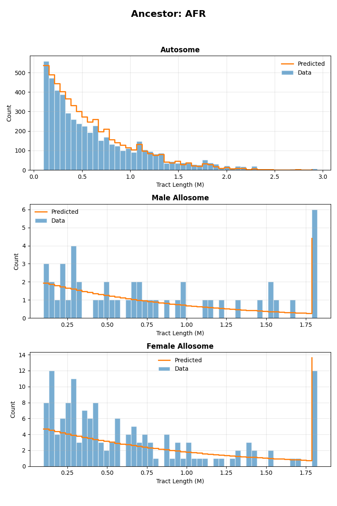
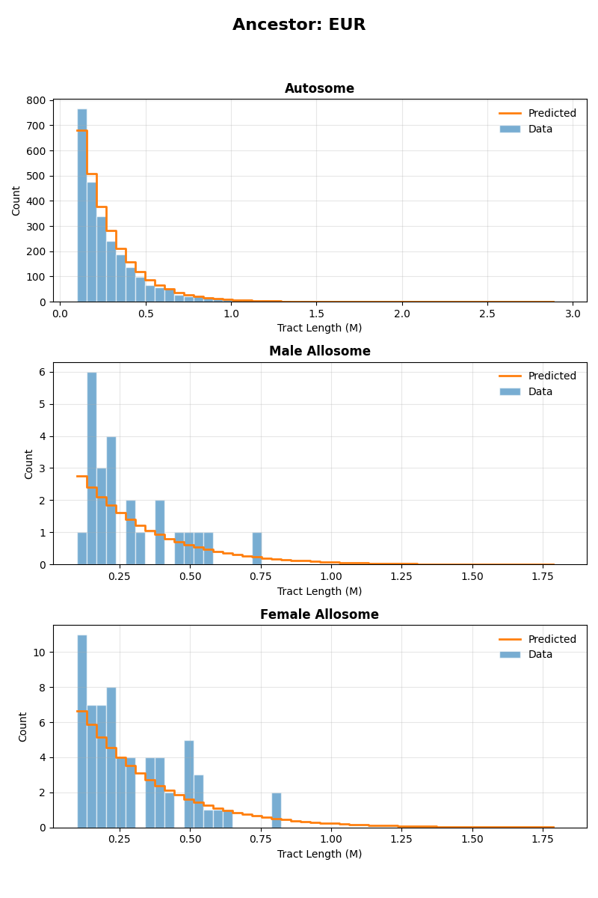
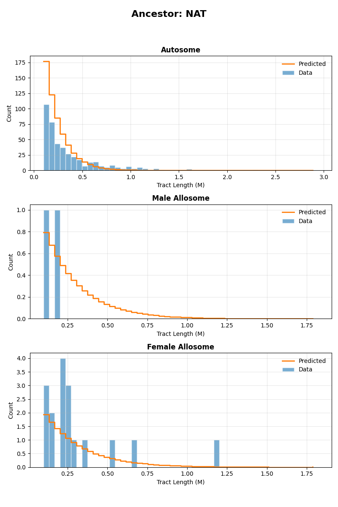

.. DO NOT EDIT.
.. THIS FILE WAS AUTOMATICALLY GENERATED BY SPHINX-GALLERY.
.. TO MAKE CHANGES, EDIT THE SOURCE PYTHON FILE:
.. "auto_examples/ASW/ASW_two_pulses.py"
.. LINE NUMBERS ARE GIVEN BELOW.

.. only:: html

    .. note::
        :class: sphx-glr-download-link-note

        :ref:`Go to the end <sphx_glr_download_auto_examples_ASW_ASW_two_pulses.py>`
        to download the full example code.

.. rst-class:: sphx-glr-example-title

.. _sphx_glr_auto_examples_ASW_ASW_two_pulses.py:

ASW inference - Two pulses model
================================

This example implements inference for the ASW population under a two pulses model of admixture, using the tracts package.
Inference is performed using autosomal and X chromosome data, allowing for the specification of sex-biased admixture. 

To implement this example, we use the following driver file:

.. code-block:: yaml

   samples:
     directory: ./TrioPhased/
     individual_names: [
       "NA19625","NA19700","NA19701","NA19703","NA19704","NA19707","NA19711","NA19712","NA19713","NA19818","NA19819",
       "NA19834","NA19835","NA19900","NA19901","NA19904","NA19908","NA19909","NA19913","NA19914","NA19916","NA19917",
       "NA19920","NA19921","NA19922","NA19923","NA19982","NA19984","NA20126","NA20127","NA20274","NA20276","NA20278",
       "NA20281","NA20282","NA20287","NA20289","NA20291","NA20294","NA20296","NA20298","NA20299","NA20314","NA20317",
       "NA20318","NA20320","NA20321","NA20332","NA20334","NA20339","NA20340","NA20342","NA20346","NA20348","NA20351",
       "NA20355","NA20356","NA20357","NA20359","NA20362","NA20412"] 
     male_names : [
       "NA19700","NA19703","NA19711","NA19818","NA19834","NA19900","NA19904","NA19908","NA19916","NA19920",
       "NA19922","NA19982","NA19984","NA20126","NA20278","NA20281","NA20291","NA20298","NA20318","NA20340",
       "NA20342","NA20346","NA20348","NA20351","NA20356","NA20362"] #see Readme_dataprocessing.md for how this was generated
     filename_format: "{name}_{label}_final.bed"
     labels: [A, B] #If this field is omitted, 'A' and 'B' will be used by default
     chromosomes: 1-22 #The chromosomes to use for analysis. Can be specified as a list or a range
     allosomes: [X]
   output_filename_format: "ASW_test_output_{label}"
   model_filename: ../models/ppp_pxx.yaml
   start_params: 
     t1: 10
     REUR: 0.1
     t2: 5
     REUR_sex_bias: 0.01

   repetitions: 1
   seed: 100
   maximum_iterations: 1000
   unknown_labels_for_smoothing: ["UNK", "centromere","miscall"] # segments with these labels will be smoother over, that is, will be filled with neighbouring ancestries up to their midpoints.  
   exclude_tracts_below_cm: 2
   npts : 50
   fix_parameters_from_ancestry_proportions: ['REUR2', 'RNAT', 'REUR2_sex_bias', 'RNAT_sex_bias']
   output_directory: ./output_two_pulses/
   ad_model_autosomes: M
   ad_model_allosomes: DC

Complete results from this analysis are saved in the output directory specified in the driver file. Below, we display the optimal parameters estimated from this analysis,
as well as the plots illustrating the inferred tract length distributions, compared to the observed histograms, for every source population and chromosome type (autosomes and X chromosome).

Optimal parameters
------------------

.. csv-table:: Estimated optimal parameters
   :file: output_two_pulses/ASW_test_output_optimal_parameters.txt
   :header-rows: 1
   :delim: tab

Tract length histograms
-----------------------

African ancestry
^^^^^^^^^^^^^^^^

European ancestry
^^^^^^^^^^^^^^^^^

Native American ancestry
^^^^^^^^^^^^^^^^^^^^^^^^

.. GENERATED FROM PYTHON SOURCE LINES 85-104

.. rst-class:: sphx-glr-script-out

 .. code-block:: none

    ------------------------------------------------------------------------------------------------

    Running tracts 2.0 with driver file: ASW_two_pulses.yaml 

    Reading data, demographic model and driver specifications...

    ------------------------------------------------------------------------------------------------

    excluding_tracts_below Defaulting to 2.0 cM.
    Individual NA19700 is listed as male but has two X chromosomes. Selecting first of the two.
    Individual NA19703 is listed as male but has two X chromosomes. Selecting first of the two.
    Individual NA19711 is listed as male but has two X chromosomes. Selecting first of the two.
    Individual NA19818 is listed as male but has two X chromosomes. Selecting first of the two.
    Individual NA19834 is listed as male but has two X chromosomes. Selecting first of the two.
    Individual NA19900 is listed as male but has two X chromosomes. Selecting first of the two.
    Individual NA19904 is listed as male but has two X chromosomes. Selecting first of the two.
    Individual NA19908 is listed as male but has two X chromosomes. Selecting first of the two.
    Individual NA19916 is listed as male but has two X chromosomes. Selecting first of the two.
    Individual NA19920 is listed as male but has two X chromosomes. Selecting first of the two.
    Individual NA19922 is listed as male but has two X chromosomes. Selecting first of the two.
    Individual NA19982 is listed as male but has two X chromosomes. Selecting first of the two.
    Individual NA19984 is listed as male but has two X chromosomes. Selecting first of the two.
    Individual NA20126 is listed as male but has two X chromosomes. Selecting first of the two.
    Individual NA20278 is listed as male but has two X chromosomes. Selecting first of the two.
    Individual NA20281 is listed as male but has two X chromosomes. Selecting first of the two.
    Individual NA20291 is listed as male but has two X chromosomes. Selecting first of the two.
    Individual NA20298 is listed as male but has two X chromosomes. Selecting first of the two.
    Individual NA20318 is listed as male but has two X chromosomes. Selecting first of the two.
    Individual NA20340 is listed as male but has two X chromosomes. Selecting first of the two.
    Individual NA20342 is listed as male but has two X chromosomes. Selecting first of the two.
    Individual NA20346 is listed as male but has two X chromosomes. Selecting first of the two.
    Individual NA20348 is listed as male but has two X chromosomes. Selecting first of the two.
    Individual NA20351 is listed as male but has two X chromosomes. Selecting first of the two.
    Individual NA20356 is listed as male but has two X chromosomes. Selecting first of the two.
    Individual NA20362 is listed as male but has two X chromosomes. Selecting first of the two.
    Parameter "REUR_male" already exists.
    Parameter "RNAT_male" already exists.
    Parameter "REUR_female" already exists.
    Parameter "RNAT_female" already exists.
    Parameter "t1" already exists.
    Parameter "REUR2_male" already exists.
    Parameter "REUR2_female" already exists.
    Parameter "t2" already exists.
    Computed autosome proportions [0.19578862 0.03825495 0.76595643]
    Computed allosome proportions [0.16839124 0.03818939 0.79341937]
    Model parameters : ['REUR', 'REUR_sex_bias', 'RNAT', 'RNAT_sex_bias', 't1', 'REUR2', 'REUR2_sex_bias', 't2']
    Physical start params : [ 1.e-01  1.e-02  1.e-09 -1.e+00  1.e+01  1.e-09 -1.e+00  5.e+00]
    /home/jgonzale/Documents/PhaseType/tracts/tracts/driver.py:166: RuntimeWarning: divide by zero encountered in log1p
      return np.log1p(y) - np.log1p(-y)
    Initial parameters :  [-2.19722458e+00  2.00006667e-02 -2.07232658e+01            -inf
      2.30258509e+00 -2.07232658e+01            -inf  1.60943791e+00]
    Initial ancestry proportions : {'X_autosomal': array([1.00000001e-01, 9.99999999e-10, 8.99999998e-01]), 'X_X': array([1.00333334e-01, 6.66666657e-10, 8.99666665e-01])}

    --------------------------------------------------------------------------------------------------
    Admixture is modelled with the M model for autosomes and with the DC model for allosomes.
    Optimization is performed in two steps.
    Step 1 : Optimizing autosomal likelihood over parameters ['REUR', 't1', 't2']
    --------------------------------------------------------------------------------------------------
    Iter.    Log-likelihood  Model parameters                Transmission
    ---------------------------------------------------------------------

    1       , -991.537    , array([ 0.1        ,  0          ,  0.0428114  , -0.104669   ,  10         ,  0.106432   , -0.858058   ,  5          ]), Autosomes
    2       , -996.347    , array([ 0.100904   ,  0          ,  0.0427685  , -0.104669   ,  10         ,  0.105534   , -0.866229   ,  5          ]), Autosomes
    3       , -1016.59    , array([ 0.1        ,  0          ,  0.0428114  , -0.104669   ,  10.1005    ,  0.106432   , -0.858058   ,  5          ]), Autosomes
    4       , -998.481    , array([ 0.1        ,  0          ,  0.0428114  , -0.104521   ,  10         ,  0.10593    , -0.866867   ,  5.05025    ]), Autosomes
    5       , -963.179    , array([ 0.0998364  ,  0          ,  0.0428192  , -0.102151   ,  9.90569    ,  0.106486   , -0.858485   ,  4.98689    ]), Autosomes
    6       , -936.839    , array([ 0.0996841  ,  0          ,  0.0428265  , -0.102175   ,  9.81157    ,  0.106538   , -0.858853   ,  4.9747     ]), Autosomes
    7       , -912.748    , array([ 0.0994562  ,  0          ,  0.0428373  , -0.102209   ,  9.72294    ,  0.106631   , -0.859124   ,  4.95808    ]), Autosomes
    8       , -895.452    , array([ 0.0989734  ,  0          ,  0.0428603  , -0.102272   ,  9.66743    ,  0.106875   , -0.858903   ,  4.9276     ]), Autosomes
    9       , -875.867    , array([ 0.0986496  ,  0          ,  0.0428757  , -0.102256   ,  9.579      ,  0.107253   , -0.855034   ,  4.93513    ]), Autosomes
    10      , -856.971    , array([ 0.0987855  ,  0          ,  0.0428692  , -0.102291   ,  9.49052    ,  0.106993   , -0.858424   ,  4.91839    ]), Autosomes
    11      , -838.801    , array([ 0.0985329  ,  0          ,  0.0428812  , -0.102313   ,  9.40224    ,  0.107165   , -0.857522   ,  4.90786    ]), Autosomes
    12      , -824.065    , array([ 0.0986727  ,  0          ,  0.0428746  , -0.102288   ,  9.31269    ,  0.107115   , -0.857233   ,  4.91984    ]), Autosomes
    13      , -808.84     , array([ 0.0986556  ,  0          ,  0.0428754  , -0.102331   ,  9.22839    ,  0.106983   , -0.859674   ,  4.89943    ]), Autosomes
    14      , -795.956    , array([ 0.0982309  ,  0          ,  0.0428956  , -0.102328   ,  9.14774    ,  0.107413   , -0.855742   ,  4.9007     ]), Autosomes
    15      , -783.198    , array([ 0.0983285  ,  0          ,  0.042891   , -0.102343   ,  9.05826    ,  0.107264   , -0.857498   ,  4.89351    ]), Autosomes
    16      , -767.011    , array([ 0.0980449  ,  0          ,  0.0429044  , -0.106727   ,  8.99224    ,  0.107342   , -0.858506   ,  4.86414    ]), Autosomes
    17      , -761.454    , array([ 0.0977646  ,  0          ,  0.0429178  , -0.106594   ,  8.92501    ,  0.107435   , -0.859208   ,  4.83603    ]), Autosomes
    18      , -752.884    , array([ 0.0982599  ,  0          ,  0.0428942  , -0.106677   ,  8.85882    ,  0.107059   , -0.86164    ,  4.85362    ]), Autosomes
    19      , -748.556    , array([ 0.0977186  ,  0          ,  0.04292    , -0.106827   ,  8.81985    ,  0.107812   , -0.853079   ,  4.88558    ]), Autosomes
    20      , -738.401    , array([ 0.0978646  ,  0          ,  0.042913   , -0.106867   ,  8.73474    ,  0.10773    , -0.853291   ,  4.89439    ]), Autosomes
    21      , -729.173    , array([ 0.0979739  ,  0          ,  0.0429078  , -0.10689    ,  8.64892    ,  0.107657   , -0.853657   ,  4.89923    ]), Autosomes
    22      , -721.727    , array([ 0.0981111  ,  0          ,  0.0429013  , -0.106965   ,  8.56894    ,  0.107641   , -0.852797   ,  4.91571    ]), Autosomes
    23      , -716.124    , array([ 0.0976669  ,  0          ,  0.0429224  , -0.106896   ,  8.50004    ,  0.10797    , -0.850797   ,  4.90057    ]), Autosomes
    24      , -711.41     , array([ 0.0981521  ,  0          ,  0.0428993  , -0.106788   ,  8.44176    ,  0.107326   , -0.857891   ,  4.87739    ]), Autosomes
    25      , -706.389    , array([ 0.0981757  ,  0          ,  0.0428982  , -0.106825   ,  8.35888    ,  0.107357   , -0.857154   ,  4.88524    ]), Autosomes
    26      , -703.169    , array([ 0.0980848  ,  0          ,  0.0429025  , -0.106728   ,  8.28418    ,  0.107304   , -0.858835   ,  4.86435    ]), Autosomes
    27      , -699.97     , array([ 0.0986342  ,  0          ,  0.0428764  , -0.106781   ,  8.22233    ,  0.106837   , -0.86239    ,  4.87574    ]), Autosomes
    28      , -698.15     , array([ 0.098393   ,  0          ,  0.0428879  , -0.106889   ,  8.15391    ,  0.10724    , -0.85738    ,  4.89908    ]), Autosomes
    29      , -696.616    , array([ 0.0987651  ,  0          ,  0.0428702  , -0.106827   ,  8.08355    ,  0.106777   , -0.862341   ,  4.88582    ]), Autosomes
    30      , -694.553    , array([ 0.0993212  ,  0          ,  0.0428437  , -0.106983   ,  8.05366    ,  0.10647    , -0.86307    ,  4.91959    ]), Autosomes
    31      , -691.997    , array([ 0.0996595  ,  0          ,  0.0428276  , -0.0977853  ,  7.99354    ,  0.106338   , -0.862545   ,  4.94643    ]), Autosomes
    32      , -689.569    , array([ 0.0997667  ,  0          ,  0.0428225  , -0.0975659  ,  7.93018    ,  0.106465   , -0.859425   ,  4.97589    ]), Autosomes
    33      , -687.068    , array([ 0.10004    ,  0          ,  0.0428095  , -0.0974939  ,  7.87079    ,  0.106339   , -0.859351   ,  5.00509    ]), Autosomes
    /home/jgonzale/Documents/PhaseType/tracts/tracts/phase_type_distribution.py:171: ComplexWarning: Casting complex values to real discards the imaginary part
      CDF_values[bin_number] = prop_connected * ((self.inner_CDF(bin_val, L, S, exp_Sx, alpha, S0_inv) +
    34      , -683.247    , array([ 0.100229   ,  0          ,  0.0428006  , -0.0980954  ,  7.80924    ,  0.105855   , -0.866252   ,  5.03435    ]), Autosomes
    35      , -683.439    , array([ 0.0995688  ,  0          ,  0.042832   , -0.0983221  ,  7.75913    ,  0.106405   , -0.862141   ,  5.04528    ]), Autosomes
    36      , -682.465    , array([ 0.100123   ,  0          ,  0.0428056  , -0.0985187  ,  7.83031    ,  0.105765   , -0.868738   ,  5.05477    ]), Autosomes
    37      , -678.794    , array([ 0.100624   ,  0          ,  0.0427818  , -0.0993391  ,  7.80623    ,  0.104919   , -0.87955    ,  5.09402    ]), Autosomes
    38      , -675.384    , array([ 0.101092   ,  0          ,  0.0427595  , -0.100232   ,  7.78832    ,  0.104117   , -0.890007   ,  5.13623    ]), Autosomes
    39      , -672.575    , array([ 0.101427   ,  0          ,  0.0427435  , -0.101258   ,  7.78649    ,  0.10345    , -0.899287   ,  5.18418    ]), Autosomes
    40      , -669.838    , array([ 0.102191   ,  0          ,  0.0427072  , -0.10173    ,  7.75921    ,  0.102554   , -0.90923    ,  5.20614    ]), Autosomes
    41      , -667.264    , array([ 0.102176   ,  0          ,  0.0427079  , -0.102356   ,  7.69475    ,  0.102409   , -0.912061   ,  5.23492    ]), Autosomes
    42      , -664.395    , array([ 0.102584   ,  0          ,  0.0426885  , -0.10323    ,  7.65834    ,  0.101811   , -0.919702   ,  5.27488    ]), Autosomes
    43      , -662.038    , array([ 0.103072   ,  0          ,  0.0426653  , -0.103798   ,  7.60539    ,  0.101219   , -0.926613   ,  5.30073    ]), Autosomes
    44      , -659.645    , array([ 0.103141   ,  0          ,  0.042662   , -0.104892   ,  7.57708    ,  0.100993   , -0.930312   ,  5.34998    ]), Autosomes
    45      , -657.435    , array([ 0.103792   ,  0          ,  0.0426311  , -0.10574    ,  7.58192    ,  0.100255   , -0.938678   ,  5.38804    ]), Autosomes
    46      , -655.105    , array([ 0.104208   ,  0          ,  0.0426113  , -0.106707   ,  7.55106    ,  0.0997801  , -0.944157   ,  5.43114    ]), Autosomes
    47      , -653.172    , array([ 0.10445    ,  0          ,  0.0425998  , -0.107896   ,  7.54653    ,  0.0995196  , -0.947051   ,  5.48374    ]), Autosomes
    48      , -651.174    , array([ 0.105112   ,  0          ,  0.0425683  , -0.108644   ,  7.51836    ,  0.0988726  , -0.953762   ,  5.51685    ]), Autosomes
    49      , -649.376    , array([ 0.105228   ,  0          ,  0.0425627  , -0.109521   ,  7.4654     ,  0.0988054  , -0.95403    ,  5.5554     ]), Autosomes
    50      , -647.521    , array([ 0.105689   ,  0          ,  0.0425408  , -0.110544   ,  7.44042    ,  0.0984363  , -0.957136   ,  5.60036    ]), Autosomes
    51      , -646.066    , array([ 0.106267   ,  0          ,  0.0425133  , -0.111111   ,  7.39185    ,  0.0979218  , -0.962082   ,  5.62535    ]), Autosomes
    52      , -644.501    , array([ 0.106417   ,  0          ,  0.0425062  , -0.112303   ,  7.36623    ,  0.0979523  , -0.960086   ,  5.67759    ]), Autosomes
    53      , -643.052    , array([ 0.107071   ,  0          ,  0.0424751  , -0.113243   ,  7.37023    ,  0.0974691  , -0.963732   ,  5.71894    ]), Autosomes
    54      , -641.607    , array([ 0.107507   ,  0          ,  0.0424543  , -0.114299   ,  7.34285    ,  0.0972622  , -0.96385    ,  5.7654     ]), Autosomes
    55      , -640.663    , array([ 0.107659   ,  0          ,  0.0424471  , -0.115588   ,  7.35115    ,  0.0974403  , -0.958845   ,  5.82223    ]), Autosomes
    56      , -639.482    , array([ 0.10843    ,  0          ,  0.0424104  , -0.11625    ,  7.32712    ,  0.0968499  , -0.963566   ,  5.85161    ]), Autosomes
    57      , -638.346    , array([ 0.108621   ,  0          ,  0.0424013  , -0.117099   ,  7.27313    ,  0.0969181  , -0.960388   ,  5.88937    ]), Autosomes
    58      , -637.283    , array([ 0.109135   ,  0          ,  0.0423769  , -0.118058   ,  7.24114    ,  0.0967179  , -0.95962    ,  5.93223    ]), Autosomes
    59      , -636.708    , array([ 0.108865   ,  0          ,  0.0423897  , -0.119325   ,  7.23458    ,  0.0974513  , -0.947386   ,  5.98925    ]), Autosomes
    60      , -635.237    , array([ 0.109208   ,  0          ,  0.0423734  , -0.118217   ,  7.18009    ,  0.0969642  , -0.953952   ,  6.02235    ]), Autosomes
    61      , -634.813    , array([ 0.109239   ,  0          ,  0.042372   , -0.117212   ,  7.11158    ,  0.0967652  , -0.957685   ,  6.03939    ]), Autosomes
    62      , -633.016    , array([ 0.11009    ,  0          ,  0.0423315  , -0.115512   ,  7.11147    ,  0.0956239  , -0.97294    ,  6.06901    ]), Autosomes
    Pulses cannot occur before or during the founding of the population. Out of bounds by: 0.006436305385319585.
    63      , 1.00644e+32 , array([ 0.110173   ,  0          ,  0.0423275  , -0.112225   ,  7.1226     ,  0.095038   , -0.984311   ,  6.12903    ]), 
    Pulses cannot occur before or during the founding of the population. Out of bounds by: 0.006436305385319585.
    64      , -635.402    , array([ 0.110557   ,  0          ,  0.0423093  , -0.118492   ,  7.09481    ,  0.0956421  , -0.968116   ,  6.01776    ]), Autosomes
    65      , -631.688    , array([ 0.110159   ,  0          ,  0.0423282  , -0.113854   ,  7.11664    ,  0.0952949  , -0.979095   ,  6.0988     ]), Autosomes
    Pulses cannot occur before or during the founding of the population. Out of bounds by: 0.007163976086951074.
    66      , 1.00716e+32 , array([ 0.110273   ,  0          ,  0.0423228  , -0.112265   ,  7.12112    ,  0.0949423  , -0.985353   ,  6.12829    ]), 
    Pulses cannot occur before or during the founding of the population. Out of bounds by: 0.007163976086951074.
    Pulses cannot occur before or during the founding of the population. Out of bounds by: 0.002055050556249327.
    67      , 1.00206e+32 , array([ 0.110137   ,  0          ,  0.0423293  , -0.113722   ,  7.09917    ,  0.0952973  , -0.979258   ,  6.10123    ]), 
    Pulses cannot occur before or during the founding of the population. Out of bounds by: 0.002055050556249327.
    68      , -631.829    , array([ 0.110203   ,  0          ,  0.0423261  , -0.11412    ,  7.15171    ,  0.0952904  , -0.978762   ,  6.09396    ]), Autosomes
    69      , -631.671    , array([ 0.110401   ,  0          ,  0.0423167  , -0.11396    ,  7.11466    ,  0.0950651  , -0.981559   ,  6.09691    ]), Autosomes
    Pulses cannot occur before or during the founding of the population. Out of bounds by: 0.011051745191645423.
    70      , 1.01105e+32 , array([ 0.110477   ,  0          ,  0.0423131  , -0.112331   ,  7.11602    ,  0.0947436  , -0.987545   ,  6.12707    ]), 
    Pulses cannot occur before or during the founding of the population. Out of bounds by: 0.011051745191645423.
    71      , -632.321    , array([ 0.110366   ,  0          ,  0.0423183  , -0.114784   ,  7.11208    ,  0.0952279  , -0.9785     ,  6.082      ]), Autosomes
    72      , -631.673    , array([ 0.11039    ,  0          ,  0.0423172  , -0.113893   ,  7.10592    ,  0.0950662  , -0.981642   ,  6.09812    ]), Autosomes
    73      , -631.05     , array([ 0.110442   ,  0          ,  0.0423147  , -0.11315    ,  7.11735    ,  0.0949005  , -0.984598   ,  6.11177    ]), Autosomes
    Pulses cannot occur before or during the founding of the population. Out of bounds by: 0.006631249301237929.
    74      , 1.00663e+32 , array([ 0.110483   ,  0          ,  0.0423128  , -0.112352   ,  7.12004    ,  0.0947404  , -0.987552   ,  6.12667    ]), 
    Pulses cannot occur before or during the founding of the population. Out of bounds by: 0.006631249301237929.
    Pulses cannot occur before or during the founding of the population. Out of bounds by: 0.000523560146705293.
    75      , 1.00052e+32 , array([ 0.110463   ,  0          ,  0.0423138  , -0.11275    ,  7.11869    ,  0.0948199  , -0.986086   ,  6.11922    ]), 
    Pulses cannot occur before or during the founding of the population. Out of bounds by: 0.000523560146705293.
    76      , -631.05     , array([ 0.110502   ,  0          ,  0.0423119  , -0.113182   ,  7.11685    ,  0.094844   , -0.985202   ,  6.11119    ]), Autosomes
    77      , -631.207    , array([ 0.110502   ,  0          ,  0.0423119  , -0.113424   ,  7.12407    ,  0.09488    , -0.984446   ,  6.10673    ]), Autosomes
    78      , -631.319    , array([ 0.110479   ,  0          ,  0.042313   , -0.113512   ,  7.11175    ,  0.0949174  , -0.98389    ,  6.1051     ]), Autosomes
    79      , -630.899    , array([ 0.110512   ,  0          ,  0.0423114  , -0.11298    ,  7.11723    ,  0.0948034  , -0.985953   ,  6.11494    ]), Autosomes
    Pulses cannot occur before or during the founding of the population. Out of bounds by: 0.0011788001387591507.
    80      , 1.00118e+32 , array([ 0.110522   ,  0          ,  0.0423109  , -0.112778   ,  7.11753    ,  0.0947632  , -0.986699   ,  6.1187     ]), 
    Pulses cannot occur before or during the founding of the population. Out of bounds by: 0.0011788001387591507.
    Pulses cannot occur before or during the founding of the population. Out of bounds by: 0.00011248313944012267.
    81      , 1.00011e+32 , array([ 0.110509   ,  0          ,  0.0423115  , -0.112969   ,  7.11503    ,  0.0948049  , -0.985951   ,  6.11514    ]), 
    Pulses cannot occur before or during the founding of the population. Out of bounds by: 0.00011248313944012267.
    82      , -630.903    , array([ 0.110518   ,  0          ,  0.0423111  , -0.113001   ,  7.12163    ,  0.0948004  , -0.985958   ,  6.11455    ]), Autosomes
    83      , -630.824    , array([ 0.110517   ,  0          ,  0.0423111  , -0.112879   ,  7.11736    ,  0.0947833  , -0.986327   ,  6.11682    ]), Autosomes
    Pulses cannot occur before or during the founding of the population. Out of bounds by: 0.0012208511616442763.
    84      , 1.00122e+32 , array([ 0.110523   ,  0          ,  0.0423109  , -0.112778   ,  7.11748    ,  0.094763   , -0.986702   ,  6.1187     ]), 
    Pulses cannot occur before or during the founding of the population. Out of bounds by: 0.0012208511616442763.
    85      , -630.824    , array([ 0.110532   ,  0          ,  0.0423104  , -0.112887   ,  7.11723    ,  0.0947691  , -0.986478   ,  6.11668    ]), Autosomes
    Pulses cannot occur before or during the founding of the population. Out of bounds by: 0.0011978097382998598.
    86      , 1.0012e+32  , array([ 0.110538   ,  0          ,  0.0423102  , -0.112786   ,  7.11736    ,  0.094749   , -0.986851   ,  6.11856    ]), 
    Pulses cannot occur before or during the founding of the population. Out of bounds by: 0.0011978097382998598.
    Pulses cannot occur before or during the founding of the population. Out of bounds by: 0.000619369179486462.
    87      , 1.00062e+32 , array([ 0.110531   ,  0          ,  0.0423105  , -0.112883   ,  7.11613    ,  0.0947701  , -0.986472   ,  6.11675    ]), 
    Pulses cannot occur before or during the founding of the population. Out of bounds by: 0.000619369179486462.
    88      , -630.857    , array([ 0.110533   ,  0          ,  0.0423104  , -0.112939   ,  7.11915    ,  0.0947763  , -0.986322   ,  6.1157     ]), Autosomes
    89      , -630.857    , array([ 0.11053    ,  0          ,  0.0423106  , -0.11293    ,  7.11668    ,  0.0947786  , -0.986308   ,  6.11587    ]), Autosomes
    90      , -630.834    , array([ 0.110533   ,  0          ,  0.0423104  , -0.112903   ,  7.11784    ,  0.0947714  , -0.986428   ,  6.11636    ]), Autosomes
    91      , -630.8      , array([ 0.110534   ,  0          ,  0.0423104  , -0.112854   ,  7.11728    ,  0.0947627  , -0.986598   ,  6.11728    ]), Autosomes
    Pulses cannot occur before or during the founding of the population. Out of bounds by: 0.0005562493793176415.
    92      , 1.00056e+32 , array([ 0.110536   ,  0          ,  0.0423103  , -0.112822   ,  7.11732    ,  0.0947562  , -0.986717   ,  6.11788    ]), 
    Pulses cannot occur before or during the founding of the population. Out of bounds by: 0.0005562493793176415.
    --------------------------------------------------------------------------------------------------
    Step 2 : Optimizing autosomal + allosomal likelihood over parameters : ['REUR_sex_bias']
    Non-sex-bias parameters fixed at values from previous optimization step : {'REUR': -2.0852806314473726, 't1': 1.9625316848389576, 't2': 1.8112155240172019}
    --------------------------------------------------------------------------------------------------
    Iter.    Log-likelihood  Model parameters                Transmission
    ---------------------------------------------------------------------

    Pulses cannot occur before or during the founding of the population. Out of bounds by: 0.0005562493793176415.
    Pulses cannot occur before or during the founding of the population. Out of bounds by: 0.0005562493793176415.
    93      , 1.00056e+32 , array([ 0.110536   ,  0          ,  0.0423103  , -0.112822   ,  7.11732    ,  0.0947562  , -0.986717   ,  6.11788    ]), 
    Pulses cannot occur before or during the founding of the population. Out of bounds by: 0.0005562493793176415.
    Pulses cannot occur before or during the founding of the population. Out of bounds by: 0.0005562493793176415.
    94      , 1.00056e+32 , array([ 0.110536   ,  0.00499996 ,  0.0423103  , -0.113476   ,  7.11732    ,  0.0947434  , -0.992627   ,  6.11788    ]), 
    Pulses cannot occur before or during the founding of the population. Out of bounds by: 0.0005562493793176415.
    Pulses cannot occur before or during the founding of the population. Out of bounds by: 0.0005562493793176415.
    95      , 1.00056e+32 , array([ 0.110536   ,  0.000625   ,  0.0423103  , -0.112904   ,  7.11732    ,  0.0947546  , -0.987456   ,  6.11788    ]), 
    Pulses cannot occur before or during the founding of the population. Out of bounds by: 0.0005562493793176415.
    Pulses cannot occur before or during the founding of the population. Out of bounds by: 0.0005562493793176415.
    96      , 1.00056e+32 , array([ 0.110536   ,  7.8125e-05 ,  0.0423103  , -0.112832   ,  7.11732    ,  0.094756   , -0.986809   ,  6.11788    ]), 
    Pulses cannot occur before or during the founding of the population. Out of bounds by: 0.0005562493793176415.
    Pulses cannot occur before or during the founding of the population. Out of bounds by: 0.0005562493793176415.
    97      , 1.00056e+32 , array([ 0.110536   ,  0          ,  0.0423103  , -0.112822   ,  7.11732    ,  0.0947562  , -0.986717   ,  6.11788    ]), 
    ---------------------------------------------------------------------
    Likelihoods found :[-1.0005562493793176e+32]
    Optimal Parameters:[ 0.11053572  0.          0.04231028 -0.11282197  7.11732309  0.09475624
     -0.98671691  6.11787934]
    Pulses cannot occur before or during the founding of the population. Out of bounds by: 0.0005562493793176415.
    /home/jgonzale/Documents/PhaseType/tracts/tracts/driver.py:875: UserWarning: The figure layout has changed to tight
      plt.tight_layout(rect=[0, 0.03, 1, 0.95])
    Results saved to : ./output_two_pulses/

    {'destination_dir': PosixPath('/home/jgonzale/Documents/PhaseType/tracts/docs/source/auto_examples/ASW/output_two_pulses'), 'table_file': PosixPath('/home/jgonzale/Documents/PhaseType/tracts/docs/source/auto_examples/ASW/output_two_pulses/ASW_test_output_optimal_parameters.txt')}

|

.. code-block:: Python

    import sys
    from pathlib import Path

    sys.path.append('.')

    from tracts.driver import run_tracts

    script_path = Path(sys.argv[0]).resolve()

    driver_filename = "ASW_two_pulses.yaml"

    run_tracts(driver_filename = driver_filename, script_dir = script_path)

    # Don't run the code below: for documentation purposes only.
    from tracts.doc_utils import prepare_example_outputs_for_docs
    prepare_example_outputs_for_docs("output_two_pulses")

.. rst-class:: sphx-glr-timing

   **Total running time of the script:** (1 minutes 17.392 seconds)

.. _sphx_glr_download_auto_examples_ASW_ASW_two_pulses.py:

.. only:: html

  .. container:: sphx-glr-footer sphx-glr-footer-example

    .. container:: sphx-glr-download sphx-glr-download-jupyter

      :download:`Download Jupyter notebook: ASW_two_pulses.ipynb <ASW_two_pulses.ipynb>`

    .. container:: sphx-glr-download sphx-glr-download-python

      :download:`Download Python source code: ASW_two_pulses.py <ASW_two_pulses.py>`

    .. container:: sphx-glr-download sphx-glr-download-zip

      :download:`Download zipped: ASW_two_pulses.zip <ASW_two_pulses.zip>`

.. only:: html

 .. rst-class:: sphx-glr-signature

    `Gallery generated by Sphinx-Gallery <https://sphinx-gallery.github.io>`_
