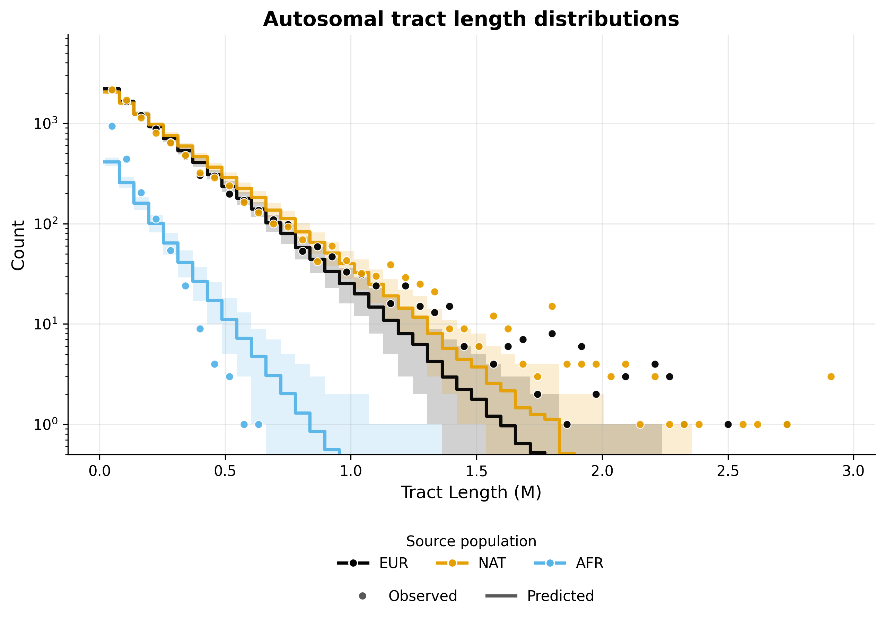
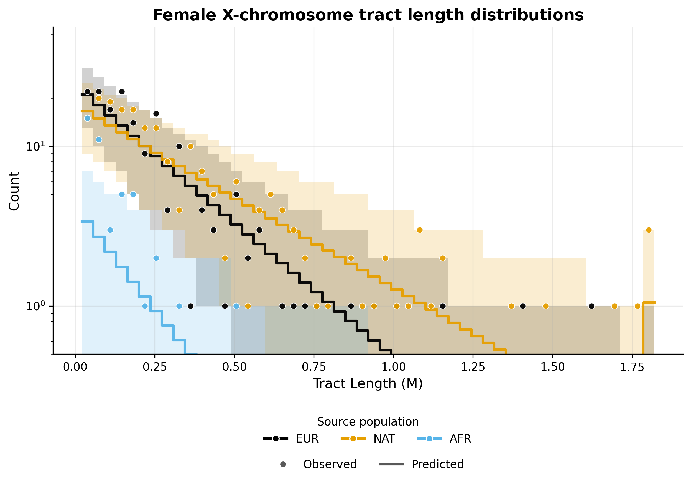
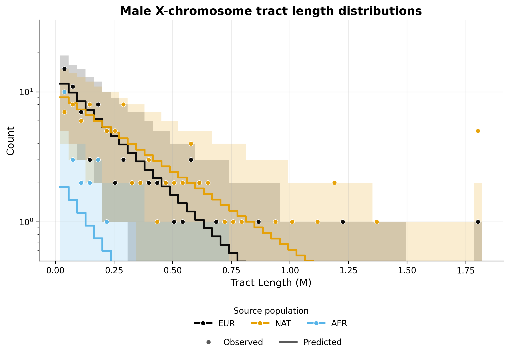

.. DO NOT EDIT.
.. THIS FILE WAS AUTOMATICALLY GENERATED BY SPHINX-GALLERY.
.. TO MAKE CHANGES, EDIT THE SOURCE PYTHON FILE:
.. "auto_examples/MXL/MXL_3pop_sexbiased_fix.py"
.. LINE NUMBERS ARE GIVEN BELOW.

.. only:: html

    .. note::
        :class: sphx-glr-download-link-note

        :ref:`Go to the end <sphx_glr_download_auto_examples_MXL_MXL_3pop_sexbiased_fix.py>`
        to download the full example code.

.. rst-class:: sphx-glr-example-title

.. _sphx_glr_auto_examples_MXL_MXL_3pop_sexbiased_fix.py:

MXL inference - continuous pulse model
======================================

This example implements inference for the MXL population under a continuous pulse model of admixture, using the tracts package.
Inference is performed using autosomal and X chromosome data, allowing for the specification of sex-biased admixture. 

To implement this example, we use the following driver file:

.. code-block:: yaml

   samples:
     directory: ./TrioPhased/
     individual_names: [
       "NA19648","NA19649","NA19651","NA19652","NA19654","NA19655","NA19657","NA19658","NA19661","NA19663",
       "NA19664","NA19669","NA19670","NA19676","NA19678","NA19679","NA19681","NA19682","NA19684","NA19716",
       "NA19717","NA19719","NA19720","NA19722","NA19723","NA19725","NA19726","NA19728","NA19729","NA19731",
       "NA19732","NA19734","NA19735","NA19740","NA19741","NA19746","NA19747","NA19749","NA19750","NA19752",
       "NA19755","NA19756","NA19758","NA19759","NA19761","NA19762","NA19764","NA19770","NA19771","NA19773",
       "NA19774","NA19776","NA19777","NA19779","NA19780","NA19782","NA19783","NA19785","NA19786","NA19788",
       "NA19789","NA19792","NA19794","NA19795"] 
     male_names : [
       "NA19649","NA19652","NA19655","NA19658","NA19661","NA19664","NA19670","NA19676","NA19679","NA19682",
       "NA19717","NA19720","NA19723","NA19726","NA19729","NA19732","NA19735","NA19741","NA19747","NA19750",
       "NA19756","NA19759","NA19762","NA19771","NA19774","NA19777","NA19780","NA19783","NA19786","NA19789",
       "NA19792","NA19795"] #see Readme_dataprocessing.md for how this was generated
     filename_format: "{name}_{label}_final.bed"
     labels: [A, B] #If this field is omitted, 'A' and 'B' will be used by default
     chromosomes: 1-22 #The chromosomes to use for analysis. Can be specified as a list or a range
     allosomes: [X]
     
   output_filename_format: "MXL_test_output_{label}"
   log_filename: 'ASW_continuous_pulse.log'
   output_directory: ./output_continuous_pulse/
   verbose_log: 1
   verbose_screen: 30
   log_scale : True
     
   model_filename: ../models/ccc.yaml
   start_params: 
     t1: 13.5
     REUR: 0.2
     RAFR: 0.02
     RNAT: 0.2
     t2: 6.8
  
     REUR_sex_bias: -0.99 # more males
     RNAT_sex_bias: 0.99 # more females
     RAFR_sex_bias: -0.1
   repetitions: 3
   seed: 100
   maximum_iterations: 1000
   unknown_labels_for_smoothing: ["UNK", "centromere","miscall"] # segments with these labels will be smoother over, that is, will be filled with neighbouring ancestries up to their midpoints.  
   exclude_tracts_below_cm: 2
   npts : 50
   fix_parameters_from_ancestry_proportions: ['REUR', 'RAFR','REUR_sex_bias', 'RAFR_sex_bias']

   ad_model_autosomes : M
   ad_model_allosomes : DC

Complete results from this analysis are saved in the output directory specified in the driver file. Below, we display the optimal parameters estimated from this analysis,
as well as the plots illustrating the inferred tract length distributions, compared to the observed histograms, for every source population and chromosome type (autosomes and X chromosome).

Optimal parameters
------------------

.. csv-table:: Estimated optimal parameters
   :file: output_continuous_pulse/MXL_test_output_optimal_parameters.txt
   :header-rows: 1
   :delim: tab

Tract length histograms
-----------------------

Autosomal admixture
^^^^^^^^^^^^^^^^^^^

X chromosome admixture in females
^^^^^^^^^^^^^^^^^^^^^^^^^^^^^^^^^

X chromosome admixture in males
^^^^^^^^^^^^^^^^^^^^^^^^^^^^^^^

.. GENERATED FROM PYTHON SOURCE LINES 98-116

.. rst-class:: sphx-glr-script-out

 .. code-block:: none

    ------------------------------------------------------------------------------------------------

    Running tracts 2.0 with driver file: MXL_continuous.yaml 

    Reading data, demographic model and driver specifications...

    ------------------------------------------------------------------------------------------------

    excluding_tracts_below set to 2.0 cM.
    Ancestries: ['EUR', 'NAT', 'AFR']
    Data autosome proportions: [0.468066   0.49277278 0.03920868]
    Data allosome proportions: [0.33731709 0.62309703 0.03958588]
    Model parameters : ['REUR', 'REUR_sex_bias', 'RNAT', 'RNAT_sex_bias', 'RAFR', 'RAFR_sex_bias', 't1', 't2']

    Multiple starting parameters were generated. These will be converted to optimizer units and used for multiple optimization runs.

    Run | Starting parameters                          
    ---------------------------------------------------
      1 | [0.1899, -0.8308, 0.2, 0.8, 0.01589, 0.03968, 13.58, 7.821]
      2 | [0.1899, -0.8304, 0.2, 0.8, 0.01589, 0.0398, 13.2, 7.07]
      3 | [0.1899, -0.8309, 0.2, 0.8, 0.01589, 0.03955, 12.79, 6.644]
    ---------------------------------------------------

    Optimization run #1

    -----------------------------------------------------------------------------------------
    Admixture is modelled with the M model for autosomes and with the DC model for allosomes.
    Optimization is performed in two steps.
    Step 1 : Optimizing autosomal likelihood over parameters ['RNAT', 't1', 't2'].
    Iter.    Log-likelihood  Model parameters        Transmission
    -----------------------------------------------------------------------------------------
    /home/jgonzale/Documents/PhaseType/tracts/tracts/demography/base_parametrized_demography.py:743: RuntimeWarning: The iteration is not making good progress, as measured by the 
      improvement from the last ten iterations.
      solved_params = scipy.optimize.fsolve(param_objective_func, start_point_validated)
    /home/jgonzale/Documents/PhaseType/tracts/tracts/demography/base_parametrized_demography.py:743: RuntimeWarning: The iteration is not making good progress, as measured by the 
      improvement from the last ten iterations.
      solved_params = scipy.optimize.fsolve(param_objective_func, start_point_validated)
    Step 1 completed.
    -----------------------------------------------------------------------------------------
    Step 2 : Optimizing autosomal + allosomal likelihood over parameters : ['RNAT_sex_bias'].
    Non-sex-bias parameters fixed at values from previous optimization step.
    Iter.    Log-likelihood  Model parameters        Transmission
    -----------------------------------------------------------------------------------------
    /home/jgonzale/Documents/PhaseType/tracts/tracts/demography/base_parametrized_demography.py:743: RuntimeWarning: The iteration is not making good progress, as measured by the 
      improvement from the last ten iterations.
      solved_params = scipy.optimize.fsolve(param_objective_func, start_point_validated)
    Step 2 completed.
    -----------------------------------------------------------------------------------------

    Optimization run #2

    -----------------------------------------------------------------------------------------
    Admixture is modelled with the M model for autosomes and with the DC model for allosomes.
    Optimization is performed in two steps.
    Step 1 : Optimizing autosomal likelihood over parameters ['RNAT', 't1', 't2'].
    Iter.    Log-likelihood  Model parameters        Transmission
    -----------------------------------------------------------------------------------------
    /home/jgonzale/Documents/PhaseType/tracts/tracts/demography/base_parametrized_demography.py:743: RuntimeWarning: The iteration is not making good progress, as measured by the 
      improvement from the last ten iterations.
      solved_params = scipy.optimize.fsolve(param_objective_func, start_point_validated)
    Step 1 completed.
    -----------------------------------------------------------------------------------------
    Step 2 : Optimizing autosomal + allosomal likelihood over parameters : ['RNAT_sex_bias'].
    Non-sex-bias parameters fixed at values from previous optimization step.
    Iter.    Log-likelihood  Model parameters        Transmission
    -----------------------------------------------------------------------------------------
    /home/jgonzale/Documents/PhaseType/tracts/tracts/demography/base_parametrized_demography.py:743: RuntimeWarning: The iteration is not making good progress, as measured by the 
      improvement from the last ten iterations.
      solved_params = scipy.optimize.fsolve(param_objective_func, start_point_validated)
    Step 2 completed.
    -----------------------------------------------------------------------------------------

    Optimization run #3

    -----------------------------------------------------------------------------------------
    Admixture is modelled with the M model for autosomes and with the DC model for allosomes.
    Optimization is performed in two steps.
    Step 1 : Optimizing autosomal likelihood over parameters ['RNAT', 't1', 't2'].
    Iter.    Log-likelihood  Model parameters        Transmission
    -----------------------------------------------------------------------------------------
    Step 1 completed.
    -----------------------------------------------------------------------------------------
    Step 2 : Optimizing autosomal + allosomal likelihood over parameters : ['RNAT_sex_bias'].
    Non-sex-bias parameters fixed at values from previous optimization step.
    Iter.    Log-likelihood  Model parameters        Transmission
    -----------------------------------------------------------------------------------------
    Step 2 completed.
    -----------------------------------------------------------------------------------------

    ---------------------------------------------------------------------------
    Results from multiple optimization runs with different starting parameters:
    -------------------------------------
    Run |       LogLik | Found parameters
    -------------------------------------
      1 |     -1497.36 | [0.1785, -1, 0.2, 0, 0.01457, -0.9991, 13.58, 7.821]
      2 |     -1349.92 | [0.1761, -1, 0.2, 0, 0.01434, -0.9993, 13.2, 7.07]
      3 | -1.38742e+16 | [0.1775, -1, 0.2, 0, 0.01441, -0.9964, 12.79, 6.644]
    -------------------------------------

    Final parameters and corresponding likelihood:
    -------------------------------------------------------------------------------------------------------------------------
          LogLik |         REUR REUR_sex_bias         RNAT RNAT_sex_bias         RAFR RAFR_sex_bias           t1           t2
    -------------------------------------------------------------------------------------------------------------------------
        -1349.92 |       0.1761           -1          0.2            0      0.01434      -0.9993         13.2         7.07
    -------------------------------------------------------------------------------------------------------------------------
    Results saved to : ./output_continuous_pulse/

    {'destination_dir': PosixPath('/home/jgonzale/Documents/PhaseType/tracts/docs/source/auto_examples/MXL/output_continuous_pulse'), 'table_file': PosixPath('/home/jgonzale/Documents/PhaseType/tracts/docs/source/auto_examples/MXL/output_continuous_pulse/MXL_test_output_optimal_parameters.txt')}

|

.. code-block:: Python

    import sys
    from pathlib import Path

    sys.path.append('.')

    from tracts.driver import run_tracts

    script_path = Path(sys.argv[0]).resolve()
   
    driver_filename = "MXL_continuous.yaml"

    run_tracts(driver_filename = driver_filename, script_dir = script_path.parent)

    # Don't run the code below: for documentation purposes only.
    from tracts.doc_utils import prepare_example_outputs_for_docs
    prepare_example_outputs_for_docs("output_continuous_pulse")

.. rst-class:: sphx-glr-timing

   **Total running time of the script:** (3 minutes 6.614 seconds)

.. _sphx_glr_download_auto_examples_MXL_MXL_3pop_sexbiased_fix.py:

.. only:: html

  .. container:: sphx-glr-footer sphx-glr-footer-example

    .. container:: sphx-glr-download sphx-glr-download-jupyter

      :download:`Download Jupyter notebook: MXL_3pop_sexbiased_fix.ipynb <MXL_3pop_sexbiased_fix.ipynb>`

    .. container:: sphx-glr-download sphx-glr-download-python

      :download:`Download Python source code: MXL_3pop_sexbiased_fix.py <MXL_3pop_sexbiased_fix.py>`

    .. container:: sphx-glr-download sphx-glr-download-zip

      :download:`Download zipped: MXL_3pop_sexbiased_fix.zip <MXL_3pop_sexbiased_fix.zip>`

.. only:: html

 .. rst-class:: sphx-glr-signature

    `Gallery generated by Sphinx-Gallery <https://sphinx-gallery.github.io>`_
