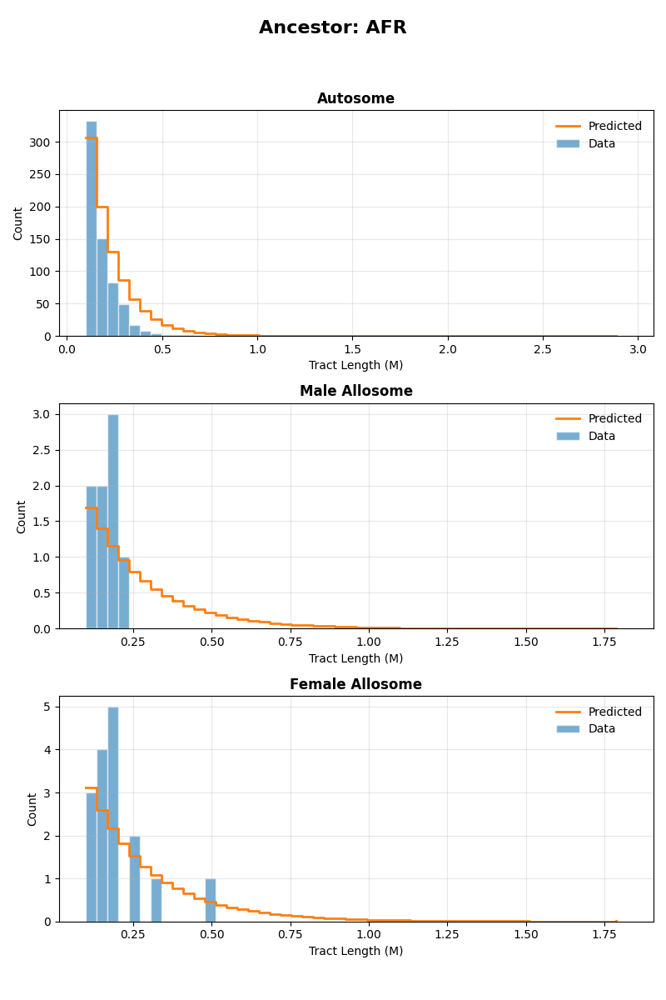
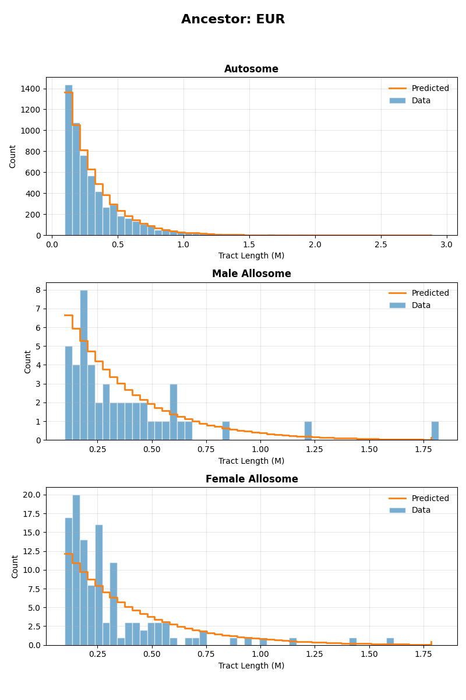
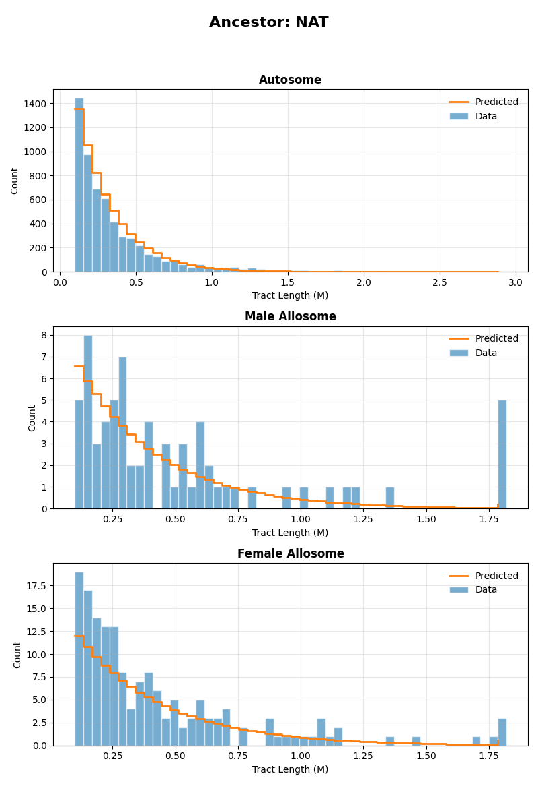

.. DO NOT EDIT.
.. THIS FILE WAS AUTOMATICALLY GENERATED BY SPHINX-GALLERY.
.. TO MAKE CHANGES, EDIT THE SOURCE PYTHON FILE:
.. "auto_examples/MXL/MXL_3pop_sexbiased_fix.py"
.. LINE NUMBERS ARE GIVEN BELOW.

.. only:: html

    .. note::
        :class: sphx-glr-download-link-note

        :ref:`Go to the end <sphx_glr_download_auto_examples_MXL_MXL_3pop_sexbiased_fix.py>`
        to download the full example code.

.. rst-class:: sphx-glr-example-title

.. _sphx_glr_auto_examples_MXL_MXL_3pop_sexbiased_fix.py:

MXL inference - continuous pulse model
======================================

This example implements inference for the MXL population under a continuous pulse model of admixture, using the tracts package.
Inference is performed using autosomal and X chromosome data, allowing for the specification of sex-biased admixture. 

To implement this example, we use the following driver file:

.. code-block:: yaml

   samples:
     directory: ./TrioPhased/
     individual_names: [
       "NA19648","NA19649","NA19651","NA19652","NA19654","NA19655","NA19657","NA19658","NA19661","NA19663",
       "NA19664","NA19669","NA19670","NA19676","NA19678","NA19679","NA19681","NA19682","NA19684","NA19716",
       "NA19717","NA19719","NA19720","NA19722","NA19723","NA19725","NA19726","NA19728","NA19729","NA19731",
       "NA19732","NA19734","NA19735","NA19740","NA19741","NA19746","NA19747","NA19749","NA19750","NA19752",
       "NA19755","NA19756","NA19758","NA19759","NA19761","NA19762","NA19764","NA19770","NA19771","NA19773",
       "NA19774","NA19776","NA19777","NA19779","NA19780","NA19782","NA19783","NA19785","NA19786","NA19788",
       "NA19789","NA19792","NA19794","NA19795"] 
     male_names : [
       "NA19649","NA19652","NA19655","NA19658","NA19661","NA19664","NA19670","NA19676","NA19679","NA19682",
       "NA19717","NA19720","NA19723","NA19726","NA19729","NA19732","NA19735","NA19741","NA19747","NA19750",
       "NA19756","NA19759","NA19762","NA19771","NA19774","NA19777","NA19780","NA19783","NA19786","NA19789",
       "NA19792","NA19795"] #see Readme_dataprocessing.md for how this was generated
     filename_format: "{name}_{label}_final.bed"
     labels: [A, B] #If this field is omitted, 'A' and 'B' will be used by default
     chromosomes: 1-22 #The chromosomes to use for analysis. Can be specified as a list or a range
     allosomes: [X]
   output_filename_format: "MXL_test_output_{label}"
   model_filename: ../models/ccc.yaml
   start_params: 
     t1: 13.5
     REUR: 0.2
     RAFR: 0.02
     RNAT: 0.2
     t2: 6.8
  
     REUR_sex_bias: -0.99 # more males
     RNAT_sex_bias: 0.99 # more females
     RAFR_sex_bias: -0.1
   repetitions: 1
   seed: 100
   maximum_iterations: 1000
   unknown_labels_for_smoothing: ["UNK", "centromere","miscall"] # segments with these labels will be smoother over, that is, will be filled with neighbouring ancestries up to their midpoints.  
   exclude_tracts_below_cm: 2
   npts : 50
   #fix_parameters_from_ancestry_proportions: ['REUR', 'RAFR','REUR_sex_bias', 'RAFR_sex_bias']
   output_directory: ./output_continuous_pulse/
   ad_model_autosomes : M
   ad_model_allosomes : DC

Complete results from this analysis are saved in the output directory specified in the driver file. Below, we display the optimal parameters estimated from this analysis,
as well as the plots illustrating the inferred tract length distributions, compared to the observed histograms, for every source population and chromosome type (autosomes and X chromosome).

Optimal parameters
------------------

.. csv-table:: Estimated optimal parameters
   :file: output_continuous_pulse/MXL_test_output_optimal_parameters.txt
   :header-rows: 1
   :delim: tab

Tract length histograms
-----------------------

African ancestry
^^^^^^^^^^^^^^^^

European ancestry
^^^^^^^^^^^^^^^^^

Native American ancestry
^^^^^^^^^^^^^^^^^^^^^^^^

.. GENERATED FROM PYTHON SOURCE LINES 91-110

.. rst-class:: sphx-glr-script-out

 .. code-block:: none

    ------------------------------------------------------------------------------------------------

    Running tracts 2.0 with driver file: MXL_continuous.yaml 

    Reading data, demographic model and driver specifications...

    ------------------------------------------------------------------------------------------------

    excluding_tracts_below Defaulting to 2.0 cM.
    Individual NA19649 is listed as male but has two X chromosomes. Selecting first of the two.
    Individual NA19652 is listed as male but has two X chromosomes. Selecting first of the two.
    Individual NA19655 is listed as male but has two X chromosomes. Selecting first of the two.
    Individual NA19658 is listed as male but has two X chromosomes. Selecting first of the two.
    Individual NA19661 is listed as male but has two X chromosomes. Selecting first of the two.
    Individual NA19664 is listed as male but has two X chromosomes. Selecting first of the two.
    Individual NA19670 is listed as male but has two X chromosomes. Selecting first of the two.
    Individual NA19676 is listed as male but has two X chromosomes. Selecting first of the two.
    Individual NA19679 is listed as male but has two X chromosomes. Selecting first of the two.
    Individual NA19682 is listed as male but has two X chromosomes. Selecting first of the two.
    Individual NA19717 is listed as male but has two X chromosomes. Selecting first of the two.
    Individual NA19720 is listed as male but has two X chromosomes. Selecting first of the two.
    Individual NA19723 is listed as male but has two X chromosomes. Selecting first of the two.
    Individual NA19726 is listed as male but has two X chromosomes. Selecting first of the two.
    Individual NA19729 is listed as male but has two X chromosomes. Selecting first of the two.
    Individual NA19732 is listed as male but has two X chromosomes. Selecting first of the two.
    Individual NA19735 is listed as male but has two X chromosomes. Selecting first of the two.
    Individual NA19741 is listed as male but has two X chromosomes. Selecting first of the two.
    Individual NA19747 is listed as male but has two X chromosomes. Selecting first of the two.
    Individual NA19750 is listed as male but has two X chromosomes. Selecting first of the two.
    Individual NA19756 is listed as male but has two X chromosomes. Selecting first of the two.
    Individual NA19759 is listed as male but has two X chromosomes. Selecting first of the two.
    Individual NA19762 is listed as male but has two X chromosomes. Selecting first of the two.
    Individual NA19771 is listed as male but has two X chromosomes. Selecting first of the two.
    Individual NA19774 is listed as male but has two X chromosomes. Selecting first of the two.
    Individual NA19777 is listed as male but has two X chromosomes. Selecting first of the two.
    Individual NA19780 is listed as male but has two X chromosomes. Selecting first of the two.
    Individual NA19783 is listed as male but has two X chromosomes. Selecting first of the two.
    Individual NA19786 is listed as male but has two X chromosomes. Selecting first of the two.
    Individual NA19789 is listed as male but has two X chromosomes. Selecting first of the two.
    Individual NA19792 is listed as male but has two X chromosomes. Selecting first of the two.
    Individual NA19795 is listed as male but has two X chromosomes. Selecting first of the two.
    Parameter "REUR_male" already exists.
    Parameter "RNAT_male" already exists.
    Parameter "RAFR_male" already exists.
    Parameter "REUR_female" already exists.
    Parameter "RNAT_female" already exists.
    Parameter "RAFR_female" already exists.
    Parameter "t1" already exists.
    Parameter "t2" already exists.
    Computed autosome proportions [0.468066   0.49277278 0.03920868]
    Computed allosome proportions [0.33731709 0.62309703 0.03958588]
    Model parameters : ['REUR', 'REUR_sex_bias', 'RNAT', 'RNAT_sex_bias', 'RAFR', 'RAFR_sex_bias', 't1', 't2']
    Physical start params : [ 0.2  -0.99  0.2   0.99  0.02 -0.1  13.5   6.8 ]
    Initial parameters :  [-1.38629436 -5.29330482 -1.38629436  5.29330482 -3.8918203  -0.2006707
      2.60268969  1.91692261]
    Initial ancestry proportions : {'X_autosomal': array([0.47612893, 0.47625262, 0.04761845]), 'X_X': array([0.3198092 , 0.63408342, 0.04610739])}

    --------------------------------------------------------------------------------------------------
    Admixture is modelled with the M model for autosomes and with the DC model for allosomes.
    Optimization is performed in two steps.
    Step 1 : Optimizing autosomal likelihood over parameters ['REUR', 'RNAT', 'RAFR', 't1', 't2']
    --------------------------------------------------------------------------------------------------
    Iter.    Log-likelihood  Model parameters                Transmission
    ---------------------------------------------------------------------

    1       , -867.946    , array([ 0.2        ,  0          ,  0.2        ,  0          ,  0.02       ,  0          ,  13.5       ,  6.8        ]), Autosomes
    2       , -871.788    , array([ 0.201605   ,  0          ,  0.2        ,  0          ,  0.02       ,  0          ,  13.5       ,  6.8        ]), Autosomes
    3       , -869.193    , array([ 0.2        ,  0          ,  0.201605   ,  0          ,  0.02       ,  0          ,  13.5       ,  6.8        ]), Autosomes
    4       , -865.011    , array([ 0.2        ,  0          ,  0.2        ,  0          ,  0.0201969  ,  0          ,  13.5       ,  6.8        ]), Autosomes
    5       , -864.385    , array([ 0.2        ,  0          ,  0.2        ,  0          ,  0.0201969  ,  0          ,  13.6357    ,  6.8        ]), Autosomes
    6       , -862.737    , array([ 0.2        ,  0          ,  0.2        ,  0          ,  0.0201969  ,  0          ,  13.6357    ,  6.86834    ]), Autosomes
    7       , -858.818    , array([ 0.198842   ,  0          ,  0.199624   ,  0          ,  0.0203069  ,  0          ,  13.6518    ,  6.88976    ]), Autosomes
    8       , -856.097    , array([ 0.198092   ,  0          ,  0.199142   ,  0          ,  0.0204488  ,  0          ,  13.6725    ,  6.91732    ]), Autosomes
    9       , -858.702    , array([ 0.19895    ,  0          ,  0.198852   ,  0          ,  0.0205348  ,  0          ,  13.685     ,  6.96563    ]), Autosomes
    10      , -855.821    , array([ 0.198092   ,  0          ,  0.199877   ,  0          ,  0.020488   ,  0          ,  13.6725    ,  6.91732    ]), Autosomes
    11      , -854.205    , array([ 0.196578   ,  0          ,  0.200098   ,  0          ,  0.0204685  ,  0          ,  13.6864    ,  6.93227    ]), Autosomes
    12      , -851.287    , array([ 0.196221   ,  0          ,  0.199992   ,  0          ,  0.0205268  ,  0          ,  13.7951    ,  6.89885    ]), Autosomes
    13      , -847.819    , array([ 0.195425   ,  0          ,  0.199749   ,  0          ,  0.0206451  ,  0          ,  13.7758    ,  6.85773    ]), Autosomes
    /home/jgonzale/Documents/PhaseType/tracts/tracts/phase_type_distribution.py:171: ComplexWarning: Casting complex values to real discards the imaginary part
      CDF_values[bin_number] = prop_connected * ((self.inner_CDF(bin_val, L, S, exp_Sx, alpha, S0_inv) +
    14      , -845.652    , array([ 0.194493   ,  0          ,  0.199774   ,  0          ,  0.0207096  ,  0          ,  13.8054    ,  6.80945    ]), Autosomes
    15      , -842.424    , array([ 0.194058   ,  0          ,  0.199335   ,  0          ,  0.0208816  ,  0          ,  13.8417    ,  6.82694    ]), Autosomes
    16      , -840.283    , array([ 0.19276    ,  0          ,  0.199287   ,  0          ,  0.0209345  ,  0          ,  13.787     ,  6.84666    ]), Autosomes
    17      , -839.801    , array([ 0.192774   ,  0          ,  0.200417   ,  0          ,  0.0210743  ,  0          ,  13.7607    ,  6.84365    ]), Autosomes
    18      , -839.7      , array([ 0.193013   ,  0          ,  0.200038   ,  0          ,  0.0211022  ,  0          ,  13.7131    ,  6.83141    ]), Autosomes
    19      , -836.622    , array([ 0.192104   ,  0          ,  0.199398   ,  0          ,  0.0212425  ,  0          ,  13.7405    ,  6.83123    ]), Autosomes
    20      , -834.643    , array([ 0.191453   ,  0          ,  0.198732   ,  0          ,  0.0213877  ,  0          ,  13.7516    ,  6.85848    ]), Autosomes
    21      , -831.707    , array([ 0.190275   ,  0          ,  0.198403   ,  0          ,  0.0214762  ,  0          ,  13.7669    ,  6.82909    ]), Autosomes
    22      , -829.203    , array([ 0.189221   ,  0          ,  0.197868   ,  0          ,  0.0215843  ,  0          ,  13.7422    ,  6.8054     ]), Autosomes
    23      , -827.256    , array([ 0.188046   ,  0          ,  0.198179   ,  0          ,  0.0216966  ,  0          ,  13.7792    ,  6.79622    ]), Autosomes
    24      , -825.778    , array([ 0.188122   ,  0          ,  0.197488   ,  0          ,  0.0218108  ,  0          ,  13.8499    ,  6.76176    ]), Autosomes
    25      , -823.927    , array([ 0.187048   ,  0          ,  0.196543   ,  0          ,  0.021773   ,  0          ,  13.8965    ,  6.75892    ]), Autosomes
    26      , -824.031    , array([ 0.186174   ,  0          ,  0.19645    ,  0          ,  0.0217616  ,  0          ,  13.8995    ,  6.70416    ]), Autosomes
    27      , -823.532    , array([ 0.186974   ,  0          ,  0.196187   ,  0          ,  0.0218189  ,  0          ,  13.8428    ,  6.76069    ]), Autosomes
    28      , 1e+32       , array([ 0.186274   ,  0          ,  0.195488   ,  0          ,  0.0219432  ,  0          ,  13.8902    ,  6.78573    ]), 
    29      , -824.9      , array([ 0.187776   ,  0          ,  0.195406   ,  0          ,  0.0216898  ,  0          ,  13.824     ,  6.74042    ]), Autosomes
    30      , -824.01     , array([ 0.186682   ,  0          ,  0.19646    ,  0          ,  0.0217504  ,  0          ,  13.8087    ,  6.77002    ]), Autosomes
    31      , -823.364    , array([ 0.186747   ,  0          ,  0.196151   ,  0          ,  0.0218156  ,  0          ,  13.8442    ,  6.7473     ]), Autosomes
    32      , -824.417    , array([ 0.187093   ,  0          ,  0.196664   ,  0          ,  0.0218338  ,  0          ,  13.8185    ,  6.73215    ]), Autosomes
    33      , -823.688    , array([ 0.186947   ,  0          ,  0.195956   ,  0          ,  0.0217833  ,  0          ,  13.8395    ,  6.74224    ]), Autosomes
    34      , -823.263    , array([ 0.186728   ,  0          ,  0.196063   ,  0          ,  0.0218271  ,  0          ,  13.8308    ,  6.74774    ]), Autosomes
    35      , -822.647    , array([ 0.186495   ,  0          ,  0.195858   ,  0          ,  0.0218524  ,  0          ,  13.8408    ,  6.75119    ]), Autosomes
    36      , -822.06     , array([ 0.186264   ,  0          ,  0.195677   ,  0          ,  0.0218834  ,  0          ,  13.8496    ,  6.75354    ]), Autosomes
    37      , -821.516    , array([ 0.186051   ,  0          ,  0.195507   ,  0          ,  0.0219208  ,  0          ,  13.852     ,  6.75476    ]), Autosomes
    38      , -821.077    , array([ 0.185838   ,  0          ,  0.195369   ,  0          ,  0.0219289  ,  0          ,  13.876     ,  6.75879    ]), Autosomes
    39      , -820.707    , array([ 0.185522   ,  0          ,  0.195228   ,  0          ,  0.0219378  ,  0          ,  13.8714    ,  6.76481    ]), Autosomes
    40      , -820.284    , array([ 0.185451   ,  0          ,  0.19487    ,  0          ,  0.0219546  ,  0          ,  13.8778    ,  6.76393    ]), Autosomes
    41      , -820.315    , array([ 0.185514   ,  0          ,  0.194772   ,  0          ,  0.0219823  ,  0          ,  13.8826    ,  6.7773     ]), Autosomes
    42      , 1e+32       , array([ 0.185422   ,  0          ,  0.194938   ,  0          ,  0.021977   ,  0          ,  13.8779    ,  6.76052    ]), 
    43      , -820.55     , array([ 0.18551    ,  0          ,  0.194735   ,  0          ,  0.0219099  ,  0          ,  13.8776    ,  6.77075    ]), Autosomes
    44      , -820.216    , array([ 0.185405   ,  0          ,  0.194909   ,  0          ,  0.0219514  ,  0          ,  13.8941    ,  6.76417    ]), Autosomes
    45      , -819.682    , array([ 0.185151   ,  0          ,  0.194738   ,  0          ,  0.0219736  ,  0          ,  13.9019    ,  6.75791    ]), Autosomes
    46      , 1e+32       , array([ 0.184976   ,  0          ,  0.194545   ,  0          ,  0.0219982  ,  0          ,  13.9129    ,  6.74978    ]), 
    47      , -819.636    , array([ 0.185021   ,  0          ,  0.194734   ,  0          ,  0.0219738  ,  0          ,  13.8902    ,  6.76005    ]), Autosomes
    48      , -819.829    , array([ 0.184923   ,  0          ,  0.195042   ,  0          ,  0.0219632  ,  0          ,  13.9032    ,  6.76627    ]), Autosomes
    49      , -819.656    , array([ 0.185019   ,  0          ,  0.194637   ,  0          ,  0.0219541  ,  0          ,  13.8969    ,  6.76224    ]), Autosomes
    50      , -819.768    , array([ 0.184868   ,  0          ,  0.194731   ,  0          ,  0.0219597  ,  0          ,  13.863     ,  6.76667    ]), Autosomes
    51      , -819.811    , array([ 0.185097   ,  0          ,  0.194806   ,  0          ,  0.0219581  ,  0          ,  13.8853    ,  6.7556     ]), Autosomes
    52      , -819.728    , array([ 0.185094   ,  0          ,  0.194739   ,  0          ,  0.0219751  ,  0          ,  13.889     ,  6.76261    ]), Autosomes
    53      , -819.369    , array([ 0.184912   ,  0          ,  0.194636   ,  0          ,  0.0219869  ,  0          ,  13.8952    ,  6.75746    ]), Autosomes
    54      , -819.107    , array([ 0.184791   ,  0          ,  0.194556   ,  0          ,  0.0219998  ,  0          ,  13.9013    ,  6.75523    ]), Autosomes
    55      , -818.847    , array([ 0.184691   ,  0          ,  0.19445    ,  0          ,  0.0220139  ,  0          ,  13.9062    ,  6.75291    ]), Autosomes
    56      , -818.588    , array([ 0.18458    ,  0          ,  0.194364   ,  0          ,  0.0220282  ,  0          ,  13.9122    ,  6.7509     ]), Autosomes
    57      , -818.341    , array([ 0.1845     ,  0          ,  0.194262   ,  0          ,  0.0220459  ,  0          ,  13.9171    ,  6.74939    ]), Autosomes
    58      , -818.092    , array([ 0.184373   ,  0          ,  0.194199   ,  0          ,  0.0220589  ,  0          ,  13.9241    ,  6.74752    ]), Autosomes
    59      , -817.851    , array([ 0.184284   ,  0          ,  0.194118   ,  0          ,  0.0220773  ,  0          ,  13.9303    ,  6.74649    ]), Autosomes
    60      , -817.613    , array([ 0.18419    ,  0          ,  0.193985   ,  0          ,  0.0220853  ,  0          ,  13.9329    ,  6.74299    ]), Autosomes
    61      , -817.38     , array([ 0.184089   ,  0          ,  0.193917   ,  0          ,  0.0220996  ,  0          ,  13.9378    ,  6.73896    ]), Autosomes
    62      , -817.164    , array([ 0.184047   ,  0          ,  0.19379    ,  0          ,  0.0221185  ,  0          ,  13.9409    ,  6.73802    ]), Autosomes
    63      , -816.958    , array([ 0.183896   ,  0          ,  0.193718   ,  0          ,  0.0221302  ,  0          ,  13.9379    ,  6.73789    ]), Autosomes
    64      , -816.715    , array([ 0.183779   ,  0          ,  0.193612   ,  0          ,  0.02214    ,  0          ,  13.9448    ,  6.73664    ]), Autosomes
    65      , -816.472    , array([ 0.183665   ,  0          ,  0.193502   ,  0          ,  0.0221514  ,  0          ,  13.9495    ,  6.73448    ]), Autosomes
    66      , -816.24     , array([ 0.183551   ,  0          ,  0.193396   ,  0          ,  0.0221644  ,  0          ,  13.951     ,  6.73185    ]), Autosomes
    67      , -816.008    , array([ 0.183454   ,  0          ,  0.193287   ,  0          ,  0.0221728  ,  0          ,  13.9604    ,  6.73029    ]), Autosomes
    68      , -815.779    , array([ 0.183336   ,  0          ,  0.19322    ,  0          ,  0.0221888  ,  0          ,  13.9667    ,  6.72944    ]), Autosomes
    69      , -815.547    , array([ 0.183223   ,  0          ,  0.193095   ,  0          ,  0.0221993  ,  0          ,  13.9711    ,  6.7291     ]), Autosomes
    70      , 1e+32       , array([ 0.18312    ,  0          ,  0.19299    ,  0          ,  0.0222113  ,  0          ,  13.9756    ,  6.7259     ]), 
    71      , -815.553    , array([ 0.183265   ,  0          ,  0.193093   ,  0          ,  0.0222107  ,  0          ,  13.9692    ,  6.72993    ]), Autosomes
    72      , -815.574    , array([ 0.183128   ,  0          ,  0.193188   ,  0          ,  0.0222021  ,  0          ,  13.9704    ,  6.73507    ]), Autosomes
    73      , 1e+32       , array([ 0.183247   ,  0          ,  0.19311    ,  0          ,  0.0222004  ,  0          ,  13.9793    ,  6.72962    ]), 
    74      , -815.6      , array([ 0.18325    ,  0          ,  0.192982   ,  0          ,  0.02219    ,  0          ,  13.9622    ,  6.73344    ]), Autosomes
    75      , -815.545    , array([ 0.183186   ,  0          ,  0.193109   ,  0          ,  0.0222007  ,  0          ,  13.9642    ,  6.72727    ]), Autosomes
    76      , -815.555    , array([ 0.183193   ,  0          ,  0.19308    ,  0          ,  0.0221984  ,  0          ,  13.962     ,  6.72835    ]), Autosomes
    77      , -815.516    , array([ 0.183172   ,  0          ,  0.193093   ,  0          ,  0.022202   ,  0          ,  13.9647    ,  6.72722    ]), Autosomes
    78      , 1e+32       , array([ 0.183145   ,  0          ,  0.193065   ,  0          ,  0.0222047  ,  0          ,  13.9662    ,  6.72674    ]), 
    79      , -815.518    , array([ 0.183185   ,  0          ,  0.193084   ,  0          ,  0.0222016  ,  0          ,  13.9648    ,  6.72644    ]), Autosomes
    80      , -815.562    , array([ 0.183187   ,  0          ,  0.193137   ,  0          ,  0.022201   ,  0          ,  13.964     ,  6.72685    ]), Autosomes
    81      , -815.516    , array([ 0.183162   ,  0          ,  0.193093   ,  0          ,  0.0221991  ,  0          ,  13.9651    ,  6.72706    ]), Autosomes
    82      , -815.549    , array([ 0.18319    ,  0          ,  0.193082   ,  0          ,  0.0221994  ,  0          ,  13.9618    ,  6.72817    ]), Autosomes
    83      , -815.523    , array([ 0.183185   ,  0          ,  0.193093   ,  0          ,  0.0222014  ,  0          ,  13.9663    ,  6.72768    ]), Autosomes
    84      , -815.526    , array([ 0.183178   ,  0          ,  0.193089   ,  0          ,  0.0222012  ,  0          ,  13.9638    ,  6.72753    ]), Autosomes
    85      , -815.508    , array([ 0.18317    ,  0          ,  0.193086   ,  0          ,  0.0222022  ,  0          ,  13.9649    ,  6.72728    ]), Autosomes
    86      , -815.489    , array([ 0.183161   ,  0          ,  0.193077   ,  0          ,  0.0222031  ,  0          ,  13.9653    ,  6.72717    ]), Autosomes
    87      , -815.471    , array([ 0.183151   ,  0          ,  0.193069   ,  0          ,  0.022204   ,  0          ,  13.9658    ,  6.72706    ]), Autosomes
    88      , -815.452    , array([ 0.183142   ,  0          ,  0.19306    ,  0          ,  0.0222048  ,  0          ,  13.9663    ,  6.72695    ]), Autosomes
    89      , -815.433    , array([ 0.183133   ,  0          ,  0.193052   ,  0          ,  0.0222057  ,  0          ,  13.9668    ,  6.72684    ]), Autosomes
    90      , -815.414    , array([ 0.183124   ,  0          ,  0.193043   ,  0          ,  0.0222066  ,  0          ,  13.9673    ,  6.72675    ]), Autosomes
    91      , -815.396    , array([ 0.183114   ,  0          ,  0.193035   ,  0          ,  0.0222075  ,  0          ,  13.9677    ,  6.72661    ]), Autosomes
    92      , -815.377    , array([ 0.183104   ,  0          ,  0.193027   ,  0          ,  0.0222084  ,  0          ,  13.9682    ,  6.72649    ]), Autosomes
    93      , -815.358    , array([ 0.183095   ,  0          ,  0.193019   ,  0          ,  0.0222094  ,  0          ,  13.9687    ,  6.72637    ]), Autosomes
    94      , -815.34     , array([ 0.183086   ,  0          ,  0.19301    ,  0          ,  0.0222102  ,  0          ,  13.9692    ,  6.72627    ]), Autosomes
    95      , -815.321    , array([ 0.183076   ,  0          ,  0.193002   ,  0          ,  0.0222111  ,  0          ,  13.9697    ,  6.72616    ]), Autosomes
    96      , -815.303    , array([ 0.183066   ,  0          ,  0.192998   ,  0          ,  0.0222123  ,  0          ,  13.9701    ,  6.72601    ]), Autosomes
    97      , -815.285    , array([ 0.183056   ,  0          ,  0.192989   ,  0          ,  0.0222132  ,  0          ,  13.9705    ,  6.7259     ]), Autosomes
    98      , -815.266    , array([ 0.183047   ,  0          ,  0.19298    ,  0          ,  0.0222141  ,  0          ,  13.971     ,  6.7258     ]), Autosomes
    99      , -815.247    , array([ 0.183038   ,  0          ,  0.192971   ,  0          ,  0.0222149  ,  0          ,  13.9714    ,  6.7257     ]), Autosomes
    100     , -815.229    , array([ 0.183028   ,  0          ,  0.192963   ,  0          ,  0.0222158  ,  0          ,  13.9718    ,  6.72559    ]), Autosomes
    101     , 1e+32       , array([ 0.183018   ,  0          ,  0.192956   ,  0          ,  0.022217   ,  0          ,  13.972     ,  6.72546    ]), 
    102     , -815.229    , array([ 0.183026   ,  0          ,  0.192963   ,  0          ,  0.0222159  ,  0          ,  13.9718    ,  6.72591    ]), Autosomes
    103     , -815.228    , array([ 0.183035   ,  0          ,  0.192955   ,  0          ,  0.0222151  ,  0          ,  13.9727    ,  6.72572    ]), Autosomes
    104     , -815.228    , array([ 0.183039   ,  0          ,  0.192954   ,  0          ,  0.0222159  ,  0          ,  13.9726    ,  6.72577    ]), Autosomes
    105     , 1e+32       , array([ 0.183026   ,  0          ,  0.192947   ,  0          ,  0.022216   ,  0          ,  13.9732    ,  6.7256     ]), 
    106     , -815.228    , array([ 0.183035   ,  0          ,  0.19295    ,  0          ,  0.0222147  ,  0          ,  13.9723    ,  6.72572    ]), Autosomes
    107     , -815.209    , array([ 0.183025   ,  0          ,  0.192942   ,  0          ,  0.0222156  ,  0          ,  13.9728    ,  6.7256     ]), Autosomes
    108     , -815.191    , array([ 0.183016   ,  0          ,  0.192933   ,  0          ,  0.0222164  ,  0          ,  13.9732    ,  6.72547    ]), Autosomes
    109     , -815.172    , array([ 0.183007   ,  0          ,  0.192924   ,  0          ,  0.0222173  ,  0          ,  13.9737    ,  6.72535    ]), Autosomes
    110     , -815.153    , array([ 0.182997   ,  0          ,  0.192916   ,  0          ,  0.0222181  ,  0          ,  13.9742    ,  6.72523    ]), Autosomes
    111     , -815.135    , array([ 0.182988   ,  0          ,  0.192907   ,  0          ,  0.022219   ,  0          ,  13.9746    ,  6.7251     ]), Autosomes
    112     , 1e+32       , array([ 0.182979   ,  0          ,  0.192899   ,  0          ,  0.0222198  ,  0          ,  13.9751    ,  6.72498    ]), 
    113     , 1e+32       , array([ 0.18299    ,  0          ,  0.192907   ,  0          ,  0.022219   ,  0          ,  13.9747    ,  6.72478    ]), 
    114     , -815.135    , array([ 0.182983   ,  0          ,  0.192908   ,  0          ,  0.0222191  ,  0          ,  13.9746    ,  6.72574    ]), Autosomes
    115     , -815.135    , array([ 0.182992   ,  0          ,  0.192904   ,  0          ,  0.0222186  ,  0          ,  13.9751    ,  6.72517    ]), Autosomes
    116     , -815.116    , array([ 0.182979   ,  0          ,  0.192899   ,  0          ,  0.0222198  ,  0          ,  13.9751    ,  6.72497    ]), Autosomes
    117     , -815.097    , array([ 0.182969   ,  0          ,  0.19289    ,  0          ,  0.0222207  ,  0          ,  13.9756    ,  6.72484    ]), Autosomes
    118     , -815.079    , array([ 0.18296    ,  0          ,  0.192881   ,  0          ,  0.0222215  ,  0          ,  13.976     ,  6.72472    ]), Autosomes
    119     , -815.06     , array([ 0.182951   ,  0          ,  0.192872   ,  0          ,  0.0222224  ,  0          ,  13.9764    ,  6.72458    ]), Autosomes
    120     , -815.042    , array([ 0.182941   ,  0          ,  0.192862   ,  0          ,  0.0222231  ,  0          ,  13.9768    ,  6.72445    ]), Autosomes
    121     , -815.023    , array([ 0.182932   ,  0          ,  0.192854   ,  0          ,  0.022224   ,  0          ,  13.9773    ,  6.72433    ]), Autosomes
    122     , -815.005    , array([ 0.182923   ,  0          ,  0.192845   ,  0          ,  0.0222249  ,  0          ,  13.9778    ,  6.7242     ]), Autosomes
    123     , -814.986    , array([ 0.182914   ,  0          ,  0.192836   ,  0          ,  0.0222257  ,  0          ,  13.9782    ,  6.72407    ]), Autosomes
    124     , -814.968    , array([ 0.182905   ,  0          ,  0.192828   ,  0          ,  0.0222265  ,  0          ,  13.9788    ,  6.72396    ]), Autosomes
    125     , -814.949    , array([ 0.182895   ,  0          ,  0.192819   ,  0          ,  0.0222274  ,  0          ,  13.9792    ,  6.72384    ]), Autosomes
    126     , -814.931    , array([ 0.182886   ,  0          ,  0.192809   ,  0          ,  0.0222281  ,  0          ,  13.9795    ,  6.72368    ]), Autosomes
    127     , -814.913    , array([ 0.182877   ,  0          ,  0.192801   ,  0          ,  0.022229   ,  0          ,  13.98      ,  6.72357    ]), Autosomes
    128     , 1e+32       , array([ 0.182867   ,  0          ,  0.192791   ,  0          ,  0.0222298  ,  0          ,  13.9804    ,  6.72344    ]), 
    129     , -814.913    , array([ 0.182873   ,  0          ,  0.192803   ,  0          ,  0.0222281  ,  0          ,  13.9801    ,  6.72352    ]), Autosomes
    130     , -814.894    , array([ 0.182863   ,  0          ,  0.192793   ,  0          ,  0.0222289  ,  0          ,  13.9805    ,  6.72339    ]), Autosomes
    131     , 1e+32       , array([ 0.182856   ,  0          ,  0.192788   ,  0          ,  0.0222299  ,  0          ,  13.9815    ,  6.72337    ]), 
    132     , -814.894    , array([ 0.182866   ,  0          ,  0.192793   ,  0          ,  0.0222289  ,  0          ,  13.9807    ,  6.72309    ]), Autosomes
    133     , 1e+32       , array([ 0.182863   ,  0          ,  0.19279    ,  0          ,  0.0222287  ,  0          ,  13.9794    ,  6.72289    ]), 
    134     , -814.894    , array([ 0.182869   ,  0          ,  0.192788   ,  0          ,  0.0222284  ,  0          ,  13.9808    ,  6.72315    ]), Autosomes
    135     , -814.893    , array([ 0.182869   ,  0          ,  0.192797   ,  0          ,  0.0222292  ,  0          ,  13.982     ,  6.72329    ]), Autosomes
    --------------------------------------------------------------------------------------------------
    Step 2 : Optimizing autosomal + allosomal likelihood over parameters : ['REUR_sex_bias', 'RNAT_sex_bias', 'RAFR_sex_bias']
    Non-sex-bias parameters fixed at values from previous optimization step : {'REUR': -1.4970300419041969, 'RNAT': -1.4319375486748434, 'RAFR': -3.7838690772884704, 't1': 2.6377675576737527, 't2': 1.9055776044852655}
    --------------------------------------------------------------------------------------------------
    Iter.    Log-likelihood  Model parameters                Transmission
    ---------------------------------------------------------------------

    136     , -188.175    , array([ 0.182869   ,  0          ,  0.192797   ,  0          ,  0.0222292  ,  0          ,  13.982     ,  6.72329    ]), Female allosomes
    136     , -118.132    , array([ 0.182869   ,  0          ,  0.192797   ,  0          ,  0.0222292  ,  0          ,  13.982     ,  6.72329    ]), Male allosomes
    136     , -814.893    , array([ 0.182869   ,  0          ,  0.192797   ,  0          ,  0.0222292  ,  0          ,  13.982     ,  6.72329    ]), Autosomes
    137     , 1e+32       , array([ 0.182869   ,  0.00499996 ,  0.192797   ,  0          ,  0.0222292  ,  0          ,  13.982     ,  6.72329    ]), 
    138     , -188.206    , array([ 0.182869   ,  0          ,  0.192797   ,  0.00499996 ,  0.0222292  ,  0          ,  13.982     ,  6.72329    ]), Female allosomes
    138     , -118.13     , array([ 0.182869   ,  0          ,  0.192797   ,  0.00499996 ,  0.0222292  ,  0          ,  13.982     ,  6.72329    ]), Male allosomes
    138     , -814.893    , array([ 0.182869   ,  0          ,  0.192797   ,  0.00499996 ,  0.0222292  ,  0          ,  13.982     ,  6.72329    ]), Autosomes
    139     , -188.163    , array([ 0.182869   ,  0          ,  0.192797   ,  0          ,  0.0222292  ,  0.00499996 ,  13.982     ,  6.72329    ]), Female allosomes
    139     , -118.127    , array([ 0.182869   ,  0          ,  0.192797   ,  0          ,  0.0222292  ,  0.00499996 ,  13.982     ,  6.72329    ]), Male allosomes
    139     , -814.893    , array([ 0.182869   ,  0          ,  0.192797   ,  0          ,  0.0222292  ,  0.00499996 ,  13.982     ,  6.72329    ]), Autosomes
    140     , -188.07     , array([ 0.182869   , -0.00499996 ,  0.192797   ,  0          ,  0.0222292  ,  0.00499996 ,  13.982     ,  6.72329    ]), Female allosomes
    140     , -118.096    , array([ 0.182869   , -0.00499996 ,  0.192797   ,  0          ,  0.0222292  ,  0.00499996 ,  13.982     ,  6.72329    ]), Male allosomes
    140     , -814.893    , array([ 0.182869   , -0.00499996 ,  0.192797   ,  0          ,  0.0222292  ,  0.00499996 ,  13.982     ,  6.72329    ]), Autosomes
    141     , -188.021    , array([ 0.182869   , -0.00741236 ,  0.192797   , -0.00055384 ,  0.0222292  ,  0.00535082 ,  13.982     ,  6.72329    ]), Female allosomes
    141     , -118.081    , array([ 0.182869   , -0.00741236 ,  0.192797   , -0.00055384 ,  0.0222292  ,  0.00535082 ,  13.982     ,  6.72329    ]), Male allosomes
    141     , -814.893    , array([ 0.182869   , -0.00741236 ,  0.192797   , -0.00055384 ,  0.0222292  ,  0.00535082 ,  13.982     ,  6.72329    ]), Autosomes
    142     , -187.972    , array([ 0.182869   , -0.00982461 ,  0.192797   , -0.00110775 ,  0.0222292  ,  0.00570208 ,  13.982     ,  6.72329    ]), Female allosomes
    142     , -118.066    , array([ 0.182869   , -0.00982461 ,  0.192797   , -0.00110775 ,  0.0222292  ,  0.00570208 ,  13.982     ,  6.72329    ]), Male allosomes
    142     , -814.892    , array([ 0.182869   , -0.00982461 ,  0.192797   , -0.00110775 ,  0.0222292  ,  0.00570208 ,  13.982     ,  6.72329    ]), Autosomes
    143     , -187.923    , array([ 0.182869   , -0.0122367  ,  0.192797   , -0.00166168 ,  0.0222292  ,  0.00605359 ,  13.982     ,  6.72329    ]), Female allosomes
    143     , -118.051    , array([ 0.182869   , -0.0122367  ,  0.192797   , -0.00166168 ,  0.0222292  ,  0.00605359 ,  13.982     ,  6.72329    ]), Male allosomes
    143     , -814.892    , array([ 0.182869   , -0.0122367  ,  0.192797   , -0.00166168 ,  0.0222292  ,  0.00605359 ,  13.982     ,  6.72329    ]), Autosomes
    144     , 1e+32       , array([ 0.182869   , -0.0146486  ,  0.192797   , -0.00221565 ,  0.0222292  ,  0.0064055  ,  13.982     ,  6.72329    ]), 
    145     , -187.921    , array([ 0.182869   , -0.0119227  ,  0.192797   , -0.00283007 ,  0.0222292  ,  0.00636775 ,  13.982     ,  6.72329    ]), Female allosomes
    145     , -118.053    , array([ 0.182869   , -0.0119227  ,  0.192797   , -0.00283007 ,  0.0222292  ,  0.00636775 ,  13.982     ,  6.72329    ]), Male allosomes
    145     , -814.892    , array([ 0.182869   , -0.0119227  ,  0.192797   , -0.00283007 ,  0.0222292  ,  0.00636775 ,  13.982     ,  6.72329    ]), Autosomes
    146     , 1e+32       , array([ 0.182869   , -0.014332   ,  0.192797   , -0.00339368 ,  0.0222292  ,  0.00672224 ,  13.982     ,  6.72329    ]), 
    147     , -187.922    , array([ 0.182869   , -0.0118278  ,  0.192797   , -0.00248272 ,  0.0222292  ,  0.0075647  ,  13.982     ,  6.72329    ]), Female allosomes
    147     , -118.052    , array([ 0.182869   , -0.0118278  ,  0.192797   , -0.00248272 ,  0.0222292  ,  0.0075647  ,  13.982     ,  6.72329    ]), Male allosomes
    147     , -814.892    , array([ 0.182869   , -0.0118278  ,  0.192797   , -0.00248272 ,  0.0222292  ,  0.0075647  ,  13.982     ,  6.72329    ]), Autosomes
    148     , -187.971    , array([ 0.182869   , -0.00941575 ,  0.192797   , -0.00192889 ,  0.0222292  ,  0.00721284 ,  13.982     ,  6.72329    ]), Female allosomes
    148     , -118.067    , array([ 0.182869   , -0.00941575 ,  0.192797   , -0.00192889 ,  0.0222292  ,  0.00721284 ,  13.982     ,  6.72329    ]), Male allosomes
    148     , -814.892    , array([ 0.182869   , -0.00941575 ,  0.192797   , -0.00192889 ,  0.0222292  ,  0.00721284 ,  13.982     ,  6.72329    ]), Autosomes
    149     , 1e+32       , array([ 0.182869   , -0.0130325  ,  0.192797   , -0.00276447 ,  0.0222292  ,  0.00774213 ,  13.982     ,  6.72329    ]), 
    150     , -187.934    , array([ 0.182869   , -0.0112248  ,  0.192797   , -0.00234426 ,  0.0222292  ,  0.00747674 ,  13.982     ,  6.72329    ]), Female allosomes
    150     , -118.056    , array([ 0.182869   , -0.0112248  ,  0.192797   , -0.00234426 ,  0.0222292  ,  0.00747674 ,  13.982     ,  6.72329    ]), Male allosomes
    150     , -814.892    , array([ 0.182869   , -0.0112248  ,  0.192797   , -0.00234426 ,  0.0222292  ,  0.00747674 ,  13.982     ,  6.72329    ]), Autosomes
    151     , -187.922    , array([ 0.182869   , -0.0117493  ,  0.192797   , -0.00277482 ,  0.0222292  ,  0.00764324 ,  13.982     ,  6.72329    ]), Female allosomes
    151     , -118.052    , array([ 0.182869   , -0.0117493  ,  0.192797   , -0.00277482 ,  0.0222292  ,  0.00764324 ,  13.982     ,  6.72329    ]), Male allosomes
    151     , -814.892    , array([ 0.182869   , -0.0117493  ,  0.192797   , -0.00277482 ,  0.0222292  ,  0.00764324 ,  13.982     ,  6.72329    ]), Autosomes
    152     , -187.909    , array([ 0.182869   , -0.0123517  ,  0.192797   , -0.00291558 ,  0.0222292  ,  0.00773192 ,  13.982     ,  6.72329    ]), Female allosomes
    152     , -118.049    , array([ 0.182869   , -0.0123517  ,  0.192797   , -0.00291558 ,  0.0222292  ,  0.00773192 ,  13.982     ,  6.72329    ]), Male allosomes
    152     , -814.891    , array([ 0.182869   , -0.0123517  ,  0.192797   , -0.00291558 ,  0.0222292  ,  0.00773192 ,  13.982     ,  6.72329    ]), Autosomes
    153     , -187.897    , array([ 0.182869   , -0.012954   ,  0.192797   , -0.00305634 ,  0.0222292  ,  0.0078206  ,  13.982     ,  6.72329    ]), Female allosomes
    153     , -118.045    , array([ 0.182869   , -0.012954   ,  0.192797   , -0.00305634 ,  0.0222292  ,  0.0078206  ,  13.982     ,  6.72329    ]), Male allosomes
    153     , -814.891    , array([ 0.182869   , -0.012954   ,  0.192797   , -0.00305634 ,  0.0222292  ,  0.0078206  ,  13.982     ,  6.72329    ]), Autosomes
    154     , -187.885    , array([ 0.182869   , -0.0135564  ,  0.192797   , -0.00319711 ,  0.0222292  ,  0.00790929 ,  13.982     ,  6.72329    ]), Female allosomes
    154     , -118.041    , array([ 0.182869   , -0.0135564  ,  0.192797   , -0.00319711 ,  0.0222292  ,  0.00790929 ,  13.982     ,  6.72329    ]), Male allosomes
    154     , -814.891    , array([ 0.182869   , -0.0135564  ,  0.192797   , -0.00319711 ,  0.0222292  ,  0.00790929 ,  13.982     ,  6.72329    ]), Autosomes
    155     , 1e+32       , array([ 0.182869   , -0.0141587  ,  0.192797   , -0.00333793 ,  0.0222292  ,  0.00799799 ,  13.982     ,  6.72329    ]), 
    156     , -187.885    , array([ 0.182869   , -0.0135326  ,  0.192797   , -0.00311027 ,  0.0222292  ,  0.00820852 ,  13.982     ,  6.72329    ]), Female allosomes
    156     , -118.041    , array([ 0.182869   , -0.0135326  ,  0.192797   , -0.00311027 ,  0.0222292  ,  0.00820852 ,  13.982     ,  6.72329    ]), Male allosomes
    156     , -814.891    , array([ 0.182869   , -0.0135326  ,  0.192797   , -0.00311027 ,  0.0222292  ,  0.00820852 ,  13.982     ,  6.72329    ]), Autosomes
    157     , -187.873    , array([ 0.182869   , -0.0141587  ,  0.192797   , -0.00333794 ,  0.0222292  ,  0.00799796 ,  13.982     ,  6.72329    ]), Female allosomes
    157     , -118.037    , array([ 0.182869   , -0.0141587  ,  0.192797   , -0.00333794 ,  0.0222292  ,  0.00799796 ,  13.982     ,  6.72329    ]), Male allosomes
    157     , -814.891    , array([ 0.182869   , -0.0141587  ,  0.192797   , -0.00333794 ,  0.0222292  ,  0.00799796 ,  13.982     ,  6.72329    ]), Autosomes
    158     , -187.861    , array([ 0.182869   , -0.014761   ,  0.192797   , -0.00347883 ,  0.0222292  ,  0.00808664 ,  13.982     ,  6.72329    ]), Female allosomes
    158     , -118.034    , array([ 0.182869   , -0.014761   ,  0.192797   , -0.00347883 ,  0.0222292  ,  0.00808664 ,  13.982     ,  6.72329    ]), Male allosomes
    158     , -814.891    , array([ 0.182869   , -0.014761   ,  0.192797   , -0.00347883 ,  0.0222292  ,  0.00808664 ,  13.982     ,  6.72329    ]), Autosomes
    159     , -187.848    , array([ 0.182869   , -0.0153633  ,  0.192797   , -0.00361981 ,  0.0222292  ,  0.00817533 ,  13.982     ,  6.72329    ]), Female allosomes
    159     , -118.03     , array([ 0.182869   , -0.0153633  ,  0.192797   , -0.00361981 ,  0.0222292  ,  0.00817533 ,  13.982     ,  6.72329    ]), Male allosomes
    159     , -814.891    , array([ 0.182869   , -0.0153633  ,  0.192797   , -0.00361981 ,  0.0222292  ,  0.00817533 ,  13.982     ,  6.72329    ]), Autosomes
    160     , -187.836    , array([ 0.182869   , -0.0159655  ,  0.192797   , -0.00376091 ,  0.0222292  ,  0.008264   ,  13.982     ,  6.72329    ]), Female allosomes
    160     , -118.026    , array([ 0.182869   , -0.0159655  ,  0.192797   , -0.00376091 ,  0.0222292  ,  0.008264   ,  13.982     ,  6.72329    ]), Male allosomes
    160     , -814.891    , array([ 0.182869   , -0.0159655  ,  0.192797   , -0.00376091 ,  0.0222292  ,  0.008264   ,  13.982     ,  6.72329    ]), Autosomes
    161     , -187.824    , array([ 0.182869   , -0.0165677  ,  0.192797   , -0.00390217 ,  0.0222292  ,  0.00835264 ,  13.982     ,  6.72329    ]), Female allosomes
    161     , -118.022    , array([ 0.182869   , -0.0165677  ,  0.192797   , -0.00390217 ,  0.0222292  ,  0.00835264 ,  13.982     ,  6.72329    ]), Male allosomes
    161     , -814.89     , array([ 0.182869   , -0.0165677  ,  0.192797   , -0.00390217 ,  0.0222292  ,  0.00835264 ,  13.982     ,  6.72329    ]), Autosomes
    162     , -187.812    , array([ 0.182869   , -0.0171698  ,  0.192797   , -0.00404362 ,  0.0222292  ,  0.00844122 ,  13.982     ,  6.72329    ]), Female allosomes
    162     , -118.019    , array([ 0.182869   , -0.0171698  ,  0.192797   , -0.00404362 ,  0.0222292  ,  0.00844122 ,  13.982     ,  6.72329    ]), Male allosomes
    162     , -814.89     , array([ 0.182869   , -0.0171698  ,  0.192797   , -0.00404362 ,  0.0222292  ,  0.00844122 ,  13.982     ,  6.72329    ]), Autosomes
    163     , -187.8      , array([ 0.182869   , -0.0177719  ,  0.192797   , -0.0041853  ,  0.0222292  ,  0.00852974 ,  13.982     ,  6.72329    ]), Female allosomes
    163     , -118.015    , array([ 0.182869   , -0.0177719  ,  0.192797   , -0.0041853  ,  0.0222292  ,  0.00852974 ,  13.982     ,  6.72329    ]), Male allosomes
    163     , -814.89     , array([ 0.182869   , -0.0177719  ,  0.192797   , -0.0041853  ,  0.0222292  ,  0.00852974 ,  13.982     ,  6.72329    ]), Autosomes
    164     , 1e+32       , array([ 0.182869   , -0.0183739  ,  0.192797   , -0.00432725 ,  0.0222292  ,  0.00861815 ,  13.982     ,  6.72329    ]), 
    165     , -187.799    , array([ 0.182869   , -0.017692   ,  0.192797   , -0.00447793 ,  0.0222292  ,  0.00860483 ,  13.982     ,  6.72329    ]), Female allosomes
    165     , -118.015    , array([ 0.182869   , -0.017692   ,  0.192797   , -0.00447793 ,  0.0222292  ,  0.00860483 ,  13.982     ,  6.72329    ]), Male allosomes
    165     , -814.89     , array([ 0.182869   , -0.017692   ,  0.192797   , -0.00447793 ,  0.0222292  ,  0.00860483 ,  13.982     ,  6.72329    ]), Autosomes
    166     , -187.787    , array([ 0.182869   , -0.018294   ,  0.192797   , -0.00462005 ,  0.0222292  ,  0.00869329 ,  13.982     ,  6.72329    ]), Female allosomes
    166     , -118.012    , array([ 0.182869   , -0.018294   ,  0.192797   , -0.00462005 ,  0.0222292  ,  0.00869329 ,  13.982     ,  6.72329    ]), Male allosomes
    166     , -814.89     , array([ 0.182869   , -0.018294   ,  0.192797   , -0.00462005 ,  0.0222292  ,  0.00869329 ,  13.982     ,  6.72329    ]), Autosomes
    167     , -187.775    , array([ 0.182869   , -0.0188959  ,  0.192797   , -0.00476195 ,  0.0222292  ,  0.00878251 ,  13.982     ,  6.72329    ]), Female allosomes
    167     , -118.008    , array([ 0.182869   , -0.0188959  ,  0.192797   , -0.00476195 ,  0.0222292  ,  0.00878251 ,  13.982     ,  6.72329    ]), Male allosomes
    167     , -814.89     , array([ 0.182869   , -0.0188959  ,  0.192797   , -0.00476195 ,  0.0222292  ,  0.00878251 ,  13.982     ,  6.72329    ]), Autosomes
    168     , -187.763    , array([ 0.182869   , -0.0194978  ,  0.192797   , -0.00490394 ,  0.0222292  ,  0.00887155 ,  13.982     ,  6.72329    ]), Female allosomes
    168     , -118.004    , array([ 0.182869   , -0.0194978  ,  0.192797   , -0.00490394 ,  0.0222292  ,  0.00887155 ,  13.982     ,  6.72329    ]), Male allosomes
    168     , -814.889    , array([ 0.182869   , -0.0194978  ,  0.192797   , -0.00490394 ,  0.0222292  ,  0.00887155 ,  13.982     ,  6.72329    ]), Autosomes
    169     , -187.75     , array([ 0.182869   , -0.0200996  ,  0.192797   , -0.00504602 ,  0.0222292  ,  0.00896042 ,  13.982     ,  6.72329    ]), Female allosomes
    169     , -118.001    , array([ 0.182869   , -0.0200996  ,  0.192797   , -0.00504602 ,  0.0222292  ,  0.00896042 ,  13.982     ,  6.72329    ]), Male allosomes
    169     , -814.889    , array([ 0.182869   , -0.0200996  ,  0.192797   , -0.00504602 ,  0.0222292  ,  0.00896042 ,  13.982     ,  6.72329    ]), Autosomes
    170     , -187.738    , array([ 0.182869   , -0.0207015  ,  0.192797   , -0.00518825 ,  0.0222292  ,  0.00904911 ,  13.982     ,  6.72329    ]), Female allosomes
    170     , -117.997    , array([ 0.182869   , -0.0207015  ,  0.192797   , -0.00518825 ,  0.0222292  ,  0.00904911 ,  13.982     ,  6.72329    ]), Male allosomes
    170     , -814.889    , array([ 0.182869   , -0.0207015  ,  0.192797   , -0.00518825 ,  0.0222292  ,  0.00904911 ,  13.982     ,  6.72329    ]), Autosomes
    171     , -187.726    , array([ 0.182869   , -0.0213033  ,  0.192797   , -0.00533064 ,  0.0222292  ,  0.00913763 ,  13.982     ,  6.72329    ]), Female allosomes
    171     , -117.993    , array([ 0.182869   , -0.0213033  ,  0.192797   , -0.00533064 ,  0.0222292  ,  0.00913763 ,  13.982     ,  6.72329    ]), Male allosomes
    171     , -814.889    , array([ 0.182869   , -0.0213033  ,  0.192797   , -0.00533064 ,  0.0222292  ,  0.00913763 ,  13.982     ,  6.72329    ]), Autosomes
    172     , -187.714    , array([ 0.182869   , -0.0219051  ,  0.192797   , -0.00547324 ,  0.0222292  ,  0.00922597 ,  13.982     ,  6.72329    ]), Female allosomes
    172     , -117.989    , array([ 0.182869   , -0.0219051  ,  0.192797   , -0.00547324 ,  0.0222292  ,  0.00922597 ,  13.982     ,  6.72329    ]), Male allosomes
    172     , -814.889    , array([ 0.182869   , -0.0219051  ,  0.192797   , -0.00547324 ,  0.0222292  ,  0.00922597 ,  13.982     ,  6.72329    ]), Autosomes
    173     , -187.702    , array([ 0.182869   , -0.0225068  ,  0.192797   , -0.00561609 ,  0.0222292  ,  0.00931413 ,  13.982     ,  6.72329    ]), Female allosomes
    173     , -117.986    , array([ 0.182869   , -0.0225068  ,  0.192797   , -0.00561609 ,  0.0222292  ,  0.00931413 ,  13.982     ,  6.72329    ]), Male allosomes
    173     , -814.888    , array([ 0.182869   , -0.0225068  ,  0.192797   , -0.00561609 ,  0.0222292  ,  0.00931413 ,  13.982     ,  6.72329    ]), Autosomes
    174     , -187.69     , array([ 0.182869   , -0.0231085  ,  0.192797   , -0.00575922 ,  0.0222292  ,  0.00940212 ,  13.982     ,  6.72329    ]), Female allosomes
    174     , -117.982    , array([ 0.182869   , -0.0231085  ,  0.192797   , -0.00575922 ,  0.0222292  ,  0.00940212 ,  13.982     ,  6.72329    ]), Male allosomes
    174     , -814.888    , array([ 0.182869   , -0.0231085  ,  0.192797   , -0.00575922 ,  0.0222292  ,  0.00940212 ,  13.982     ,  6.72329    ]), Autosomes
    175     , -187.678    , array([ 0.182869   , -0.0237101  ,  0.192797   , -0.00590268 ,  0.0222292  ,  0.00948994 ,  13.982     ,  6.72329    ]), Female allosomes
    175     , -117.978    , array([ 0.182869   , -0.0237101  ,  0.192797   , -0.00590268 ,  0.0222292  ,  0.00948994 ,  13.982     ,  6.72329    ]), Male allosomes
    175     , -814.888    , array([ 0.182869   , -0.0237101  ,  0.192797   , -0.00590268 ,  0.0222292  ,  0.00948994 ,  13.982     ,  6.72329    ]), Autosomes
    176     , -187.665    , array([ 0.182869   , -0.0243116  ,  0.192797   , -0.00604652 ,  0.0222292  ,  0.00957758 ,  13.982     ,  6.72329    ]), Female allosomes
    176     , -117.975    , array([ 0.182869   , -0.0243116  ,  0.192797   , -0.00604652 ,  0.0222292  ,  0.00957758 ,  13.982     ,  6.72329    ]), Male allosomes
    176     , -814.888    , array([ 0.182869   , -0.0243116  ,  0.192797   , -0.00604652 ,  0.0222292  ,  0.00957758 ,  13.982     ,  6.72329    ]), Autosomes
    177     , -187.653    , array([ 0.182869   , -0.0249131  ,  0.192797   , -0.00619079 ,  0.0222292  ,  0.00966505 ,  13.982     ,  6.72329    ]), Female allosomes
    177     , -117.971    , array([ 0.182869   , -0.0249131  ,  0.192797   , -0.00619079 ,  0.0222292  ,  0.00966505 ,  13.982     ,  6.72329    ]), Male allosomes
    177     , -814.887    , array([ 0.182869   , -0.0249131  ,  0.192797   , -0.00619079 ,  0.0222292  ,  0.00966505 ,  13.982     ,  6.72329    ]), Autosomes
    178     , -187.641    , array([ 0.182869   , -0.0255144  ,  0.192797   , -0.00633556 ,  0.0222292  ,  0.00975234 ,  13.982     ,  6.72329    ]), Female allosomes
    178     , -117.967    , array([ 0.182869   , -0.0255144  ,  0.192797   , -0.00633556 ,  0.0222292  ,  0.00975234 ,  13.982     ,  6.72329    ]), Male allosomes
    178     , -814.887    , array([ 0.182869   , -0.0255144  ,  0.192797   , -0.00633556 ,  0.0222292  ,  0.00975234 ,  13.982     ,  6.72329    ]), Autosomes
    179     , -187.629    , array([ 0.182869   , -0.0261156  ,  0.192797   , -0.0064809  ,  0.0222292  ,  0.00983945 ,  13.982     ,  6.72329    ]), Female allosomes
    179     , -117.963    , array([ 0.182869   , -0.0261156  ,  0.192797   , -0.0064809  ,  0.0222292  ,  0.00983945 ,  13.982     ,  6.72329    ]), Male allosomes
    179     , -814.887    , array([ 0.182869   , -0.0261156  ,  0.192797   , -0.0064809  ,  0.0222292  ,  0.00983945 ,  13.982     ,  6.72329    ]), Autosomes
    180     , 1e+32       , array([ 0.182869   , -0.0267166  ,  0.192797   , -0.00662689 ,  0.0222292  ,  0.00992637 ,  13.982     ,  6.72329    ]), 
    181     , -187.629    , array([ 0.182869   , -0.0261324  ,  0.192797   , -0.00658715 ,  0.0222292  ,  0.00954608 ,  13.982     ,  6.72329    ]), Female allosomes
    181     , -117.964    , array([ 0.182869   , -0.0261324  ,  0.192797   , -0.00658715 ,  0.0222292  ,  0.00954608 ,  13.982     ,  6.72329    ]), Male allosomes
    181     , -814.887    , array([ 0.182869   , -0.0261324  ,  0.192797   , -0.00658715 ,  0.0222292  ,  0.00954608 ,  13.982     ,  6.72329    ]), Autosomes
    182     , -187.617    , array([ 0.182869   , -0.0267164  ,  0.192797   , -0.00662549 ,  0.0222292  ,  0.00993022 ,  13.982     ,  6.72329    ]), Female allosomes
    182     , -117.96     , array([ 0.182869   , -0.0267164  ,  0.192797   , -0.00662549 ,  0.0222292  ,  0.00993022 ,  13.982     ,  6.72329    ]), Male allosomes
    182     , -814.887    , array([ 0.182869   , -0.0267164  ,  0.192797   , -0.00662549 ,  0.0222292  ,  0.00993022 ,  13.982     ,  6.72329    ]), Autosomes
    183     , -187.605    , array([ 0.182869   , -0.027317   ,  0.192797   , -0.00677063 ,  0.0222292  ,  0.0100212  ,  13.982     ,  6.72329    ]), Female allosomes
    183     , -117.956    , array([ 0.182869   , -0.027317   ,  0.192797   , -0.00677063 ,  0.0222292  ,  0.0100212  ,  13.982     ,  6.72329    ]), Male allosomes
    183     , -814.886    , array([ 0.182869   , -0.027317   ,  0.192797   , -0.00677063 ,  0.0222292  ,  0.0100212  ,  13.982     ,  6.72329    ]), Autosomes
    184     , -187.593    , array([ 0.182869   , -0.0279174  ,  0.192797   , -0.00691637 ,  0.0222292  ,  0.0101124  ,  13.982     ,  6.72329    ]), Female allosomes
    184     , -117.952    , array([ 0.182869   , -0.0279174  ,  0.192797   , -0.00691637 ,  0.0222292  ,  0.0101124  ,  13.982     ,  6.72329    ]), Male allosomes
    184     , -814.886    , array([ 0.182869   , -0.0279174  ,  0.192797   , -0.00691637 ,  0.0222292  ,  0.0101124  ,  13.982     ,  6.72329    ]), Autosomes
    185     , -187.581    , array([ 0.182869   , -0.0285176  ,  0.192797   , -0.0070628  ,  0.0222292  ,  0.0102039  ,  13.982     ,  6.72329    ]), Female allosomes
    185     , -117.949    , array([ 0.182869   , -0.0285176  ,  0.192797   , -0.0070628  ,  0.0222292  ,  0.0102039  ,  13.982     ,  6.72329    ]), Male allosomes
    185     , -814.886    , array([ 0.182869   , -0.0285176  ,  0.192797   , -0.0070628  ,  0.0222292  ,  0.0102039  ,  13.982     ,  6.72329    ]), Autosomes
    186     , -187.569    , array([ 0.182869   , -0.0291175  ,  0.192797   , -0.00721005 ,  0.0222292  ,  0.0102959  ,  13.982     ,  6.72329    ]), Female allosomes
    186     , -117.945    , array([ 0.182869   , -0.0291175  ,  0.192797   , -0.00721005 ,  0.0222292  ,  0.0102959  ,  13.982     ,  6.72329    ]), Male allosomes
    186     , -814.886    , array([ 0.182869   , -0.0291175  ,  0.192797   , -0.00721005 ,  0.0222292  ,  0.0102959  ,  13.982     ,  6.72329    ]), Autosomes
    187     , 1e+32       , array([ 0.182869   , -0.0297171  ,  0.192797   , -0.00735832 ,  0.0222292  ,  0.0103884  ,  13.982     ,  6.72329    ]), 
    188     , -187.568    , array([ 0.182869   , -0.0290324  ,  0.192797   , -0.00749148 ,  0.0222292  ,  0.0104016  ,  13.982     ,  6.72329    ]), Female allosomes
    188     , -117.946    , array([ 0.182869   , -0.0290324  ,  0.192797   , -0.00749148 ,  0.0222292  ,  0.0104016  ,  13.982     ,  6.72329    ]), Male allosomes
    188     , -814.885    , array([ 0.182869   , -0.0290324  ,  0.192797   , -0.00749148 ,  0.0222292  ,  0.0104016  ,  13.982     ,  6.72329    ]), Autosomes
    189     , -187.556    , array([ 0.182869   , -0.0297184  ,  0.192797   , -0.00735401 ,  0.0222292  ,  0.0103868  ,  13.982     ,  6.72329    ]), Female allosomes
    189     , -117.941    , array([ 0.182869   , -0.0297184  ,  0.192797   , -0.00735401 ,  0.0222292  ,  0.0103868  ,  13.982     ,  6.72329    ]), Male allosomes
    189     , -814.885    , array([ 0.182869   , -0.0297184  ,  0.192797   , -0.00735401 ,  0.0222292  ,  0.0103868  ,  13.982     ,  6.72329    ]), Autosomes
    190     , -187.544    , array([ 0.182869   , -0.0303192  ,  0.192797   , -0.0074979  ,  0.0222292  ,  0.0104779  ,  13.982     ,  6.72329    ]), Female allosomes
    190     , -117.938    , array([ 0.182869   , -0.0303192  ,  0.192797   , -0.0074979  ,  0.0222292  ,  0.0104779  ,  13.982     ,  6.72329    ]), Male allosomes
    190     , -814.885    , array([ 0.182869   , -0.0303192  ,  0.192797   , -0.0074979  ,  0.0222292  ,  0.0104779  ,  13.982     ,  6.72329    ]), Autosomes
    191     , -187.532    , array([ 0.182869   , -0.0309199  ,  0.192797   , -0.00764166 ,  0.0222292  ,  0.0105693  ,  13.982     ,  6.72329    ]), Female allosomes
    191     , -117.934    , array([ 0.182869   , -0.0309199  ,  0.192797   , -0.00764166 ,  0.0222292  ,  0.0105693  ,  13.982     ,  6.72329    ]), Male allosomes
    191     , -814.885    , array([ 0.182869   , -0.0309199  ,  0.192797   , -0.00764166 ,  0.0222292  ,  0.0105693  ,  13.982     ,  6.72329    ]), Autosomes
    192     , -187.52     , array([ 0.182869   , -0.0315207  ,  0.192797   , -0.00778524 ,  0.0222292  ,  0.0106608  ,  13.982     ,  6.72329    ]), Female allosomes
    192     , -117.93     , array([ 0.182869   , -0.0315207  ,  0.192797   , -0.00778524 ,  0.0222292  ,  0.0106608  ,  13.982     ,  6.72329    ]), Male allosomes
    192     , -814.884    , array([ 0.182869   , -0.0315207  ,  0.192797   , -0.00778524 ,  0.0222292  ,  0.0106608  ,  13.982     ,  6.72329    ]), Autosomes
    193     , -187.508    , array([ 0.182869   , -0.0321215  ,  0.192797   , -0.00792858 ,  0.0222292  ,  0.0107527  ,  13.982     ,  6.72329    ]), Female allosomes
    193     , -117.926    , array([ 0.182869   , -0.0321215  ,  0.192797   , -0.00792858 ,  0.0222292  ,  0.0107527  ,  13.982     ,  6.72329    ]), Male allosomes
    193     , -814.884    , array([ 0.182869   , -0.0321215  ,  0.192797   , -0.00792858 ,  0.0222292  ,  0.0107527  ,  13.982     ,  6.72329    ]), Autosomes
    194     , -187.496    , array([ 0.182869   , -0.0327222  ,  0.192797   , -0.00807161 ,  0.0222292  ,  0.0108448  ,  13.982     ,  6.72329    ]), Female allosomes
    194     , -117.923    , array([ 0.182869   , -0.0327222  ,  0.192797   , -0.00807161 ,  0.0222292  ,  0.0108448  ,  13.982     ,  6.72329    ]), Male allosomes
    194     , -814.884    , array([ 0.182869   , -0.0327222  ,  0.192797   , -0.00807161 ,  0.0222292  ,  0.0108448  ,  13.982     ,  6.72329    ]), Autosomes
    195     , -187.484    , array([ 0.182869   , -0.033323   ,  0.192797   , -0.00821423 ,  0.0222292  ,  0.0109374  ,  13.982     ,  6.72329    ]), Female allosomes
    195     , -117.919    , array([ 0.182869   , -0.033323   ,  0.192797   , -0.00821423 ,  0.0222292  ,  0.0109374  ,  13.982     ,  6.72329    ]), Male allosomes
    195     , -814.883    , array([ 0.182869   , -0.033323   ,  0.192797   , -0.00821423 ,  0.0222292  ,  0.0109374  ,  13.982     ,  6.72329    ]), Autosomes
    196     , -187.472    , array([ 0.182869   , -0.0339238  ,  0.192797   , -0.00835637 ,  0.0222292  ,  0.0110304  ,  13.982     ,  6.72329    ]), Female allosomes
    196     , -117.915    , array([ 0.182869   , -0.0339238  ,  0.192797   , -0.00835637 ,  0.0222292  ,  0.0110304  ,  13.982     ,  6.72329    ]), Male allosomes
    196     , -814.883    , array([ 0.182869   , -0.0339238  ,  0.192797   , -0.00835637 ,  0.0222292  ,  0.0110304  ,  13.982     ,  6.72329    ]), Autosomes
    197     , -187.46     , array([ 0.182869   , -0.0345246  ,  0.192797   , -0.00849788 ,  0.0222292  ,  0.0111239  ,  13.982     ,  6.72329    ]), Female allosomes
    197     , -117.912    , array([ 0.182869   , -0.0345246  ,  0.192797   , -0.00849788 ,  0.0222292  ,  0.0111239  ,  13.982     ,  6.72329    ]), Male allosomes
    197     , -814.883    , array([ 0.182869   , -0.0345246  ,  0.192797   , -0.00849788 ,  0.0222292  ,  0.0111239  ,  13.982     ,  6.72329    ]), Autosomes
    198     , -187.448    , array([ 0.182869   , -0.0351255  ,  0.192797   , -0.00863861 ,  0.0222292  ,  0.0112181  ,  13.982     ,  6.72329    ]), Female allosomes
    198     , -117.908    , array([ 0.182869   , -0.0351255  ,  0.192797   , -0.00863861 ,  0.0222292  ,  0.0112181  ,  13.982     ,  6.72329    ]), Male allosomes
    198     , -814.883    , array([ 0.182869   , -0.0351255  ,  0.192797   , -0.00863861 ,  0.0222292  ,  0.0112181  ,  13.982     ,  6.72329    ]), Autosomes
    199     , -187.436    , array([ 0.182869   , -0.0357265  ,  0.192797   , -0.00877827 ,  0.0222292  ,  0.0113131  ,  13.982     ,  6.72329    ]), Female allosomes
    199     , -117.904    , array([ 0.182869   , -0.0357265  ,  0.192797   , -0.00877827 ,  0.0222292  ,  0.0113131  ,  13.982     ,  6.72329    ]), Male allosomes
    199     , -814.882    , array([ 0.182869   , -0.0357265  ,  0.192797   , -0.00877827 ,  0.0222292  ,  0.0113131  ,  13.982     ,  6.72329    ]), Autosomes
    200     , -187.424    , array([ 0.182869   , -0.0363276  ,  0.192797   , -0.00891639 ,  0.0222292  ,  0.0114094  ,  13.982     ,  6.72329    ]), Female allosomes
    200     , -117.901    , array([ 0.182869   , -0.0363276  ,  0.192797   , -0.00891639 ,  0.0222292  ,  0.0114094  ,  13.982     ,  6.72329    ]), Male allosomes
    200     , -814.882    , array([ 0.182869   , -0.0363276  ,  0.192797   , -0.00891639 ,  0.0222292  ,  0.0114094  ,  13.982     ,  6.72329    ]), Autosomes
    201     , -187.412    , array([ 0.182869   , -0.036929   ,  0.192797   , -0.00905176 ,  0.0222292  ,  0.0115077  ,  13.982     ,  6.72329    ]), Female allosomes
    201     , -117.897    , array([ 0.182869   , -0.036929   ,  0.192797   , -0.00905176 ,  0.0222292  ,  0.0115077  ,  13.982     ,  6.72329    ]), Male allosomes
    201     , -814.882    , array([ 0.182869   , -0.036929   ,  0.192797   , -0.00905176 ,  0.0222292  ,  0.0115077  ,  13.982     ,  6.72329    ]), Autosomes
    202     , -187.4      , array([ 0.182869   , -0.0375311  ,  0.192797   , -0.00917832 ,  0.0222292  ,  0.0116125  ,  13.982     ,  6.72329    ]), Female allosomes
    202     , -117.893    , array([ 0.182869   , -0.0375311  ,  0.192797   , -0.00917832 ,  0.0222292  ,  0.0116125  ,  13.982     ,  6.72329    ]), Male allosomes
    202     , -814.881    , array([ 0.182869   , -0.0375311  ,  0.192797   , -0.00917832 ,  0.0222292  ,  0.0116125  ,  13.982     ,  6.72329    ]), Autosomes
    203     , -187.388    , array([ 0.182869   , -0.0381288  ,  0.192797   , -0.00934065 ,  0.0222292  ,  0.0116906  ,  13.982     ,  6.72329    ]), Female allosomes
    203     , -117.89     , array([ 0.182869   , -0.0381288  ,  0.192797   , -0.00934065 ,  0.0222292  ,  0.0116906  ,  13.982     ,  6.72329    ]), Male allosomes
    203     , -814.881    , array([ 0.182869   , -0.0381288  ,  0.192797   , -0.00934065 ,  0.0222292  ,  0.0116906  ,  13.982     ,  6.72329    ]), Autosomes
    204     , -187.376    , array([ 0.182869   , -0.0387292  ,  0.192797   , -0.0094831  ,  0.0222292  ,  0.0117838  ,  13.982     ,  6.72329    ]), Female allosomes
    204     , -117.886    , array([ 0.182869   , -0.0387292  ,  0.192797   , -0.0094831  ,  0.0222292  ,  0.0117838  ,  13.982     ,  6.72329    ]), Male allosomes
    204     , -814.88     , array([ 0.182869   , -0.0387292  ,  0.192797   , -0.0094831  ,  0.0222292  ,  0.0117838  ,  13.982     ,  6.72329    ]), Autosomes
    205     , -187.364    , array([ 0.182869   , -0.0393305  ,  0.192797   , -0.00961841 ,  0.0222292  ,  0.0118821  ,  13.982     ,  6.72329    ]), Female allosomes
    205     , -117.882    , array([ 0.182869   , -0.0393305  ,  0.192797   , -0.00961841 ,  0.0222292  ,  0.0118821  ,  13.982     ,  6.72329    ]), Male allosomes
    205     , -814.88     , array([ 0.182869   , -0.0393305  ,  0.192797   , -0.00961841 ,  0.0222292  ,  0.0118821  ,  13.982     ,  6.72329    ]), Autosomes
    206     , -187.352    , array([ 0.182869   , -0.0399344  ,  0.192797   , -0.00971124 ,  0.0222292  ,  0.0120095  ,  13.982     ,  6.72329    ]), Female allosomes
    206     , -117.879    , array([ 0.182869   , -0.0399344  ,  0.192797   , -0.00971124 ,  0.0222292  ,  0.0120095  ,  13.982     ,  6.72329    ]), Male allosomes
    206     , -814.88     , array([ 0.182869   , -0.0399344  ,  0.192797   , -0.00971124 ,  0.0222292  ,  0.0120095  ,  13.982     ,  6.72329    ]), Autosomes
    207     , -187.34     , array([ 0.182869   , -0.0405339  ,  0.192797   , -0.00985961 ,  0.0222292  ,  0.0120987  ,  13.982     ,  6.72329    ]), Female allosomes
    207     , -117.875    , array([ 0.182869   , -0.0405339  ,  0.192797   , -0.00985961 ,  0.0222292  ,  0.0120987  ,  13.982     ,  6.72329    ]), Male allosomes
    207     , -814.879    , array([ 0.182869   , -0.0405339  ,  0.192797   , -0.00985961 ,  0.0222292  ,  0.0120987  ,  13.982     ,  6.72329    ]), Autosomes
    208     , -187.328    , array([ 0.182869   , -0.0411347  ,  0.192797   , -0.00999839 ,  0.0222292  ,  0.012195   ,  13.982     ,  6.72329    ]), Female allosomes
    208     , -117.871    , array([ 0.182869   , -0.0411347  ,  0.192797   , -0.00999839 ,  0.0222292  ,  0.012195   ,  13.982     ,  6.72329    ]), Male allosomes
    208     , -814.879    , array([ 0.182869   , -0.0411347  ,  0.192797   , -0.00999839 ,  0.0222292  ,  0.012195   ,  13.982     ,  6.72329    ]), Autosomes
    209     , -187.316    , array([ 0.182869   , -0.0417366  ,  0.192797   , -0.0101245  ,  0.0222292  ,  0.0123004  ,  13.982     ,  6.72329    ]), Female allosomes
    209     , -117.867    , array([ 0.182869   , -0.0417366  ,  0.192797   , -0.0101245  ,  0.0222292  ,  0.0123004  ,  13.982     ,  6.72329    ]), Male allosomes
    209     , -814.879    , array([ 0.182869   , -0.0417366  ,  0.192797   , -0.0101245  ,  0.0222292  ,  0.0123004  ,  13.982     ,  6.72329    ]), Autosomes
    210     , 1e+32       , array([ 0.182869   , -0.0423334  ,  0.192797   , -0.0102896  ,  0.0222292  ,  0.0123777  ,  13.982     ,  6.72329    ]), 
    211     , -187.316    , array([ 0.182869   , -0.0416751  ,  0.192797   , -0.0102099  ,  0.0222292  ,  0.0125946  ,  13.982     ,  6.72329    ]), Female allosomes
    211     , -117.868    , array([ 0.182869   , -0.0416751  ,  0.192797   , -0.0102099  ,  0.0222292  ,  0.0125946  ,  13.982     ,  6.72329    ]), Male allosomes
    211     , -814.878    , array([ 0.182869   , -0.0416751  ,  0.192797   , -0.0102099  ,  0.0222292  ,  0.0125946  ,  13.982     ,  6.72329    ]), Autosomes
    212     , -187.317    , array([ 0.182869   , -0.0417683  ,  0.192797   , -0.00962191 ,  0.0222292  ,  0.0127847  ,  13.982     ,  6.72329    ]), Female allosomes
    212     , -117.867    , array([ 0.182869   , -0.0417683  ,  0.192797   , -0.00962191 ,  0.0222292  ,  0.0127847  ,  13.982     ,  6.72329    ]), Male allosomes
    212     , -814.879    , array([ 0.182869   , -0.0417683  ,  0.192797   , -0.00962191 ,  0.0222292  ,  0.0127847  ,  13.982     ,  6.72329    ]), Autosomes
    213     , -187.328    , array([ 0.182869   , -0.0410706  ,  0.192797   , -0.0100845  ,  0.0222292  ,  0.0125042  ,  13.982     ,  6.72329    ]), Female allosomes
    213     , -117.871    , array([ 0.182869   , -0.0410706  ,  0.192797   , -0.0100845  ,  0.0222292  ,  0.0125042  ,  13.982     ,  6.72329    ]), Male allosomes
    213     , -814.879    , array([ 0.182869   , -0.0410706  ,  0.192797   , -0.0100845  ,  0.0222292  ,  0.0125042  ,  13.982     ,  6.72329    ]), Autosomes
    214     , 1e+32       , array([ 0.182869   , -0.0419748  ,  0.192797   , -0.0102832  ,  0.0222292  ,  0.0126407  ,  13.982     ,  6.72329    ]), 
    215     , -187.319    , array([ 0.182869   , -0.041524   ,  0.192797   , -0.0101785  ,  0.0222292  ,  0.012572   ,  13.982     ,  6.72329    ]), Female allosomes
    215     , -117.869    , array([ 0.182869   , -0.041524   ,  0.192797   , -0.0101785  ,  0.0222292  ,  0.012572   ,  13.982     ,  6.72329    ]), Male allosomes
    215     , -814.879    , array([ 0.182869   , -0.041524   ,  0.192797   , -0.0101785  ,  0.0222292  ,  0.012572   ,  13.982     ,  6.72329    ]), Autosomes
    216     , -187.315    , array([ 0.182869   , -0.0416635  ,  0.192797   , -0.0102834  ,  0.0222292  ,  0.0125709  ,  13.982     ,  6.72329    ]), Female allosomes
    216     , -117.868    , array([ 0.182869   , -0.0416635  ,  0.192797   , -0.0102834  ,  0.0222292  ,  0.0125709  ,  13.982     ,  6.72329    ]), Male allosomes
    216     , -814.878    , array([ 0.182869   , -0.0416635  ,  0.192797   , -0.0102834  ,  0.0222292  ,  0.0125709  ,  13.982     ,  6.72329    ]), Autosomes
    217     , -187.312    , array([ 0.182869   , -0.0418133  ,  0.192797   , -0.01032    ,  0.0222292  ,  0.0125939  ,  13.982     ,  6.72329    ]), Female allosomes
    217     , -117.867    , array([ 0.182869   , -0.0418133  ,  0.192797   , -0.01032    ,  0.0222292  ,  0.0125939  ,  13.982     ,  6.72329    ]), Male allosomes
    217     , -814.878    , array([ 0.182869   , -0.0418133  ,  0.192797   , -0.01032    ,  0.0222292  ,  0.0125939  ,  13.982     ,  6.72329    ]), Autosomes
    218     , 1e+32       , array([ 0.182869   , -0.0419632  ,  0.192797   , -0.0103567  ,  0.0222292  ,  0.012617   ,  13.982     ,  6.72329    ]), 
    219     , 1e+32       , array([ 0.182869   , -0.0417969  ,  0.192797   , -0.0103411  ,  0.0222292  ,  0.0126673  ,  13.982     ,  6.72329    ]), 
    220     , -187.313    , array([ 0.182869   , -0.0417665  ,  0.192797   , -0.0103781  ,  0.0222292  ,  0.0124567  ,  13.982     ,  6.72329    ]), Female allosomes
    220     , -117.867    , array([ 0.182869   , -0.0417665  ,  0.192797   , -0.0103781  ,  0.0222292  ,  0.0124567  ,  13.982     ,  6.72329    ]), Male allosomes
    220     , -814.878    , array([ 0.182869   , -0.0417665  ,  0.192797   , -0.0103781  ,  0.0222292  ,  0.0124567  ,  13.982     ,  6.72329    ]), Autosomes
    221     , 1e+32       , array([ 0.182869   , -0.0418111  ,  0.192797   , -0.0102478  ,  0.0222292  ,  0.0125642  ,  13.982     ,  6.72329    ]), 
    222     , -187.311    , array([ 0.182869   , -0.0418596  ,  0.192797   , -0.0103367  ,  0.0222292  ,  0.0125852  ,  13.982     ,  6.72329    ]), Female allosomes
    222     , -117.867    , array([ 0.182869   , -0.0418596  ,  0.192797   , -0.0103367  ,  0.0222292  ,  0.0125852  ,  13.982     ,  6.72329    ]), Male allosomes
    222     , -814.878    , array([ 0.182869   , -0.0418596  ,  0.192797   , -0.0103367  ,  0.0222292  ,  0.0125852  ,  13.982     ,  6.72329    ]), Autosomes
    223     , -187.312    , array([ 0.182869   , -0.0418414  ,  0.192797   , -0.01037    ,  0.0222292  ,  0.0125526  ,  13.982     ,  6.72329    ]), Female allosomes
    223     , -117.867    , array([ 0.182869   , -0.0418414  ,  0.192797   , -0.01037    ,  0.0222292  ,  0.0125526  ,  13.982     ,  6.72329    ]), Male allosomes
    223     , -814.878    , array([ 0.182869   , -0.0418414  ,  0.192797   , -0.01037    ,  0.0222292  ,  0.0125526  ,  13.982     ,  6.72329    ]), Autosomes
    224     , -187.312    , array([ 0.182869   , -0.0418414  ,  0.192797   , -0.01037    ,  0.0222292  ,  0.0125526  ,  13.982     ,  6.72329    ]), Female allosomes
    224     , -117.867    , array([ 0.182869   , -0.0418414  ,  0.192797   , -0.01037    ,  0.0222292  ,  0.0125526  ,  13.982     ,  6.72329    ]), Male allosomes
    224     , -814.878    , array([ 0.182869   , -0.0418414  ,  0.192797   , -0.01037    ,  0.0222292  ,  0.0125526  ,  13.982     ,  6.72329    ]), Autosomes
    ---------------------------------------------------------------------
    Likelihoods found :[-1120.0566992022354]
    Optimal Parameters:[ 1.82868900e-01 -4.18414330e-02  1.92796971e-01 -1.03699997e-02
      2.22291885e-02  1.25525944e-02  1.39819548e+01  6.72328991e+00]
    /home/jgonzale/Documents/PhaseType/tracts/tracts/driver.py:875: UserWarning: The figure layout has changed to tight
      plt.tight_layout(rect=[0, 0.03, 1, 0.95])
    Results saved to : ./output_continuous_pulse/

    {'destination_dir': PosixPath('/home/jgonzale/Documents/PhaseType/tracts/docs/source/auto_examples/MXL/output_continuous_pulse'), 'table_file': PosixPath('/home/jgonzale/Documents/PhaseType/tracts/docs/source/auto_examples/MXL/output_continuous_pulse/MXL_test_output_optimal_parameters.txt')}

|

.. code-block:: Python

    import sys
    from pathlib import Path

    sys.path.append('.')

    from tracts.driver import run_tracts

    script_path = Path(sys.argv[0]).resolve()
   
    driver_filename = "MXL_continuous.yaml"

    run_tracts(driver_filename = driver_filename, script_dir = script_path.parent)

    # Don't run the code below: for documentation purposes only.
    from tracts.doc_utils import prepare_example_outputs_for_docs
    prepare_example_outputs_for_docs("output_continuous_pulse")

.. rst-class:: sphx-glr-timing

   **Total running time of the script:** (104 minutes 40.719 seconds)

.. _sphx_glr_download_auto_examples_MXL_MXL_3pop_sexbiased_fix.py:

.. only:: html

  .. container:: sphx-glr-footer sphx-glr-footer-example

    .. container:: sphx-glr-download sphx-glr-download-jupyter

      :download:`Download Jupyter notebook: MXL_3pop_sexbiased_fix.ipynb <MXL_3pop_sexbiased_fix.ipynb>`

    .. container:: sphx-glr-download sphx-glr-download-python

      :download:`Download Python source code: MXL_3pop_sexbiased_fix.py <MXL_3pop_sexbiased_fix.py>`

    .. container:: sphx-glr-download sphx-glr-download-zip

      :download:`Download zipped: MXL_3pop_sexbiased_fix.zip <MXL_3pop_sexbiased_fix.zip>`

.. only:: html

 .. rst-class:: sphx-glr-signature

    `Gallery generated by Sphinx-Gallery <https://sphinx-gallery.github.io>`_
